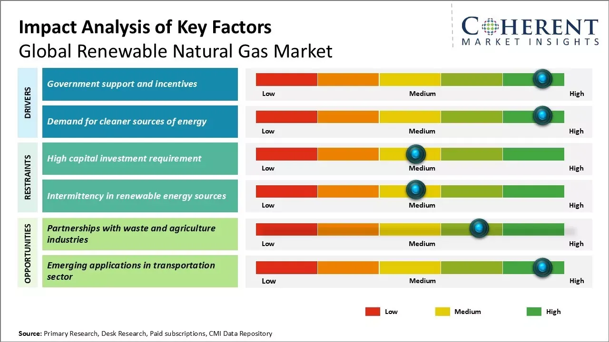

## Table of Contents

## What is clean energy and how is it defined?

Clean energy is energy that comes from sources that don't harm the environment. These sources are called renewable because they can be used over and over again without running out. Examples of clean energy include wind power, solar power, and hydroelectric power. These types of energy don't produce harmful gases like carbon dioxide, which can make the Earth warmer.

Using clean energy is important because it helps keep the air and water clean. It also means we don't have to use up resources like oil and coal, which can be harmful to the environment when we burn them. By using clean energy, we can help protect the planet for future generations and make sure there is enough energy for everyone.

## What are the main sources of clean energy?

The main sources of clean energy are solar, wind, and hydroelectric power. Solar power comes from the sun. We use special panels to turn sunlight into electricity. Wind power uses big turbines that spin when the wind blows, and this spinning creates electricity. Hydroelectric power uses the energy of moving water, like in rivers or dams, to make electricity.

Another important source of clean energy is geothermal energy. This comes from the heat inside the Earth. We can use this heat to make steam, which then turns into electricity. There's also bioenergy, which comes from plants and waste. When we burn these materials, they can create electricity or heat, and they are considered cleaner than fossil fuels because they release less harmful gases.

These sources of clean energy are important because they don't run out like oil or coal, and they don't make the air dirty. By using them, we can help keep the planet healthy and have enough energy for everyone.

## How does the use of clean energy affect the demand for natural gas?

When we use more clean energy like solar, wind, and hydroelectric power, we need less natural gas. Natural gas is a fossil fuel that we burn to make electricity or heat our homes. If we use clean energy instead, we don't need to burn as much natural gas. This means we use less of it, and the demand for natural gas goes down.

Using less natural gas is good for the environment because burning it releases harmful gases like carbon dioxide. These gases can make the Earth warmer, which is bad for the planet. By switching to clean energy, we can help keep the air cleaner and slow down the warming of the Earth. So, the more we use clean energy, the less we need natural gas, and the better it is for our planet.

## What are the current trends in clean energy adoption globally?

Around the world, more and more people are using clean energy. Countries are setting goals to use more solar, wind, and other renewable sources of energy. For example, many countries want to use only clean energy by the year 2050. This is because people understand that clean energy is good for the planet and can help stop the Earth from getting too warm. Governments are also giving money to help build more solar panels and wind turbines.

In some places, the cost of clean energy is going down. This makes it easier for people to choose solar or wind power instead of using fossil fuels like coal or natural gas. Big companies are also starting to use more clean energy for their factories and offices. They do this because it saves them money and shows that they care about the environment. Overall, the trend is moving towards using more clean energy all over the world.

## How have natural gas prices been influenced by the rise of clean energy?

The rise of clean energy has started to change the price of natural gas. As more people use solar, wind, and other clean energy sources, they need less natural gas. When the demand for natural gas goes down, the price can go down too. This is because companies that sell natural gas have to lower their prices to sell what they have.

But, it's not always simple. In some places, the price of natural gas can still go up if there are other things happening. For example, if there is a cold winter and people use more natural gas to heat their homes, the price might go up even if clean energy is becoming more popular. Overall, as clean energy becomes more common, it can help make natural gas prices lower over time.

## What role does government policy play in the transition to clean energy and its impact on natural gas markets?

Government policy is very important in helping the world switch to clean energy. Governments can make rules that say companies have to use more solar, wind, or other clean energy sources. They can also give money to help build more clean energy projects. When governments do this, it makes it easier for people to choose clean energy instead of natural gas. This can make the demand for natural gas go down, which can help lower its price.

But, government policies can also affect natural gas markets in other ways. Sometimes, governments might still need natural gas for a while as they switch to clean energy. They might make rules to keep natural gas prices stable so that people can still use it if they need to. This can make the transition to clean energy slower, but it can also help keep the energy supply steady. Overall, what governments decide to do can have a big impact on how quickly we move to clean energy and what happens to natural gas prices.

## How do subsidies for clean energy technologies affect the competitiveness of natural gas?

Subsidies for clean energy technologies make it easier and cheaper for people to use solar, wind, and other renewable sources of energy. When governments give money to help build these clean energy projects, it lowers the cost of using them. This means that clean energy can compete better with natural gas. People might choose to use solar panels or wind turbines instead of burning natural gas because it's cheaper and better for the environment.

As more people switch to clean energy, the demand for natural gas goes down. When fewer people need natural gas, the companies that sell it might have to lower their prices to sell what they have. This makes natural gas less competitive compared to clean energy. Over time, as clean energy becomes more popular and cheaper, it can take over more of the energy market, making it harder for natural gas to stay competitive.

## What are the technological advancements in clean energy that pose a threat to natural gas?

Technological advancements in clean energy are making it easier and cheaper to use renewable sources like solar and wind power. Solar panels are getting better at turning sunlight into electricity, and they are also becoming cheaper to make and buy. Wind turbines are being designed to work better in different kinds of wind, which means they can make more electricity. These improvements make clean energy a stronger choice compared to natural gas because people can get more energy for less money.

Another big advancement is in energy storage. Batteries are getting better at storing the electricity made from solar and wind power. This means that even when the sun isn't shining or the wind isn't blowing, people can still use the energy they saved. This makes clean energy more reliable and less dependent on the weather, which is something natural gas can't compete with. As these technologies keep getting better, more people might choose clean energy over natural gas, making it harder for natural gas to stay competitive.

## How do the lifecycle emissions of natural gas compare to those of clean energy sources?

Lifecycle emissions are the total amount of harmful gases that come out when we make and use energy. Natural gas has higher lifecycle emissions than clean energy sources like solar, wind, and hydroelectric power. When we use natural gas, we burn it to make electricity or heat. This burning releases gases like carbon dioxide, which can make the Earth warmer. Even before we burn it, getting natural gas out of the ground and moving it around can release some of these gases too. So, from start to finish, natural gas adds more harmful gases to the air than clean energy.

Clean energy sources like solar and wind power don't release harmful gases when they make electricity. Solar panels use sunlight, and wind turbines use wind, so they don't need to burn anything. The only emissions from these sources come from making the panels or turbines, but these are much smaller than the emissions from natural gas. Hydroelectric power uses water to make electricity, and it also doesn't burn anything, so it has very low emissions too. Overall, clean energy is much better for the environment because it has lower lifecycle emissions than natural gas.

## What are the economic implications for regions heavily reliant on natural gas extraction as clean energy grows?

As clean energy becomes more popular, regions that depend a lot on natural gas might face big changes. These areas might see fewer jobs in natural gas because people are using less of it. This could be hard for the people who work in the natural gas industry. They might need to find new jobs, and the local economy might not do as well if it relies a lot on natural gas money. Governments and communities in these areas might need to help workers find new jobs or start new businesses that use clean energy.

But there's also a chance for these regions to grow in new ways. They could start making and selling clean energy technology, like solar panels or wind turbines. This could create new jobs and bring in new money. If these areas can switch to clean energy, they might be able to keep their economy strong. It's important for them to plan ahead and work together to make the most of the growing clean energy market.

## How might future projections of clean energy growth impact long-term natural gas market strategies?

As clean energy grows, people think it will keep getting bigger and bigger. This means that in the future, more people might use solar, wind, and other clean energy sources instead of natural gas. Because of this, companies that sell natural gas might need to change their plans. They might need to start selling less natural gas and maybe even start working with clean energy. If they don't change, they could lose money because fewer people will want to buy natural gas.

To stay in business, natural gas companies might need to think about new ways to make money. They could start helping people switch to clean energy by building solar farms or wind turbines. They might also need to find new places to sell natural gas, like countries that are still using a lot of it. By planning for the future and understanding that clean energy is growing, these companies can find new ways to keep their business strong even as the world changes.

## What are the geopolitical implications of shifting from natural gas to clean energy on a global scale?

As more countries switch from natural gas to clean energy, it can change how countries work together and compete with each other. Countries that have a lot of natural gas might not be as powerful as they used to be. They might lose money and influence because fewer people will need their natural gas. On the other hand, countries that are good at making clean energy technology, like solar panels or wind turbines, might become more important. They could sell these technologies to other countries and help them switch to clean energy. This could change which countries are seen as leaders in the world.

The shift to clean energy can also make countries work together more. They might need to share technology and ideas to make clean energy work better. This could help countries get along better and solve big problems like climate change together. But it could also cause problems if some countries feel left behind or if they don't agree on how to switch to clean energy. Overall, moving from natural gas to clean energy will change how countries interact and could make the world a different place.

## References & Further Reading

Ritchie, A., & Roser, M. (2020). "Energy." Our World in Data. This comprehensive resource explores global energy trends, historical data, and future projections for different energy sources, highlighting the importance of transitioning to sustainable energy solutions. Available at: [Our World in Data](https://ourworldindata.org/energy).

Business Insider. (2021). "Why thorium may be key to our nuclear energy future." This article provides insights into thorium as an alternative nuclear fuel, considering its availability and potential benefits over traditional uranium-based nuclear power. Access the article at: Business Insider.

De Vries, C., & Giglio, S. (2021). "The Future of Energy Markets: The Role of Algorithmic Trading." This paper discusses the growing influence of [algorithmic trading](/wiki/algorithmic-trading) in energy markets, detailing its potential to optimize trading strategies and improve market efficiencies.

Kannan, N., & Vakeesan, D. (2015). "Solar energy for future world: A review." Renewable and Sustainable Energy Reviews. This review article examines the advancements and challenges in solar energy technologies, emphasizing the role of solar power in achieving sustainable energy targets. More details available in Renewable and Sustainable Energy Reviews.

Liang, X., & MacLaren, J.M. (2020). "Hydrogen as a Clean and Sustainable Energy Carrier for Future Energy Systems." This piece explores hydrogen's potential as a sustainable energy carrier, examining the technological developments and economic considerations for its integration into energy systems.

