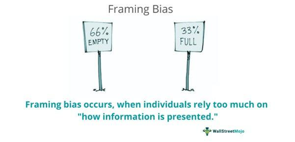

In the rapidly evolving world of business and finance, decision-making processes are crucial for success. One of the most significant influences on these processes is cognitive biases, which are systematic patterns of deviation from norm or rationality in judgment. These biases are inherently linked to human psychology and arise due to the brain's need to simplify information processing. This simplification often leads to errors in perception, interpretation, and evaluation of information, consequently affecting decision quality.

In business, where strategic decisions can determine the direction and success of an organization, the impact of cognitive biases cannot be overstated. These biases challenge the assumption of rational behavior often held by economic theories, suggesting instead that decisions are frequently made based on flawed reasoning. In financial contexts, such flaws can result in suboptimal investment strategies, poor risk assessments, and misguided market entries.

Algorithmic trading, a notable development in the financial sector, is also subject to the influence of cognitive biases. While these systems operate on pre-defined rules intended to mitigate human error, they are not immune to the biases of their developers. Such biases can seep into algorithmic models, leading to issues like overfitting data or ignoring critical market trends. Thus, understanding cognitive biases becomes essential not only for improving business decision-making but also for enhancing the effectiveness of algorithmic trading systems. This article explores the nature of cognitive biases, their varied types, and their significant effects on both business and algorithmic trading.

## Table of Contents

## Understanding Cognitive Biases

Cognitive biases are systematic patterns that influence how individuals perceive and interpret information. These biases often emerge from the brain's natural tendency to simplify information processing, a mechanism that can lead to distorted judgments and decisions. In the realm of finance, cognitive biases challenge the fundamental economic theories that assume rational decision-making by highlighting instances where emotions and subjective perception take precedence over objective analysis.

One major cognitive bias is the **confirmation bias**, which involves the tendency to favor information that confirms one's pre-existing beliefs or hypotheses. This bias can lead individuals to overlook or dismiss evidence that contradicts their initial assumptions, resulting in skewed decision-making [1]. The **overconfidence bias** involves an overestimation of one's own abilities or the accuracy of one's information, leading to excessive risk-taking and unwarranted certainty [2]. Another notable bias is the **hindsight bias**, where people perceive past events as having been more predictable than they actually were, often influenced by the knowledge of the outcome [3].

In addition, the **anchoring bias** describes the human tendency to rely too heavily on the first piece of information encountered, or an "anchor," when making decisions [4]. This can significantly affect judgments and decisions in areas such as pricing and estimation. The **availability bias**, on the other hand, involves a propensity to base judgments on immediate examples that readily come to mind, rather than considering all relevant data. This can lead to an overestimation of unlikely events, simply because they are more memorable or were recently observed [5].

Together, these cognitive biases illustrate the complexities of human judgment and the challenges in achieving fully rational decision-making. In financial contexts, they highlight the potential for irrational behavior, underscoring the importance of understanding and accounting for these biases to improve decision-making accuracy and outcomes.

### References:

1. Nickerson, R. S. (1998). *Confirmation Bias: A Ubiquitous Phenomenon in Many Guises*. Review of General Psychology.
2. Odean, T. (1998). *Volume, Volatility, Price, and Profit When All Traders Are Above Average*. Journal of Finance.
3. Fischhoff, B. (1975). *Hindsight ≠ Foresight: The Effect of Outcome Knowledge on Judgment Under Uncertainty*. Journal of Experimental Psychology: Human Perception and Performance.
4. Tversky, A., & Kahneman, D. (1974). *Judgment under Uncertainty: Heuristics and Biases*. Science.
5. Tversky, A., & Kahneman, D. (1973). *Availability: A Heuristic for Judging Frequency and Probability*. Cognitive Psychology.

## Types of Cognitive Biases in Business Decision-Making

Cognitive biases represent systematic deviations from rationality, influencing how decisions are made in business environments. Understanding these biases is essential for making informed decisions. Below are five common cognitive biases prevalent in business decision-making:

**1. Confirmation Bias:** This cognitive bias involves the tendency to search for, interpret, and remember information that confirms one's preexisting beliefs or theories, while giving disproportionately less consideration to alternative possibilities. In a business context, confirmation bias can lead decision-makers to favor evidence that supports their existing plans or objectives, potentially overlooking contradictory data. This can result in suboptimal strategic decisions, as diverse perspectives and evidence are not fully considered.

**2. Overconfidence Bias:** Overconfidence bias refers to an individual's inflated belief in their own abilities, knowledge, or judgment. In business, this can lead to overestimating market predictions, underestimating risks, or making aggressive decisions based on perceived superior insight. It can manifest in the form of overly ambitious projects, neglecting potential risks, or under-preparing for complex challenges. This bias can impair objective decision-making and lead to unexpected failures.

**3. Hindsight Bias:** Often described as the "I-knew-it-all-along" effect, hindsight bias occurs when people perceive past events as having been more predictable than they actually were. In business, this bias can create a false sense of security or inevitability regarding past decisions, leading to the perception that outcomes were foreseeable. This can hinder learning from past experiences, as individuals may not accurately remember or evaluate the uncertainty and complexity involved in previous decisions.

**4. Anchoring Bias:** Anchoring bias involves the reliance on the first piece of information encountered (the "anchor") when making decisions. In business, initial figures or data points can disproportionately influence subsequent judgments and decisions. For example, the initial price offered during negotiations can set the tone for final agreements, even if it's not reflective of true value. This bias can impact various business activities, such as pricing strategies, budgeting, and financial forecasting, leading to decisions that are misaligned with actual market conditions.

**5. Availability Bias:** Availability bias refers to the tendency to overestimate the importance of information that can be recalled easily, typically because it is recent or emotionally salient. Business decisions may be heavily influenced by recent events or easily accessible data, rather than considering all relevant information. This can result in an overemphasis on recent trends or memorable occurrences, potentially ignoring comprehensive historical data or less conspicuous market indicators.

Awareness of these biases provides opportunities for businesses to cultivate more objective and data-driven decision-making processes, minimizing the influence of erroneous psychological tendencies.

## Impact of Cognitive Biases on Business

Cognitive biases can significantly influence business decisions, often leading to strategic missteps. These biases distort perception and judgment, potentially causing businesses to misinterpret market trends or customer needs. For example, confirmation bias may lead executives to favor information that supports their existing strategies, disregarding contrary data that might suggest a shift in market demands. Consequently, firms might miss evolving consumer preferences or fail to anticipate competitive movements, ultimately hindering their growth prospects.

In hiring, biases such as overconfidence or the availability heuristic can skew recruitment processes. Overconfidence might lead managers to underestimate the limitations of their selected candidates, assuming they possess broader skills than they actually do. Meanwhile, availability bias might result in hiring decisions based on recent observations rather than a comprehensive evaluation of a candidate’s potential. These biases impede the formulation of well-rounded teams, thereby affecting a company's long-term performance.

Market entry strategies are also vulnerable to cognitive biases. Anchoring bias, for instance, might cause firms to rely too heavily on initial market research findings without adequately considering new data. This can result in entering markets that no longer serve strategic interests. Similarly, running new initiatives based solely on past successes without adapting to current market conditions may result in failure.

In risk management, biases can result in either an underestimation or overestimation of potential threats. A hindsight bias might lead risk managers to perceive past events as more predictable than they truly were, giving a false sense of security regarding future risks. In contrast, fear driven by immediate past events accessed through availability bias might cause an overestimation of risks, leading to overly cautious strategies that limit business innovation.

Recognizing and mitigating these biases is essential for enhancing decision-making and improving business outcomes. By employing techniques to counteract biases—such as diverse team decision-making, incorporating external feedback, and systematic testing—businesses can pave the way for more rational and effective strategies. This proactive approach enables companies to adapt to changing environments and maintain competitiveness in dynamic markets.

## Algorithmic Trading and Cognitive Bias

Algorithmic trading utilizes pre-defined rules and computational algorithms to execute trades at high speed and [volume](/wiki/volume-trading-strategy). Despite the seemingly objective nature of these algorithms, developer biases can inadvertently influence the decision-making process within trading systems. Cognitive biases manifest in the design and implementation, potentially skewing outcomes.

A primary concern is overfitting, often driven by confirmation bias. Developers, when fine-tuning algorithms, may unconsciously favor patterns or outcomes that support their initial hypotheses, leading to models that perform well on historical data but fail in live markets. This happens because the model may be tuned excessively to capture noise instead of true market signals, thus reducing its generalizability.

Moreover, availability bias can cause developers to rely unduly on recent market data, misrepresenting broader market dynamics. Algorithmic models influenced by this bias may prioritize recent trends over long-term data, leading to systematic errors in predicting future market movements.

To combat these biases, developers must critically analyze their assumptions throughout the development process. This involves employing a mix of qualitative assessments and quantitative methods like cross-validation to ensure that models are comprehensive and adaptable. Awareness and understanding of these cognitive biases are essential for developers to enhance the objectivity and effectiveness of trading algorithms, leading to more robust and adaptive trading strategies.

## Techniques to Manage Cognitive Biases in Trading

Managing cognitive biases in trading requires a structured approach to minimize their influence and enhance decision-making. The first step is raising awareness about these biases and making a conscious effort to avoid them. Educating traders and developers about common cognitive biases, such as confirmation bias and availability bias, can prepare them to recognize and counteract these biases in practice.

Gathering feedback and actively challenging existing mental models is vital in providing alternative perspectives. Encouraging open discussions and peer reviews helps identify blind spots and introduces diverse viewpoints. This collaborative approach can prevent overconfidence and tunnel vision, which often impair effective decision-making in trading environments.

Incorporating rules-based strategies is another effective technique for managing biases. By establishing predefined criteria and systematic rules for trading, subjective judgment is minimized. For instance, using quantitative methods or algorithmic strategies ensures that trading decisions are based on data-driven insights rather than emotional or biased responses. In practice, this might involve developing algorithms that adhere strictly to technical indicators or specific market conditions, reducing the influence of cognitive biases.

Systematic testing and validation play a crucial role in refining trading strategies. Utilizing [backtesting](/wiki/backtesting) and forward testing can objectively evaluate the performance of trading systems under various market scenarios. By using comprehensive data sets and rigorous statistical analysis, traders can determine the robustness of their strategies, mitigating the risks of biases affecting their outcomes.

Regular monitoring and adjustments based on objective evaluations further reduce the impact of biases. Continuous performance analysis allows for the identification of deviations from expected outcomes. By setting objective performance benchmarks and consistently analyzing results, traders can adjust their strategies to align more closely with changing market dynamics.

In summary, managing cognitive biases in trading involves raising awareness, seeking diverse perspectives, employing rules-based strategies, and systematically evaluating performance. These techniques help create a more objective decision-making process, enhancing the effectiveness of trading strategies and improving market outcomes.

## Conclusion

Cognitive biases present substantial challenges in the domains of business decision-making and [algorithmic trading](/wiki/algorithmic-trading). Their potential to skew judgment and lead to suboptimal strategies is significant, often resulting in financial losses or missed opportunities. Recognizing and understanding these biases is crucial for any organization or individual aiming to improve the quality and effectiveness of their decisions.

By actively identifying cognitive biases such as confirmation bias, overconfidence bias, and availability bias, businesses and traders can implement strategies designed to reduce their influence. Techniques such as fostering an environment of critical thinking, gathering diverse perspectives, and utilizing data-driven decision processes serve as effective countermeasures against biased judgment.

As technology rapidly advances and markets undergo continuous transformations, vigilance against cognitive biases is imperative. Organizations that remain aware and proactive in addressing these biases not only improve their decision-making processes but also strengthen their competitive positioning in the market. Continuous education, systematic bias audits, and integrating [machine learning](/wiki/machine-learning) models with safeguards against bias can further aid in maintaining objectivity and enhancing decision outcomes.

In conclusion, understanding cognitive biases and employing systematic methods to mitigate their impact are essential for success in both business and trading environments. By doing so, individuals and companies equip themselves with the tools necessary to navigate a complex and ever-changing financial landscape.

## References & Further Reading

1. Nickerson, R. S. (1998). ["Confirmation Bias: A Ubiquitous Phenomenon in Many Guises."](https://psycnet.apa.org/record/2018-70006-003) Review of General Psychology.

2. Odean, T. (1998). ["Volume, Volatility, Price, and Profit When All Traders Are Above Average."](https://www.jstor.org/stable/117456) Journal of Finance.

3. Fischhoff, B. (1975). ["Hindsight ≠ Foresight: The Effect of Outcome Knowledge on Judgment Under Uncertainty."](http://web.mit.edu/curhan/www/docs/Articles/15341_Readings/Behavioral_Decision_Theory/Fischhoff_1975_Hindsight_is_not_equal_to_foresight.pdf) Journal of Experimental Psychology: Human Perception and Performance.

4. Tversky, A., & Kahneman, D. (1974). ["Judgment under Uncertainty: Heuristics and Biases."](https://www2.psych.ubc.ca/~schaller/Psyc590Readings/TverskyKahneman1974.pdf) Science.

5. Tversky, A., & Kahneman, D. (1973). ["Availability: A Heuristic for Judging Frequency and Probability."](https://www.sciencedirect.com/science/article/pii/0010028573900339) Cognitive Psychology.