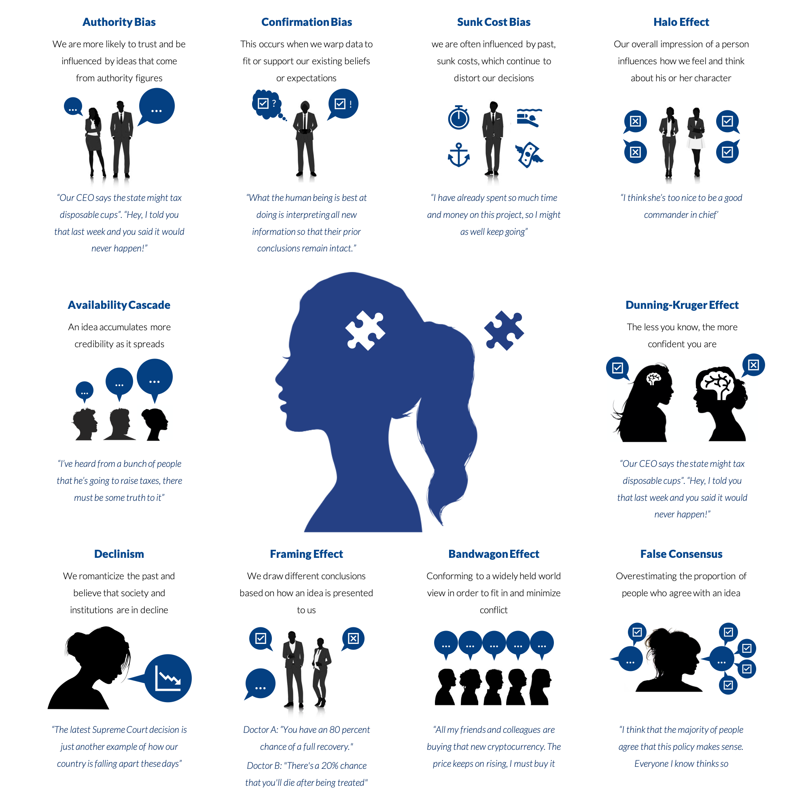

## Table of Contents

## What is cognitive bias?

Cognitive bias is when our brain tricks us into thinking or deciding things in a way that isn't completely correct. It's like a shortcut our brain takes to help us make quick decisions, but sometimes these shortcuts lead us to mistakes. For example, if you meet someone new and they remind you of someone you didn't like, you might think you won't like this new person either, even if you don't really know them yet.

These biases can affect how we see the world and make choices every day. They can make us see things in a way that fits what we already believe, instead of seeing things as they really are. For instance, if you hear a news story that matches what you already think, you might believe it more easily than a story that challenges your beliefs. Understanding cognitive biases can help us try to think more clearly and make better decisions.

## How does cognitive bias affect decision-making in business?

Cognitive bias can really change how business decisions are made. It can make people in a company see things in a way that isn't totally right. For example, if a manager really likes a project because it was their idea, they might think it's better than it really is. This is called the 'halo effect.' It can make them ignore problems with the project and not see other, maybe better, options. This can lead to bad choices, like spending too much money on a project that won't work out.

Another way cognitive bias affects business is through something called 'confirmation bias.' This is when people look for information that agrees with what they already think and ignore information that doesn't. In a business, if leaders think a certain strategy will work, they might only pay attention to the data that supports that idea. They might miss important signs that the strategy isn't working. This can cause the business to stick with a plan that isn't good, just because the leaders want to believe it will work. Understanding these biases can help businesses make better, more fair decisions.

## Can you provide examples of common cognitive biases in a business setting?

One common cognitive bias in a business setting is the 'anchoring bias.' This happens when people rely too much on the first piece of information they get. For example, if a company is negotiating a deal and the first offer is really low, everyone might think that's the starting point. They might end up agreeing to a deal that's not good for them because they got stuck on that first number. This can lead to bad business deals because people don't look at all the options carefully.

Another bias is the 'overconfidence bias.' This is when people think they know more than they really do. In business, this can make managers think their plans will work out perfectly, even when there are risks. They might start big projects without thinking about all the things that could go wrong. This can lead to big mistakes, like spending a lot of money on something that fails because the manager was too sure it would work.

The 'availability heuristic' is also common in business. This is when people make decisions based on the information that's easiest to remember. For example, if a company had a big success with a certain type of product last year, they might think that's the best thing to do again this year. They might not look at new data or think about other options because the old success is what they remember most. This can make businesses miss out on new opportunities or keep doing things that aren't the best choice anymore.

## What are the potential negative impacts of cognitive biases on business operations?

Cognitive biases can really hurt a business by making people make bad choices. For example, if managers are too sure about their plans because of overconfidence bias, they might start big projects without thinking about all the risks. This can lead to spending a lot of money on things that don't work out. Also, if they stick to the first number they hear in a deal because of anchoring bias, they might agree to deals that aren't good for the company. This can make the business lose money and miss out on better opportunities.

Another way cognitive biases can harm business operations is by making people ignore important information. If leaders only look at data that agrees with what they already think because of confirmation bias, they might miss signs that their plans aren't working. This can make the business keep doing things that aren't good, just because the leaders want to believe they are right. Also, if they make decisions based on what's easiest to remember because of the availability heuristic, they might not see new chances or keep doing old things that aren't the best choice anymore. This can slow down the business and make it hard to grow and improve.

## How can cognitive biases influence strategic planning and execution?

Cognitive biases can really mess up strategic planning in a business. When leaders are making big plans, they might fall into the trap of overconfidence bias. This means they think their plans will work out perfectly without looking at all the risks. For example, they might start a new project thinking it will be a big success, but they don't think about what could go wrong. This can lead to spending a lot of money on things that fail. Also, if they stick to the first idea they come up with because of anchoring bias, they might not look at other, maybe better, options. This can make the business miss out on good opportunities and stick with plans that aren't the best.

When it comes to executing those plans, cognitive biases can cause even more problems. If leaders only pay attention to information that agrees with what they already think because of confirmation bias, they might miss important signs that their plans aren't working. For example, if sales are going down but they only look at the good reports, they might keep doing the same thing even though it's not working. This can make the business waste time and money on the wrong things. Also, if they make decisions based on what's easiest to remember because of the availability heuristic, they might not see new chances or keep doing old things that aren't the best choice anymore. This can slow down the business and make it hard to grow and improve.

## What role does cognitive bias play in market analysis and consumer behavior?

Cognitive bias can really change how businesses look at the market and understand what customers want. When companies do market analysis, they might fall into the trap of confirmation bias. This means they only look at information that agrees with what they already think. For example, if a company thinks their product is the best, they might only pay attention to good reviews and ignore the bad ones. This can make them miss important feedback from customers and not see what they need to change. Also, if they use the availability heuristic, they might make decisions based on what's easiest to remember. If they had a big success with a certain type of product last year, they might think that's the best thing to do again this year, even if the market has changed.

Cognitive bias also affects how consumers behave. People often make choices based on what they remember most easily, which is the availability heuristic. For example, if someone hears a lot about a certain brand on the news, they might think it's the best option, even if it's not. Also, the anchoring bias can make people stick to the first price they see. If a store shows a high original price next to a sale price, people might think they're getting a good deal, even if the sale price is still too high. Understanding these biases can help businesses talk to customers in a way that's more fair and clear, and it can help customers make better choices.

## How can businesses identify cognitive biases within their teams?

Businesses can identify cognitive biases within their teams by paying attention to how decisions are made. If team members always seem to agree with the first idea that comes up, it might be because of anchoring bias. They might be sticking to that first idea without looking at other options. Also, if people only talk about the good things and ignore the bad things, it could be confirmation bias at work. They might be looking only for information that agrees with what they already think. By watching how people talk and make choices, leaders can spot these biases and help their teams think more clearly.

Another way to find cognitive biases is by asking for different points of view. If everyone on the team thinks the same way, it might be because of groupthink, which is a kind of bias where people want to fit in and agree with everyone else. Leaders can ask team members to share different ideas and challenge each other's thoughts. This can help bring out biases that might be hiding. Also, using tools like surveys or feedback sessions can help. If people feel safe to say what they really think, they might point out biases that others don't see. By listening to everyone and encouraging different opinions, businesses can better understand and deal with cognitive biases.

## What strategies can businesses implement to mitigate the effects of cognitive biases?

Businesses can help reduce the effects of cognitive biases by encouraging different points of view. If everyone on a team thinks the same way, they might be falling into groupthink. Leaders can ask team members to share different ideas and challenge each other's thoughts. This can help bring out biases that might be hiding. Also, using tools like surveys or feedback sessions can help. If people feel safe to say what they really think, they might point out biases that others don't see. By listening to everyone and encouraging different opinions, businesses can better understand and deal with cognitive biases.

Another way to lessen the impact of cognitive biases is by making sure decisions are based on good information. If leaders only look at data that agrees with what they already think, they might miss important signs that their plans aren't working. To avoid this, businesses can set up rules for how decisions are made. For example, they can make sure to look at all the data, not just the good parts. They can also use outside experts to check their plans and give new ideas. By making sure decisions are based on all the facts, businesses can make better choices and avoid the traps of cognitive biases.

## How do cognitive biases affect leadership and management decisions?

Cognitive biases can really change how leaders and managers make decisions. For example, if a leader really likes a project because it was their idea, they might think it's better than it really is. This is called the 'halo effect.' It can make them ignore problems with the project and not see other, maybe better, options. This can lead to bad choices, like spending too much money on a project that won't work out. Also, if leaders only look at information that agrees with what they already think because of confirmation bias, they might miss important signs that their plans aren't working. This can make the business keep doing things that aren't good, just because the leaders want to believe they are right.

Another way cognitive biases affect leadership and management is through overconfidence. Leaders might think they know more than they really do, which can make them start big projects without thinking about all the risks. This can lead to big mistakes, like spending a lot of money on something that fails because the leader was too sure it would work. Also, if leaders stick to the first idea they come up with because of anchoring bias, they might not look at other, maybe better, options. This can make the business miss out on good opportunities and stick with plans that aren't the best. By understanding these biases, leaders can try to think more clearly and make better decisions for their business.

## Can cognitive biases impact financial decisions and economic forecasts in a business?

Cognitive biases can really mess up financial decisions in a business. For example, if a manager is too sure about a project because of overconfidence bias, they might spend a lot of money on it without thinking about all the risks. This can lead to big financial losses if the project fails. Also, if they stick to the first number they hear in a deal because of anchoring bias, they might agree to deals that aren't good for the company. This can make the business lose money and miss out on better opportunities.

Cognitive biases can also affect economic forecasts. If leaders only look at data that agrees with what they already think because of confirmation bias, they might miss important signs that the market is changing. This can make their forecasts wrong and lead to bad financial planning. Also, if they make decisions based on what's easiest to remember because of the availability heuristic, they might not see new chances or keep doing old things that aren't the best choice anymore. This can slow down the business and make it hard to grow and improve.

## What are advanced methods for measuring the impact of cognitive biases on business performance?

Businesses can use advanced methods like data analytics and [machine learning](/wiki/machine-learning) to measure how cognitive biases affect their performance. They can look at past decisions and see if there were any patterns that show biases at work. For example, if a company always agrees to the first offer in a deal, that might be because of anchoring bias. By using data to track these patterns, businesses can see how biases are hurting their decisions and their bottom line. They can also use machine learning to predict how biases might affect future decisions and plan ways to avoid them.

Another method is to use surveys and psychological assessments to understand how biases are affecting the people in the company. By asking employees about their decision-making processes, businesses can find out if biases like overconfidence or confirmation bias are common. They can also use these assessments to see how different teams are affected by biases and how it changes their performance. This information can help leaders create training programs to help their teams make better, less biased decisions. By combining data analysis with insights from employees, businesses can get a full picture of how cognitive biases are impacting their performance and find ways to improve.

## How can businesses integrate cognitive bias training into their corporate culture and employee development programs?

Businesses can integrate cognitive bias training into their corporate culture by making it a regular part of how they do things. They can start by including lessons about cognitive biases in their employee training programs. This can be done through workshops or online courses that teach people about common biases like confirmation bias, anchoring bias, and overconfidence. By showing real examples from the company's past decisions, employees can see how these biases have affected their work. This helps everyone understand why it's important to be aware of biases and how to spot them in their own thinking. Over time, talking about biases can become a normal part of meetings and decision-making processes, making the whole company more aware and better at making fair choices.

Another way to bring cognitive bias training into employee development is by encouraging a culture of open feedback and diverse thinking. Leaders can set up regular feedback sessions where employees can share their thoughts and challenge each other's ideas. This helps to bring out different points of view and can show where biases might be hiding. Businesses can also use team-building activities that focus on understanding and reducing biases. By making these activities fun and engaging, employees are more likely to learn and remember the lessons. Over time, this kind of training can help everyone in the company make better decisions and work together more effectively, leading to a stronger and more successful business.

## References & Further Reading

1. Nickerson, R. S. (1998). ["Confirmation Bias: A Ubiquitous Phenomenon in Many Guises."](https://psycnet.apa.org/record/2018-70006-003) Review of General Psychology.

2. Odean, T. (1998). ["Volume, Volatility, Price, and Profit When All Traders Are Above Average."](https://www.jstor.org/stable/117456) Journal of Finance.

3. Fischhoff, B. (1975). ["Hindsight ≠ Foresight: The Effect of Outcome Knowledge on Judgment Under Uncertainty."](http://web.mit.edu/curhan/www/docs/Articles/15341_Readings/Behavioral_Decision_Theory/Fischhoff_1975_Hindsight_is_not_equal_to_foresight.pdf) Journal of Experimental Psychology: Human Perception and Performance.

4. Tversky, A., & Kahneman, D. (1974). ["Judgment under Uncertainty: Heuristics and Biases."](https://www2.psych.ubc.ca/~schaller/Psyc590Readings/TverskyKahneman1974.pdf) Science.

5. Tversky, A., & Kahneman, D. (1973). ["Availability: A Heuristic for Judging Frequency and Probability."](https://www.sciencedirect.com/science/article/pii/0010028573900339) Cognitive Psychology.