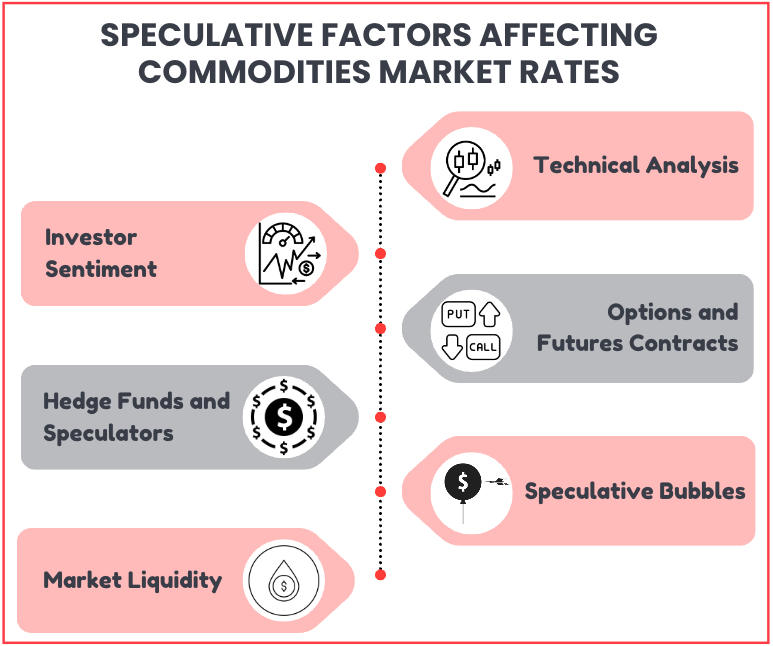

## Table of Contents

## What are commodities speculators?

Commodities speculators are people who buy and sell things like oil, gold, or wheat, hoping to make money from price changes. They don't plan to use these items themselves. Instead, they guess if the prices will go up or down and try to buy low and sell high.

These speculators can affect the market a lot. If many speculators think the price of a commodity will go up, they will buy a lot of it, which can make the price go up. On the other hand, if they think the price will go down, they might sell a lot, which can make the price go down. This can sometimes cause big changes in prices, which can be good or bad for the economy.

## How do commodities speculators operate in the market?

Commodities speculators operate in the market by buying and selling things like oil, gold, or wheat without planning to use them. They try to predict if the prices will go up or down. If they think the price will go up, they buy the commodity hoping to sell it later at a higher price. If they think the price will go down, they might sell what they have or even borrow the commodity to sell it now and buy it back later at a lower price to make a profit.

Their actions can have a big impact on the market. When many speculators buy a commodity because they think the price will go up, it can actually make the price go up because there's more demand. On the other hand, if many speculators sell a commodity because they think the price will go down, it can make the price go down because there's more supply. This can lead to big swings in prices, which can affect the economy in different ways.

## What is the basic impact of speculators on commodity prices?

Speculators can make commodity prices go up and down a lot. When many speculators think a commodity's price will go up, they buy a lot of it. This makes the demand go up, which can push the price higher. For example, if many speculators think the price of oil will go up, they will buy a lot of oil, and this can make the price of oil go up.

On the other hand, if many speculators think a commodity's price will go down, they will sell a lot of it. This makes the supply go up, which can push the price lower. For example, if many speculators think the price of wheat will go down, they will sell a lot of wheat, and this can make the price of wheat go down.

These big changes in prices can affect the economy. Sometimes, these price changes can be good, like when they help balance the supply and demand. But sometimes, they can be bad, like when they make it hard for businesses and people to plan because prices are changing too much.

## Can speculators influence the supply and demand of commodities?

Yes, speculators can influence the supply and demand of commodities. When speculators think the price of a commodity will go up, they buy a lot of it. This increases the demand for the commodity, which can make its price go up. For example, if many speculators believe the price of gold will rise, they will buy more gold, causing the demand to go up and the price to increase.

On the other hand, when speculators think the price of a commodity will go down, they sell a lot of it. This increases the supply of the commodity, which can make its price go down. For instance, if many speculators believe the price of oil will fall, they will sell more oil, causing the supply to go up and the price to decrease.

These actions by speculators can lead to big changes in commodity prices, which can affect the economy. Sometimes, these changes help balance the supply and demand, but other times, they can cause problems by making prices too unstable.

## How do speculators affect the volatility of commodity markets?

Speculators can make commodity markets more volatile. When many speculators think the price of a commodity will go up, they buy a lot of it. This makes the demand go up quickly, which can make the price jump higher. On the other hand, when many speculators think the price will go down, they sell a lot of the commodity. This makes the supply go up fast, which can make the price drop suddenly. These quick changes in buying and selling can make the market prices move up and down a lot.

This [volatility](/wiki/volatility-trading-strategies) can be good or bad. Sometimes, it helps the market find the right price faster. When speculators see a change in supply or demand coming, they can help the market adjust to it quicker. But other times, too much volatility can be a problem. It can make it hard for farmers, miners, and other people who produce commodities to plan because they don't know what the price will be. It can also make it harder for people who use commodities to know how much they will have to pay.

## What role do speculators play in price discovery for commodities?

Speculators help find out the right price for commodities. They do this by guessing what the price will be in the future and then buying or selling the commodity based on their guesses. When a lot of speculators think the price will go up, they buy more of the commodity. This makes the demand go up, which pushes the price higher. When they think the price will go down, they sell more of the commodity. This makes the supply go up, which pushes the price lower. By doing this, speculators help the market figure out what the price should be.

This process of guessing and trading helps the market react to new information quickly. If something happens that might change the supply or demand for a commodity, like a bad harvest or a new mine opening, speculators can help the market adjust to this new information faster. Their buying and selling can make the price move to where it should be based on the new situation. While this can make the market more unpredictable, it also helps keep the prices more in line with what's really happening in the world.

## How have regulations on commodities speculation evolved over time?

Over time, rules about commodities speculation have changed a lot. In the past, there were not many rules. People could buy and sell as much as they wanted. But after some big problems, like the 2008 financial crisis, people started thinking that too much speculation might be bad. So, governments started making more rules. In the United States, they passed the Dodd-Frank Act in 2010. This law made new rules to control how much people could speculate on commodities. It was meant to stop big price changes that could hurt the economy.

These rules keep changing as people learn more about how speculation works. Some countries have rules about how much a person can buy or sell. Other countries have rules about what kind of information people have to share when they trade. These rules are trying to find a balance. They want to let people trade and help the market work well, but they also want to stop too much speculation that can make prices go up and down too much. It's a hard balance to find, and the rules keep getting updated to try to get it right.

## What are the economic theories supporting the role of speculators in commodity markets?

Economic theories say that speculators help make commodity markets work better. They do this by guessing what prices will be in the future and then buying or selling based on their guesses. This helps the market find the right price faster. For example, if speculators think the price of oil will go up because of a war, they will buy more oil. This makes the price go up now, which is closer to what it will be in the future. This is called the "price discovery" role of speculators. They help the market see new information and adjust prices to match that information.

Another theory is that speculators help share risk. When farmers or miners produce commodities, they don't know what the price will be when they sell. Speculators can buy from them now and sell later, which helps the farmers and miners know how much money they will get. This is called "risk management." By taking on the risk of price changes, speculators help the people who produce commodities feel more sure about their money. This can help the whole economy work better because it makes it easier for people to plan and invest.

## How do speculators impact the long-term trends in commodity prices?

Speculators can affect long-term trends in commodity prices by changing how much people buy and sell over time. When speculators think a commodity's price will keep going up, they keep buying it. This can make the price go up for a long time. For example, if speculators think oil will be more expensive in the future because of less supply, they will keep buying oil. This can make the price of oil go up over many months or even years. On the other hand, if speculators think a commodity's price will keep going down, they will keep selling it. This can make the price go down for a long time. For example, if speculators think there will be too much wheat, they will keep selling wheat, which can make the price of wheat go down over time.

But speculators are not the only ones who affect long-term trends. Other things like how much of a commodity is made, how much people want it, and what's happening in the world also matter a lot. For example, if a new technology makes it easier to find oil, the price might go down even if speculators are buying it. Or if a country starts using less oil because of new laws, the price might go down even if speculators are trying to make it go up. So, while speculators can push prices in one direction for a long time, other big things can change the trend too.

## What are the criticisms against commodities speculators, and how valid are they?

Some people don't like commodities speculators because they think they make prices go up and down too much. They say that when speculators buy and sell a lot, it can make the price of things like oil or wheat change a lot in a short time. This can be bad for farmers, miners, and other people who need to know what the price will be to plan their work. It can also be bad for people who use these things because they don't know how much they will have to pay. Critics say that this kind of price change can hurt the economy and make life harder for regular people.

But not everyone agrees that speculators are bad. Some people say that speculators help the market work better. They say that speculators help find out what the price should be by guessing what will happen in the future and then buying or selling based on their guesses. This can make the market react to new information faster, which can be good for the economy. Also, speculators can help share the risk of price changes with people who produce commodities, which can make it easier for them to plan and invest. So, while some criticisms of speculators might be true, there are also good things that speculators do for the market.

## How do speculators' activities affect different stakeholders such as farmers, consumers, and investors?

Speculators' activities can have a big impact on farmers. When speculators buy a lot of a commodity like wheat, it can make the price go up. This can be good for farmers because they can sell their wheat for more money. But if speculators think the price will go down and they sell a lot of wheat, the price can go down. This can be bad for farmers because they might not make as much money when they sell their wheat. Farmers need to know what the price will be to plan their work, so big changes in prices can make it hard for them to know how much money they will make.

Consumers can also be affected by what speculators do. If speculators make the price of oil go up by buying a lot of it, it can make gas more expensive for people who drive cars. If the price of wheat goes up because of speculators, it can make bread and other food more expensive. This can be hard for people who need to buy these things because they have to spend more money. But if speculators make the price go down by selling a lot, it can make things cheaper for consumers, which can be good for them.

Investors are another group that can be affected by speculators. If investors think speculators will make the price of a commodity go up, they might buy it too, hoping to make money. But if the price goes down because of what speculators do, investors can lose money. So, investors need to watch what speculators are doing and try to guess what will happen next. This can make investing in commodities more risky, but it can also be a way for investors to make money if they guess right.

## What advanced strategies do expert speculators use to predict and influence commodity markets?

Expert speculators use a lot of different ways to guess what will happen in commodity markets. They look at a lot of information, like how much of a commodity is being made, how much people want it, and what's happening in the world. They use special math and computer programs to find patterns in this information. They also listen to what other people in the market are saying and watch what they are doing. Sometimes, they even use news and social media to see what people are thinking. By putting all this information together, they try to guess if the price of a commodity will go up or down.

Some expert speculators also try to make the price go in the direction they want. They do this by buying or selling a lot of a commodity at the same time. If they think the price will go up, they might buy a lot to make the demand go up and push the price higher. If they think the price will go down, they might sell a lot to make the supply go up and push the price lower. This can be risky because if they guess wrong, they can lose a lot of money. But if they guess right, they can make a lot of money. This is why they need to be very good at guessing and understanding the market.

## References & Further Reading

[1]: Tang, K., & Xiong, W. (2012). ["Index Investment and Financialization of Commodities."](https://www.princeton.edu/~wxiong/papers/commodity.pdf) Journal of Economic Perspectives, 30(2), 118-161.

[2]: Irwin, S. H., & Sanders, D. R. (2010). ["The Impact of Index and Swap Funds on Commodity Futures Markets."](https://www.cftc.gov/sites/default/files/idc/groups/public/@swaps/documents/file/plstudy_23_oecd.pdf) In: "Position Limits and Other Apparently Non-Controversial Measures", Brookings Institution.

[3]: Hendershott, T., Jones, C. M., & Menkveld, A. J. (2011). ["Does Algorithmic Trading Improve Liquidity?"](https://onlinelibrary.wiley.com/doi/full/10.1111/j.1540-6261.2010.01624.x) The Journal of Finance, 66, 1-33.

[4]: Bloomberg, M. (2016). ["The Fundamentals of Commodity Futures Trading."](https://quizlet.com/853843726/bloomberg-market-concepts-commodities-flash-cards/)

[5]: Chaboud, A. P., Chiquoine, B., Hjalmarsson, E., & Vega, C. (2009). ["Rise of the Machines: Algorithmic Trading in the Foreign Exchange Market."](https://www.jstor.org/stable/43612951) International Finance Discussion Papers.

[6]: Aldrich, E. M., Grundfest, J. A., & Laughrin, G. B. (2015). ["The Flash Crash: A New Deconstruction."](https://www.semanticscholar.org/paper/The-Flash-Crash%3A-A-New-Deconstruction-Aldrich-Grundfest/ec1ecf918858b35dc707af80c9d605cddec740e5) Journal of Business, Economics & Technology, 13(3).