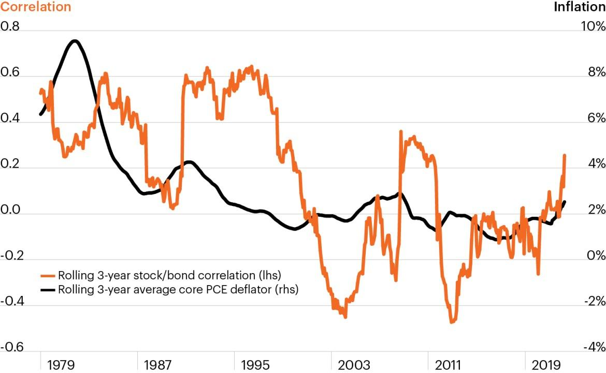

## Table of Contents

## What is correlation in the context of the stock market?

Correlation in the stock market is a way to measure how closely two stocks or other investments move in relation to each other. When two stocks have a high positive correlation, it means that when one stock goes up, the other stock tends to go up too. On the other hand, if two stocks have a high negative correlation, one stock going up usually means the other stock will go down. This can be important for investors because understanding correlation can help them build a balanced portfolio.

Investors often look at correlation to diversify their investments. If all the stocks in a portfolio are highly correlated, they might all go up or down at the same time, which can be risky. By including stocks with low or negative correlations, investors can reduce the overall risk of their portfolio. For example, if tech stocks are going down, having some investments in a different sector, like utilities, which might not be as affected, can help balance out the losses.

## How is correlation calculated between two stocks?

To calculate the correlation between two stocks, you first need to gather the price data for both stocks over a certain period of time. This data is usually the daily closing prices. Once you have this data, you can calculate the returns for each stock. Returns are found by taking the difference between the current price and the previous price, then dividing by the previous price. This gives you a percentage change for each day.

Next, you use these returns to find the correlation coefficient, which is a number between -1 and 1. A correlation coefficient of 1 means the stocks move perfectly together, -1 means they move perfectly opposite each other, and 0 means there's no relationship. To find this number, you use a formula that looks at how the returns of the two stocks move together compared to how they move on their own. This formula involves calculating the average returns, the standard deviation of the returns, and then combining these into the correlation coefficient. Many financial software tools and spreadsheets can do this calculation for you, making it easier to understand how closely two stocks are related.

## What does a positive correlation between stocks indicate?

A positive correlation between stocks means that when one stock goes up, the other stock tends to go up too. If one stock goes down, the other stock usually goes down as well. The strength of this relationship is shown by a number called the correlation coefficient. If this number is close to 1, it means the stocks move very similarly. If it's closer to 0, they don't move together as much.

Understanding positive correlation is important for investors. If you have a lot of stocks in your portfolio that are positively correlated, they might all go up or down at the same time. This can be risky because if the market goes down, all your stocks might lose value. On the other hand, if you know which stocks are positively correlated, you can use this information to make better choices about which stocks to buy or sell.

## What does a negative correlation between stocks indicate?

A negative correlation between stocks means that when one stock goes up, the other stock tends to go down. If one stock loses value, the other one usually gains value. The strength of this relationship is shown by a number called the correlation coefficient. If this number is close to -1, it means the stocks move very differently from each other. If it's closer to 0, they don't move opposite each other as much.

Understanding negative correlation can help investors. If you have stocks in your portfolio that are negatively correlated, they can balance each other out. When one stock goes down, the other might go up, which can reduce the overall risk in your portfolio. This can be a good strategy to protect your investments from big losses if the market goes down.

## How can understanding correlation help in diversifying a portfolio?

Understanding correlation helps in diversifying a portfolio by showing how different investments move together. If you have a lot of stocks that all go up and down at the same time, your portfolio might be risky. But if you know which stocks move differently, you can pick some that go up when others go down. This can help balance your portfolio and reduce the risk of losing a lot of money if the market goes down.

For example, if you have a lot of tech stocks and they all have a high positive correlation, they might all lose value if the tech industry has a bad day. But if you also have some stocks from a different industry, like utilities, that have a low or negative correlation with tech stocks, those might go up when tech stocks go down. This way, your portfolio is more balanced and less likely to be hurt by problems in just one industry.

## What is the impact of high correlation among stocks in a portfolio?

When many stocks in a portfolio have a high correlation, it means they tend to move up and down together. If the market goes up, all those stocks might go up too, which can seem good. But if the market goes down, all those stocks might go down at the same time. This can be risky because if something bad happens in the market, you might lose a lot of money all at once.

To manage this risk, it's important to look at how correlated your stocks are. If you find that many of your stocks move together a lot, you might want to add some different kinds of investments. These could be stocks from different industries or even other types of investments like bonds. By doing this, you can make your portfolio more balanced and less likely to be hurt by big swings in the market.

## How does correlation affect risk management in stock market investments?

Correlation plays a big role in managing risk in stock market investments. If you know how much your stocks move together, you can make better choices about what to buy or sell. When stocks have a high positive correlation, they go up and down at the same time. This can be risky because if the market goes down, all your stocks might lose value at once. To manage this risk, you need to look at how correlated your stocks are and maybe add some different kinds of investments.

By understanding correlation, you can build a more balanced portfolio. If you have some stocks that move differently from each other, like ones with low or negative correlation, they can help balance out your investments. For example, if tech stocks go down, having some stocks from another industry that might go up can help protect your money. This way, your portfolio is less likely to be hurt by big swings in the market, and you can manage your risk better.

## Can correlation between stocks change over time, and if so, why?

Yes, the correlation between stocks can change over time. This happens because the things that affect stock prices can change. For example, a company might start doing business in a new industry, or the economy might go through changes like a recession or a boom. These changes can make stocks that used to move together start moving differently, or vice versa.

Another reason correlation can change is because of how investors feel about the market. If everyone is feeling good about the economy, they might buy a lot of stocks, making them all go up together. But if people start to worry, they might sell some stocks and not others, which can change how stocks move together. So, it's important for investors to keep checking the correlation between their stocks because it can help them make better choices about their investments.

## How do market conditions influence the correlation between stocks?

Market conditions can change how stocks move together. When the economy is doing well, people might feel happy and buy a lot of different stocks. This can make many stocks go up at the same time, so they have a high positive correlation. But if the economy starts to have problems, like a recession, people might get worried and sell some stocks but not others. This can make stocks move differently, so their correlation might go down or even become negative.

Also, big events like changes in interest rates or new laws can affect how stocks move together. For example, if the government makes new rules for banks, bank stocks might start moving differently from other stocks. Or if there's a big change in oil prices, energy stocks might move differently from tech stocks. So, the correlation between stocks can change a lot depending on what's happening in the market.

## What are the limitations of using correlation as a sole measure for investment decisions?

Using correlation as the only way to make investment choices can be tricky. Correlation just shows how two stocks move together, but it doesn't tell you why they move that way. For example, two stocks might go up and down together because they are in the same industry, but that doesn't mean one stock is a good investment just because it's correlated with another. There are other important things to think about, like how much money a company makes, its debts, and what's happening in the world that could affect it.

Also, correlation can change over time. What was true last year might not be true this year. If you only look at correlation, you might miss out on other important information. For example, if the economy changes or a company starts doing something new, the correlation between stocks can change. So, it's better to use correlation along with other tools and information to make smarter investment choices.

## How can advanced statistical tools enhance the analysis of correlation in the stock market?

Advanced statistical tools can help investors understand correlation better by looking at more than just the simple numbers. These tools can look at how correlation changes over time, which is important because the way stocks move together can change. They can also look at more than two stocks at once, which helps investors see how their whole portfolio might move together. This can give a more complete picture of how different investments might affect each other.

These tools can also use something called "multivariate analysis" to look at many different things at the same time. This means they can see how different factors, like interest rates or company earnings, might affect how stocks move together. By using these advanced tools, investors can make better choices about which stocks to buy or sell. They can see not just how stocks have moved together in the past, but also how they might move together in the future, which helps them plan their investments better.

## What role does correlation play in algorithmic trading strategies?

Correlation plays a big part in [algorithmic trading](/wiki/algorithmic-trading) strategies. These strategies use computers to buy and sell stocks very quickly based on certain rules. One rule might be to look at how two stocks move together. If the computer sees that two stocks usually go up and down together, it might decide to buy or sell them at the same time. This can help the computer make money by taking advantage of how stocks move together.

But correlation can also help in other ways. For example, if a computer sees that two stocks usually move in opposite ways, it might decide to buy one and sell the other. This can help the computer make money even when the market is going down. By understanding how stocks move together, the computer can make smarter choices about when to buy and sell, which can lead to better results for the people using these strategies.

## References & Further Reading

[1]: Engle, R., & Granger, C. (1987). ["Co-Integration and Error Correction: Representation, Estimation, and Testing"](https://www.jstor.org/stable/pdf/1913236.pdf). Econometrica: Journal of the Econometric Society.

[2]: Chan, E. P. (2009). ["Quantitative Trading: How to Build Your Own Algorithmic Trading Business"](https://github.com/ftvision/quant_trading_echan_book). John Wiley & Sons.

[3]: Jagannathan, R., & Ma, T. (2003). ["Risk Reduction in Large Portfolios: Why Imposing the Wrong Constraints Helps"](https://www.nber.org/papers/w8922). The Journal of Finance, 58(4), 1651-1683.

[4]: Lopez de Prado, M. (2018). ["Advances in Financial Machine Learning"](https://www.amazon.com/Advances-Financial-Machine-Learning-Marcos/dp/1119482089). John Wiley & Sons.

[5]: Aronson, D. R. (2006). ["Evidence-Based Technical Analysis: Applying the Scientific Method and Statistical Inference to Trading Signals"](https://www.amazon.com/Evidence-Based-Technical-Analysis-Scientific-Statistical/dp/0470008741). John Wiley & Sons.