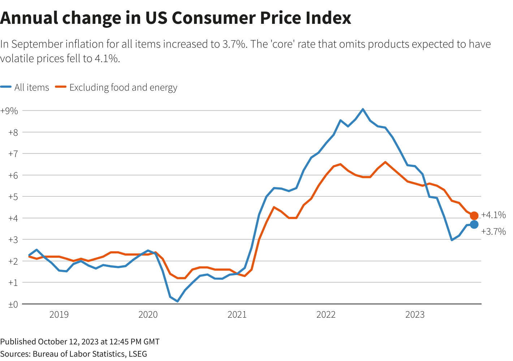

## Table of Contents

## What is the Consumer Price Index (CPI)?

The Consumer Price Index, or CPI, is a measure that tracks the average change over time in the prices paid by urban consumers for a market basket of consumer goods and services. This includes things like food, housing, clothing, transportation, and medical care. The CPI is calculated by taking price changes for each item in the basket and averaging them. It's often used to understand inflation, which is the rate at which the general level of prices for goods and services is rising.

The CPI is important because it helps people understand how much more expensive life is getting. For example, if the CPI goes up, it means that, on average, prices are increasing, and people might need more money to buy the same things they used to. Governments and businesses use the CPI to make decisions about wages, retirement benefits, and economic policies. It's a key tool for understanding the economy and planning for the future.

## How is the CPI calculated in the United States?

In the United States, the CPI is calculated by the Bureau of Labor Statistics (BLS). They start by figuring out what people commonly buy. They do this by sending out surveys to thousands of families to see what they spend their money on. This helps them create a "market basket" of goods and services, which includes things like food, housing, and transportation. Once they know what's in the basket, they go out and collect prices for these items from stores, rental units, and service providers all over the country. They do this every month to keep the data up to date.

After collecting the prices, the BLS calculates the average price change for each item in the basket. They then use a special formula to combine these price changes into a single number, which is the CPI. This formula takes into account how important each item is in the average family's spending. For example, if people spend a lot on housing, changes in housing prices will have a bigger effect on the CPI. The final CPI number shows how much prices have gone up or down compared to a base period, usually set at 100. If the CPI is 105, it means prices have gone up by 5% since the base period.

## What is the relationship between CPI and inflation?

The CPI and inflation are closely related. Inflation is when the prices of things we buy go up over time. The CPI measures this by looking at the average price changes of a bunch of goods and services that people commonly buy. When the CPI goes up, it means that, on average, prices are rising, which is a sign of inflation. So, the CPI is a way to keep track of inflation and see how fast prices are going up.

The CPI is important because it helps us understand how inflation is affecting our lives. If the CPI is going up quickly, it means inflation is high, and the money we have might not buy as much as it used to. Governments and businesses use the CPI to make decisions. For example, they might adjust wages or benefits to keep up with rising prices. By watching the CPI, we can get a good idea of how inflation is changing and plan for the future.

## How does inflation influence the value of the US dollar?

Inflation makes the value of the US dollar go down. When there's inflation, the prices of things go up, so the same amount of money can buy less than before. If you had a dollar and could buy a candy bar with it, but then inflation happens and the price of the candy bar goes up, now your dollar can't buy that candy bar anymore. It's like the dollar is worth less because it can't buy as much stuff.

This change in the dollar's value can affect a lot of things. For example, if you save money, inflation means your savings can buy less over time. Also, if you're buying things from other countries, a weaker dollar means you need more dollars to buy the same foreign goods. Governments and banks watch inflation closely because it can change how much their money is worth and how their economy is doing.

## What are exchange rates and how are they determined?

Exchange rates are the value of one country's money compared to another country's money. They tell you how much of one currency you need to get another currency. For example, if the exchange rate between the US dollar and the Euro is 1 to 0.85, it means you need 1 US dollar to get 0.85 Euros. Exchange rates are important because they affect how much things cost when you buy them from other countries and how much money you get when you sell things to other countries.

Exchange rates are determined by a lot of things. One big thing is supply and demand. If more people want to buy a country's currency, its value goes up. If fewer people want it, its value goes down. Things like a country's economy, interest rates, and even big news events can change how much people want a currency. Governments and banks can also try to change exchange rates by buying or selling their own currency. It's like a big, complicated puzzle where lots of pieces fit together to decide how much one currency is worth compared to another.

## How does a change in CPI affect the US dollar exchange rates?

When the CPI goes up, it usually means there's more inflation in the US. This can make the US dollar weaker compared to other countries' money. If people think the US dollar will buy less stuff because of higher prices, they might not want to hold onto US dollars as much. This can make the exchange rate change so that you need more US dollars to buy the same amount of another country's money.

For example, if the CPI in the US goes up a lot, but it doesn't go up as much in another country like Japan, people might think the US dollar will keep losing value. They might start buying more Japanese yen instead of US dollars. This would make the exchange rate between the US dollar and the Japanese yen go down, meaning you'd need more US dollars to get the same amount of yen. So, changes in the CPI can really affect how much the US dollar is worth when you're trading it for other currencies.

## Can you explain the concept of purchasing power parity in relation to CPI and exchange rates?

Purchasing power parity (PPP) is a way to compare how much things cost in different countries. It's based on the idea that if you take the same amount of money in two different countries, it should be able to buy about the same amount of stuff, no matter where you are. For example, if a burger costs $5 in the US and 4 Euros in Germany, the exchange rate should be about 1 US dollar to 0.8 Euros, so the burger costs the same in both places. PPP helps us understand if a currency is too strong or too weak compared to another currency.

The CPI and exchange rates are important for figuring out PPP. The CPI shows how much prices are going up in a country, which can change how much things cost. If the CPI goes up a lot in the US but not as much in another country, it might mean that the US dollar can buy less stuff than before. This could make the exchange rate change so that you need more US dollars to buy the same amount of the other country's money. So, by looking at the CPI and exchange rates, we can see if the idea of PPP is working or if currencies are not worth what they should be based on what they can buy.

## What historical data shows the correlation between CPI changes and US dollar fluctuations?

Historical data shows that when the CPI in the US goes up a lot, it usually means there's more inflation, and this can make the US dollar weaker compared to other countries' money. For example, during the 1970s, the US had high inflation, and the CPI went up a lot. This made the US dollar lose value compared to other currencies like the German mark and the Japanese yen. People didn't want to hold onto US dollars as much because they thought it would keep losing value, so the exchange rate changed to need more US dollars to buy the same amount of other currencies.

In the 1980s, the US started to control inflation better, and the CPI didn't go up as fast. This helped the US dollar get stronger again. The exchange rates started to change so that you needed fewer US dollars to buy other currencies. This shows that when the CPI and inflation are under control, the US dollar can be more stable and even get stronger. But when the CPI goes up a lot and inflation gets out of control, the US dollar can lose value quickly.

## How do expectations of future CPI affect currency markets?

When people think the CPI will go up a lot in the future, it can make them worry about inflation. If they believe prices will keep going up, they might not want to hold onto US dollars because they think the dollars will be worth less later. This can make the demand for US dollars go down, and as a result, the exchange rate might change so that you need more US dollars to buy the same amount of other currencies. So, if people expect the CPI to go up, it can make the US dollar weaker in the currency markets.

On the other hand, if people expect the CPI to stay steady or go up slowly, they might feel more confident about the US dollar. They might think it will keep its value or even get stronger. This can make more people want to buy and hold US dollars, which can make the exchange rate change so that you need fewer US dollars to buy other currencies. So, expectations about future CPI can really affect how strong or weak the US dollar is in the currency markets.

## What role do Federal Reserve policies play in mediating the impact of CPI on the US dollar?

The Federal Reserve, which is like the big boss of money in the US, can do things to help control how the CPI affects the US dollar. One big thing they do is change interest rates. If the CPI goes up a lot and they think inflation is getting too high, they might raise interest rates. This can make people want to save more money instead of spending it, which can slow down inflation. When interest rates go up, it can also make the US dollar stronger because people from other countries might want to buy US dollars to get those higher interest rates.

But the Federal Reserve can also do other things to help keep the US dollar stable. They can buy or sell US dollars in the currency markets to change how much the dollar is worth compared to other money. If they see the CPI going up and the dollar getting weaker, they might sell other currencies and buy US dollars to make the dollar stronger. By doing these things, the Federal Reserve tries to keep inflation under control and make sure the US dollar stays strong, even when the CPI changes a lot.

## How do international investors react to US CPI data releases, and what impact does this have on exchange rates?

When the US releases new CPI data, international investors pay close attention because it tells them about inflation in the US. If the CPI goes up a lot, investors might think the US dollar will become weaker because higher inflation can make money worth less. They might start selling their US dollars and buying other currencies instead. This can make the exchange rate change so that you need more US dollars to buy the same amount of other money. On the other hand, if the CPI stays steady or goes up slowly, investors might feel more confident about the US dollar and want to keep or buy more of it, which can make the dollar stronger.

The reaction of international investors to CPI data can really move the exchange rates. For example, if the CPI numbers are higher than what people expected, it can cause a big reaction in the currency markets. Investors might quickly sell US dollars, making the dollar drop in value fast. But if the CPI numbers are lower than expected, it can make investors feel better about the US dollar, and they might buy more of it, pushing the dollar's value up. So, the way investors react to CPI data can lead to big changes in how much the US dollar is worth compared to other currencies.

## What advanced econometric models are used to predict the impact of CPI on US dollar exchange rates?

Economists use fancy math models to guess how changes in the CPI will affect the US dollar's value compared to other money. One popular model is called the Vector Autoregression (VAR) model. This model looks at how different things, like the CPI, interest rates, and even what people expect about the future, all work together to change the exchange rate. By studying past data, the VAR model can help predict what might happen to the US dollar if the CPI goes up or down. It's like trying to see into the future by looking at how things have moved together in the past.

Another model that economists use is the Error Correction Model (ECM). This model is good at showing how the US dollar and the CPI might not match up perfectly right away, but they will eventually get back in line. For example, if the CPI goes up a lot but the US dollar doesn't get weaker right away, the ECM can help predict when and how much the dollar will change to match the new CPI numbers. It's like knowing that if you stretch a rubber band, it will snap back into place, and the ECM helps figure out when that snap will happen for the US dollar and the CPI.

## What is the understanding of CPI and its economic impact?

The Consumer Price Index (CPI) is a crucial economic indicator that measures the average change over time in the prices paid by consumers for a specified basket of goods and services. This basket typically includes categories such as food, housing, clothing, transportation, and healthcare, among others. The CPI is often used as a proxy for inflation, providing a snapshot of the general price level in an economy. 

Economists and policymakers closely monitor CPI as it is instrumental in gauging inflation, which is the rate at which the general level of prices for goods and services is rising, consequently eroding purchasing power. When inflation is high, each unit of currency buys fewer goods and services, impacting consumer spending patterns and overall economic stability.

The relationship between CPI and monetary policy is significant. Central banks, such as the Federal Reserve in the United States, use CPI as a critical input in their decision-making processes. If CPI data indicates rising inflation, central banks may opt to increase interest rates to cool down the economy. Higher interest rates tend to reduce consumer spending and borrowing but increase savings, thereby controlling the inflationary pressure.

Mathematically, inflation can be calculated as a percentage change in CPI over a period. For example, if $\text{CPI}_{\text{year 1}}$ is 100 and $\text{CPI}_{\text{year 2}}$ is 105, the inflation rate is calculated as follows:

$$
\text{Inflation Rate} = \left( \frac{\text{CPI}_{\text{year 2}} - \text{CPI}_{\text{year 1}}}{\text{CPI}_{\text{year 1}}} \right) \times 100 = 5\%
$$

Inflation levels have a direct influence on currency strength. Higher inflation typically leads to increased interest rates, which can bolster the value of the US Dollar. As interest rates rise, foreign investors seeking better returns might shift their investments into US-dominated assets, increasing demand for the US Dollar. Conversely, if CPI indicates declining inflation, central banks may lower interest rates, potentially weakening the currency as investors look for more lucrative opportunities elsewhere.

## What is the impact of CPI on US Dollar exchange rates?

Traders closely monitor monthly CPI releases due to their substantial impact on currency value fluctuations, particularly the US Dollar. The Consumer Price Index (CPI) serves as an essential gauge of inflation within an economy, reflecting the average change over time in the prices paid by consumers for a basket of goods and services. Thus, CPI data are potent signals that can preempt shifts in monetary policy, influencing foreign exchange markets.

A higher-than-expected CPI indicates that inflation is rising faster than anticipated. This scenario often leads central banks, such as the Federal Reserve, to consider elevating interest rates to curb inflationary pressures. When interest rates increase, investments in that country become more attractive due to higher returns, thus strengthening the currency. As a result, an unexpectedly high CPI release can bolster the US Dollar against other currencies. The relationship between interest rates and currency value can be understood through the Interest Rate Parity (IRP) equation:

$$
\frac{1 + i_{\text{domestic}}}{1 + i_{\text{foreign}}} = \frac{F}{S}
$$

where $i_{\text{domestic}}$ and $i_{\text{foreign}}$ are the interest rates of domestic and foreign countries, respectively, and $F$ and $S$ are the forward and spot exchange rates. A rise in $i_{\text{domestic}}$ relative to $i_{\text{foreign}}$ results in a stronger domestic currency over time.

Conversely, a lower-than-expected CPI suggests that inflationary pressures are under control or declining, providing potential leeway for the Federal Reserve to decrease interest rates to stimulate economic growth. Reduced interest rates make the currency less attractive for investors seeking better yields elsewhere, leading to a depreciation of the US Dollar. The expectation mechanism plays a central role here, as traders adjust their positions in anticipation of monetary policy shifts based on CPI readings.

In practice, [forex](/wiki/forex-system) traders employ sophisticated tools and analyses to interpret CPI data promptly, ensuring their trading strategies align with evolving economic conditions. By predicting the likely [course](/wiki/best-algorithmic-trading-courses) of interest rates and currency strength, traders seek to optimize their positions and maximize returns.

## How can one develop CPI-Based Trading Strategies?

To develop effective trading strategies based on Consumer Price Index (CPI) data, forex traders can employ a combination of [fundamental analysis](/wiki/fundamental-analysis), technical analysis, and risk management techniques. Each component plays a critical role in understanding and navigating the impacts of CPI releases on currency markets.

### Fundamental Analysis

Fundamental analysis involves evaluating economic indicators, such as CPI trends, to understand broader economic conditions. CPI is an essential measure of inflation, reflecting changes in the cost of goods and services. By regularly assessing CPI data, traders can anticipate shifts in inflation that may influence central bank policies, such as [interest rate](/wiki/interest-rate-trading-strategies) adjustments. For instance, a rising CPI could suggest the Federal Reserve may increase interest rates to curb inflation, possibly strengthening the US Dollar. Traders should analyze historical CPI data, noting patterns and changes over time, to form expectations about future monetary policy responses.

### Technical Analysis

Incorporating technical analysis allows traders to interpret market movements and time their trades effectively around CPI announcements. Tools like moving averages, relative strength index (RSI), and Bollinger Bands help in identifying entry and [exit](/wiki/exit-strategy) points based on CPI release impacts. Moving averages, for example, can smooth out price data over a specific period, making it easier to spot trends. A simple moving average (SMA) can be calculated as:

$$
\text{SMA} = \frac{\sum_{i=1}^{n} P_i}{n}
$$

where $P_i$ represents the price at the $i^{th}$ period, and $n$ is the number of periods.

Python code for calculating a simple moving average:

```python
def simple_moving_average(prices, window):
    if len(prices) < window:
        return None
    return sum(prices[-window:]) / window

# Example usage
prices = [1.10, 1.12, 1.15, 1.14, 1.13, 1.16, 1.18]
sma = simple_moving_average(prices, 3)
print(sma)  # Output should be the average of the last 3 prices
```

### Hedging Strategies and Risk Management

Due to the potential for increased [volatility](/wiki/volatility-trading-strategies) following CPI releases, risk management and hedging strategies are crucial for protecting investments. Traders can utilize options, futures contracts, or other financial instruments to hedge against adverse movements in currency prices. This approach helps mitigate risk by providing a safety net against large, unexpected swings in exchange rates. Additionally, setting stop-loss orders ensures positions are automatically exited if market movements exceed predetermined thresholds, preventing significant losses during volatile periods.

Properly integrating these strategies enables traders to respond effectively to CPI data, minimizing risks while maximizing opportunities. Understanding how CPI trends interact with market dynamics allows traders to implement informed strategies that are robust under various economic conditions.

## References & Further Reading

[1]: Bergstra, J., Bardenet, R., Bengio, Y., & Kégl, B. (2011). ["Algorithms for Hyper-Parameter Optimization."](https://papers.nips.cc/paper/4443-algorithms-for-hyper-parameter-optimization) Advances in Neural Information Processing Systems 24.

[2]: Antonopoulos, A. M., & Wood, G. (2018). ["Mastering Blockchain."](https://www.amazon.com/Mastering-Ethereum-Building-Smart-Contracts/dp/1491971940) Packt Publishing Ltd.

[3]: ["Advances in Financial Machine Learning"](https://www.amazon.com/Advances-Financial-Machine-Learning-Marcos/dp/1119482089) by Marcos Lopez de Prado

[4]: ["Evidence-Based Technical Analysis: Applying the Scientific Method and Statistical Inference to Trading Signals"](https://www.amazon.com/Evidence-Based-Technical-Analysis-Scientific-Statistical/dp/0470008741) by David Aronson

[5]: Taylor, J. B., & Weerapana, A. (2011). ["Principles of Economics."](https://www.amazon.com/Principles-Economics-John-B-Taylor/dp/0538453591) Cengage Learning.

[6]: ["Machine Learning for Algorithmic Trading"](https://github.com/stefan-jansen/machine-learning-for-trading) by Stefan Jansen

[7]: ["Quantitative Trading: How to Build Your Own Algorithmic Trading Business"](https://books.google.com/books/about/Quantitative_Trading.html?id=j70yEAAAQBAJ) by Ernest P. Chan