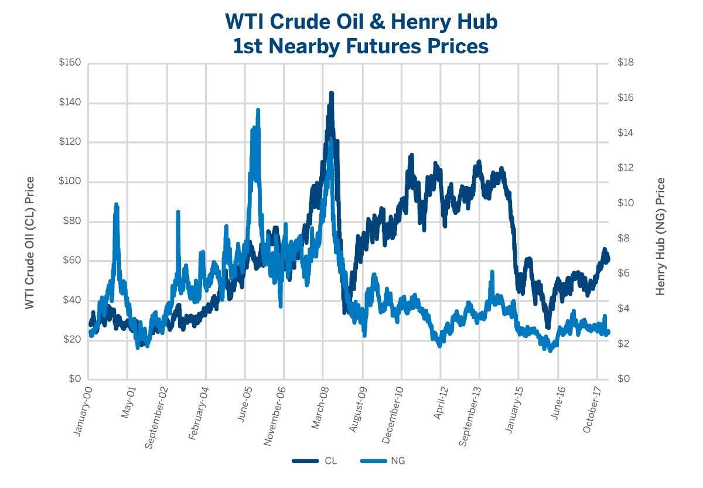

## Table of Contents

## What is crude oil and how is it used?

Crude oil is a thick, dark liquid found deep underground or under the ocean floor. It is made up of a mix of different substances, like hydrocarbons, which come from the remains of ancient plants and animals. People find crude oil by drilling into the earth, and it is very important because it is used to make many things we use every day.

Crude oil is turned into useful products through a process called refining. At a refinery, crude oil is heated and separated into different parts, like gasoline, diesel, and jet fuel. These fuels are used to power cars, trucks, and airplanes. Crude oil is also used to make plastics, medicines, and many other things. Without crude oil, many parts of our daily life would be very different.

## What is natural gas and how is it used?

Natural gas is a type of gas found deep in the earth, often near oil. It is made up mostly of a gas called methane, but it can also have other gases mixed in. People find natural gas by drilling into the earth, just like they do for oil. It is a very important energy source because it can be burned to make heat and power.

People use natural gas in many ways. In homes, it is used to heat water, cook food, and keep houses warm in the winter. It is also used in factories and power plants to make electricity. Natural gas is cleaner than coal or oil when it is burned, so it is better for the environment. It helps us do many things we need every day, like staying warm and having lights and power.

## How are crude oil and natural gas prices determined?

The prices of [crude oil](/wiki/crude-oil) and natural gas are set by what people call the market. This means that the price goes up when a lot of people want to buy oil or gas, but there isn't enough to go around. It goes down when there is more oil or gas than people want to buy. Many things can change how much people want to buy or how much is available. For example, if a big storm stops oil from being shipped, the price might go up because less oil is available. If new technology makes it easier to find oil or gas, the price might go down because there is more of it.

Another big thing that affects prices is what countries do. Some countries work together in groups like OPEC, which can decide to make less oil so the price goes up. Wars or political problems in countries that have a lot of oil or gas can also make prices change a lot. Also, the value of money in different countries can make oil and gas more or less expensive. If the dollar gets weaker, oil and gas, which are often sold in dollars, can become more expensive for people using other kinds of money.

Lastly, what people think might happen in the future can also change prices now. If people think there will be less oil or gas soon, they might start buying more now, which pushes the price up. If they think there will be more oil or gas soon, they might wait to buy, which can make the price go down. So, it's not just about what is happening right now, but also what people expect to happen later.

## What is the relationship between crude oil and natural gas?

Crude oil and natural gas are both found deep underground or under the sea. They are made from the remains of ancient plants and animals that got buried and changed over millions of years. Often, they are found together in the same places because they come from similar processes. When people drill for oil, they usually find natural gas too. This is why they are called fossil fuels, and they are very important for energy.

Crude oil and natural gas are used for different things, but they are connected in the energy market. The price of one can affect the price of the other. For example, if the price of oil goes up, people might use more natural gas instead, which can make the price of natural gas go up too. Also, when oil is refined, some natural gas can be made as a byproduct. So, what happens with oil can change how much natural gas is available and how much it costs. They are like close cousins in the world of energy.

## How does the price of crude oil directly affect natural gas prices?

The price of crude oil can directly affect the price of natural gas because they are often found and used together. When the price of oil goes up, people and companies might start using more natural gas instead because it can be cheaper. This increased demand for natural gas can push its price up. Also, when oil is refined into products like gasoline, some natural gas is made as a byproduct. If the price of oil is high, it can make more people want to refine oil, which means more natural gas is produced, but if this natural gas can't be used right away, it might be stored, which can affect its price too.

Another way oil prices affect natural gas prices is through the energy market. Oil and natural gas are both important for energy, and they compete with each other. If oil prices go up a lot, people might switch to natural gas to save money, making the demand for natural gas go up and its price go up too. On the other hand, if oil prices go down, people might use less natural gas, which can make its price go down. So, the prices of oil and natural gas are connected, and changes in one can cause changes in the other.

## Can changes in crude oil production influence natural gas prices?

Changes in crude oil production can definitely influence natural gas prices. When people produce more oil, they often find more natural gas too, because these two are usually found together underground. If there's a lot more natural gas because of increased oil production, the price of natural gas might go down. That's because there's more of it available, and people don't need to pay as much to get it. On the other hand, if oil production goes down, there might be less natural gas too, which can make its price go up because there's not enough to go around.

Also, when oil production changes, it can affect how much natural gas is made when oil is refined. When oil is turned into things like gasoline, some natural gas comes out as a byproduct. If oil production goes up, more natural gas might be made this way, which could lower its price if there's too much. If oil production goes down, less natural gas might be made, which could raise its price because there's not as much. So, what happens with oil can have a big impact on what happens with natural gas prices.

## What role do geopolitical events play in the pricing of crude oil and natural gas?

Geopolitical events can really shake up the prices of crude oil and natural gas. When there are wars, political problems, or big changes in countries that have a lot of oil and gas, it can make it hard to get these fuels out of those places. For example, if a country decides to stop selling oil because of a war, there's less oil to go around, and the price can go up because people still need it. Also, if a big storm or some other problem stops oil and gas from being shipped, the price can go up too because it's harder to get them where they need to go.

Countries sometimes work together in groups like OPEC, which can decide to make less oil to make the price go up. If a big country in OPEC has political trouble, it might not be able to make as much oil, which can change the price too. Even what people think might happen because of these events can change prices. If people think a war might start soon, they might start buying more oil now, which can push the price up even before anything happens. So, what's going on in the world can have a big effect on how much we pay for oil and gas.

## How do market speculations impact the prices of crude oil and natural gas?

Market speculations can make the prices of crude oil and natural gas go up and down a lot. When people who trade oil and gas think that the price will go up soon, they start buying a lot of it now. This makes the demand go up, and the price goes up too, even if nothing has really changed yet. On the other hand, if people think the price will go down soon, they might sell their oil and gas now, which can make the price go down because there's more of it available.

These guesses about the future can be based on many things, like what people think might happen with the economy, new technology, or even the weather. If traders think there will be a big storm that could stop oil from being shipped, they might start buying more oil now, which pushes the price up. So, what people think might happen can make the prices of oil and gas change, even if those things don't actually happen.

## What are the long-term trends in the correlation between crude oil and natural gas prices?

Over the long term, the prices of crude oil and natural gas have often moved together, but not always in the same way. This is because they are both important energy sources and are often found and used together. When the price of oil goes up a lot, people might start using more natural gas instead because it can be cheaper. This can make the demand for natural gas go up, which pushes its price up too. But sometimes, the prices can move differently. For example, if there's a lot more natural gas being found than oil, the price of natural gas might not go up as much as oil, even if people are using more of it.

In the past few decades, new ways of finding and getting natural gas, like fracking, have changed how the prices of oil and gas are related. Fracking has made a lot more natural gas available, which has sometimes made its price go down, even when oil prices were going up. Also, as more people and countries try to use less oil and more natural gas because it's cleaner, the way their prices move together can change. So, while oil and gas prices often go up and down together, new technology and changes in what people want can make their prices move differently over time.

## How do seasonal demands affect the relationship between crude oil and natural gas prices?

Seasonal demands can change how the prices of crude oil and natural gas move together. In the winter, people use more natural gas to heat their homes. This means the demand for natural gas goes up, which can make its price go up too. At the same time, people might use less oil because they're driving less in the cold weather. So, the price of oil might not go up as much as natural gas in the winter. This can make the prices of oil and gas move differently during this time.

In the summer, the opposite can happen. People use more oil because they're driving more for vacations and other trips. This can make the demand for oil go up, which can push its price up. At the same time, people might use less natural gas because they don't need as much to heat their homes. So, the price of natural gas might not go up as much as oil in the summer. These seasonal changes can make the prices of oil and gas go up and down in different ways throughout the year.

## What economic theories explain the impact of crude oil on natural gas prices?

One economic theory that helps explain how crude oil affects natural gas prices is the theory of substitution. This theory says that if the price of one thing goes up, people might start using something else instead. For example, if oil gets really expensive, people might switch to using more natural gas because it's cheaper. This makes the demand for natural gas go up, which can push its price up too. So, when oil prices change, it can make people want to use more or less natural gas, which changes its price.

Another theory is the theory of joint production. This theory says that when you make one thing, you often make something else at the same time. For oil and natural gas, they are often found together underground. When people drill for oil, they usually find natural gas too. If more oil is being produced, more natural gas is usually produced too. This can make the price of natural gas go down if there's too much of it. But if less oil is being produced, there might be less natural gas too, which can make its price go up. So, what happens with oil production can change how much natural gas is available and how much it costs.

## How can advanced econometric models predict future impacts of crude oil prices on natural gas?

Advanced econometric models can help predict how changes in crude oil prices might affect natural gas prices by looking at a lot of data from the past. These models use math to find patterns in how oil and gas prices have moved together over time. They can look at things like how much oil and gas people are using, how much is being produced, and even what's happening in the world that might change prices. By understanding these patterns, the models can make guesses about what might happen to natural gas prices if oil prices go up or down.

For example, if an econometric model sees that every time oil prices went up in the past, natural gas prices went up too because people started using more gas, the model can predict that this might happen again. The models can also take into account things like new technology or changes in what people want that might change how oil and gas prices are related. By using all this information, these models can give us a good idea of what might happen to natural gas prices in the future based on what's happening with oil prices now.

## References & Further Reading

[1]: Kaufman, P. J. (2013). ["Trading Systems and Methods"](https://onlinelibrary.wiley.com/doi/book/10.1002/9781119202561). Wiley.

[2]: Geman, H. (2005). ["Commodities and Commodity Derivatives: Modelling and Pricing for Agriculturals, Metals and Energy"](https://download.e-bookshelf.de/download/0000/5675/90/L-G-0000567590-0015270354.pdf). Wiley.

[3]: Dempster, M. A. H., & Leemans, V. (2006). ["An Automated FX Trading System Using Adaptive Reinforcement Learning"](https://www.sciencedirect.com/science/article/pii/S0957417405003015). Quantitative Finance, 6(1), 57-71.

[4]: Hull, J. (2015). ["Options, Futures, and Other Derivatives"](https://www.amazon.com/Options-Futures-Other-Derivatives-9th/dp/0133456315). Pearson.

[5]: Narang, R. K. (2013). ["Inside the Black Box: The Simple Truth About Quantitative Trading"](https://onlinelibrary.wiley.com/doi/book/10.1002/9781118267738). Wiley.