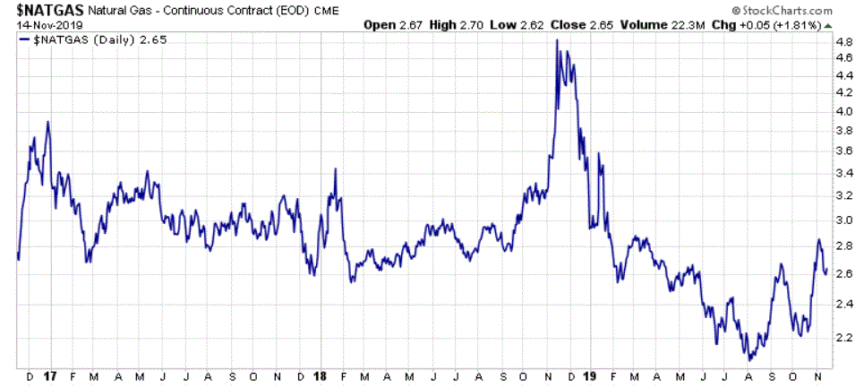

In energy markets, natural gas prices and crude oil play pivotal roles in shaping global economic landscapes. These commodities are key drivers of energy production, transportation, and industrial activities, influencing both developed and emerging economies. Understanding the intricacies of these markets can provide valuable insights for investors and traders alike, allowing them to anticipate shifts and make informed decisions.

Algorithmic trading, commonly known as algo trading, has revolutionized the way financial markets operate, including those involving natural gas and crude oil. This innovative trading method uses computer algorithms to automate trading strategies, enabling rapid execution of trades with precision and minimal human intervention. The integration of algo trading into energy markets has introduced new levels of speed, efficiency, and liquidity, transforming how market participants interact with these traditionally volatile commodities.



This article aims to explore the complex interrelations between natural gas and crude oil markets, examining the various factors that drive their price movements and the profound influence of algorithmic trading on these dynamics. Key considerations include supply and demand fluctuations, geopolitical developments, and technological innovations in extraction and trading. Additionally, we will investigate how algorithmic trading is reshaping market behavior, impacting everything from price discovery to risk management.

Whether you're a seasoned trader or a curious observer, this comprehensive guide will provide detailed insights into the energy market. It offers a rich understanding of the interplay between these critical energy commodities and the technological advancements that are propelling modern trading practices. By enhancing your knowledge of these sectors, you can better navigate the complexities of energy markets and optimize your investment strategies.

## Table of Contents

## Understanding Natural Gas Prices

Natural gas is an essential element of the global energy supply chain, integral to heating, electricity generation, and industrial processes. Its pricing is influenced by multiple factors, each playing a critical role in determining market stability and trends.

**Supply and Demand Dynamics**

The fundamental economic principle of supply and demand significantly impacts natural gas prices. High demand scenarios, coupled with supply constraints, typically cause price surges. Conversely, an oversupply can lead to price reductions. The extraction and production levels are sharp indicators of supply; when producers anticipate higher demand, they may increase extraction efforts, affecting market prices.

**Geopolitical Tensions**

Geopolitical events can have immediate and sometimes severe impacts on natural gas prices. Political instability in major producing regions can disrupt supply chains, causing price [volatility](/wiki/volatility-trading-strategies). For instance, conflicts or sanctions in countries rich in natural gas reserves might lead to supply shortages in the international market, pushing prices higher.

**Advancements in Extraction Technology**

Technological innovations in extraction methods, such as hydraulic fracturing and horizontal drilling, have reshaped the production landscape. These advancements enable producers to access previously unattainable reserves, increasing overall supply. Enhanced extraction technology can reduce costs, thereby influencing market prices by lowering the cost barriers associated with production.

**Seasonal Consumption Patterns**

Seasonal variations significantly affect natural gas consumption, with cold winters and hot summers leading to increased usage for heating and cooling, respectively. In regions with extreme climate fluctuations, this seasonal demand contributes to price volatility. Energy providers often rely on stockpiling natural gas during off-peak seasons to manage supply during high-demand periods.

**Policy Changes and Climate Initiatives**

Recent trends indicate that policy shifts concerning renewable energy and climate change mitigation influence natural gas prices. As governments implement measures to reduce carbon emissions, there may be increased investments in natural gas as a cleaner alternative to coal and oil. However, aggressive transitions toward renewable energy sources could dampen natural gas demand, affecting its market valuation.

An understanding of these interconnected factors is crucial for predicting natural gas market trends, facilitating effective trading strategies, and making informed investment decisions. Integrating these insights with market data analytics can aid traders in navigating the complexities of the natural gas market effectively.

## Crude Oil: A Market Overview

Crude oil is a fundamental commodity in the global market, acting as a benchmark for numerous industrial and economic activities. Its significance stems from its wide-ranging applications, from fueling transportation to serving as a raw material in petrochemical industries. The pricing of [crude oil](/wiki/crude-oil) is subject to a variety of influential factors, foremost among them being geopolitical events. Political instability or conflict in key oil-producing regions can lead to supply disruptions, thus affecting prices. Similarly, international diplomatic developments, such as sanctions or trade agreements, can have immediate impacts on oil market dynamics.

Another critical [factor](/wiki/factor-investing) in crude oil pricing is the production levels set by major oil-producing countries. Nations with vast oil reserves, such as those in the Organization of the Petroleum Exporting Countries (OPEC), wield considerable influence over market prices through their production quotas. OPEC's policies, which may include agreements to cut or increase oil production, are closely monitored by traders as they can significantly alter market supply and demand balances.

Technological advancements, particularly in extraction methods like shale oil, have altered the global supply landscape. Enhanced oil recovery techniques and hydraulic fracturing (fracking) have unlocked vast quantities of previously inaccessible oil, particularly in North America. The increase in shale oil production has contributed to a shift in global oil supply, making the U.S. one of the top oil producers. This has further implications for OPEC's influence on the market, as non-OPEC production gains prominence.

In recent years, there has been a growing emphasis on alternative energy sources, driven by environmental concerns and sustainability goals. The rise of renewable energy technologies—such as solar, wind, and biofuels—poses a long-term challenge to crude oil demand. While the current energy infrastructure is heavily reliant on fossil fuels, the gradual shift towards cleaner energy alternatives suggests a potential reduction in the demand for oil, influencing its market dynamics.

For traders looking to capitalize on crude oil market trends, a comprehensive understanding of these elements—political influences, production dynamics, technological advancements, and the growing embrace of renewables—is imperative. These factors collectively shape the complex environment in which crude oil markets operate, and staying informed about these developments can provide traders with a valuable edge in forecasting price movements and executing effective trading strategies.

## The Rise of Algorithmic Trading in Energy Markets

Algorithmic trading revolutionizes the way trades are executed in energy markets, particularly for commodities like natural gas and crude oil. Through the use of computer algorithms, this trading approach automates transactions, enhancing both speed and efficiency. This automation is crucial in energy markets where the execution of large volumes of trades with minimal market impact is essential to maintain [liquidity](/wiki/liquidity-risk-premium) and stability.

Traders leverage [algorithmic trading](/wiki/algorithmic-trading) to capitalize on minor price discrepancies rapidly. This involves utilizing complex mathematical models and fast computational processes. A typical example is statistical [arbitrage](/wiki/arbitrage), where traders employ algorithms to identify pricing inefficiencies between correlated financial instruments and execute trades to exploit these differences. 

```python
# Example of a simple algorithmic trading strategy in Python using a moving average crossover

import pandas as pd

# Load historical data
data = pd.read_csv('historical_data.csv')

# Calculate moving averages
data['Short_MA'] = data['Close'].rolling(window=30).mean()
data['Long_MA'] = data['Close'].rolling(window=90).mean()

# Generate trading signals
data['Signal'] = 0
data.loc[data['Short_MA'] > data['Long_MA'], 'Signal'] = 1
data.loc[data['Short_MA'] < data['Long_MA'], 'Signal'] = -1

# Execute trades based on signals
def execute_trades(data):
    for i in range(1, len(data)):
        if data['Signal'].iloc[i] == 1 and data['Signal'].iloc[i-1] == -1:
            print(f"Buy at {data['Close'].iloc[i]}")
        elif data['Signal'].iloc[i] == -1 and data['Signal'].iloc[i-1] == 1:
            print(f"Sell at {data['Close'].iloc[i]}")

execute_trades(data)
```

The integration of big data and [machine learning](/wiki/machine-learning) into algorithmic strategies has further propelled their capabilities. Machine learning algorithms can process vast amounts of data to uncover patterns and insights that were previously hidden, thereby enhancing predictive accuracy and decision-making processes. For instance, machine learning models can analyze historical oil price movements, weather patterns affecting natural gas demand, and geopolitical events to forecast future price trends with greater precision.

Despite the advantages, the rapid technological advancements in algorithmic trading necessitate continuous adaptation by regulatory bodies. These regulators work to develop frameworks and guidelines that ensure fair competition and protect against potential market abuses such as flash crashes or market manipulation. To address these challenges, regulatory agencies are increasingly incorporating real-time monitoring systems and stress-testing approaches to oversee trading activities effectively.

The continual evolution of algorithmic trading underscores the need for ongoing adaptation by both market participants and regulators. Traders must stay abreast of technological developments and regulatory updates to maintain a competitive edge in these dynamic markets.

## Impact of Algo Trading on Natural Gas and Crude Oil Prices

Algorithmic trading, or algo trading, has made a significant impact on the natural gas and crude oil markets by streamlining trading operations and enhancing market efficiency. One of the primary advantages of algorithmic trading is its ability to significantly reduce response times for trading opportunities. By leveraging high-frequency trading algorithms, traders can execute orders within microseconds, thus capitalizing on fleeting price movements that would otherwise be unattainable through manual trading methods.

A key benefit of algorithmic trading is its capacity to analyze vast datasets swiftly and accurately, facilitating improved market predictions and decision-making. Algorithms are designed to process large volumes of data, such as historical prices, market news, and other relevant indicators, to identify patterns and predict future price movements. This ability to handle and interpret complex datasets enables traders to make informed decisions rapidly, effectively optimizing their trading strategies.

Nevertheless, the rapid pace and complexity of algorithmic trading come with inherent risks. One such risk is the occurrence of flash crashes, where massive sell-offs occur in fractions of a second, leading to drastic price declines and market volatility. Flash crashes can be triggered by erroneous algorithms, unexpected market events, or cascading failures in trading systems. Additionally, erratic market behaviors induced by high-frequency trading can lead to increased market instability.

To mitigate these risks, traders and financial institutions must implement effective risk management and monitoring strategies. This involves setting circuit breakers—mechanisms that automatically halt trading when volatility spikes—and deploying robust testing and validation protocols to ensure algorithm integrity. Continuous monitoring of algorithm performance and market conditions is essential to adapting strategies in real-time and minimizing potential adverse effects.

Despite these challenges, algorithmic trading brings significant advantages to energy markets, particularly in enhancing liquidity and tightening spreads. By increasing the [volume](/wiki/volume-trading-strategy) of trades and bringing more participants into the market, algorithms contribute to a more liquid trading environment. This heightened liquidity encourages tighter spreads, making trading more cost-efficient for market participants.

Overall, while algorithmic trading introduces certain complexities and risks, its benefits in terms of speed, efficiency, and market liquidity make it an invaluable tool in modern natural gas and crude oil markets. With proper risk management and ongoing technological advancements, algorithmic trading is likely to continue playing a crucial role in shaping the future of energy markets.

## Future Trends and Considerations

As renewable energy sources such as wind, solar, and hydroelectric power continue to grow, both natural gas and crude oil markets might undergo significant changes. This shift towards sustainable energy will likely alter supply and demand dynamics, as well as influence market volatility and price structures in traditional energy sectors.

Algorithmic trading tools are evolving in parallel with advancements in [artificial intelligence](/wiki/ai-artificial-intelligence) (AI) and machine learning technologies. These technologies enable more sophisticated modeling and predictive analytics, allowing traders to process vast amounts of data with improved accuracy. Machine learning algorithms can analyze patterns and predict market movements that may not be immediately apparent to human analysts. Python, with its extensive libraries such as NumPy, pandas, and TensorFlow, remains a preferred language for developing and testing these trading algorithms.

Staying informed about regulatory changes is essential for traders, given that changes in policy can have direct and indirect effects on trading operations and market stability. Regulatory bodies are continuously updating frameworks to keep pace with technological advancements, ensuring fair and transparent market practices. Traders must adapt to these changes to remain compliant and mitigate legal risks.

As technological trends and market innovations emerge, adapting to these developments will be crucial for long-term success. This involves leveraging new tools, staying current on technological advances, and continually refining trading strategies. The integration of AI-driven algorithms can be an opportunity for those who quickly adapt, offering competitive advantages in speed and efficiency.

The evolving energy trading landscape demands continuous learning and adaptation. Traders must be proactive in acquiring new skills and staying updated on market trends to effectively seize trading opportunities. With the rapid pace of technological evolution, a commitment to lifelong learning in algorithmic trading is vital for maintaining relevance and ensuring profitability in energy markets.

## Conclusion

The interplay between natural gas prices, crude oil, and algorithmic trading underscores the intricate nature of contemporary energy markets. Understanding these complexities is pivotal for traders seeking to gain a competitive edge. Market drivers such as geopolitical events, supply and demand fluctuations, and technological advancements play crucial roles in shaping the dynamics of these commodities. Algorithmic trading, with its rapid data processing and execution capabilities, further adds layers of sophistication to market operations.

As the energy sectors continue to evolve, embracing change and innovation is fundamental for effective navigation. Algorithmic trading strategies, driven by advancements in artificial intelligence and machine learning, are expected to advance, potentially transforming how trading decisions are made. Traders must remain vigilant in keeping up with regulatory changes, which could significantly influence market participation and strategies.

This article serves as a foundation for comprehending the nuances of energy trading, offering insights into the interactions between key market components. Empowering oneself with knowledge about these markets is essential for making informed and strategic investment decisions. As technology and market conditions evolve, continuous learning and adaptation will be crucial for traders aiming to capitalize on future trading opportunities.

## References & Further Reading

[1]: Kaufman, P. J. (2013). ["Trading Systems and Methods"](https://onlinelibrary.wiley.com/doi/book/10.1002/9781119202561). Wiley.

[2]: Geman, H. (2005). ["Commodities and Commodity Derivatives: Modelling and Pricing for Agriculturals, Metals and Energy"](https://download.e-bookshelf.de/download/0000/5675/90/L-G-0000567590-0015270354.pdf). Wiley.

[3]: Dempster, M. A. H., & Leemans, V. (2006). ["An Automated FX Trading System Using Adaptive Reinforcement Learning"](https://www.sciencedirect.com/science/article/pii/S0957417405003015). Quantitative Finance, 6(1), 57-71.

[4]: Hull, J. (2015). ["Options, Futures, and Other Derivatives"](https://www.amazon.com/Options-Futures-Other-Derivatives-9th/dp/0133456315). Pearson.

[5]: Narang, R. K. (2013). ["Inside the Black Box: The Simple Truth About Quantitative Trading"](https://onlinelibrary.wiley.com/doi/book/10.1002/9781118267738). Wiley.