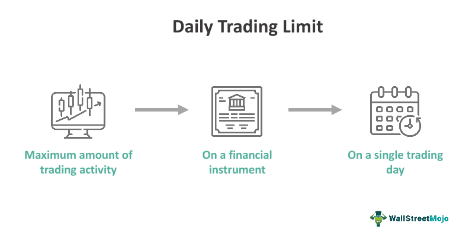

## Table of Contents

## What are daily trading limits and why do they exist?

Daily trading limits are rules set by stock exchanges that limit how much the price of a stock or futures contract can change in one day. These limits are usually set as a percentage of the stock's or contract's current price. For example, if a stock has a daily trading limit of 10%, it means the price can't go up or down more than 10% from its starting price that day.

These limits exist to help keep the market stable and protect investors from big, sudden price swings. Without these limits, the price of a stock could change a lot very quickly, which could scare investors and make them lose a lot of money. By having daily trading limits, exchanges can slow down these big price changes and give investors time to think and make better decisions.

## How do daily trading limits affect a beginner trader's strategy?

Daily trading limits can really change how a beginner trader plans their moves. If a stock hits its daily limit, it means the price can't go any higher or lower that day. This can be tricky for a beginner because they might want to buy or sell a stock, but they can't if it's already at its limit. So, they need to be careful and think about when to trade, making sure they don't miss out on chances to make money or lose money because of these limits.

Because of these limits, a beginner trader might decide to spread out their trades over several days instead of trying to do everything in one day. This way, they can still buy or sell a stock even if it hits its limit on one day. It's also a good idea for them to keep an eye on the news and market trends, so they can guess when a stock might hit its limit and plan their trades around that. By understanding and working with daily trading limits, a beginner can make smarter choices and maybe even find new ways to trade.

## What are the potential risks of reaching a daily trading limit?

When a stock hits its daily trading limit, it can't go up or down anymore that day. This can be risky for traders because if they want to buy or sell the stock, they have to wait until the next day. If the stock is going up and hits its limit, people who want to buy it might miss out on making more money because they can't buy it at a higher price that day. On the other hand, if the stock is going down and hits its limit, people who want to sell it might lose more money because they can't sell it at a lower price that day.

Another risk is that when a stock hits its limit, it can make the market feel unsure and cause more people to want to buy or sell the stock the next day. This can lead to big price changes when trading starts again. For example, if a lot of people want to buy a stock that hit its upper limit, the price might jump up a lot when the market opens the next day. This can be hard for beginner traders to handle because they might not know how to react to these big changes.

## Can daily trading limits help in managing risk for novice traders?

Daily trading limits can help novice traders manage risk by stopping big price changes from happening in one day. When a stock hits its limit, it can't go up or down anymore that day. This gives new traders time to think and make better choices instead of rushing to buy or sell when prices are moving a lot. It's like a safety net that helps keep the market calm and gives everyone a chance to catch their breath.

But, these limits can also make things tricky for beginners. If a stock hits its limit and a new trader wants to buy or sell it, they have to wait until the next day. This can be frustrating because they might miss out on making money or lose money if the price changes a lot when trading starts again. So, while daily trading limits can help manage risk, new traders need to be careful and plan their moves around these limits to make the most of them.

## How do experienced traders adjust their strategies around daily trading limits?

Experienced traders know how to use daily trading limits to their advantage. They watch the market closely and try to guess when a stock might hit its limit. If they think a stock is going to go up and hit its upper limit, they might buy it before it gets there. This way, they can sell it the next day when the price might jump even higher. On the other hand, if they think a stock is going to go down and hit its lower limit, they might sell it before it gets there or even short sell it, hoping to buy it back cheaper the next day.

These traders also spread out their trades over several days to avoid getting stuck if a stock hits its limit. They know that waiting a day can sometimes be a good thing because it gives them more time to see how the market is moving. By understanding how daily trading limits work, experienced traders can make smarter choices and find new ways to make money, even when the market is moving a lot.

## What psychological impacts can daily trading limits have on traders?

Daily trading limits can make traders feel frustrated or stressed out. When a stock hits its limit, traders can't buy or sell it anymore that day. This means they might miss out on making money if the stock was going up, or they might lose money if it was going down. This can make them feel like they have no control over what's happening, which can be really hard to deal with, especially for new traders who are still learning.

On the other hand, daily trading limits can also help traders feel safer. Knowing that there's a limit on how much a stock can change in one day can make them feel more calm and less worried about big, sudden price swings. This can give them time to think and make better choices instead of rushing to buy or sell when things get crazy. So, while these limits can be frustrating, they can also help traders feel more secure and in control of their trading.

## How do daily trading limits vary across different markets and exchanges?

Daily trading limits can be different depending on which market or exchange you're looking at. For example, in the U.S., the stock market has rules called "circuit breakers" that stop trading if the market goes up or down too much in one day. These rules are meant to keep things calm and give everyone a chance to think. But, in other countries, like China, they have their own rules. The Chinese stock market has limits on how much a single stock can go up or down each day, usually around 10%. This is to stop big price changes and protect investors.

Different types of markets also have different limits. For example, futures markets, where people trade contracts for things like oil or corn, often have tighter limits than stock markets. This is because futures prices can change a lot very quickly, so they need stricter rules to keep things under control. Also, some smaller or newer exchanges might have different limits than big, well-known ones. It's important for traders to know the rules of the market they're trading in, so they can plan their moves and manage their risks better.

## What are the historical impacts of daily trading limits on market volatility?

Daily trading limits have been used for a long time to try and keep markets from getting too wild. When these limits were first put in place, they helped stop big, sudden price changes that could scare investors and make them lose a lot of money. For example, during the 1987 stock market crash in the U.S., the market fell so fast that it made everyone panic. After that, rules like circuit breakers were made to stop trading for a bit if the market started falling too fast. These rules helped calm things down and gave people time to think before making big decisions.

But, daily trading limits can also make things more confusing sometimes. When a stock hits its limit and can't go up or down anymore that day, it can make people feel unsure about what will happen next. This can lead to even bigger price changes when trading starts again. For instance, if a lot of people want to buy a stock that hit its upper limit, the price might jump up a lot the next day. So, while these limits can help keep the market calm, they can also make it harder for traders to know what to do next.

## How can advanced traders use daily trading limits to their advantage?

Advanced traders know how to use daily trading limits to make smart moves. They watch the market closely and try to guess when a stock might hit its limit. If they think a stock is going to go up and hit its upper limit, they might buy it before it gets there. This way, they can sell it the next day when the price might jump even higher. On the other hand, if they think a stock is going to go down and hit its lower limit, they might sell it before it gets there or even short sell it, hoping to buy it back cheaper the next day.

These traders also spread out their trades over several days to avoid getting stuck if a stock hits its limit. They know that waiting a day can sometimes be a good thing because it gives them more time to see how the market is moving. By understanding how daily trading limits work, advanced traders can make smarter choices and find new ways to make money, even when the market is moving a lot.

## What are the regulatory perspectives on daily trading limits and their effectiveness?

Regulators see daily trading limits as important tools to keep markets stable and protect investors. They think these limits stop big, sudden price changes that could scare people and make them lose a lot of money. For example, after the 1987 stock market crash, U.S. regulators made rules like circuit breakers to stop trading for a bit if the market starts falling too fast. These rules help calm things down and give everyone time to think before making big decisions. Regulators believe that by having these limits, they can make the market safer for everyone.

But, regulators also know that daily trading limits can have some problems. Sometimes, when a stock hits its limit and can't go up or down anymore that day, it can make people feel unsure about what will happen next. This can lead to even bigger price changes when trading starts again. So, while these limits can help keep the market calm, they can also make it harder for traders to know what to do next. Regulators keep watching how these limits work and sometimes change the rules to make them better.

## How do daily trading limits interact with other market mechanisms like circuit breakers?

Daily trading limits and circuit breakers are both rules that markets use to stop big, sudden price changes. Daily trading limits stop a single stock or futures contract from going up or down too much in one day. For example, if a stock has a daily limit of 10%, it can't change more than 10% from its starting price that day. Circuit breakers, on the other hand, stop trading for the whole market if it goes up or down too much in a short time. They are like a big pause button that gives everyone a chance to calm down and think before trading starts again.

These two rules work together to keep the market stable. If a stock hits its daily limit, it can't go up or down anymore that day, which helps stop big price changes for that stock. But if the whole market starts moving a lot, circuit breakers can step in and stop trading for everyone. This way, both rules help protect investors from losing a lot of money because of wild price swings. By working together, daily trading limits and circuit breakers make the market safer and more predictable for everyone.

## What future changes might we see in daily trading limits based on current market trends?

As markets keep changing and getting more high-tech, the rules about daily trading limits might change too. One big trend is using computers and math to trade, which can make prices move really fast. Because of this, some people think daily trading limits might need to be tighter or quicker to stop big price changes. Also, as more people trade all over the world, markets might start working together more to set limits that work for everyone, no matter where they are.

Another thing that could change daily trading limits is how people feel about risk. If people start feeling more scared about losing money, regulators might make the limits stricter to make them feel safer. But if people start feeling more okay with taking risks, the limits might get looser to let prices move more freely. Either way, the goal will still be to keep the market stable and protect investors, but the rules might look a bit different in the future.

## References & Further Reading

[1]: Laurence, M.M. (circuit breakers in organized futures markets) (2000), Journal of Futures Markets, 8(3), 279-292.

[2]: Kim, K. A., & Rhee, S. G. (1997). "Price Limit Performance: Evidence from the Tokyo Stock Exchange." The Journal of Finance, 52(2), 885-901.

[3]: Kyle, A. S. (1985). "Continuous Auctions and Insider Trading." Econometrica: Journal of the Econometric Society, 53(6), 1315-1335.

[4]: Madhavan, A. (2000). "Market microstructure: A survey." Journal of Financial Markets, 3(3), 205-258.

[5]: Lopez de Prado, M. (2018). ["Advances in Financial Machine Learning"](https://www.amazon.com/Advances-Financial-Machine-Learning-Marcos/dp/1119482089), Wiley.

[6]: Chan, E. P. (2009). ["Quantitative Trading: How to Build Your Own Algorithmic Trading Business"](https://github.com/ftvision/quant_trading_echan_book), Wiley.