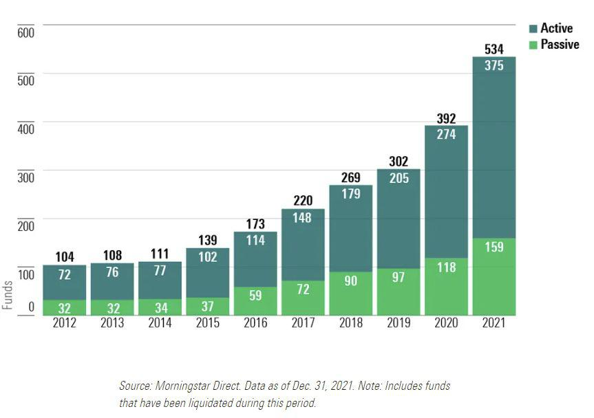

ESG (Environmental, Social, and Governance) investing has experienced a notable rise in prominence in recent years. This shift can be largely attributed to the increasing availability and significance of ESG data, which empowers investors to make choices that are not only financially informed but also ethically and sustainably conscious. ESG investing is characterized by incorporating considerations of environmental impact, social influence, and governance standards into investment decision-making.

The proliferation of ESG data has heralded a new era in investment strategies, rendering ESG investing a mainstream approach rather than a niche market. The breadth and depth of available data allow investors to evaluate corporate performance through a lens that extends beyond traditional financial metrics, offering insights into a company's sustainable practices and governance qualities. This holistic view aligns well with modern trading frameworks that emphasize long-term gains and corporate responsibility.



Furthermore, ESG data is increasingly being integrated into algorithmic trading strategies. This convergence allows for the automation of trading decisions that adhere to sustainable investment principles while leveraging advanced computational tools to optimize outcomes. The scope of ESG investing is expanding as data becomes not only more abundant but also more actionable, guiding investors and trading algorithms toward practices that align with ethical and sustainable values.

As the landscape of ESG investing continues to evolve, its integration with algorithmic trading strategies highlights the transformative power of data in reshaping investment paradigms. Driven by both technological advancements and the growing awareness of sustainable practices, ESG investing is positioned at the forefront of responsible investment strategies. This development challenges traditional approaches, urging a reevaluation of how investment success is defined and pursued in contemporary markets.

## Table of Contents

## The Rise of ESG Investing

ESG (Environmental, Social, and Governance) investing integrates environmental stewardship, social responsibility, and governance standards into investment processes. This approach aims to ensure that investments align not only with financial goals but also with ethical and sustainable principles. The rise of ESG investing has been facilitated significantly by the availability of comprehensive ESG data, which provides insights into an organization's non-financial performance.

Data availability has been a pivotal [factor](/wiki/factor-investing) in the expansion of ESG investing. Previously, investors primarily focused on financial data to make investment decisions. However, the growing emphasis on ESG data has broadened the criteria investors use. Companies and third-party organizations now provide extensive ESG reports, offering data on carbon footprints, human rights practices, board diversity, and other relevant metrics. This data helps investors assess sustainability and ethical risks associated with their portfolios.

Over recent years, [ESG](/wiki/esg-investing) investments have shown an upward trend. A report from the Global Sustainable Investment Alliance (GSIA) indicated that global sustainable investment reached $35.3 trillion at the start of 2020, a 15% increase since 2018 [1]. The increase in ESG-focused funds can be attributed to the public's growing demand for transparency and accountability from the companies they invest in. Investors are increasingly recognizing the long-term benefits of incorporating ESG criteria, such as risk mitigation and the potential for superior returns.

Data analytics has become an indispensable tool in this growth trajectory. Analytical models can process vast volumes of ESG data to score companies on various sustainability metrics. For instance, [machine learning](/wiki/machine-learning) algorithms can identify patterns and correlations within data that might not be immediately apparent, allowing investors to predict the performance of ESG-compliant stocks more accurately. This competence enhances the decision-making process, allowing for more nuanced assessments of risk and opportunity in sustainable investing.

Furthermore, the rise of ESG scores and ratings by institutions like MSCI and Sustainalytics has provided investors with standardized benchmarks for assessing ESG performance. These scores synthesize complex ESG data into actionable insights, facilitating easier comparisons across companies and sectors.

In conclusion, the rise of ESG investing has been significantly bolstered by the availability and utilization of ESG data. This data enables investors to make better-informed choices that are in line with sustainable and ethical practices, ultimately promoting a more responsible investment landscape.

References:
1. Global Sustainable Investment Alliance. (2020). "2020 Global Sustainable Investment Review". Available at: [GSIA Resource](http://www.gsi-alliance.org/trends-report-2020/).

## Data as a Catalyst for ESG Investing

The role of data in ESG (Environmental, Social, and Governance) investing is pivotal, acting as the essential ingredient for informed and responsible investment decisions. ESG data enables investors to evaluate potential investments by integrating sustainability and ethical considerations, broadening the criteria traditionally used for investment analysis.

### Types of ESG Data Used

ESG data is diverse, encompassing a wide range of metrics and qualitative information that provide insight into a company's performance on environmental, social, and governance factors. Key types of ESG data include:

#### 1. Environmental Data
Environmental data assesses the ecological impact of a company, including metrics related to carbon emissions, resource usage, waste management, and biodiversity. Such data helps investors understand a company's environmental footprint and its strategy for mitigating negative impacts.

#### 2. Social Data
Social indicators address how a company manages relationships with employees, suppliers, customers, and the communities where it operates. Metrics under this category may include employee engagement, diversity and inclusion, customer satisfaction, and community development initiatives.

#### 3. Governance Data
Governance factors pertain to the management structure, practices, and policies that dictate how a company is run. This includes data on executive compensation, board diversity, stakeholder rights, and corruption practices. Strong governance data can signal robust ethics and accountability frameworks.

### Impact on Investment Strategies

Incorporating ESG data into investment strategies impacts decision-making processes, offering investors a framework to assess risks and opportunities beyond financial performance. The benefits include:

- **Risk Mitigation:** ESG data helps investors identify companies with potentially unsustainable practices that may lead to regulatory penalties, litigation, or reputational risks. By integrating ESG data, investors can mitigate these risks and foster long-term investment stability.

- **Value Creation:** Companies with high ESG ratings may demonstrate superior operational performance, leading to enhanced long-term value creation. Positive ESG performance can attract socially conscious consumers and investors and improve brand loyalty.

- **Portfolio Optimization:** ESG data allows for the construction of portfolios aligned with investors' sustainability goals. By selecting companies with favorable ESG metrics, investors can optimize their portfolios for not only financial returns but also environmental and social impact.

### Practical Application and Analysis

The integration of ESG data into investment strategies often involves quantitative analysis and sophisticated modeling. For instance, analysts can employ statistical software or programming languages like Python to analyze large ESG datasets. A simple example in Python could be evaluating the correlation between ESG scores and financial performance indicators, such as stock returns.

```python
import pandas as pd

# Example: Load ESG data
esg_data = pd.read_csv('esg_data.csv')

# Calculate correlation between ESG scores and financial returns
correlation_matrix = esg_data[['ESG_Score', 'Financial_Return']].corr()
print(correlation_matrix)
```

This basic analysis can help understand the relationship between a company’s ESG performance and its financial outcomes, providing insights for strategic asset allocation.

In summary, ESG data is crucial for investors aiming to align investment practices with ethical and sustainable principles. It enriches investment strategies by providing a comprehensive view of potential risks and opportunities, facilitating a more holistic approach to portfolio management.

## Algorithmic Trading and ESG Data

Algorithmic trading has become an integral part of the financial markets, characterized by the use of automated processes to execute trades based on a defined set of rules. With the rising importance of Environmental, Social, and Governance (ESG) data, there is a paradigm shift towards integrating ESG factors into trading algorithms, aiming for strategies that are not only profitable but also sustainable.

The incorporation of ESG data into [algorithmic trading](/wiki/algorithmic-trading) systems enhances the scope of trading strategies by leveraging vast datasets that capture a company’s ESG performance. This process enables investors to align their financial decisions with ethical values and sustainability principles. ESG data, encompassing a company’s environmental impact, social responsibility, and governance policies, provides a comprehensive overview that is crucial for constructing responsible investment portfolios.

Advancements in Artificial Intelligence (AI) and Machine Learning (ML) play a pivotal role in refining ESG-driven algorithmic trading. These technologies allow for sophisticated data analysis and pattern recognition that challenge conventional trading methods. One example is the use of Natural Language Processing (NLP) to analyze ESG-related news and reports, extracting insights that influence trading decisions. Python, with its extensive libraries such as TensorFlow and PyTorch, offers robust frameworks for developing machine learning models tailored to ESG data analysis.

Consider a simple Python implementation that utilizes NLP to extract sentiment from ESG news:

```python
from transformers import pipeline

# Load a sentiment analysis model
nlp = pipeline("sentiment-analysis")

# Sample ESG-related news text
text = "The company announced its commitment to renewable energy."

# Analyze sentiment
sentiment = nlp(text)
print(sentiment)
```

In this example, the sentiment analysis provides additional layers of information that can be fed into trading algorithms, influencing buy or sell decisions based on perceived ESG sentiment.

The adaptation of AI models aids in handling the enormous [volume](/wiki/volume-trading-strategy) and variety of ESG data. Predictive analytics using these models can forecast potential market movements influenced by ESG trends. For instance, machine learning algorithms can identify correlations between a company's carbon footprint and its stock performance, helping traders anticipate shifts driven by environmental factors.

Furthermore, algorithmic approaches can employ optimization techniques to create portfolios balancing returns with ESG performance targets. Multi-objective optimization models, which are integral to portfolio management, can be adapted to include ESG scores as constraints or objectives, managing the trade-off between financial returns and sustainability criteria.

In conclusion, the convergence of algorithmic trading and ESG data is facilitated by innovations in AI and machine learning. This integration not only opens up avenues for sustainable investing but also redefines how traders approach market strategies by embedding ethical considerations alongside financial metrics. As ESG data becomes increasingly standardized and technology evolves, its role in shaping algorithmic trading strategies will likely grow, reflecting a commitment to responsible investing.

## Challenges in ESG Data Utilization

The integration of ESG (Environmental, Social, and Governance) data into investment strategies has become increasingly popular due to its potential for promoting sustainability and enhancing returns. However, this integration is not without its challenges, particularly in terms of data inconsistencies and biases, which can complicate investment decision-making.

One of the primary challenges in utilizing ESG data is inconsistencies in data quality. ESG metrics can vary significantly between different data providers due to the lack of standardization in how such metrics are calculated and reported. For example, one rating firm might prioritize carbon emissions data for an environmental score, while another may focus more on resource usage. These discrepancies make it difficult for investors to compare companies uniformly or to develop standardized strategies.

Furthermore, biases inherent in ESG data present substantial issues. These biases can arise from various sources, such as regional differences in reporting standards or the subjective nature of certain social or governance metrics. For instance, a company's governance score might be influenced by cultural norms that differ significantly across countries, affecting cross-border investment analyses.

Investors must also contend with the immaturity of certain ESG metrics. While environmental metrics, like carbon footprints, are relatively mature and quantifiable, social and governance factors are often less tangible and more qualitative. This disparity can skew the weight and impact of data inputs in investment models.

These data quality challenges and metric maturity issues demand that investors adopt rigorous data validation and cross-verification processes. An effective strategy might include using multiple data sources to triangulate findings or applying advanced data cleansing techniques to enhance data consistency.

In conclusion, the effective utilization of ESG data in investment strategies requires investors to address significant data challenges through meticulous scrutiny and innovative solutions. This pursuit not only enhances the reliability of ESG assessments but also fortifies the integrity of sustainable investment practices.

## Case Study: ESG Algorithms in the Indian Market

In the Indian financial market, the integration of Environmental, Social, and Governance (ESG) criteria into algorithmic trading strategies represents a significant development in sustainable investing. This case study explores how ESG-driven pairs trading strategies have been successfully applied in India to enhance returns while adhering to sustainability principles.

Pairs trading, a type of statistical [arbitrage](/wiki/arbitrage) strategy, typically involves identifying two stocks with historically correlated price movements. Traders execute a strategy by simultaneously buying and selling these stocks when their price relationship deviates, expecting convergence. The inclusion of ESG data into such strategies allows traders to align their investments with sustainability goals, introducing additional non-financial parameters into their trading decisions.

In the Indian market, ESG data comprises critical insights related to a company's environmental impact, social responsibilities, and governance practices. These data points are quantified using metrics such as carbon emissions, board diversity, and business ethics. By incorporating these factors into pairs trading algorithms, investors can select pairs that are not only financially correlated but also similarly positioned in terms of ESG performance.

The integration process typically involves the following steps:
1. **Data Collection and Normalization**: ESG data is collected from various sources, including company reports, third-party ESG rating agencies, and market databases. This data is normalized for consistency, ensuring comparable assessment across companies.

2. **Correlation and ESG Screening**: Traditional financial metrics are used to identify statistically correlated pairs. These pairs are then screened against ESG criteria to ensure that both companies exhibit similar ESG attributes.

3. **Algorithm Development**: Using machine learning techniques, such as regression analysis, algorithms are trained to identify entry and exit points based on both financial and ESG factors. This dual-layered approach enables traders to capture pricing discrepancies while maintaining an ESG-aligned portfolio.

4. **Backtesting and Optimization**: The algorithm is backtested using historical data to validate its effectiveness and is further optimized to improve predictive accuracy. This process often involves refining the ESG weighting within the algorithm to balance financial and ethical considerations.

The implications of utilizing ESG-driven pairs algorithms in the Indian market are profound. For investors, this strategy provides an opportunity to achieve competitive returns while supporting companies with strong sustainability practices. Firms with exemplary ESG credentials are often viewed as being more resilient and better prepared for long-term success, aligning investor interests with broader societal values.

The outcomes of employing such ESG-integrated strategies have been promising. Studies and real-world applications indicate that portfolios managed with ESG considerations often experience reduced risk and outperformance compared to traditional portfolios. Furthermore, these strategies also contribute to increased market [liquidity](/wiki/liquidity-risk-premium) for sustainability-focused assets, enhancing their visibility and attractiveness.

In conclusion, the usage of ESG algorithms in the Indian market exemplifies the potential of combining financial innovation with ethical investing. As ESG data becomes more sophisticated and pervasive, algorithmic strategies are poised to play a pivotal role in shaping the future landscape of sustainable investment, offering both financial gains and social impact.

## Future Outlook: ESG and Algorithmic Trading

The future of ESG (Environmental, Social, and Governance) investing is set to benefit significantly from technological advancements that enhance data-driven decision-making. As ESG datasets become increasingly standardized and accessible, they are poised to play a more prominent role in shaping investment strategies across global markets.

One major trend is the progressive integration of machine learning and [artificial intelligence](/wiki/ai-artificial-intelligence) (AI) technologies with ESG data. These technologies enable investors to acquire insights from vast datasets, allowing for the development of sophisticated models that can predict company performance based on ESG criteria. For instance, machine learning algorithms can analyze patterns in environmental impact and social responsibility data to forecast potential financial outcomes. This capability not only aids in risk management but also helps identify investment opportunities aligned with sustainability goals.

In addition, blockchain technology is emerging as a tool to increase transparency and trust in ESG data. By providing an immutable ledger, blockchain can ensure the authenticity of ESG records, reducing the problem of data manipulation and greenwashing—where companies exaggerate their environmental efforts. This added layer of security can bolster the credibility of ESG strategies and attract more investors committed to ethical standards.

The anticipated trend towards more robust data standardization will further facilitate the comparability and reliability of ESG data. Organizations like the Task Force on Climate-related Financial Disclosures (TCFD) and the Sustainability Accounting Standards Board (SASB) are spearheading efforts to establish consistent reporting frameworks. Such standardization is crucial for algorithmic trading, as it ensures that the datasets feeding into trading models are coherent and integrated across different investment platforms.

Moreover, the API economy is likely to influence how ESG data is utilized in algorithmic trading. By providing access to real-time ESG data through APIs, platforms can enhance the agility with which trading algorithms respond to market shifts. This enhances the ability of traders and investors to capitalize on sustainability trends swiftly and effectively.

As the role of technology in ESG investing expands, the interaction between algorithmic trading and ESG principles is expected to evolve, leading to a more nuanced approach that not only seeks financial returns but also fosters positive societal impact. Investors are increasingly recognizing the material significance of ESG factors, thus embedding these considerations into automated decision-making processes, thereby ensuring that sustainability is a core attribute of future investment paradigms.

Overall, the future of ESG investing appears promising, buoyed by technological innovations that foster data-rich environments. As these technologies advance, the alignment between ethical values and financial performance is likely to deepen, promoting a more sustainable economic future.

## Conclusion

ESG investing, supported by extensive data availability, is poised to define the future of sustainable and responsible investing. The integration of Environmental, Social, and Governance data into investment strategies allows investors to align financial objectives with ethical considerations, thus fostering a more conscientious approach to capital allocation. As ESG data becomes increasingly sophisticated and standardized, it enables a clearer understanding of an investment's impact on society and the environment, promoting transparency and accountability.

Algorithmic trading strategies, particularly those enhanced with ESG data, extend lucrative opportunities for investors. These strategies enable the swift execution of trades, minimizing human bias and leveraging real-time data to optimize financial outcomes while adhering to ethical standards. By embedding ESG metrics into algorithmic models, investors can reconcile profitability with sustainability, a critical aspect in today's socially conscious investment landscape.

Continued innovation in ESG data integration is essential for the evolution of sustainable investing practices. Commitment to refining data collection methodologies and addressing present challenges, such as data quality and harmonization, will be vital. As technologies such as artificial intelligence and machine learning advance, they promise to further transform ESG investing, enabling more precise and automated decision-making processes.

In conclusion, as ESG investing matures and interlaces with emerging technologies, it will undoubtedly become a cornerstone of modern investment strategy. Stakeholders must continue to foster an environment conducive to innovation, ensuring sustainable and responsible investing remains at the forefront of financial markets.

## References & Further Reading

[1]: Global Sustainable Investment Alliance. (2020). ["2020 Global Sustainable Investment Review."](http://www.gsi-alliance.org/wp-content/uploads/2021/08/GSIR-20201.pdf)

[2]: Khan, M., Serafeim, G., & Yoon, A. (2016). ["Corporate Sustainability: First Evidence on Materiality."](https://papers.ssrn.com/sol3/papers.cfm?abstract_id=2575912) The Accounting Review, 91(6), 1697-1724.

[3]: Henisz, W., Koller, T., & Nuttall, R. (2019). ["Five ways that ESG creates value."](https://www.proquest.com/docview/2371931251) McKinsey Quarterly.

[4]: Friede, G., Busch, T., & Bassen, A. (2015). ["ESG and financial performance: aggregated evidence from more than 2000 empirical studies."](https://www.tandfonline.com/doi/full/10.1080/20430795.2015.1118917) Journal of Sustainable Finance & Investment, 5(4), 210-233.

[5]: MSCI. (2020). ["MSCI ESG Research"](https://www.msci.com/web/msci/research/esg-research) - A comprehensive resource for ESG ratings and research.