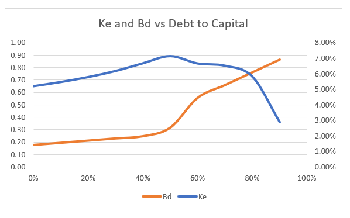

Understanding the intricacies of investment risk is crucial for navigating today's dynamic financial markets. Investors and financial managers must consider several interconnected components, including financial risk, debt management, company beta, and algorithmic trading, to formulate effective investment strategies. These elements significantly influence decision-making processes, affecting both the stability and growth potential of companies. Financial risk encompasses the uncertainties that can impact a company's financial health, often linked to high levels of debt and leveraging practices. Efficient debt management is indispensable for maintaining robust financial performance and minimizing associated risks.

Company beta, a statistical measure reflecting the volatility of a stock relative to the overall market, aids investors in assessing risk. By incorporating debt factors, levered beta provides a comprehensive understanding of a company's potential volatility. In contrast, unlevered beta isolates business risk from financial risk by excluding debt considerations. A higher beta means greater risk and potential return, guiding investors in adding or managing risks within their diversified portfolios.



Algorithmic trading stands at the forefront of modern risk management, harnessing technology's power to optimize investment decisions. By processing massive data volumes and predicting market changes instantaneously, algorithms ensure real-time portfolio adjustments, crucial for managing a portfolio's beta. The rise of artificial intelligence and big data analytics signifies a transformative era, establishing algorithmic trading as a pillar in contemporary financial management.

This article comprehensively examines how these concepts—financial risk, debt management, company beta, and algorithmic trading—interact and shape investment strategies. By understanding these elements, businesses and investors can enhance their ability to navigate complex financial landscapes confidently, securing a competitive edge in volatile markets. As technology advances, its role in integrating these financial strategies will become increasingly pivotal, underscoring the necessity for continuous adaptation and learning in the financial sector.

## Table of Contents

## Understanding Financial Risk and Debt in Companies

Financial risk encompasses the diverse range of factors that might negatively impact a company's financial health, with debt playing a pivotal role. Understanding how debt influences a company's financial stability and potential for growth is essential for effective risk management. 

Debt is a double-edged sword. On one hand, it can provide the leverage necessary to boost growth and expand operations. On the other hand, excessive debt levels increase a company's financial risk, potentially leading to amplified gains during prosperous times and more severe losses during downturns. The interplay of debt and leverage can be illustrated by considering the debt-to-equity ratio, a common metric used to assess a company's financial leverage. This ratio is defined as:

$$
\text{Debt-to-Equity Ratio} = \frac{\text{Total Debt}}{\text{Total Equity}}
$$

A higher debt-to-equity ratio indicates greater leverage, meaning the company is using more borrowed funds relative to its equity. While this can enhance returns on equity, it also elevates the company's risk profile, particularly in volatile markets or during economic slowdowns.

Efficient debt management is crucial for maintaining a healthy balance sheet and minimizing financial risk. Companies employ various strategies to manage debt effectively and ensure long-term stability. These strategies may include:

1. **Debt Restructuring**: Companies may negotiate with lenders to modify the terms of their existing debt obligations. This can involve extending the maturity period, reducing interest rates, or converting debt into equity. Such measures can alleviate short-term financial pressures and improve cash flow.

2. **Refinancing**: By replacing existing debt with new debt at more favorable terms, companies can reduce their interest expenses and improve their financial position. Refinancing is particularly beneficial when interest rates are declining or when a company's credit rating has improved.

3. **Diversifying Debt Sources**: Relying on a variety of financing sources, such as bonds, bank loans, and credit lines, can reduce a company's vulnerability to changes in the financial market. Diversification ensures that the company is not overly dependent on a single lender or financing mechanism.

4. **Maintaining Adequate Liquidity**: Ensuring sufficient liquidity to meet short-term obligations is crucial for preventing financial distress. Companies often maintain liquid assets or access to revolving credit facilities as a buffer against unforeseen expenses or revenue shortfalls.

5. **Prudent Capital Expenditure**: Companies strategically plan capital expenditures to align with anticipated cash flows, ensuring that investments are made when they are most financially viable. Timing capital expenditures appropriately can prevent undue strain on cash flow and debt levels.

Effective debt management requires a delicate balance between leveraging opportunities for growth and maintaining financial stability. Companies that adeptly navigate these complexities can bolster their resilience against financial risks, positioning themselves for sustained success.

## The Role of Beta in Evaluating Company Risk

Beta is a crucial metric in assessing the risk associated with investing in a company's stock. It quantifies a stock's [volatility](/wiki/volatility-trading-strategies) in comparison to the overall market, with the market typically having a beta of 1.0. A stock with a beta greater than 1.0 is considered more volatile than the market, while a beta of less than 1.0 indicates lower volatility.

Levered beta is particularly important as it incorporates a company's debt into the risk assessment. This metric provides investors with a comprehensive view of potential volatility by taking into account both equity and debt. The presence of debt increases a company's financial leverage, which can amplify the impact of market fluctuations on the company's stock price. The formula to calculate levered beta ($\beta_{\text{levered}}$) is:

$$
\beta_{\text{levered}} = \beta_{\text{unlevered}} \left(1 + \frac{D}{E}(1 - T)\right)
$$

Where:
- $\beta_{\text{unlevered}}$ is the company's beta excluding debt.
- $D$ is the total debt.
- $E$ is the total equity.
- $T$ is the corporate tax rate.

Unlevered beta, on the other hand, provides an assessment of inherent business risk, excluding the impact of debt. It focuses solely on a company's assets, allowing investors to understand the business's risk profile independent of its capital structure.

A higher beta indicates greater volatility and a higher risk, but it also suggests the potential for higher returns. This duality makes beta an essential tool for investors who are shaping a diversified portfolio. A stock with high beta will contribute more risk, and potentially more reward, to a portfolio, while a stock with low beta will typically add stability.

Investors leverage beta to better understand and manage the risk contribution of a stock to a diversified portfolio. By evaluating beta, investors can align their risk tolerance with their investment strategy, choosing stocks that fit their desired level of exposure to market fluctuations. This process assists in crafting well-balanced portfolios that account for both market expectations and individual risk preferences.

## Algorithmic Trading: A Game-Changer in Risk Management

Algorithmic trading has revolutionized the way investors approach risk management by employing sophisticated computational techniques to optimize investment decisions. This method leverages algorithms to process and analyze vast amounts of market data, allowing for rapid responses to market changes. This ability to swiftly react is crucial in today's fast-paced financial markets, where timing can significantly affect investment outcomes.

Through [algorithmic trading](/wiki/algorithmic-trading), it is possible to manage a portfolio's beta, a measure of a portfolio's sensitivity to market movements, with greater precision. By continuously monitoring market conditions, algorithms can automatically rebalance a portfolio to maintain a desired level of risk exposure. This dynamic adjustment helps investors mitigate the impact of volatility while pursuing strategic investment goals.

The integration of [artificial intelligence](/wiki/ai-artificial-intelligence) (AI) and big data analytics has further cemented algorithmic trading as a core component of modern financial management. AI's ability to learn from historical data patterns enables algorithms to make more informed predictions about future market trends, enhancing decision-making capabilities.

One prevalent algorithmic strategy for risk management is statistical [arbitrage](/wiki/arbitrage), which involves exploiting price differentials between related securities to achieve relatively risk-free profits. For example, if two stocks historically move together, but temporarily deviate from this pattern, an algorithm might buy the underpriced stock while shorting the overpriced one, expecting the prices to converge again.

Another strategy is the utilization of [machine learning](/wiki/machine-learning) models to forecast market volatility. By training algorithms on historical price data and employing techniques such as natural language processing to analyze news, these models can anticipate price swings and adjust trading activities to hedge against potential losses.

Additionally, algorithms can implement delta-neutral strategies, which aim to offset the price movements of an underlying asset. By holding a portfolio of options and stocks that responds minimally to small price changes in the underlying asset, investors can protect against unexpected market movements while maintaining their strategic positions.

The application of algorithmic trading in risk management is exemplified in its ability to preserve capital during periods of high market volatility. By dynamically adjusting positions based on real-time data analysis, algorithms can preemptively reduce exposure to risky assets and reallocate capital to more stable investment vehicles.

In summary, algorithmic trading is a transformative approach to risk management, enabling investors to leverage technology for more agile and informed decision-making. As AI and big data techniques continue to evolve, their integration with algorithmic strategies will further enhance the effectiveness of risk management in financial markets.

## Integrating Debt Management with Beta and Algorithmic Strategies

The integration of debt management strategies with beta analysis is essential for an all-encompassing approach to assessing financial risk. By combining these elements, companies can achieve a more nuanced understanding of their financial stability and market position. Debt management focuses on optimizing a company's capital structure, ensuring that operational and growth objectives are met while maintaining manageable levels of risk. This is critical because excessive leverage can intensify both potential earnings and losses, ultimately affecting the financial health of a business.

Beta analysis, on the other hand, measures a company's stock volatility relative to the market. A comprehensive assessment involves examining both levered beta, which includes a company's debt, and unlevered beta, which analyzes the intrinsic business risk without debt considerations. By understanding these metrics, companies can better grasp how much risk each investment adds to their portfolio and make informed decisions accordingly.

The role of algorithmic trading in this framework is transformative. Algorithms, through their ability to process copious amounts of financial data and respond rapidly to market movements, enable financial managers to automate strategies that account for changes in a company's financials dynamically. For instance, if a company experiences a change in its debt levels or market conditions cause a shift in its beta, algorithms can adjust investment strategies to maintain an optimal risk-return balance.

Algorithmic trading strategies can automate portfolio rebalancing to ensure the desired beta is maintained or altered according to strategic goals. For example, in Python, a simple algorithm could look like this:

```python
def rebalance_portfolio(portfolio, target_beta):
    current_beta = calculate_current_beta(portfolio)
    if current_beta < target_beta:
        # Increase exposure to higher-beta stocks
        adjust_portfolio(portfolio, increase_beta=True)
    elif current_beta > target_beta:
        # Decrease exposure to higher-beta stocks
        adjust_portfolio(portfolio, increase_beta=False)
    return portfolio

def calculate_current_beta(portfolio):
    # Pseudo-function to calculate current beta
    return sum(stock['beta'] * stock['weight'] for stock in portfolio)

def adjust_portfolio(portfolio, increase_beta):
    for stock in portfolio:
        if increase_beta:
            stock['weight'] += 0.01  # Adjust weights to increase beta
        else:
            stock['weight'] -= 0.01  # Adjust weights to decrease beta
```

Effective integration of debt management with beta and algorithmic strategies offers a balanced approach that optimizes returns while controlling risks. By tailoring these strategies to a company's specific risk tolerance and objectives, financial managers can ensure stability even in volatile market conditions. This requires a careful analysis of their capital structure, an understanding of market movements through beta analytics, and the power of algorithmic trading to implement these insights swiftly and accurately.

Ultimately, assembling these components into a cohesive strategy empowers companies to navigate the complexities of financial markets with greater confidence and foresight. As technology progresses, the sophistication with which companies can integrate these elements will likely evolve, enhancing their ability to mitigate risks and capitalize on opportunities.

## Conclusion

Understanding financial risk, debt, beta, and algorithmic trading is essential for making informed investment decisions. These elements form the backbone of a robust financial strategy, aligning to provide businesses and investors with a comprehensive toolkit for navigating today’s complex markets.

Companies that adeptly manage financial risk and leverage effectively can position themselves for competitive advantages. Strong debt management ensures financial stability, while understanding beta allows investors to gauge and balance volatility. For instance, a thorough evaluation of levered and unlevered beta helps assess how debt influences a firm’s market risk profile. This insight enables optimization of capital structure to minimize risk and maximize returns.

The integration of these concepts leads to a synergistic effect: they empower businesses to adeptly handle financial turbulence and seize opportunities for growth. Algorithmic trading plays a pivotal role in this integration. With its ability to analyze vast datasets swiftly, it offers capabilities to optimize beta in real-time, adjust debt strategies instantaneously, and reallocate assets dynamically. This precision allows for a balanced approach toward risk and growth, maintaining equilibrium in a volatile market environment.

As financial markets continue their rapid evolution, staying informed on emerging trends is paramount. With the ongoing development of artificial intelligence and machine learning, future advancements in technology will further refine and enhance the integration of financial risk management, debt strategies, beta analysis, and trading algorithms. These advancements promise to revolutionize how we manage financial strategies, paving the way for even more sophisticated investment approaches.

Ultimately, those who continuously adapt and harness these tools will likely maintain an edge in competitive markets, navigating the ever-shifting financial landscape with confidence and foresight.

## References & Further Reading

[1]: ["Financial Risk Management: Applications in Market, Credit, Asset and Liability Management and Firmwide Risk"](https://www.wiley.com/en-us/Financial+Risk+Management%3A+Applications+in+Market%2C+Credit%2C+Asset+and+Liability+Management+and+Firmwide+Risk+-p-9781119157243) by Steve L. Allen

[2]: Damodaran, A. (1999). ["Estimating Risk Parameters"](https://pages.stern.nyu.edu/~adamodar/pdfiles/papers/beta.pdf) in "Investment Valuation"

[3]: ["Options, Futures, and Other Derivatives"](https://www.amazon.com/Options-Futures-Other-Derivatives-10th/dp/013447208X) by John C. Hull

[4]: ["Algorithmic and High-Frequency Trading"](https://www.amazon.com/Algorithmic-High-Frequency-Trading-Mathematics-Finance/dp/1107091144) by Álvaro Cartea, Sebastian Jaimungal, and José Penalva

[5]: ["Corporate Finance"](https://www.investopedia.com/terms/c/corporatefinance.asp) by Stephen A. Ross, Randolph W. Westerfield, and Jeffrey F. Jaffe

[6]: ["Big Data in Finance"](https://www.turing.com/resources/big-data-in-finance) by Alnoor Bhimani and Michael Bromwich

[7]: Pástor, Ľ., & Stambaugh, R. F. (2003). ["Liquidity Risk and Expected Stock Returns"](https://www.nber.org/papers/w8462). Journal of Political Economy, 111(3), 642-685. 

[8]: Sharpe, W. F. (1964). ["Capital Asset Prices: A Theory of Market Equilibrium under Conditions of Risk"](https://onlinelibrary.wiley.com/doi/full/10.1111/j.1540-6261.1964.tb02865.x). The Journal of Finance, 19(3), 425-442.