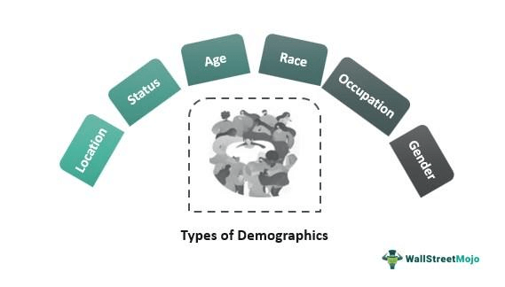

The interconnected nature of demographics, economic growth, and technological advancements plays a pivotal role in shaping the modern financial markets. As countries around the world experience varying degrees of aging populations, shifting birth rates, and evolving workforce dynamics, these demographic trends are exerting profound influences on economic outcomes. Recognizing and interpreting these shifts is vital for investors, policymakers, and economists alike, as they provide both opportunities and challenges for economic prosperity.

Demographic changes influence key aspects of economic growth, including labor supply, consumption patterns, and productivity levels. For instance, an increasing proportion of an aging population may lead to a higher dependency ratio, potentially straining social services and reducing available capital for investment. Conversely, a youth-driven demographic boom, often referred to as a "demographic dividend," can temporarily propel economic growth through an expanded labor force and increased consumption, provided there is adequate employment and economic infrastructure.

Economic indicators serve as crucial tools for assessing the health and trajectory of economies, enabling market participants to make informed trading and investment decisions. Metrics such as Gross Domestic Product (GDP), Consumer Price Index (CPI), and unemployment rates offer insights into the economic environment and guide strategies in financial markets, such as those employed in algorithmic trading. Algorithmic trading, which leverages complex algorithms to automate trading decisions, relies heavily on accurate and timely analysis of economic indicators to capitalize on market fluctuations.

Furthermore, technological advancements are instrumental in bolstering economic resilience and fostering growth amid these demographic transformations. Innovative technologies boost productivity, create new markets, and redefine existing sectors, facilitating adaptation to demographic changes. They also pose new challenges, including potential job displacement and inequality, underscoring the need for strategic investments in education and infrastructure to harness their full potential.

In summary, the interplay between demographics, economic growth, and technological advancements highlights a dynamic and complex landscape that requires continuous attentiveness and adaptation. Understanding these critical influences is essential for stakeholders aiming to navigate today’s financial markets effectively, offering the foundational insights necessary for leveraging economic indicators in strategic decision-making.

## Table of Contents

## The Role of Demographics in Economic Growth

Demographics play a crucial role in shaping economic growth by influencing the labor supply, productivity levels, and overall economic potential of a nation. One of the primary ways demographics impact economic growth is through the concept of the demographic dividend. The demographic dividend refers to the accelerated economic growth that can occur when the working-age population (15 to 64 years) is larger than the non-working-age population. This shift usually provides a favorable ratio of workers to dependents, enabling higher productivity, increased savings, and greater investments in health and education.

Demographic changes, such as shifts in birth rates and aging populations, present both challenges and opportunities for economic prosperity. A declining birth rate can lead to a reduced labor force in the future, potentially constraining economic growth unless compensated by productivity improvements or technological advancements. On the other hand, lower birth rates can free up resources that might otherwise be spent on childcare, allowing more investment in education and skills development, which can, in turn, boost productivity.

Retirement trends also have significant implications for economic growth. As life expectancy increases and birth rates decline, many countries face the challenge of an aging population. This can lead to a higher dependency ratio, with more retirees supported by relatively fewer workers. To offset this imbalance, policies encouraging extended working life, such as raising the retirement age or promoting lifelong learning and retraining, can be crucial.

Consider a simplified economic growth model where $Y = A \times K^\alpha \times L^{1-\alpha}$, where $Y$ is the output, $A$ is the level of technology, $K$ is the capital stock, $L$ is the labor force, and $\alpha$ is the capital share of output. In this model, a changing labor force $L$ directly impacts $Y$. Therefore, demographic shifts altering $L$—either through growth or contraction—will significantly influence potential economic output.

Overall, demographic trends require strategic planning to harness potential economic opportunities and address challenges such as workforce shortages or increased retirement pressures. Policymakers need to consider these factors to create conditions that optimize the demographic dividend and sustain economic growth.

## Key Economic Indicators and Their Impact

Economic indicators are essential tools for gauging the overall health of an economy. They provide vital information that can significantly impact trading strategies and economic forecasts. Among these indicators, Gross Domestic Product (GDP), the Consumer Price Index (CPI), and unemployment rates are critical for understanding economic conditions.

Gross Domestic Product (GDP) represents the total monetary value of all goods and services produced within a country over a specified period. It serves as a comprehensive measure of a nation's economic activity and is used to assess economic performance. A growing GDP typically indicates a healthy economy and can lead to increased investor confidence and positive market sentiment. Conversely, a declining GDP may signal economic trouble, prompting caution among investors. The formula for GDP can be presented as:

$$
\text{GDP} = C + I + G + (X - M)
$$

where $C$ is consumption, $I$ is investment, $G$ is government spending, and $(X - M)$ is net exports (exports minus imports).

The Consumer Price Index (CPI) measures the average change over time in the prices paid by consumers for a basket of goods and services. It is a critical indicator of inflation, reflecting the cost of living and purchasing power in an economy. A rising CPI suggests increasing inflation, which can erode purchasing power and impact interest rates. Central banks may adjust monetary policy in response to changes in CPI, influencing market interest rates and asset prices. For instance, high inflation might lead to higher interest rates to curb spending, affecting bond prices and currency value.

Unemployment rates measure the percentage of the labor force that is jobless and actively seeking employment. This indicator sheds light on the labor market's health and economic stability. High unemployment rates can signal economic distress, reducing consumer spending and hampering economic growth. Conversely, low unemployment rates may indicate economic expansion but could also lead to inflationary pressures if labor markets become too tight, driving up wages. Understanding unemployment trends helps investors anticipate potential market changes and adjust their strategies accordingly.

By closely monitoring these economic indicators, traders and investors can gain insights into economic trends, adjust their portfolios, and make informed decisions. Accurate economic forecasting, based on these indicators, is crucial for maximizing returns and managing risks in the financial markets.

## Algorithmic Trading and Economic Growth

Algorithmic trading leverages economic indicators to enhance trading strategies and exploit market opportunities. By utilizing detailed economic data, algorithmic systems can execute trades with greater precision and speed than traditional methods. Economic indicators such as GDP, CPI, and unemployment rates provide insights into the macroeconomic environment, enabling traders to make informed decisions.

Algorithmic trading systems analyze these indicators to detect patterns and trends that could impact asset prices. For example, a rise in the CPI might signal inflationary pressures, prompting algorithms to adjust portfolios accordingly. Similarly, fluctuations in GDP growth can indicate shifts in economic [momentum](/wiki/momentum), influencing trading strategies.

The automation of decision-making processes in [algorithmic trading](/wiki/algorithmic-trading) is accomplished through complex mathematical models and algorithms. These models evaluate large datasets in real-time, identifying profitable opportunities and executing trades autonomously. The speed at which algorithmic trading operates allows investors to capitalize on fleeting market conditions, often executing trades in milliseconds.

Algorithmic trading benefits include reduced transaction costs, minimized human error, and enhanced ability to manage complex trading strategies. By automating routine tasks, traders can focus on strategy development and risk management. Furthermore, the systematic nature of algorithmic trading ensures that emotional biases are minimized, leading to more consistent and objective trading outcomes.

In conclusion, algorithmic trading integrates economic indicators into automated trading strategies, providing a significant advantage in fast-paced financial markets. The use of advanced algorithms and technology not only improves execution efficiency but also enhances the ability to respond swiftly to economic developments, ultimately supporting economic growth within financial markets.

## Technological Innovation and Economic Resilience

Technological advancements are pivotal in driving productivity gains, which in turn influence economic growth, particularly in the context of demographic changes. As populations age and birth rates decline in many developed nations, technology offers potential solutions to maintain and enhance economic resilience.

Historically, technological innovation has consistently spurred productivity by enabling more efficient processes and the development of higher-value goods and services. For instance, the advent of the Internet led to the creation of entirely new industries, such as e-commerce and digital marketing, which have substantially boosted economic activity. In the manufacturing sector, automation and robotics have increased production efficiency, reducing reliance on human labor and allowing for a reallocation of human resources to more complex and creative tasks.

The integration of [artificial intelligence](/wiki/ai-artificial-intelligence) (AI) and [machine learning](/wiki/machine-learning) into business operations exemplifies current technological trends facilitating economic resilience. AI algorithms can process vast amounts of data far more quickly and accurately than humans, providing insights that can lead to smarter decision-making and the optimization of operational processes. For example, in supply chain management, AI-powered analytics can predict demand fluctuations more accurately, reducing waste and improving inventory management.

Moreover, the development and adoption of emerging technologies create new job opportunities even as they disrupt traditional sectors. This dynamic is evident in the rise of the gig economy, where platforms like Uber and Airbnb have redefined work and service provision. While these platforms may displace traditional taxi services and hotel industries, they simultaneously generate new employment opportunities and income streams for individuals who might not engage in conventional employment.

In addition to creating jobs, technological advancements can lead to the upskilling of the workforce. As businesses adopt new tools and platforms, there is a concurrent demand for workers with the skills to utilize these technologies effectively. This shift underscores the importance of investing in education and training programs that equip workers with the necessary skills to navigate an evolving job market.

Internationally, technology serves as a bridge for economic disparities by providing access to global markets. Digital platforms allow small businesses and entrepreneurs in developing countries to reach consumers worldwide, promoting economic inclusivity and growth. For example, e-commerce giants like Alibaba have enabled numerous small enterprises in China and other countries to access international markets, significantly impacting local economies.

Despite these benefits, the rapid pace of technological advancement also poses challenges, such as widening income inequality and the displacement of workers in certain industries. Policymakers need to address these issues by implementing measures such as social safety nets and retraining programs to ensure that economic gains are distributed broadly across society.

In conclusion, technological innovation stands as a cornerstone of economic resilience, offering solutions to demographic challenges while fostering growth through increased productivity and the creation of novel job opportunities. As economies continue to adapt to technological changes, it is crucial to balance innovation with social responsibility to ensure sustainable economic prosperity.

## Challenges and Future Prospects

An aging population and declining birth rates are posing significant challenges for sustained economic growth across the globe. As the population ages, the proportion of individuals exiting the workforce grows, leading to a reduced labor supply and potentially diminishing economic productivity. This demographic trend can result in increased pressures on social security systems, health care, and pension funds, which may, in turn, strain government budgets and impact economic stability.

To counterbalance these challenges, increases in productivity and technological innovations present promising solutions. Enhanced productivity can be achieved through various means, such as improving education systems, investing in workforce training, and optimizing production processes to utilize the existing labor force more efficiently. Technological advancements play a crucial role as they drive innovation, create new industries, and replace labor-intensive tasks with automated processes, thereby compensating for the decline in labor supply due to demographic changes.

For instance, advancements in automation and artificial intelligence can lead to more efficient production lines, reducing the need for manual labor. This shift not only sustains economic productivity but also creates new job opportunities in technology-driven sectors. Moreover, increased connectivity and the proliferation of digital technologies can enable more flexible work arrangements, such as remote working, which can tap into wider pools of human capital regardless of geographic constraints.

Continued investment in research and development (R&D) is critical for fostering innovative technologies and maintaining competitive economic growth. Encouraging private and public sector collaboration in R&D can accelerate technological breakthroughs that provide long-term solutions to the issues posed by shifting demographics.

In summary, while the challenges of an aging population and declining birth rates are significant, strategic initiatives in boosting productivity and leveraging technological innovations offer a viable pathway to achieving sustained economic growth. It is imperative for policymakers, businesses, and society as a whole to embrace these opportunities to navigate the demographic transitions successfully.

## Conclusion

Demographics and technology are central to understanding the evolution of the economic landscape. Changes in population characteristics, such as age distribution and growth rates, directly impact labor markets, consumption patterns, and overall economic productivity. These demographic factors create both opportunities and challenges for economic growth. For instance, an aging population may strain social welfare systems, but concurrently, it could stimulate industries focused on healthcare and technology designed to cater to older individuals.

Technological advancements further compound these dynamics by driving productivity and creating new market opportunities. Automation and the rise of algorithmic trading, for instance, enable more precise and rapid trading decisions, potentially amplifying the effects of demographic changes on financial markets. Algorithmic trading systems can quickly analyze vast amounts of data, leveraging economic indicators such as GDP growth rates, inflation levels, and unemployment figures, which are often influenced by demographic trends.

For individuals and institutions involved in investing and trading, understanding how demographics and technology interact is critical. By closely monitoring demographic trends and their interaction with technological progress, investors can make more informed decisions. This involves not only predicting potential shifts in market demand and labor supply but also anticipating technological innovations that could disrupt existing business models. Furthermore, leveraging economic indicators allows traders to fine-tune their strategies, aligning them with broader economic trends dictated by demographic and technological changes.

In summary, the intersection of demographics and technology is a fundamental aspect of economic analysis and trading strategy formulation. By grasping these dynamics, investors and traders can enhance their ability to navigate financial markets, making informed decisions that anticipate and capitalize on future economic conditions.

## References & Further Reading

[1]: "Advances in Financial Machine Learning" by Marcos Lopez de Prado. Available at: https://www.amazon.com/Advances-Financial-Machine-Learning-Marcos/dp/1119482089

[2]: "Machine Learning for Algorithmic Trading" by Stefan Jansen. Available at: https://www.amazon.com/Machine-Learning-Algorithmic-Trading-intelligence/dp/9918608013

[3]: "Quantitative Trading: How to Build Your Own Algorithmic Trading Business" by Ernest P. Chan. Available at: https://www.amazon.com/Quantitative-Trading-Build-Algorithmic-Business/dp/0470284889

[4]: Bergstra, J., Bardenet, R., Bengio, Y., & Kégl, B. (2011). "Algorithms for Hyper-Parameter Optimization." Advances in Neural Information Processing Systems 24. Available at: https://papers.nips.cc/paper_files/paper/2011/hash/86e8f7ab32cfd12577bc2619bc635690-Abstract.html

[5]: "Evidence-Based Technical Analysis: Applying the Scientific Method and Statistical Inference to Trading Signals" by David Aronson. Available at: https://www.wiley.com/en-gb/Evidence+Based+Technical+Analysis:+Applying+the+Scientific+Method+and+Statistical+Inference+to+Trading+Signals-p-9780470008744