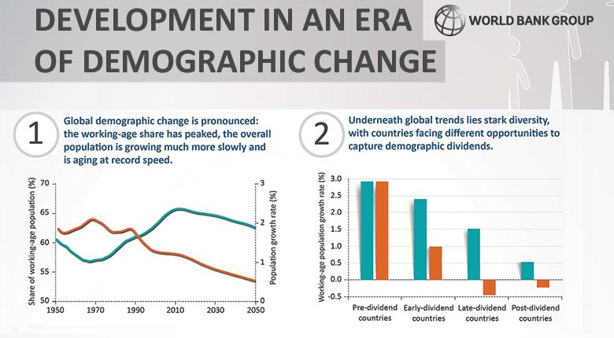

## Table of Contents

## What are demographics and why are they important for economic growth?

Demographics are the details about people in a specific area, like their age, gender, income, and education. It's like knowing who lives in your neighborhood and what they're like. This information is important because it helps businesses and governments understand the people they serve.

Knowing demographics is crucial for economic growth because it helps businesses decide what products to make and where to sell them. For example, if a lot of young people live in an area, businesses might sell more video games or trendy clothes. Governments use this information to plan schools, hospitals, and roads in the right places. When businesses and governments make good decisions based on demographics, it can lead to more jobs and a stronger economy.

## How does population size influence economic growth?

Population size can have a big impact on economic growth. When there are more people in a country, there are more workers available to produce goods and services. This can lead to more economic activity and growth. For example, a larger population means more people to work in factories, offices, and stores, which can help businesses grow and create more jobs.

However, a large population can also put pressure on resources like food, water, and housing. If there are too many people and not enough resources, it can slow down economic growth. Governments need to manage these resources carefully to make sure everyone has what they need. So, while a bigger population can help the economy grow, it's important to balance it with the available resources to keep the economy strong.

## What role does age distribution play in economic development?

Age distribution is important for economic development because it shows how many young, working-age, and older people are in a country. If a country has a lot of young people, it can mean more workers in the future. This is good because young workers can help the economy grow by working in businesses and starting new ones. But, if there are too many young people and not enough jobs, it can cause problems like high unemployment.

On the other hand, if a country has a lot of older people, it might mean fewer workers. This can slow down economic growth because there are fewer people to work and produce goods and services. Also, older people might need more healthcare and support, which can cost a lot of money. So, countries need to plan carefully to make sure they have enough workers and resources to support everyone.

In summary, the balance of different age groups in a population affects how an economy grows. A good mix of young and old can help an economy stay strong, but too many people in one age group can create challenges. Governments need to think about age distribution when making plans for the future to keep the economy healthy.

## How does the labor force participation rate affect economic growth?

The labor force participation rate is the percentage of people who are working or looking for work. When this rate is high, it means more people are working, which can help the economy grow. More workers means more people making things and providing services, which can lead to more money being spent and more businesses growing. If a lot of people are working, they can also pay more taxes, which helps the government have more money to spend on things like schools and roads.

On the other hand, if the labor force participation rate is low, it can slow down economic growth. Fewer people working means fewer goods and services being produced. This can lead to less money being spent in the economy, which can make it harder for businesses to grow. Also, if fewer people are working, they might not be able to spend as much money, which can hurt businesses even more. So, a high labor force participation rate is important for keeping the economy strong and growing.

## What impact does education level have on a country's economy?

Education level is very important for a country's economy. When people are more educated, they can get better jobs and earn more money. This means they can spend more money on things they need and want, which helps businesses grow. Educated people also tend to start their own businesses more often, which creates more jobs and helps the economy grow even more. Plus, countries with more educated people can attract more businesses from other places, which brings in more money and helps the economy.

On the other hand, if a country has a low level of education, it can hurt the economy. People with less education might have a harder time finding good jobs, which means they might not earn as much money. This can lead to less money being spent in the economy, which can make it harder for businesses to grow. Also, if people are not well-educated, it can be harder for a country to attract new businesses and industries, which can slow down economic growth. So, education is a key part of making sure a country's economy stays strong and keeps growing.

## How do migration patterns influence economic growth?

Migration patterns can have a big impact on a country's economy. When people move to a new country, they often bring new skills and ideas with them. This can help businesses grow and create new jobs. For example, if a lot of people move to a country to work in technology, it can help that country become a leader in tech. Also, when people move to a new place, they need things like homes, food, and clothes. This can help the economy grow because more people buying things means more money for businesses.

However, migration can also have challenges. If too many people move to a country at once, it can put pressure on things like housing and jobs. This can make it harder for everyone to find a place to live and work. Also, if a lot of educated people leave a country, it can hurt that country's economy. This is called a "brain drain," and it means the country loses important skills and knowledge. So, while migration can help an economy grow, it's important for countries to manage it carefully to make sure it helps everyone.

## What are the economic implications of an aging population?

An aging population can have big effects on a country's economy. When more people get older, there are fewer young people to work in jobs. This means there might not be enough workers to make things and provide services. This can slow down the economy because businesses need workers to grow. Also, older people might not spend as much money as younger people, which can hurt businesses too.

But there are other challenges too. Older people often need more healthcare and support, which can cost a lot of money. This means the government might have to spend more money on things like hospitals and nursing homes. If there are fewer workers paying taxes, it can be hard for the government to have enough money to help older people. So, countries with aging populations need to plan carefully to make sure they can take care of everyone and keep the economy strong.

## How does gender distribution affect economic productivity?

Gender distribution can affect how much a country can produce. When both men and women have equal chances to work and get good jobs, it can help the economy grow. If women are not working as much as men, then the country is missing out on half of its possible workers. More workers mean more people making things and providing services, which helps the economy. Also, when women earn money, they often spend it on things that help their families and communities, which can make the economy stronger.

However, if there are not equal opportunities for men and women, it can hurt the economy. If women are not able to work as much, there are fewer people to help the economy grow. This can mean less money being spent and fewer businesses growing. Also, if women are not able to get good education and jobs, it can mean the country is not using all of its skills and talents. So, making sure both men and women have equal chances to work and succeed is important for keeping the economy strong.

## What is the relationship between income distribution and economic growth?

Income distribution is about how money is shared among people in a country. When income is spread out more evenly, it can help the economy grow. If more people have money, they can spend it on things they need and want. This helps businesses because more people buying things means more money for them. When businesses do well, they can hire more people and grow, which helps the whole economy. Also, when people feel like they have a fair share of money, they might work harder and be more productive, which is good for the economy too.

However, if income is not spread out evenly, it can slow down economic growth. When only a few people have most of the money, they might not spend it as much as a lot of people with a little bit of money. This can hurt businesses because fewer people are buying things. Also, if many people feel like they don't have enough money, they might not work as hard or start their own businesses. This can make the economy weaker. So, making sure income is shared fairly can help keep the economy strong and growing.

## How do fertility rates influence long-term economic planning?

Fertility rates, or the number of babies born per woman, are really important for planning the economy in the long run. If a country has a high fertility rate, it means there will be more young people in the future. This can be good because more young people means more workers. More workers can help the economy grow by making more things and providing more services. But, if there are too many young people and not enough jobs, it can cause problems like high unemployment. So, countries need to plan carefully to make sure they have enough jobs and resources for everyone.

On the other hand, if a country has a low fertility rate, it means there will be fewer young people in the future. This can lead to an aging population, where there are more older people and fewer young workers. Fewer young workers can slow down the economy because there are fewer people to make things and provide services. Also, older people might need more healthcare and support, which can cost a lot of money. So, countries with low fertility rates need to plan ahead to make sure they can take care of everyone and keep the economy strong.

## What are the challenges of managing economic growth in countries with diverse demographic profiles?

Managing economic growth in countries with diverse demographic profiles can be really tough. When a country has people from different backgrounds, ages, and income levels, it's hard to make plans that work for everyone. For example, if a country has a lot of young people and a lot of old people, it needs to find a way to make sure there are enough jobs for the young and enough healthcare for the old. Also, if some people have a lot of money and others don't, it can be hard to make sure everyone can spend money and help the economy grow.

Another challenge is making sure everyone has equal chances to work and get good education. If some groups of people don't have the same opportunities, it can hurt the economy. For example, if women or people from certain backgrounds can't get good jobs, the country is missing out on their skills and talents. This can slow down economic growth because there are fewer people helping the economy. So, countries with diverse demographics need to work hard to make sure everyone can help the economy grow and that everyone benefits from that growth.

## How can policymakers use demographic data to enhance economic strategies?

Policymakers can use demographic data to make better economic plans by understanding who lives in their country and what they need. For example, if there are a lot of young people, policymakers might focus on creating more jobs and improving education so these young people can work and help the economy grow. If there are a lot of older people, they might spend more money on healthcare and retirement benefits to make sure everyone is taken care of. By looking at things like age, gender, and income, policymakers can make plans that help everyone and keep the economy strong.

Demographic data also helps policymakers see where they need to focus their efforts. For instance, if certain groups of people, like women or people from certain backgrounds, are not getting equal chances to work or get good education, policymakers can make changes to help these groups. This can make the economy stronger because more people will be able to work and spend money. By using demographic data, policymakers can make sure their economic strategies are fair and help the whole country grow.

## What are the key economic indicators and what impact do they have?

Economic indicators are essential tools for gauging the overall health of an economy. They provide vital information that can significantly impact trading strategies and economic forecasts. Among these indicators, Gross Domestic Product (GDP), the Consumer Price Index (CPI), and unemployment rates are critical for understanding economic conditions.

Gross Domestic Product (GDP) represents the total monetary value of all goods and services produced within a country over a specified period. It serves as a comprehensive measure of a nation's economic activity and is used to assess economic performance. A growing GDP typically indicates a healthy economy and can lead to increased investor confidence and positive market sentiment. Conversely, a declining GDP may signal economic trouble, prompting caution among investors. The formula for GDP can be presented as:

$$
\text{GDP} = C + I + G + (X - M)
$$

where $C$ is consumption, $I$ is investment, $G$ is government spending, and $(X - M)$ is net exports (exports minus imports).

The Consumer Price Index (CPI) measures the average change over time in the prices paid by consumers for a basket of goods and services. It is a critical indicator of inflation, reflecting the cost of living and purchasing power in an economy. A rising CPI suggests increasing inflation, which can erode purchasing power and impact interest rates. Central banks may adjust monetary policy in response to changes in CPI, influencing market interest rates and asset prices. For instance, high inflation might lead to higher interest rates to curb spending, affecting bond prices and currency value.

Unemployment rates measure the percentage of the labor force that is jobless and actively seeking employment. This indicator sheds light on the labor market's health and economic stability. High unemployment rates can signal economic distress, reducing consumer spending and hampering economic growth. Conversely, low unemployment rates may indicate economic expansion but could also lead to inflationary pressures if labor markets become too tight, driving up wages. Understanding unemployment trends helps investors anticipate potential market changes and adjust their strategies accordingly.

By closely monitoring these economic indicators, traders and investors can gain insights into economic trends, adjust their portfolios, and make informed decisions. Accurate economic forecasting, based on these indicators, is crucial for maximizing returns and managing risks in the financial markets.

## References & Further Reading

[1]: "Advances in Financial Machine Learning" by Marcos Lopez de Prado. Available at: https://www.amazon.com/Advances-Financial-Machine-Learning-Marcos/dp/1119482089

[2]: "Machine Learning for Algorithmic Trading" by Stefan Jansen. Available at: https://www.amazon.com/Machine-Learning-Algorithmic-Trading-intelligence/dp/9918608013

[3]: "Quantitative Trading: How to Build Your Own Algorithmic Trading Business" by Ernest P. Chan. Available at: https://www.amazon.com/Quantitative-Trading-Build-Algorithmic-Business/dp/0470284889

[4]: Bergstra, J., Bardenet, R., Bengio, Y., & Kégl, B. (2011). "Algorithms for Hyper-Parameter Optimization." Advances in Neural Information Processing Systems 24. Available at: https://papers.nips.cc/paper_files/paper/2011/hash/86e8f7ab32cfd12577bc2619bc635690-Abstract.html

[5]: "Evidence-Based Technical Analysis: Applying the Scientific Method and Statistical Inference to Trading Signals" by David Aronson. Available at: https://www.wiley.com/en-gb/Evidence+Based+Technical+Analysis:+Applying+the+Scientific+Method+and+Statistical+Inference+to+Trading+Signals-p-9780470008744