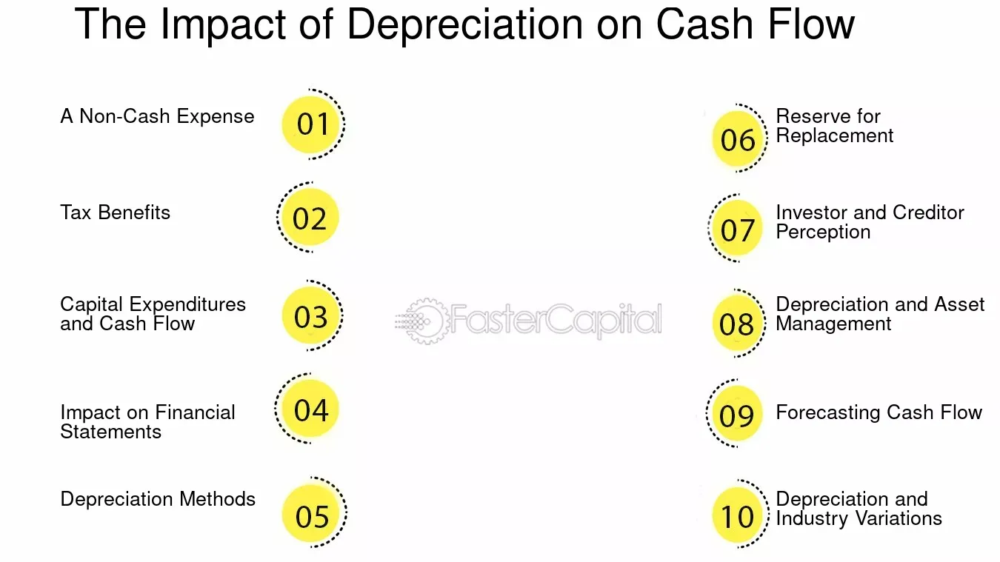

## Table of Contents

## What is depreciation and how is it calculated?

Depreciation is the way we measure how much a thing loses value over time. Imagine you buy a new car. As soon as you drive it off the lot, it's worth less than what you paid. That drop in value is what we call depreciation. It's important for businesses because it helps them figure out how much their stuff is really worth as time goes on.

There are different ways to calculate depreciation, but one common method is called straight-line depreciation. With this method, you figure out how much the thing will be worth at the end of its useful life, subtract that from what you paid for it, and then divide by the number of years you expect to use it. For example, if you bought a machine for $10,000 and you think it will be worth $2,000 after 5 years, you would subtract $2,000 from $10,000 to get $8,000, and then divide $8,000 by 5 years to find out that the machine depreciates by $1,600 each year.

## How does depreciation affect a company's financial statements?

Depreciation affects a company's financial statements in a big way. It shows up on the income statement as an expense. This means it reduces the company's profit for the year. Imagine you own a business and you bought a truck. Every year, you have to subtract a bit of the truck's value from your earnings because it's getting older and worth less. This makes your profit look smaller, even though you're not actually spending money out of your pocket.

Depreciation also affects the balance sheet. On the balance sheet, it reduces the value of the company's assets over time. Going back to the truck example, when you first buy it, it's listed as an asset at its full price. But as you depreciate it each year, the value of the truck on the balance sheet goes down. This shows that the truck is worth less now than when you bought it. So, depreciation helps give a more accurate picture of what the company owns and how much it's really worth.

## What is the difference between depreciation and cash flow?

Depreciation and cash flow are two different things that businesses keep track of. Depreciation is all about how much the value of things like machines or buildings goes down over time. It's not about money coming in or going out of the business. It's just a way to show that the stuff the business owns is getting older and worth less. When a business calculates depreciation, it shows up on the financial statements as an expense, but no actual money leaves the business.

Cash flow, on the other hand, is all about the actual money moving in and out of the business. It's about how much money the business gets from selling things or providing services, and how much money it spends on things like salaries, rent, and supplies. If a business has good cash flow, it means it has enough money coming in to pay for everything it needs to keep running. So while depreciation is about the value of things going down, cash flow is about the real money the business is dealing with every day.

## Can depreciation be considered a cash expense?

No, depreciation cannot be considered a cash expense. When a business calculates depreciation, it's just figuring out how much the value of things like machines or buildings goes down over time. It's not about money leaving the business. So even though depreciation shows up on financial statements as an expense, no actual cash is spent on it.

This is different from things like salaries or rent, which are real cash expenses. When a business pays salaries or rent, money actually leaves the business's bank account. Depreciation is more like a way to keep track of how much the business's stuff is worth as it gets older, without any money moving around.

## How does depreciation impact the cash flow statement?

Depreciation impacts the cash flow statement indirectly. On the cash flow statement, there's a section called "operating activities" where businesses show how much cash they made or spent from their day-to-day operations. Depreciation is added back to the net income in this section because it was subtracted as an expense on the income statement, but no actual cash was spent on it. So, adding depreciation back helps show the real amount of cash the business generated from its operations.

For example, if a business made $100,000 in profit but had $20,000 in depreciation expense, the income statement would show a profit of $80,000. But on the cash flow statement, they would add that $20,000 back to the $80,000 to show that they actually generated $100,000 in cash from operations. This way, the cash flow statement gives a clearer picture of how much cash the business really has coming in, without being affected by non-cash expenses like depreciation.

## What is the relationship between depreciation and taxes?

Depreciation affects taxes because it's an expense that businesses can use to lower their taxable income. When a business calculates its profit for tax purposes, it subtracts expenses like depreciation from its total income. This means the business pays less in taxes because its profit looks smaller on paper. So, depreciation helps businesses save money on taxes by showing that their stuff is worth less over time.

However, the way depreciation is used for taxes can be different from how it's used in financial statements. For taxes, businesses often use a method called Modified Accelerated Cost Recovery System (MACRS), which lets them take bigger depreciation deductions earlier in an asset's life. This can help them save more on taxes in the early years. But for financial statements, they might use straight-line depreciation to spread the expense evenly over time. This difference means that while depreciation can lower a company's tax bill, it might not match up exactly with how the company reports its financial health to investors and others.

## How does depreciation affect operating cash flow?

Depreciation affects operating cash flow in an interesting way. When a business figures out its operating cash flow, it starts with its net income from the income statement. Depreciation is an expense that gets subtracted from the income to calculate net income. But since depreciation doesn't involve any actual money leaving the business, it gets added back to the net income on the cash flow statement. This helps show the real amount of cash the business generated from its day-to-day operations.

So, if a business made $100,000 in profit but had $20,000 in depreciation expense, the income statement would show a profit of $80,000. On the cash flow statement, they would add that $20,000 back to the $80,000 to show that they actually generated $100,000 in cash from operations. This way, the cash flow statement gives a clearer picture of how much cash the business really has coming in, without being affected by non-cash expenses like depreciation.

## What are the different methods of depreciation and their impact on cash flow?

There are several ways to calculate depreciation, but the most common ones are straight-line depreciation, declining balance depreciation, and units of production depreciation. Straight-line depreciation is the simplest method. It spreads the cost of an asset evenly over its useful life. For example, if you buy a machine for $10,000 and expect it to last 5 years, you'd subtract $2,000 each year from your profit. Declining balance depreciation lets you take bigger deductions in the early years, which means your expenses go down over time. Units of production depreciation ties the expense to how much you use the asset, so if you use it more one year, you'll have a bigger expense that year.

These different methods of depreciation don't directly change the amount of cash coming in or going out of your business, but they do affect how your cash flow looks on paper. When you calculate your operating cash flow, you start with your net income, which has depreciation subtracted as an expense. But because depreciation is a non-cash expense, you add it back to your net income on the cash flow statement. So, no matter which method you use, depreciation won't change the actual cash in your bank account, but it will change how your cash flow looks on your financial statements. For example, with declining balance depreciation, you'll see bigger additions to your cash flow in the early years because you're adding back bigger depreciation expenses.

## How can changes in depreciation policies affect a company's cash flow?

Changes in depreciation policies can change how a company's cash flow looks on paper, but they don't change the actual cash in the bank. If a company switches from straight-line depreciation to a method like declining balance, it will take bigger depreciation expenses in the early years. This means the company's profit will look smaller on the income statement because of the higher expenses. But on the cash flow statement, they'll add back these bigger depreciation expenses, making the operating cash flow look higher in those early years. So, while the real cash in the company's bank account stays the same, the way it's reported on the cash flow statement can change.

This can be important for how investors and others see the company's financial health. If a company uses a method that shows higher cash flow in the early years, it might look like the company is doing better than it really is. But remember, no actual money is coming in or going out because of depreciation. It's just a way of showing how much the value of the company's stuff is going down over time. So, while changes in depreciation policies can make the numbers on the financial statements look different, they don't change how much cash the company really has.

## What are the long-term effects of depreciation on a company's cash flow?

Depreciation doesn't change the actual money a company has in its bank account, but it can make the company's cash flow look different over time. When a company uses depreciation, it shows up as an expense on the income statement, which makes the company's profit look smaller. But because depreciation is a non-cash expense, it gets added back to the net income on the cash flow statement. So, over the long term, depreciation can make the operating cash flow look higher than the profit on the income statement. This can give a different view of how well the company is doing financially, even though the real cash in the bank stays the same.

Over many years, the way a company calculates depreciation can affect how its cash flow looks. If a company uses a method like straight-line depreciation, the expense stays the same each year, so the cash flow statement will show a steady addition of the depreciation amount. But if the company uses a method like declining balance depreciation, the expense is bigger in the early years and gets smaller over time. This means the cash flow statement will show bigger additions in the early years, making the operating cash flow look higher at first. So, the long-term effect of depreciation on cash flow depends on the method used, but it's always about how the numbers look on paper, not about actual money coming in or going out.

## How do analysts adjust cash flow for depreciation when evaluating a company's performance?

When analysts look at a company's performance, they often adjust the cash flow for depreciation to get a clearer picture of how much actual money the company is making. Depreciation is added back to the net income on the cash flow statement because it's an expense that doesn't involve any real money leaving the company. By doing this, analysts can see how much cash the company is really generating from its day-to-day operations, without the influence of non-cash expenses like depreciation.

This adjustment helps analysts compare the cash flow of different companies more accurately. Since depreciation can be calculated in different ways, adding it back to the cash flow gives a better idea of the company's true cash-generating ability. It also helps analysts understand if a company is using its cash wisely, because they can see how much cash is actually coming in and going out, not just how the company's assets are losing value over time.

## What are the international accounting standards regarding depreciation and its impact on cash flow?

International accounting standards, like those set by the International Accounting Standards Board (IASB), have rules about how to handle depreciation and its impact on cash flow. Under these standards, depreciation is treated as an expense on the income statement, which reduces the company's profit. But because depreciation doesn't involve any actual money leaving the company, it gets added back to the net income on the cash flow statement. This is done in the operating activities section of the cash flow statement, which helps show how much cash the company is really making from its day-to-day operations.

These standards make sure that companies around the world report their financials in a similar way, so it's easier for investors and others to compare them. When it comes to depreciation, the standards allow for different methods like straight-line or declining balance, but the key thing is that the method chosen should reflect how the asset's value is used up over time. No matter which method is used, the impact on cash flow is the same: depreciation is added back to show the true amount of cash generated, helping to give a clear picture of the company's financial health without the influence of non-cash expenses.

## What is the importance of understanding cash flow in financial analysis?

Cash flow is a fundamental concept in financial analysis, representing the movement of money into and out of a business. It differs from profit, which is the net income after deducting all expenses from revenues. While profit provides a snapshot of financial performance over a given period, cash flow highlights liquidity and the company's ability to maintain operations. Understanding cash flow is crucial for business sustainability, as it ensures a company can meet its short-term obligations and invest in growth opportunities.

Cash flow management is critical for maintaining a business's financial health. Effective cash flow management ensures that a company can cover its operational expenses, invest in opportunities, and mitigate financial risks. Poor cash flow management can lead to insolvency, even if a business is technically profitable. Therefore, maintaining a positive cash flow is often more important than increasing profits in the short term.

Analyzing cash flow statements involves assessing the cash generated and used in operations, investing, and financing activities. The cash flow statement is divided into distinct sections that provide insights into different aspects of a company’s financial operations:

1. **Operating Activities**: This section reflects net income and non-cash items that impact working capital. It highlights the cash inflows and outflows from core business operations.

2. **Investing Activities**: This includes cash spent or generated through investment activities, such as purchasing or selling assets.

3. **Financing Activities**: This section summarizes cash transactions related to the company’s financing, including issuing stocks or equity and borrowing funds.

Challenges in cash flow management often arise from timing mismatches between cash inflows and outflows. Businesses may face difficulties due to delayed receivables, excessive inventory, or unforeseen expenses. Additionally, expanding businesses often struggle to maintain adequate cash reserves to cover increased operational costs.

Improving cash flow analysis involves utilizing various tools and techniques to enhance accuracy and predictive capabilities. These might include forecasting methods, budgeting tools, and software solutions that automate cash flow tracking and analysis. For example, companies can use Excel spreadsheets or specialized financial software to model cash flow scenarios and identify potential cash shortages before they occur.

One useful formula in cash flow analysis is the Free Cash Flow (FCF), which provides a clearer view of the cash available to be distributed to investors after accounting for capital expenditures:

$$
\text{Free Cash Flow} = \text{Operating Cash Flow} - \text{Capital Expenditures}
$$

Streamlining these practices can help businesses to make informed decisions, ensure [liquidity](/wiki/liquidity-risk-premium), and support long-term financial strategies.

## What is the Role of Depreciation in Financial Decisions?

Depreciation represents the systematic allocation of the cost of a tangible asset over its useful life. This mechanism serves a critical purpose within financial statements, ensuring that the cost of an asset is matched with the revenue it generates in any given accounting period. By recognizing this gradual expense, companies can garner a more accurate view of the financial health of their operations.

Impact on Financial Statements

1. Income Statement: Depreciation is recorded as an expense, reducing the net income. By affecting the profit and loss account, it provides a more realistic view of the net income by factoring in the cost associated with the wear and tear of physical assets.

2. Balance Sheet: Depreciation results in a decrease in the book value of an asset. As the accumulated depreciation increases, the net asset value on the balance sheet decreases, reflecting the reduced value attributable to the aging asset.

Influence on Cash Flow and Profitability

Depreciation affects cash flow indirectly. While it is a non-cash expense, meaning it does not involve an actual outflow of cash, it reduces taxable income, thereby lowering the company's tax liability. This tax shield effect can enhance a company's cash flow by reducing tax payments, ultimately allowing for reinvestment within the business or distribution to shareholders.

Methods of Calculating Depreciation

1. Straight-Line Method: This is the most straightforward depreciation method, dividing the cost of an asset evenly across its useful life. The formula is:
$$
   \text{Annual Depreciation} = \frac{\text{Cost of Asset} - \text{Salvage Value}}{\text{Useful Life}}

$$

2. Declining Balance Method: This accelerated method applies a constant rate of depreciation to the diminishing book value of the asset each year. The formula is:
$$
   \text{Annual Depreciation} = \text{Book Value at Beginning of Year} \times \text{Depreciation Rate}

$$

3. Units of Production Method: This method aligns depreciation with the asset's usage, which can be particularly effective for machinery and vehicles.

Tax Implications

Depreciation offers significant tax benefits by reducing taxable income. In many jurisdictions, businesses can choose depreciation methods that maximize tax benefits, such as accelerated depreciation. These methods allow for more depreciation in the earlier years of an asset's life, thereby enhancing cash flow through tax deferral. Governments often allow accelerated depreciation as an incentive for businesses to invest in new capital assets, promoting economic growth.

Case Studies on Depreciation Strategies

Several companies strategically leverage depreciation to optimize their financial strategies. For instance, a manufacturing company might use accelerated depreciation on expensive equipment to benefit from immediate tax relief and improved cash flow in the short term. This, in turn, can fund additional operational needs or expansion projects without necessitating further capital from external sources.

Another example is in industries with rapid technological advancements, such as technology or telecommunications. Firms may adopt the declining balance method to ensure they can remain agile and replace outdated assets without a detrimental impact on cash reserves or profitability.

In conclusion, depreciation plays a pivotal role in financial decision-making. By accurately attributing the costs of tangible assets over their useful lives, businesses can obtain a clearer picture of net income, optimize tax liabilities, and align cash flow strategies to support growth and sustainability.

## References & Further Reading

[1]: ["Principles of Corporate Finance"](https://www.mheducation.com/highered/product/Principles-of-Corporate-Finance-Brealey.html) by Richard Brealey, Stewart Myers, and Franklin Allen

[2]: ["Financial Intelligence: A Manager's Guide to Knowing What the Numbers Really Mean"](https://www.amazon.com/Financial-Intelligence-Revised-Managers-Knowing/dp/1422144119) by Karen Berman and Joe Knight

[3]: ["Algorithmic Trading: Winning Strategies and Their Rationale"](https://www.amazon.com/Algorithmic-Trading-Winning-Strategies-Rationale-ebook/dp/B00CY5HC0U) by Ernest P. Chan

[4]: ["Advances in Financial Machine Learning"](https://www.amazon.com/Advances-Financial-Machine-Learning-Marcos/dp/1119482089) by Marcos Lopez de Prado

[5]: ["Machine Learning for Asset Managers"](https://www.cambridge.org/core/elements/machine-learning-for-asset-managers/6D9211305EA2E425D33A9F38D0AE3545) by Marcos Lopez de Prado

[6]: ["Quantitative Investment Analysis"](https://www.investopedia.com/articles/investing/041114/simple-overview-quantitative-analysis.asp) by Richard A. DeFusco, Dennis W. McLeavey, Jerald E. Pinto, and David E. Runkle

[7]: ["Financial Accounting, Global Edition"](https://www.pearson.com/en-gb/subject-catalog/p/financial-accounting-global-edition/P200000007149/9781292412900) by Walter T. Harrison Jr., Charles T. Horngren, C. William (Bill) Thomas, Wendy M. Tietz, and Themin Suwardy