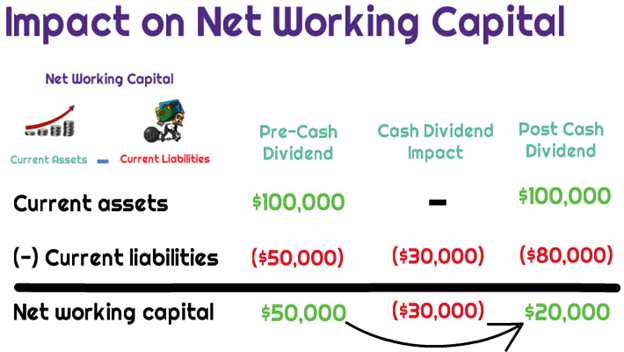

## Table of Contents

## What is additional paid-in capital (APIC)?

Additional paid-in capital (APIC) is the money that a company gets from investors when they buy its stock, but only the amount that is more than the stock's face value. For example, if a stock's face value is $1 and an investor pays $10 for it, the extra $9 goes into APIC. This is different from the money a company makes from selling its products or services.

APIC is important because it shows how much extra money investors are willing to put into the company. This can be a sign of how much they believe in the company's future. Companies keep track of APIC on their balance sheet, which is a report that shows what the company owns and owes. This helps everyone see how much money the company has raised from selling its stock.

## What are dividends and how are they typically distributed?

Dividends are payments that companies make to their shareholders from their profits. When a company does well and makes money, it can choose to share some of that money with the people who own its stock. This is a way for the company to reward its investors for believing in it and putting money into it. Dividends are usually paid out in cash, but sometimes they can be in the form of more stock or other assets.

Typically, dividends are distributed on a regular schedule, like every three months or once a year. The company's board of directors decides when and how much to pay out. Shareholders get dividends based on how many shares they own. If you own more shares, you get more money. The company announces the dividend payment date in advance, so shareholders know when to expect their money.

## How do dividends affect a company's financial statements?

When a company pays dividends, it affects its financial statements in a few ways. First, it reduces the company's cash. This is shown on the cash flow statement under the financing activities section. The cash flow statement keeps track of where the company's money comes from and where it goes. So, when dividends are paid, the cash balance goes down, and this is recorded as a cash outflow.

Second, dividends also affect the balance sheet. The balance sheet shows what the company owns and owes at a certain time. When dividends are paid, they reduce the company's retained earnings. Retained earnings are the profits that the company has kept instead of paying out as dividends. So, when dividends are paid, the retained earnings go down, and this change is shown on the balance sheet. 

Dividends do not affect the income statement directly because they are not an expense. The income statement shows the company's revenues and expenses over a period of time. Even though paying dividends does not show up as an expense, the decision to pay dividends can affect how much profit the company decides to keep or distribute.

## Can dividends be paid out of additional paid-in capital?

Dividends are usually paid out of a company's profits, which are shown as retained earnings on the balance sheet. But sometimes, if a company doesn't have enough profits, it might use other money to pay dividends. One of these other sources could be additional paid-in capital (APIC), but this is not common and depends on the rules in the company's home country.

In the United States, for example, companies can't usually pay dividends from APIC because the law says dividends should come from profits. But in some other places, it might be allowed if the company's rules say so. Using APIC for dividends is tricky because APIC is money from investors that's meant to help the company grow, not to pay out as dividends. So, companies usually try to avoid doing this unless they really have to.

## What is the difference between paying dividends from retained earnings versus APIC?

When a company pays dividends from retained earnings, it's using the money it has made from its business activities over time. Retained earnings are like the company's savings account, made up of profits that weren't given out as dividends before. This is the usual way to pay dividends because it shows that the company is doing well and can share its success with shareholders. When dividends come from retained earnings, it reduces the amount of money the company has saved up, but it doesn't change the money that investors put into the company to buy its stock.

On the other hand, paying dividends from additional paid-in capital (APIC) is less common and can be more complicated. APIC is the extra money investors paid for the company's stock above its face value. It's not money the company earned from its business, but money that investors gave to help the company grow. Using APIC for dividends means the company is using investor money that was meant for other things, like expanding the business. This can be allowed in some places, but it's not the usual way because it might make investors worried about how the company is using their money.

## How does the payment of dividends from APIC impact shareholders' equity?

When a company pays dividends from additional paid-in capital (APIC), it changes the shareholders' equity on the balance sheet. Shareholders' equity is the part of the balance sheet that shows how much of the company is owned by its shareholders. It's made up of things like common stock, APIC, and retained earnings. When dividends are paid from APIC, the APIC account goes down because the company is using that money to pay shareholders. This means the total shareholders' equity also goes down, but the money each shareholder gets doesn't change their ownership percentage in the company.

The impact on shareholders' equity can make investors think about the company's financial health. Usually, dividends come from retained earnings, which are profits the company has made. Using APIC for dividends might worry investors because it means the company doesn't have enough profits to share. They might wonder if the company is having trouble making money or if it's using investor money in a way that wasn't planned. So, even though paying dividends from APIC gives shareholders money, it can also make them think about the company's future and how it's being managed.

## What are the legal and regulatory considerations when using APIC for dividend payments?

When a company wants to use additional paid-in capital (APIC) to pay dividends, it needs to follow the rules and laws of the place where it's based. In the United States, the law usually says that dividends should come from profits, not from APIC. This means that using APIC for dividends is not common and might not be allowed. Companies need to check with their lawyers and look at the rules to make sure they're doing things the right way. If they don't follow the rules, they could get into trouble with the government or face problems with their shareholders.

In some other countries, the rules might be different. Some places might let companies use APIC for dividends if their own rules say it's okay. But even if it's allowed, companies need to be careful. Using APIC for dividends can make investors worried because it means the company doesn't have enough profits to share. So, even if it's legal, companies need to think about how it might affect what people think about them and their future plans. It's always a good idea for companies to talk to their lawyers and maybe even their shareholders before deciding to use APIC for dividends.

## How does the use of APIC for dividends affect a company's book value?

When a company uses additional paid-in capital (APIC) to pay dividends, it changes the company's book value. Book value is like the total worth of the company according to its financial records. It's figured out by taking everything the company owns, subtracting what it owes, and then looking at what's left for the shareholders. When dividends are paid from APIC, the APIC goes down, which makes the total shareholders' equity go down too. Since book value is based on shareholders' equity, using APIC for dividends means the book value will be lower.

This change in book value can affect how investors see the company. Usually, dividends come from profits, not from money investors paid for the stock. When a company uses APIC for dividends, it might make investors think the company is not doing well because it doesn't have enough profits to share. A lower book value could make the stock seem less valuable, which might make investors less happy or less likely to buy more stock. So, while using APIC for dividends gives shareholders money now, it could have a bigger effect on how the company looks in the long run.

## What are the tax implications of paying dividends from APIC for both the company and the shareholders?

When a company pays dividends from additional paid-in capital (APIC), the tax rules can be different depending on where the company is based. In the United States, dividends are usually taxed as income for shareholders, no matter where the money comes from. So, if a company pays dividends from APIC, shareholders still have to pay taxes on that money just like they would if it came from profits. The company itself doesn't get a tax break for paying dividends from APIC because it's not an expense or a way to reduce its taxable income.

For shareholders, the tax rate on dividends can depend on whether they are considered qualified or non-qualified dividends. Qualified dividends are taxed at a lower rate, similar to long-term capital gains, while non-qualified dividends are taxed at the shareholder's regular income tax rate. The source of the dividend, whether it's from APIC or retained earnings, doesn't change how it's taxed for the shareholder. They just need to report the dividend income on their tax return and pay the appropriate tax based on their tax situation.

## How do different accounting standards treat the use of APIC for dividend distributions?

Different accounting standards have different rules about using additional paid-in capital (APIC) for dividend payments. In the United States, the Generally Accepted Accounting Principles (GAAP) usually say that dividends should come from profits, not from APIC. This means that using APIC for dividends is not common and might not be allowed. Companies need to check the rules and make sure they're following them, or they could get in trouble.

On the other hand, International Financial Reporting Standards (IFRS), which are used in many countries outside the U.S., have different rules. IFRS might allow companies to use APIC for dividends if their own rules say it's okay. But even if it's allowed, companies need to be careful. Using APIC for dividends can make investors worried because it means the company doesn't have enough profits to share. So, even if it's legal under IFRS, companies need to think about how it might affect what people think about them and their future plans.

## What strategic reasons might a company have for choosing to pay dividends from APIC rather than retained earnings?

A company might choose to pay dividends from APIC instead of retained earnings if it wants to show its shareholders that it values them, even if it doesn't have enough profits right now. By using APIC, the company can still give money to its shareholders without dipping into the profits it needs to keep the business running. This can be a way to keep shareholders happy and loyal, especially if the company is going through a tough time and can't afford to pay dividends from its profits.

However, using APIC for dividends can also be a sign that the company is trying to buy time. If the company thinks it will make more money soon, it might use APIC to keep paying dividends until its profits catch up. This can be a risky move because it might make investors worried about the company's financial health. They might think the company is not doing well if it can't pay dividends from its profits. So, the company needs to be careful and make sure it has a good reason for using APIC this way.

## How does the market typically react to a company's decision to use APIC for dividend payments?

When a company decides to pay dividends from APIC, the market might not like it. Investors usually expect dividends to come from the company's profits, not from the money they paid for the stock. If a company uses APIC for dividends, it can make investors think the company is having money problems and can't afford to pay dividends from its profits. This might make the stock price go down because people might want to sell their shares and look for a company that's doing better.

On the other hand, some investors might see the company's decision to use APIC for dividends as a sign that the company really wants to keep its shareholders happy. They might think the company is trying to show it cares about its investors, even if it's going through a tough time. But even if some investors see it this way, most of the time, the market's reaction is negative because using APIC for dividends is not the usual way to do things and can make people worried about the company's future.

## What is Understanding Dividend Distributions?

Dividends are distributions made by corporations to their shareholders, typically representing a portion of the company's earnings. These distributions serve as a return on investment for shareholders and can be issued in various forms, most commonly as cash payments or additional stock shares. The strategic management of dividends is crucial for companies aiming to enhance their stock value and ensure shareholder satisfaction.

Dividend policies play a pivotal role in a company’s financial strategy. They directly impact investor confidence and, by extension, influence company valuation. Regular and predictable dividend distributions can be a signal of a company's financial health and long-term profitability. Conversely, changes in dividend policies, such as reductions or omissions, may indicate potential financial distress and can negatively affect stock prices.

The frequency and magnitude of dividend payouts are critical considerations for corporate governance. Companies often choose between different dividend policies, such as stable, constant, or residual dividend policies. A stable dividend policy involves paying a consistent dividend, which might appeal to investors who prioritize regular income. A constant dividend policy, on the other hand, pays a fixed percentage of profits, while a residual dividend policy focuses on funding required capital expenditures first, then distributing any remaining profits as dividends.

Mathematically, the dividend yield, which is the dividend per share divided by the price per share, can provide insights into how a company's dividends compare with its stock price:

$$
\text{Dividend Yield} = \left( \frac{\text{Annual Dividends Per Share}}{\text{Price Per Share}} \right) \times 100
$$

A high dividend yield may indicate that a stock is an attractive investment for income-focused investors. However, it is essential to analyze whether such yields are sustainable in the long term.

In conclusion, effective analysis and implementation of dividend policies are critical for maintaining investor confidence, attracting new investors, and optimizing company valuation. By understanding their dividend distribution strategies, companies can better position themselves in the market and ensure sustainable growth.

## What is Additional Paid-In Capital and How is it Explained?

Additional Paid-In Capital (APIC) represents the excess amount invested by shareholders when they buy shares at a price exceeding the par value. Par value is a nominal figure, often set at a minimal amount, to define the minimum price at which shares can initially be sold by the corporation. The APIC, therefore, is an indicator of the amount contributed by investors that is above this threshold, reflecting their confidence in the company's growth and profitability prospects.

APIC plays a crucial role in enhancing the equity base of a company without incurring additional debt. By increasing equity through APIC, a company can improve its financial health, making it more attractive to investors and potentially lowering its cost of capital. This strengthened equity position provides the company with a greater capacity to fund operational needs, pursue strategic investments, or cushion against financial downturns without the obligation of immediate repayment that comes with debt.

In terms of financial reporting, understanding the role of APIC is essential for a comprehensive assessment of a company’s capital structure. APIC is recorded on the equity side of a company's balance sheet, contributing to the overall stockholders' equity. It provides insights into the historical financing activities of the company, showing how much capital has been raised from equity investors beyond the basic par value of issued shares. 

Consider a hypothetical example to illustrate APIC calculation: if a corporation issues 1,000 shares with a par value of $1 each, but investors pay $10 per share, the APIC would be calculated as follows:

$$
APIC = (Issue Price - Par Value) \times Number of Shares
$$

Applying the values:

$$
APIC = (10 - 1) \times 1,000 = 9,000
$$

Here, the APIC would be $9,000, emphasizing the investor confidence through the additional $9 per share above par. Understanding and carefully managing APIC can provide companies with the flexibility needed for long-term financial planning and strategic allocations.

## What is the role of corporate finance in capital structure?

Corporate finance is the cornerstone of managing a company's capital structure, which is pivotal in ensuring a business meets its strategic objectives. The capital structure consists of the way a corporation finances its overall operations and growth through different sources of funds, primarily debt and equity. Strategic financial decisions within this domain significantly impact the company's capital structure, influencing both market perception and share price. 

By carefully planning and managing funds, a company can optimize its capital structure to enhance market competitiveness and maintain investor interest. The decision between debt and equity financing involves analyzing the cost of capital, impact on financial statements, and the potential influence on the company's valuation. Effective management of these factors determines a company's leverage ratio, calculated as:

$$
\text{Leverage Ratio} = \frac{\text{Total Debt}}{\text{Total Equity}}
$$

Maintaining the right balance of debt and equity is crucial for financial health. Excessive debt can lead to high interest obligations, potentially leading to financial distress, while too much equity can dilute earnings per share and reduce return on equity. Additionally, debt is often cheaper than equity due to tax deductibility of interest, but it increases financial risk.

Another critical aspect of corporate finance in capital structure management is the consideration of Additional Paid-In Capital (APIC). APIC represents the funds raised by a company beyond the nominal value of the stock and serves as an indication of investor confidence. Strategically utilizing APIC can strengthen the company's equity base without increasing debt, providing greater flexibility for future investments or covering unforeseen expenses.

Understanding these dynamics aids in navigating corporate growth and strategic investments. For instance, during periods of expansion, companies often raise capital through both debt and equity to fund projects, enter new markets, or make acquisitions. Effective capital structure management ensures these efforts align with long-term financial goals while minimizing costs and risks.

In summary, corporate finance plays a vital role in shaping a company's capital structure. Strategic financial decisions around debt, equity, and APIC are crucial for maintaining financial stability, competitive advantage, and achieving strategic business goals.

## References & Further Reading

[1]: Damodaran, A. (2011). ["Applied Corporate Finance."](https://www.amazon.com/Applied-Corporate-Finance-Aswath-Damodaran-ebook/dp/B00P6SS6MU) Wiley.

[2]: Berk, J., & DeMarzo, P. (2019). ["Corporate Finance."](https://www.pearson.com/en-us/subject-catalog/p/corporate-finance/P200000005829/9780135635926) Pearson Education.

[3]: Hull, J. C. (2014). ["Risk Management and Financial Institutions."](https://archive.org/download/quant_books/Risk%20Management%20_%20Financial%20Institutions%20-%20J.%20C.%20Hull.pdf) Wiley.

[4]: Lopez de Prado, M. (2018). ["Advances in Financial Machine Learning."](https://www.amazon.com/Advances-Financial-Machine-Learning-Marcos/dp/1119482089) Wiley.

[5]: Chan, E. (2008). ["Quantitative Trading: How to Build Your Own Algorithmic Trading Business."](https://github.com/ftvision/quant_trading_echan_book) Wiley.

[6]: Hirt, G., & Block, S. (2018). ["Fundamentals of Investment Management."](https://www.semanticscholar.org/paper/Fundamentals-of-Investment-Management-Hirt-Block/cd7d49db341ebb18e076b18b850e45aedfe0bb1f) McGraw-Hill Education.