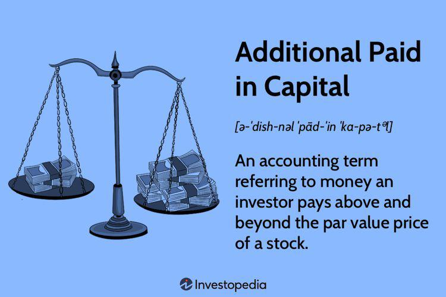

In the ever-evolving world of corporate finance, understanding key financial concepts is essential for both businesses and investors. The landscape is shaped by a complex interplay of dividend distributions, additional paid-in capital (APIC), corporate finance strategies, and algorithmic trading methodologies. The interactions among these elements influence a company's strategic direction, market performance, and the decisions made by investors. 

Dividend distributions represent a method by which corporations share their profits with shareholders, impacting both investor satisfaction and company valuation. By comprehending how dividends are structured and distributed, companies can sustain investor confidence while attracting new investments. Additional Paid-In Capital, on the other hand, underscores investors' faith in a company, reflecting the excess funds contributed by investors above the nominal value of shares. APIC is crucial in fortifying a company's financial structure and ensuring flexibility for planned investments or unforeseen expenses.



Corporate finance is the cornerstone of effective capital allocation and financial management within an organization. Decisions surrounding debt and equity, influenced by metrics like APIC, are vital for maintaining a healthy capital structure and competitive market presence. Strategic financial management determines the balance between leveraging and maintaining equity, which, in turn, impacts share prices and investor interest.

Algorithmic trading has emerged as a sophisticated tool in modern finance, using computer algorithms to automate trading decisions. By leveraging large datasets and integrating financial metrics such as APIC and equity data, these algorithms enhance market efficiency and liquidity while also optimizing decision-making processes and returns.

This comprehensive overview aims to provide insights into how businesses can optimize their financial strategies for sustainable growth by leveraging the interconnected dynamics of dividends, APIC, corporate finance, and algorithmic trading. Through this article, readers will gain a deeper understanding of these concepts and how they collectively influence financial outcomes, helping to craft strategies that align with both market opportunities and investment goals.

## Table of Contents

## Understanding Dividend Distributions

Dividends are distributions made by corporations to their shareholders, typically representing a portion of the company's earnings. These distributions serve as a return on investment for shareholders and can be issued in various forms, most commonly as cash payments or additional stock shares. The strategic management of dividends is crucial for companies aiming to enhance their stock value and ensure shareholder satisfaction.

Dividend policies play a pivotal role in a company’s financial strategy. They directly impact investor confidence and, by extension, influence company valuation. Regular and predictable dividend distributions can be a signal of a company's financial health and long-term profitability. Conversely, changes in dividend policies, such as reductions or omissions, may indicate potential financial distress and can negatively affect stock prices.

The frequency and magnitude of dividend payouts are critical considerations for corporate governance. Companies often choose between different dividend policies, such as stable, constant, or residual dividend policies. A stable dividend policy involves paying a consistent dividend, which might appeal to investors who prioritize regular income. A constant dividend policy, on the other hand, pays a fixed percentage of profits, while a residual dividend policy focuses on funding required capital expenditures first, then distributing any remaining profits as dividends.

Mathematically, the dividend yield, which is the dividend per share divided by the price per share, can provide insights into how a company's dividends compare with its stock price:

$$
\text{Dividend Yield} = \left( \frac{\text{Annual Dividends Per Share}}{\text{Price Per Share}} \right) \times 100
$$

A high dividend yield may indicate that a stock is an attractive investment for income-focused investors. However, it is essential to analyze whether such yields are sustainable in the long term.

In conclusion, effective analysis and implementation of dividend policies are critical for maintaining investor confidence, attracting new investors, and optimizing company valuation. By understanding their dividend distribution strategies, companies can better position themselves in the market and ensure sustainable growth.

## Additional Paid-In Capital Explained

Additional Paid-In Capital (APIC) represents the excess amount invested by shareholders when they buy shares at a price exceeding the par value. Par value is a nominal figure, often set at a minimal amount, to define the minimum price at which shares can initially be sold by the corporation. The APIC, therefore, is an indicator of the amount contributed by investors that is above this threshold, reflecting their confidence in the company's growth and profitability prospects.

APIC plays a crucial role in enhancing the equity base of a company without incurring additional debt. By increasing equity through APIC, a company can improve its financial health, making it more attractive to investors and potentially lowering its cost of capital. This strengthened equity position provides the company with a greater capacity to fund operational needs, pursue strategic investments, or cushion against financial downturns without the obligation of immediate repayment that comes with debt.

In terms of financial reporting, understanding the role of APIC is essential for a comprehensive assessment of a company’s capital structure. APIC is recorded on the equity side of a company's balance sheet, contributing to the overall stockholders' equity. It provides insights into the historical financing activities of the company, showing how much capital has been raised from equity investors beyond the basic par value of issued shares. 

Consider a hypothetical example to illustrate APIC calculation: if a corporation issues 1,000 shares with a par value of $1 each, but investors pay $10 per share, the APIC would be calculated as follows:

$$
APIC = (Issue Price - Par Value) \times Number of Shares
$$

Applying the values:

$$
APIC = (10 - 1) \times 1,000 = 9,000
$$

Here, the APIC would be $9,000, emphasizing the investor confidence through the additional $9 per share above par. Understanding and carefully managing APIC can provide companies with the flexibility needed for long-term financial planning and strategic allocations.

## The Role of Corporate Finance in Capital Structure

Corporate finance is the cornerstone of managing a company's capital structure, which is pivotal in ensuring a business meets its strategic objectives. The capital structure consists of the way a corporation finances its overall operations and growth through different sources of funds, primarily debt and equity. Strategic financial decisions within this domain significantly impact the company's capital structure, influencing both market perception and share price. 

By carefully planning and managing funds, a company can optimize its capital structure to enhance market competitiveness and maintain investor interest. The decision between debt and equity financing involves analyzing the cost of capital, impact on financial statements, and the potential influence on the company's valuation. Effective management of these factors determines a company's leverage ratio, calculated as:

$$
\text{Leverage Ratio} = \frac{\text{Total Debt}}{\text{Total Equity}}
$$

Maintaining the right balance of debt and equity is crucial for financial health. Excessive debt can lead to high interest obligations, potentially leading to financial distress, while too much equity can dilute earnings per share and reduce return on equity. Additionally, debt is often cheaper than equity due to tax deductibility of interest, but it increases financial risk.

Another critical aspect of corporate finance in capital structure management is the consideration of Additional Paid-In Capital (APIC). APIC represents the funds raised by a company beyond the nominal value of the stock and serves as an indication of investor confidence. Strategically utilizing APIC can strengthen the company's equity base without increasing debt, providing greater flexibility for future investments or covering unforeseen expenses.

Understanding these dynamics aids in navigating corporate growth and strategic investments. For instance, during periods of expansion, companies often raise capital through both debt and equity to fund projects, enter new markets, or make acquisitions. Effective capital structure management ensures these efforts align with long-term financial goals while minimizing costs and risks.

In summary, corporate finance plays a vital role in shaping a company's capital structure. Strategic financial decisions around debt, equity, and APIC are crucial for maintaining financial stability, competitive advantage, and achieving strategic business goals.

## Algorithmic Trading: A Modern Financial Tool

Algorithmic trading employs complex computer algorithms to automate and optimize trading decisions. These algorithms process extensive datasets to identify trading opportunities, leveraging financial metrics such as Additional Paid-In Capital (APIC). By incorporating APIC, algorithms gain insights into a company’s financial strength and equity structure, allowing for more informed investment decisions. The integration of such data aids in crafting strategies that align with market conditions, thereby optimizing returns.

One significant benefit of [algorithmic trading](/wiki/algorithmic-trading) is the enhancement of market efficiency and [liquidity](/wiki/liquidity-risk-premium). Algorithms execute trades at speeds and frequencies that are impossible for human traders, narrowing spreads and facilitating more transactions. This increased activity contributes to a more efficient and liquid market environment, which can be beneficial for both traders and the market as a whole.

However, algorithmic trading also presents challenges, including systemic risks associated with high-frequency trading. The speed and [volume](/wiki/volume-trading-strategy) of transactions can exacerbate market [volatility](/wiki/volatility-trading-strategies), potentially leading to significant financial disruptions. Ensuring robust risk management frameworks and regulatory compliance is essential to mitigate these challenges.

Incorporating APIC data into algorithmic trading strategies involves using mathematical models and [machine learning](/wiki/machine-learning) techniques to analyze equity structures. For example, a Python script could be written to parse financial reports, extract APIC figures, and integrate them into predictive market models. This process might involve regression analysis, clustering, or other machine learning methods to detect patterns and forecast market movements based on the financial health indicated by APIC.

```python
import pandas as pd
from sklearn.model_selection import train_test_split
from sklearn.linear_model import LinearRegression

# Sample dataset including APIC and market data
data = pd.read_csv('financial_data.csv')

# Features include APIC and other relevant financial indicators
X = data[['APIC', 'other_financial_indicator']]
y = data['stock_movement']

# Split the dataset into training and test sets
X_train, X_test, y_train, y_test = train_test_split(X, y, test_size=0.2, random_state=42)

# Train a linear regression model
model = LinearRegression()
model.fit(X_train, y_train)

# Predict stock movements based on test data
predictions = model.predict(X_test)
```

This code represents a simplified illustration of how financial metrics, including APIC, can be used to drive algorithmic trading decisions. The ongoing evolution of algorithmic trading, powered by advancements in data analytics and machine learning, underscores the importance of continuously integrating new financial insights to refine trading strategies and enhance market performance.

## Interconnections Between Financial Concepts

Understanding the interconnections between dividend distributions, Additional Paid-In Capital (APIC), and algorithmic trading can significantly enhance corporate finance strategies. Dividend distributions usually reduce a company's retained earnings and total equity. However, their impact on APIC is indirect and depends on the company's financial policies and capital structure. APIC, representing the excess amount paid by investors over the par value of stock, can be affected by equity issuance decisions influenced by dividend policies. 

For example, if a company opts to pay high dividends, it may need to issue more equity to maintain its financial flexibility, potentially increasing APIC. Conversely, lower dividends might preserve retained earnings and reduce the need for new equity issuance, hence impacting APIC differently. Strategic decisions around [capital raising](/wiki/hedge-fund-capital-raising), dividend policies, and equity issuance do not only affect a company's balance sheet but also shape public perception, influencing market valuation and investor confidence.

Algorithmic trading, which automates trading decisions through sophisticated computer algorithms, can exploit these financial insights by integrating data such as APIC and equity issuance trends. Algorithms that incorporate APIC-related metrics can enhance trading strategies by identifying patterns associated with changes in a company's equity base and dividend policies. By processing large datasets, these algorithms can provide timely market entry and [exit](/wiki/exit-strategy) strategies, optimizing trade execution and improving investment returns.

To illustrate, consider a Python snippet that briefly outlines how one could approach examining the impact of dividend distributions on APIC and trading strategies:

```python
import pandas as pd

# Sample data: company's dividend payouts and APIC changes over time
data = {
    'Year': [2019, 2020, 2021, 2022],
    'Dividends_paid': [5.0, 4.5, 4.8, 5.1],
    'APIC_change': [1.0, 1.5, -0.5, 2.0]
}

# Creating a DataFrame
df = pd.DataFrame(data)

# Simple analysis of correlation between dividends and APIC changes
correlation = df['Dividends_paid'].corr(df['APIC_change'])
print(f"Correlation between Dividends Paid and APIC Change: {correlation}")

# Output could be used for further insights into strategic financial planning
```

This script provides a foundational analysis, indicating whether there is a correlation between the dividend payouts and changes in APIC, aiding in refining investment strategies. By leveraging the interplay between these elements, companies can refine their financial strategies, improve investor confidence, and pursue sustainable growth. Integrating algorithmic trading with insights from APIC dynamics and dividend policies supports a more robust financial strategy that aligns with both company goals and market conditions.

## Conclusion

Navigating the complexities of corporate finance requires a comprehensive understanding of dividend distributions, Additional Paid-In Capital (APIC), and algorithmic trading. These elements, when optimally managed, can significantly bolster a company's financial strategies. By accurately timing and structuring dividend distributions, businesses can enhance shareholder satisfaction and influence their stock valuation positively. This, in turn, attracts and retains investors who are integral to a firm's capital inflow and market stability.

APIC serves as a financial buffer, reflecting investor confidence and supplementing the equity framework without accruing additional debt. Its role in improving a company’s balance sheet is pivotal, providing the necessary flexibility to accommodate future investments or unforeseen expenses. Recognizing the strategic deployment of APIC is crucial in maintaining a robust and adaptable capital structure, thus ensuring long-term financial health.

Algorithmic trading introduces unprecedented efficiency and precision in trading activities by employing data-driven strategies. This advanced financial tool utilizes algorithms to exploit price spreads and market inefficiencies quickly, enhancing liquidity and reducing trading costs. Integrating APIC and dividend insights into algorithmic models can further refine these strategies, enhancing returns and optimizing investment outcomes.

The continuous evolution of financial technology and data analytics propels these practices forward, necessitating perpetual learning and adaptation. As businesses strive to keep pace with these developments, they must remain agile, recalibrating their strategies to suit dynamic market conditions and emerging technologies. By fortifying their financial strategies through a well-rounded understanding of these interconnected concepts, companies can capitalize on market opportunities and solidify investor trust, ensuring sustainable growth and competitiveness.

## References & Further Reading

[1]: Damodaran, A. (2011). ["Applied Corporate Finance."](https://www.amazon.com/Applied-Corporate-Finance-Aswath-Damodaran-ebook/dp/B00P6SS6MU) Wiley.

[2]: Berk, J., & DeMarzo, P. (2019). ["Corporate Finance."](https://www.pearson.com/en-us/subject-catalog/p/corporate-finance/P200000005829/9780135635926) Pearson Education.

[3]: Hull, J. C. (2014). ["Risk Management and Financial Institutions."](https://archive.org/download/quant_books/Risk%20Management%20_%20Financial%20Institutions%20-%20J.%20C.%20Hull.pdf) Wiley.

[4]: Lopez de Prado, M. (2018). ["Advances in Financial Machine Learning."](https://www.amazon.com/Advances-Financial-Machine-Learning-Marcos/dp/1119482089) Wiley.

[5]: Chan, E. (2008). ["Quantitative Trading: How to Build Your Own Algorithmic Trading Business."](https://github.com/ftvision/quant_trading_echan_book) Wiley.

[6]: Hirt, G., & Block, S. (2018). ["Fundamentals of Investment Management."](https://www.semanticscholar.org/paper/Fundamentals-of-Investment-Management-Hirt-Block/cd7d49db341ebb18e076b18b850e45aedfe0bb1f) McGraw-Hill Education.