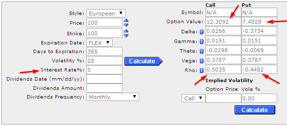

## Table of Contents

## What are dividends and how do they affect stock prices?

Dividends are payments that companies give to their shareholders from their profits. When a company makes money, it can choose to share some of that money with the people who own its stock. This payment is called a dividend, and it's usually given out every few months. Not all companies pay dividends, though. Some companies, especially newer ones, might decide to use all their profits to grow the business instead of paying dividends.

When a company announces it will pay a dividend, it can affect the stock price. Usually, the stock price goes up a bit right before the dividend is paid because people want to buy the stock to get the dividend. But on the day the dividend is paid, the stock price often drops by about the same amount as the dividend. This happens because the money that was going to be paid out as a dividend is no longer part of the company's value. So, while dividends can make shareholders happy by giving them extra money, they also cause the stock price to move in a certain way around the time the dividend is paid.

## How do interest rates influence the overall economy and stock market?

Interest rates are like the price of borrowing money. When interest rates go up, it costs more for people and businesses to borrow money. This can slow down the economy because people might buy fewer things like houses or cars, and businesses might not want to spend money on new projects. On the other hand, when interest rates are low, borrowing money is cheaper. This can make the economy grow faster because more people can afford to borrow money to buy things or start new businesses.

The stock market is also affected by interest rates. When rates are low, companies can borrow money more easily and cheaply, which can help them grow and make more profits. This often makes their stock prices go up. But when interest rates rise, borrowing becomes more expensive, and companies might not grow as fast. This can make investors worry about future profits, and stock prices might go down. Also, when interest rates go up, people might move their money from stocks to savings accounts or bonds that now offer better returns, which can also push stock prices down.

## What are stock options and how do they work?

Stock options are like special tickets that let you buy a company's stock at a certain price, called the strike price, within a certain time. They're often given to employees as part of their pay. When you get stock options, you don't own the stock yet. You have the right to buy it later if you want to. The idea is that if the company does well and the stock price goes up, you can buy the stock at the lower strike price and then sell it for a profit.

There are two main kinds of stock options: call options and put options. Call options give you the right to buy the stock, while put options let you sell the stock. If you think the stock price will go up, you might buy a call option. If you think it will go down, you might buy a put option. Options have an expiration date, so you need to decide whether to use them before they expire. If the stock price doesn't go the way you hoped, you can just let the options expire without using them, and you won't lose more than the money you paid for the options.

## How do dividends impact the valuation of stock options?

Dividends can affect the value of stock options, especially call options. When a company pays a dividend, the stock price usually drops by about the same amount as the dividend on the day it's paid. This can make call options less valuable because the stock price is lower. If you have a call option, you have the right to buy the stock at a certain price. If the stock price drops because of a dividend, the chance that the stock will be worth more than your strike price goes down, making your option worth less.

On the other hand, dividends can make put options more valuable. Put options give you the right to sell the stock at a certain price. If the stock price drops after a dividend is paid, the value of the put option goes up because it's more likely that you'll be able to sell the stock for more than its current market price. So, when a company pays dividends, it's usually good news for people who own put options and bad news for those who own call options.

## Can you explain the relationship between interest rates and the pricing of stock options?

Interest rates can affect the price of stock options because they change how much it costs to borrow money. When interest rates go up, it costs more to borrow money. This can make call options, which let you buy stock, more expensive. That's because if you buy a call option, you're betting the stock price will go up. If interest rates are high, the cost of holding onto that option until you can use it goes up too. On the other hand, put options, which let you sell stock, might become cheaper because people might want to sell stocks to avoid borrowing costs.

The other way interest rates impact stock options is through their effect on the overall economy and stock market. When interest rates are low, the economy often grows faster, and stock prices tend to go up. This can make call options more valuable because there's a better chance the stock price will rise above the strike price. But when interest rates rise, the economy might slow down, and stock prices might fall. This can make put options more valuable because there's a higher chance the stock price will drop below the strike price. So, interest rates play a big role in how much stock options are worth.

## What is the effect of dividend announcements on option prices?

When a company announces it will pay a dividend, it can change the prices of stock options. For call options, which give you the right to buy the stock, the announcement usually makes them less valuable. That's because the stock price often drops by the amount of the dividend on the day it's paid. If the stock price goes down, it's less likely that the stock will be worth more than the strike price of your call option, so the option becomes worth less.

On the other hand, put options, which give you the right to sell the stock, can become more valuable when a dividend is announced. Since the stock price is expected to drop after the dividend is paid, there's a better chance that the stock will be worth less than the strike price of your put option. This makes the put option more attractive because you can sell the stock at a higher price than its new, lower market value. So, dividend announcements can have opposite effects on call and put options.

## How does the timing of dividend payments affect option strategies?

When a company pays a dividend, it can change how people use options. If you have call options, you might want to use them before the dividend is paid. That's because the stock price usually drops by the amount of the dividend on the day it's paid. If you use your call option to buy the stock before the dividend, you can get the dividend too. But if you wait until after the dividend, the stock price might be lower, and your option might not be worth as much.

On the other hand, if you have put options, you might want to wait until after the dividend is paid. Since the stock price goes down after the dividend, your put option could be worth more. You can sell the stock at a higher price than its new, lower market value. So, knowing when a dividend is coming can help you decide the best time to use your options to make the most money.

## What role do interest rates play in the decision to exercise options early?

Interest rates can affect when someone decides to use their options early. If interest rates are high, it might be a good idea to use call options early. When you use a call option to buy stock, you can then hold onto that stock and maybe get dividends. If interest rates are high, the money you get from dividends can be more valuable. Also, if you use your call option early, you can use the money you would have spent on the option to invest in something else that gives you a good return because of the high interest rates.

On the other hand, if interest rates are low, it might be better to wait before using your call options. With low interest rates, the cost of holding onto the option until it's worth more isn't as high. You might want to wait and see if the stock price goes up more before you use your option. For put options, high interest rates might make you want to use them early too. If you use a put option to sell stock, you can take the money you get and invest it in something that gives you a good return because of the high interest rates.

## How do changes in interest rates affect the cost of carrying options?

When interest rates go up, it costs more to hold onto options. This is called the cost of [carry](/wiki/carry-trading). If you have a call option, which lets you buy stock later, you might have to pay more to keep that option because the money you're using to hold it could be earning more interest somewhere else. So, when interest rates are high, the price of call options can go up because people want to be paid more for not using their money in other ways.

On the other hand, if interest rates go down, the cost of holding onto options gets cheaper. When interest rates are low, the money you're using to keep your options isn't earning much interest if you put it somewhere else. This can make call options cheaper because there's less cost for holding them. For put options, which let you sell stock later, the opposite can happen. High interest rates might make put options cheaper because you can take the money from selling the stock and invest it at a higher rate.

## What are the implications of dividend policy changes for option traders?

When a company changes its dividend policy, it can affect option traders in big ways. If a company decides to start paying a bigger dividend or to pay dividends more often, this can make call options less valuable. That's because when the dividend is paid, the stock price usually drops by the amount of the dividend. If the stock price goes down, it's less likely that the stock will be worth more than the price you can buy it at with your call option. So, if you're an option trader with call options, you might want to use them before the dividend is paid to get the dividend and avoid the drop in stock price.

On the other hand, if a company cuts its dividend or stops paying it, this can make call options more valuable. Without the drop in stock price from a dividend, the stock has a better chance of going up above the price you can buy it at with your call option. For put options, the opposite is true. If a company increases its dividend, put options can become more valuable because the stock price is more likely to drop below the price you can sell it at with your put option. So, changes in dividend policy can make option traders think carefully about when to use their options to make the most money.

## How can option traders hedge against interest rate risk?

Option traders can hedge against interest rate risk by using interest rate options or futures. These are special kinds of options that let traders bet on what will happen to interest rates. If interest rates go up, it can make holding onto options more expensive. So, traders might buy an interest rate option that pays off if rates go up. This way, if rates do go up and their other options lose value, they can make money from the interest rate option to help cover their losses.

Another way to hedge is by using a strategy called delta hedging. This involves buying or selling the stock that the option is based on to balance out changes in the option's value caused by interest rates. If interest rates rise and the option's value goes down, traders can adjust their stock position to make up for it. By keeping a close eye on how interest rates are changing and adjusting their positions, option traders can protect themselves from the ups and downs of interest rates.

## What advanced models incorporate both dividends and interest rates in option pricing?

One of the advanced models that takes into account both dividends and interest rates in option pricing is the Black-Scholes model with dividends. This model is an extension of the original Black-Scholes model, which only considered interest rates. In the version with dividends, the model adjusts for the fact that the stock price can drop when a dividend is paid. This adjustment helps traders figure out what an option is worth when they know a company will pay dividends. The model uses a formula that includes the dividend yield, which is how much of the stock's value is paid out as dividends each year, and the risk-free interest rate, which is what you could earn by putting your money in a safe place like a government bond.

Another model that considers both dividends and interest rates is the Binomial Option Pricing Model. This model breaks down the time until the option expires into many small steps. At each step, it looks at what might happen to the stock price, including any dividends that might be paid. The model also takes into account the interest rate over these small steps. By looking at all the possible paths the stock price could take, the Binomial Model can give a more detailed picture of what an option might be worth, considering both the impact of dividends and the cost of holding onto the option because of interest rates.

## What are stock options and how are they valued?

Stock options are financial instruments that give investors the right, but not the obligation, to buy or sell a stock at a predetermined price, known as the strike price, within a specific time frame. These options are bifurcated into call options, which provide the right to purchase the stock, and put options, which allow selling the stock. This flexibility in decision-making empowers investors to hedge against potential market fluctuations or speculate on anticipated stock movements without directly owning the underlying asset.

The valuation of stock options is a critical component of options trading. The Black-Scholes model is one of the most prominent methodologies used to estimate the theoretical price of options. This model incorporates several key factors: the current stock price (S), the strike price (K), the time to expiration (T), the risk-free [interest rate](/wiki/interest-rate-trading-strategies) (r), and the [volatility](/wiki/volatility-trading-strategies) of the stock (σ). The formula for a call option, according to the Black-Scholes model, is expressed as:

$$
C = S_0 N(d_1) - Ke^{-rt} N(d_2)
$$

where:

$$
d_1 = \frac{\ln(S_0/K) + (r + \frac{\sigma^2}{2})t}{\sigma\sqrt{t}}
$$

$$
d_2 = d_1 - \sigma\sqrt{t}
$$

$N(d)$ denotes the cumulative distribution function of the standard normal distribution.

Understanding how dividends and interest rates affect option pricing is crucial for effective options trading. Dividends impact the stock price, as they are distributions of a company's earnings to shareholders, potentially reducing the future price of the stock. Options holders do not receive dividends, thus when a stock goes ex-dividend, its price typically decreases by the dividend amount. This anticipated drop must be factored into options pricing, particularly for American options that can be exercised before expiration.

Interest rates also play a significant role in the valuation process. The risk-free rate represents the theoretical return on an investment with no risk of financial loss. Higher interest rates generally increase call option values while decreasing put option values. This is because the present value of the strike price diminishes with an increase in the risk-free rate, making the purchase of the underlying stock more attractive in the future for call options.

By understanding the intricacies of stock options and their valuation, investors and traders can craft strategies that align with their market outlooks and risk tolerance. The interconnected influence of dividends and interest rates forms a significant aspect of options trading strategy, providing investors with the tools to both capitalize on market opportunities and mitigate potential risks.

## What is the Impact of Interest Rates on Investment Strategies?

Interest rates are a fundamental component of the economic environment, influencing key factors such as inflation and borrowing costs. They also have a notable impact on the attractiveness of various investment opportunities. For investors, shifts in interest rates can alter the relative appeal of different asset classes, including dividend-paying stocks and stock options.

### Impact on Dividend Stocks

Dividend stocks are shares of companies that distribute a portion of their earnings to shareholders in the form of dividends. These stocks are often seen as a stable income-generating investment, especially sought after by risk-averse investors during times of economic uncertainty. However, the attractiveness of dividend stocks is closely tied to interest rate fluctuations.

1. **Valuation**: When interest rates rise, newly issued bonds and other fixed-income investments offer higher returns, potentially making dividend stocks less attractive in comparison. This can lead to a decrease in the price of dividend stocks. Conversely, when interest rates fall, the lower yields on bonds may drive investors toward dividend stocks, potentially increasing their prices.

2. **Dividend Yield**: The dividend yield, calculated as the annual dividend payment divided by the stock price, becomes a critical metric for investors seeking income. As interest rates increase, yields on traditional fixed-income instruments like bonds rise, and investors may demand higher yields from dividend stocks, putting pressure on their prices.

### Impact on Stock Options

Options are financial derivatives that allow investors the right, but not the obligation, to purchase or sell a stock at a predetermined price within a specific timeframe. Interest rates affect option pricing in several ways:

1. **Black-Scholes Model**: A common model for valuing options is the Black-Scholes model, which incorporates various factors including the risk-free interest rate. The formula for the model is given by:
$$
   C(S, t) = SN(d_1) - Xe^{-rt}N(d_2)

$$

   Where:
   - $S$ is the current stock price
   - $X$ is the strike price 
   - $t$ is the time to expiration
   - $r$ is the risk-free interest rate
   - $N$ is the cumulative distribution function of the standard normal distribution
   - $d_1$ and $d_2$ are calculated as:
$$
   d_1 = \frac{\ln(S/X) + (r + \sigma^2/2)t}{\sigma\sqrt{t}}

$$
$$
   d_2 = d_1 - \sigma\sqrt{t}

$$

   An increase in interest rates generally leads to an increase in call option prices and a decrease in put option prices, as the opportunity cost of not [earning](/wiki/earning-announcement) interest affects the premium investors are willing to pay.

2. **Dividend Expectations**: Higher interest rates can lead companies to adjust their dividend policies, potentially reducing future dividend payments and affecting option valuations. Because dividends lower the value of call options (and increase the value of put options), expectations about future dividend changes can significantly impact option strategies.

### Strategic Adjustments

Investors can use several strategies to mitigate the effects of changing interest rates on their portfolios:

- **Diversification**: By diversifying across asset classes, sectors, and geographies, investors can spread risk and reduce reliance on any single asset type that might be negatively affected by rising interest rates.

- **Duration Hedging**: Fixed-income investors can employ duration hedging strategies to protect against the adverse impacts of interest rate increases.

- **Dynamic Allocations**: Investors can adjust their portfolio allocations dynamically based on interest rate forecasts, increasing exposure to dividend stocks when rates are low and reducing exposure when rates rise.

In summary, understanding the interplay between interest rates and different investment vehicles allows investors to better position their portfolios in changing economic climates.

## References & Further Reading

[1]: Black, F., & Scholes, M. (1973). ["The Pricing of Options and Corporate Liabilities."](https://www.cs.princeton.edu/courses/archive/fall09/cos323/papers/black_scholes73.pdf) Journal of Political Economy, 81(3), 637-654.

[2]: Hull, J. C. (2018). ["Options, Futures, and Other Derivatives."](https://www.semanticscholar.org/paper/Options%2C-Futures%2C-and-Other-Derivatives-Hull/89bdee500c8623864fc9eb7a471546aa713acc44) 10th Edition. Pearson Education.

[3]: Fabozzi, F. J., & Grant, J. L. (2000). ["Equity Management: The Art and Science of Modern Quantitative Investing."](https://www.researchgate.net/profile/James-Grant-11/publication/272091083_Equity_Portfolio_Management/links/54da6b5d0cf2ba88a68d3040/Equity-Portfolio-Management.pdf) Wiley.

[4]: Wilmott, P. (2013). ["Paul Wilmott Introduces Quantitative Finance."](https://www.amazon.com/Paul-Wilmott-Introduces-Quantitative-Finance/dp/0470319585) 2nd Edition. Wiley.

[5]: Kissell, R. (2013). ["The Science of Algorithmic Trading and Portfolio Management."](https://www.sciencedirect.com/book/9780124016897/the-science-of-algorithmic-trading-and-portfolio-management) Academic Press.