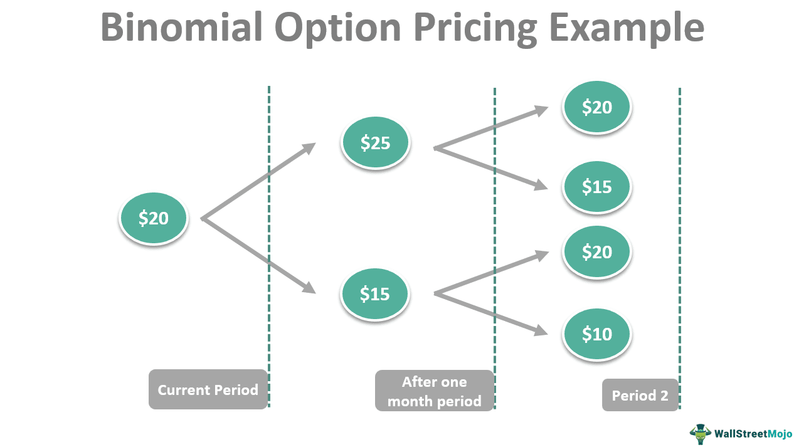

The intersection of dividends, option pricing, financial markets, and algorithmic trading presents a sophisticated yet rewarding framework for investors. This article explores the influence of dividends on option pricing, crucial financial models, including the Black-Scholes model, and algorithmic trading's transformative role in modern markets. As financial strategies evolve, understanding these elements is vital for successful market navigation.

Dividends significantly affect stock option pricing, especially around ex-dividend dates. Recognizing how dividends lead to price adjustments in call and put options is essential for informed trading decisions. Accurate option pricing is vital for financial strategies, and traditional models, like the Black-Scholes, provide valuable frameworks. However, these models have limitations. Investors must be aware of these limitations, the need for alternative models, and adjustments in strategies when dealing with dividend-paying stocks.



Algorithmic trading revolutionizes the speed and precision of market operations, playing a critical role in identifying opportunities in option pricing. As algorithms integrate with real-time data, leveraging advanced models like machine learning becomes increasingly important. The fusion of algorithmic trading and predictive analytics offers competitive advantages by adapting quickly to market changes.

This article aims to provide readers with a deep understanding of these components and their interactions. Whether an investor is a novice or an experienced professional, the insights shared here will aid in navigating the complexities and opportunities that dividends, option pricing, and algorithmic trading present.

## Table of Contents

## Impact of Dividends on Option Pricing

Dividends play a significant role in the pricing and valuation of stock options. When an underlying stock is expected to pay dividends, its expected future price tends to decline by the amount of the dividend. This anticipated reduction is captured in how options are priced, with particular focus on the ex-dividend date—the date on which a stock begins trading without the value of its next dividend payment incorporated in its price. 

For call options, which provide the right to buy a stock at a specified price, the expected decline in the stock price due to a dividend payout can result in a decrease in the option's value. As the stock price is predicted to fall post-dividend, the attractiveness and concomitant value of holding a call option reduce as this date nears. Conversely, put options, which offer the right to sell a stock at a specified price, may increase in value as the ex-dividend date approaches. This is because the put option grants the right to sell an asset that is anticipated to decrease in price, enhancing the potential profitability of executing the option.

An understanding of these dynamics is essential for making informed trading decisions. Traders often devise complex strategies around ex-dividend dates to capitalize on these expected changes in option values. These strategies might involve buying put options or selling call options as the dividend date approaches, depending on market conditions and the investor's outlook.

A basic understanding of the mechanics can be demonstrated through the adjustment made in option pricing models, such as the Black-Scholes model, which often needs modification to account for dividend payments. For instance, the modified version of the Black-Scholes formula for call options incorporates dividends as follows:

$$
C = S_0 e^{-qT}N(d_1) - Xe^{-rT}N(d_2)
$$

where:
- $C$ is the call option price.
- $S_0$ is the current stock price.
- $q$ is the continuous dividend yield.
- $T$ is the time to expiration.
- $X$ is the strike price.
- $r$ is the risk-free interest rate.
- $N(\cdot)$ is the cumulative distribution function of the standard normal distribution.
- $d_1$ and $d_2$ are intermediary calculations involving the underlying stock's price, volatility, interest rate, and dividend yield.

Traders who understand the timing and impact of dividends on option pricing can potentially unlock a range of profitable strategies. However, these strategies require a disciplined approach and a thorough analysis of market trends and dividend forecasts.

## The Black-Scholes Formula and Its Limitations

The Black-Scholes model, developed by Fischer Black, Myron Scholes, and Robert Merton in the early 1970s, is a cornerstone in the field of option pricing. This model provides a theoretical estimate for pricing European-style options, which can only be exercised at expiration. The formula is expressed as follows:

$$
C = S_0 N(d_1) - Xe^{-rT} N(d_2)
$$

Where:
- $C$ is the call option price.
- $S_0$ represents the current stock price.
- $X$ is the strike price of the option.
- $r$ denotes the risk-free interest rate.
- $T$ is the time to expiration.
- $N(\cdot)$ is the cumulative distribution function of the standard normal distribution.
- $d_1$ and $d_2$ are calculated as:

$$
d_1 = \frac{\ln(S_0 / X) + (r + \sigma^2 / 2)T}{\sigma \sqrt{T}}
$$

$$
d_2 = d_1 - \sigma \sqrt{T}
$$

While the Black-Scholes model offers a robust framework for option pricing, it presents several limitations. Notably, it cannot be directly applied to American options, which allow for early exercise, particularly when the underlying stocks pay dividends. This is due to the model's assumption that options can only be exercised at maturity.

Moreover, the Black-Scholes model assumes constant [volatility](/wiki/volatility-trading-strategies) and interest rates, which rarely holds true in real markets. Market conditions fluctuate, leading to volatility that changes over time, described as "volatility smiles" and "skews," which the traditional Black-Scholes framework fails to capture accurately. This limitation necessitates adjustments or entirely different models to incorporate the varying nature of real-world volatility.

For more accurate pricing and risk management, alternatives such as binomial tree models and numerical methods serve as effective supplements to the Black-Scholes model. For example, a binomial model allows for a step-by-step approach to option pricing, catering to different nodes representing possible stock prices over time, accommodating early exercise opportunities inherent in American options:

```python
import numpy as np

def binomial_tree_option(S0, X, T, r, sigma, N, option_type='call'):
    dt = T/N
    u = np.exp(sigma * np.sqrt(dt))
    d = 1/u
    p = (np.exp(r * dt) - d) / (u - d)
    option_prices = np.zeros(N+1)

    for i in range(N+1):
        ST = S0 * (u**i) * (d**(N-i))
        option_prices[i] = max(0, ST - X) if option_type == 'call' else max(0, X - ST)

    for j in range(N-1, -1, -1):
        for i in range(j+1):
            option_prices[i] = np.exp(-r * dt) * (p * option_prices[i+1] + (1-p) * option_prices[i])

    return option_prices[0]

# Example usage:
S0 = 100  # initial stock price
X = 100   # strike price
T = 1.0   # time to maturity in years
r = 0.05  # risk-free interest rate
sigma = 0.2  # volatility
N = 100    # number of steps in the binomial tree

call_price = binomial_tree_option(S0, X, T, r, sigma, N, option_type='call')
```

Investors must be cognizant of the Black-Scholes assumptions and make necessary adjustments to their trading strategies. For instance, incorporating dividend adjustments within the pricing of American options or employing volatility forecasting models can yield more precise pricing. Additionally, engaging with models beyond Black-Scholes can provide strategic advantages in managing diverse portfolios, ultimately enhancing financial decision-making.

## Algorithmic Trading: Transforming Financial Markets

Algorithmic trading has fundamentally changed the landscape of financial markets by providing unprecedented levels of speed, efficiency, and precision in trade execution. At its core, [algorithmic trading](/wiki/algorithmic-trading) involves the use of computer programs and systems to execute trades based on predefined criteria. These algorithms can analyze vast amounts of data in real-time, swiftly identifying lucrative opportunities in option pricing that might be missed by human traders.

One of the primary models employed in algorithmic trading is the Black-Scholes model, which provides a theoretical estimate for the pricing of European-style options. In practice, algorithms utilize this model alongside real-time market data to make informed trading decisions. The Black-Scholes formula, given by:

$$
C = S_0 N(d_1) - Xe^{-rT} N(d_2)
$$

where:
- $C$ is the call option price,
- $S_0$ is the current stock price,
- $X$ is the strike price,
- $T$ is the time to expiration,
- $r$ is the risk-free interest rate,
- $N(d)$ is the cumulative distribution function of the standard normal distribution,
- $d_1 = \frac{\ln(S_0 / X) + (r + \sigma^2 / 2) T}{\sigma \sqrt{T}}$
- $d_2 = d_1 - \sigma \sqrt{T}$
- $\sigma$ is the volatility of the stock.

However, the capability of algorithmic trading extends beyond traditional models. Advanced strategies have begun to incorporate [machine learning](/wiki/machine-learning) and predictive analytics to further enhance decision-making processes. Machine learning algorithms can detect subtle patterns within complex datasets, improving the accuracy of market predictions and trade executions.

Moreover, algorithmic trading systems are designed for continuous operation. They function round-the-clock, ensuring that they can react instantaneously to any fluctuations or changes in the market, thereby securing a competitive advantage over manual trading methods. This allows for the exploitation of tiny market inefficiencies that occur within fractions of a second, which can accumulate to substantial financial gains.

The synergy between algorithmic trading and sophisticated option pricing models leads to substantial competitive advantages. By leveraging the power of algorithms, traders are better equipped to execute trades with precision and efficiency, maximizing potential returns while minimizing risks. This technological progression continues to drive innovation in the financial markets, propelling them towards greater levels of complexity and opportunity.

## Beyond Black-Scholes: Alternative Models in Option Pricing

Alternative option pricing models have gained traction as investors and analysts seek solutions to the limitations of the Black-Scholes model, particularly when it comes to American-style options and stocks that pay dividends. These models offer more flexibility and can handle complex payoff structures that Black-Scholes cannot efficiently address.

### Numerical Integration

Numerical integration techniques provide a method for valuing options with payoff structures that require more detailed analysis than simple closed-form solutions can offer. These methods enable precise calculations by evaluating the integral of the payoff across different possible future states of the world. They are particularly useful for exotic options with path-dependent features or varying term structures of volatility.

### Monte Carlo Simulations

Monte Carlo simulations involve simulating a vast number of potential future states for the underlying asset's price path and determining the option's value based on these simulations. This method accommodates a wide span of option features, including American-style options and those with multiple exercise opportunities. The flexibility of Monte Carlo methods lies in their ability to incorporate complex variations in volatility, interest rates, and other relevant parameters without the need for explicit formulas.

```python
import numpy as np

def monte_carlo_option_pricing(S, E, r, sigma, T, num_simulations):
    # S: initial stock price, E: exercise price, r: risk-free rate,
    # sigma: volatility, T: time to expiration, num_simulations: number of simulations
    payoffs = []
    for _ in range(num_simulations):
        ST = S * np.exp((r - 0.5 * sigma ** 2) * T + sigma * np.sqrt(T) * np.random.normal())
        payoffs.append(max(ST - E, 0))  # European call option payoff
    C0 = np.exp(-r * T) * np.mean(payoffs)
    return C0

# Example Usage
S = 100  # Stock price
E = 105  # Exercise price
r = 0.05  # Risk-free rate
sigma = 0.2  # Volatility
T = 1  # Time to expiration (1 year)
num_simulations = 10000  # Number of simulations

option_price = monte_carlo_option_pricing(S, E, r, sigma, T, num_simulations)
print("Monte Carlo simulated option price:", option_price)
```

### Binomial Trees

The binomial tree method models the possible price evolution of the underlying asset as a recombining tree of discrete time points, providing another tool for American-style options that allows for early exercise. At each step, the price can move up or down, resulting in a tree-like structure of potential future prices.

Advantages of this model include its flexibility to change inputs at each node and its capability to accurately price options where dividends are involved by adjusting the stock price at dividend points.

### Strategic Diversification and Model Selection

These alternative models create opportunities for strategic diversification by allowing investors to tailor their pricing approach according to specific option features and market conditions. The selection of a suitable model hinges on factors such as the contractual form of the options, the level of market volatility, and the desired trade-offs between precision and computational efficiency.

### Staying Informed

Staying informed about emerging models and their applications is vital for any investor involved in derivatives. As markets evolve and new financial instruments are developed, the ability to rapidly adapt and accurately price options provides a competitive edge. Continuous education and practical application of these advanced techniques enhance decision-making and optimize portfolio management.

## Conclusion

Option pricing is fundamentally impacted by dividends and the innovations brought about by algorithmic trading. These factors collectively form a crucial component of contemporary financial strategies. Although traditional models, such as the Black-Scholes formula, provide a valuable foundation, they often require the supplement of new methodologies to suit modern market conditions. This shift from classical models towards more advanced strategies highlights the essential need for adaptation in investment approaches.

Algorithmic trading has become an indispensable tool in today’s dynamic markets, offering enhanced capabilities for rapid and precise decision-making. These tools enable traders to process vast amounts of data and execute trades with unprecedented speed, facilitating the capture of opportunities that may otherwise be missed within the volatile trading environment. By integrating algorithmic frameworks with option pricing models, investors can leverage computational techniques to gain competitive advantages.

Successful investors must achieve a balance between understanding fundamental principles and adapting to evolving strategies. This comprehensive knowledge equips them to make well-informed decisions that optimize their investment portfolios. Moreover, maintaining relevance and success in financial markets demands continuous learning to remain abreast of emerging technologies and models. By doing so, investors can ensure that their strategies are aligned with the latest developments, fostering resilience and growth in a competitive landscape.

## References & Further Reading

[1]: Black, F., & Scholes, M. (1973). ["The Pricing of Options and Corporate Liabilities."](https://www.cs.princeton.edu/courses/archive/fall09/cos323/papers/black_scholes73.pdf) Journal of Political Economy.

[2]: Hull, J. C. (2015). ["Options, Futures, and Other Derivatives"](https://www.amazon.com/Options-Futures-Other-Derivatives-Global/dp/1292410655) (9th ed.). Pearson.

[3]: Gatheral, J. (2006). ["The Volatility Surface: A Practitioner's Guide."](https://onlinelibrary.wiley.com/doi/book/10.1002/9781119202073) Wiley.

[4]: Lopez de Prado, M. (2018). ["Advances in Financial Machine Learning."](https://www.amazon.com/Advances-Financial-Machine-Learning-Marcos/dp/1119482089) Wiley.

[5]: Jansen, S. (2020). ["Machine Learning for Algorithmic Trading."](https://github.com/stefan-jansen/machine-learning-for-trading) Packt Publishing.

[6]: Chan, E. P. (2009). ["Quantitative Trading: How to Build Your Own Algorithmic Trading Business."](https://github.com/ftvision/quant_trading_echan_book) Wiley.