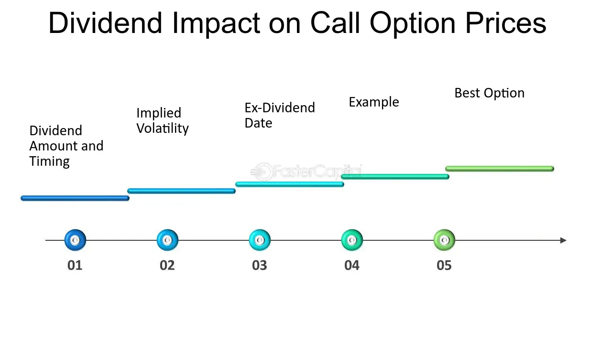

## Table of Contents

## What are dividends and how do they affect stock prices?

Dividends are payments that companies give to their shareholders from their profits. When a company makes money, it can choose to keep it to grow the business or give some of it back to the people who own its stocks. These payments are called dividends. They are usually given out every three months, but some companies might pay them yearly or at different times.

When a company announces it will pay a dividend, it can affect the stock price. Usually, the stock price goes up a bit right before the dividend is paid because people want to buy the stock to get the dividend. But on the day the company actually pays the dividend, the stock price often drops by about the same amount as the dividend. This happens because the money the company is paying out is no longer part of the company's value. So, while dividends can make shareholders happy by giving them extra money, they can also cause the stock price to go up and down a bit around the time they are paid.

## How do dividends influence the pricing of options?

Dividends can change how much options are worth. Options give people the right to buy or sell a stock at a set price before a certain date. When a company says it will pay a dividend, it usually makes the stock price go down a bit on the day the dividend is paid. This can make "call" options, which let you buy the stock, less valuable because the stock price goes down. On the other hand, "put" options, which let you sell the stock, might become more valuable because the lower stock price makes them more useful.

The timing of when the dividend is paid is important for options. If the dividend is paid before the option expires, it can affect the option's price right away. But if the option expires before the dividend is paid, the effect might be smaller or not happen at all. Traders who know about dividends can use this information to guess how the stock and option prices might move, helping them make better choices about buying or selling options.

## What is the ex-dividend date and its relevance to option pricing?

The ex-dividend date is the first day a stock trades without the right to the next dividend payment. If you buy the stock on or after this date, you won't get the upcoming dividend. The ex-dividend date is important because it's when the stock price usually drops by about the amount of the dividend. This drop can affect option pricing because options are based on the stock's price.

For call options, which give the right to buy the stock, the price might go down around the ex-dividend date. This is because the stock price is expected to drop, making the option less valuable. For put options, which give the right to sell the stock, the price might go up because the lower stock price after the ex-dividend date makes the option more valuable. Traders need to know the ex-dividend date to understand how it might change the value of their options and make smart trading decisions.

## Can you explain the concept of 'dividend yield' and its impact on options?

Dividend yield is a simple way to see how much money you get back from a company's dividends compared to how much you paid for the stock. It's like a percentage that shows how much of your investment comes back to you each year in dividends. You find it by taking the yearly dividend and dividing it by the stock's price. If a stock costs $100 and pays $5 in dividends each year, the dividend yield is 5%.

This yield can affect options because it changes how much the stock is worth to people who might buy or sell it. If a stock has a high dividend yield, it might be more attractive to investors, which can push up the stock price. For call options, a higher stock price means they could be worth more. But remember, when the dividend is paid, the stock price often drops, which might make call options less valuable around that time. For put options, a high dividend yield might make them less valuable before the dividend, but more valuable right after the stock price drops on the ex-dividend date.

## How does the announcement of a dividend change the expected value of an option?

When a company says it will pay a dividend, it can change what people think an option is worth. Options let you buy or sell a stock at a set price. If a company announces a dividend, the stock price might go up a bit before the dividend is paid because people want to buy the stock to get the dividend. This can make call options, which let you buy the stock, more valuable because the stock price is going up. But, the stock price usually drops by about the dividend amount on the ex-dividend date, the first day you can buy the stock without getting the next dividend. This drop can make call options less valuable because the stock price is going down.

On the other hand, put options, which let you sell the stock, might become more valuable around the ex-dividend date. This is because the lower stock price after the dividend makes the put option more useful. Traders who know about dividends can use this information to guess how the stock and option prices might move. They can then make better choices about buying or selling options based on when the dividend is expected to be paid and how much it will be.

## What adjustments are made to option prices on the ex-dividend date?

When a company pays a dividend, the stock price usually drops by about the dividend amount on the ex-dividend date. This drop affects option prices too. For call options, which give you the right to buy the stock, the price might go down because the stock price is lower. The call option becomes less valuable because it's now tied to a stock that's worth less. On the other hand, put options, which give you the right to sell the stock, might go up in value. This is because the lower stock price makes the put option more useful for selling the stock at a higher set price.

Traders need to think about these changes when they're buying or selling options around the ex-dividend date. The adjustments to option prices happen because the stock's value changes. Knowing when the ex-dividend date is and how much the dividend will be can help traders make smarter choices. They can use this information to predict how the stock and option prices will move and plan their trades accordingly.

## How do different types of options (e.g., American vs. European) react to dividends?

American options can be used at any time before they expire, while European options can only be used on the day they expire. When a company pays a dividend, it can change the value of these options in different ways. For American options, people might use them early to get the dividend if it's big enough. This means if you have an American call option, you might use it before the ex-dividend date to buy the stock and get the dividend. On the other hand, if you have an American put option, you might use it early if the dividend makes the stock price drop a lot, because it could be better to sell the stock at the higher set price before the dividend is paid.

European options are trickier because you can't use them until they expire. So, even if a big dividend is coming, you can't use a European call option early to get it. But the expected dividend still affects the price of European options. The price of a European call option might go down before the ex-dividend date because people know the stock price will drop when the dividend is paid. A European put option's price might go up because the lower stock price after the dividend makes it more useful. Traders need to think about these differences when they're dealing with American and European options around dividend times.

## What role do dividend forecasts play in option pricing models?

Dividend forecasts are important in option pricing models because they help predict how much a stock's price might change. When a company says it will pay a dividend, it usually makes the stock price go down a bit on the day the dividend is paid. Option pricing models, like the Black-Scholes model, use these forecasts to guess what the stock price will do. If a big dividend is expected, the model might predict a bigger drop in the stock price, which can change how much an option is worth.

For call options, which give the right to buy the stock, a forecasted dividend might make them less valuable because the stock price is expected to drop. On the other hand, put options, which give the right to sell the stock, might become more valuable because a lower stock price makes them more useful. By using dividend forecasts, option pricing models can give a better idea of what options might be worth, helping traders make smarter choices about buying or selling them.

## How does the Black-Scholes model account for dividends in option pricing?

The Black-Scholes model is a way to figure out how much an option should cost. It's like a math recipe that uses things like the stock's price, how much the stock moves up and down, how long until the option ends, and what people think the stock will do in the future. When it comes to dividends, the model has to think about them because dividends can change the stock's price. If a company is going to pay a dividend, the stock price usually goes down a bit on the day the dividend is paid. So, the Black-Scholes model takes this expected drop into account when figuring out the option's price.

For call options, which let you buy the stock, the model knows the stock price will drop because of the dividend, so it makes the call option less valuable. For put options, which let you sell the stock, the model knows the lower stock price after the dividend makes the put option more valuable. The model uses the expected dividend amount and when it will be paid to adjust the option's price. This helps traders get a better idea of what an option is worth when they're thinking about buying or selling it.

## What are the implications of special dividends on option pricing strategies?

Special dividends are extra payments a company gives to its shareholders that aren't part of the regular dividend schedule. When a company announces a special dividend, it can shake up the stock price and the value of options. If the special dividend is big, it can make the stock price drop a lot on the ex-dividend date. This big drop can mess with option pricing strategies because it changes how much the stock is worth. People who have call options, which let them buy the stock, might see their options become less valuable because the stock price goes down. On the other hand, people with put options, which let them sell the stock, might find their options more valuable because the lower stock price makes them more useful.

Traders need to be careful when they know a special dividend is coming. They might need to change their option pricing strategies to account for the expected drop in the stock price. For example, if someone owns a call option and a big special dividend is coming, they might want to sell it before the ex-dividend date to avoid losing value. Or, if someone has a put option, they might hold onto it or even buy more because it could become more valuable after the stock price drops. Knowing about special dividends and planning for them can help traders make better choices and maybe even make more money from their options.

## How can traders use dividend information to optimize their option trading strategies?

Traders can use dividend information to make smarter choices about when to buy or sell options. If a company is going to pay a dividend, the stock price usually goes down a bit on the ex-dividend date. This can make call options, which let you buy the stock, less valuable because the stock price drops. So, if you own a call option and a dividend is coming, you might want to sell it before the ex-dividend date to avoid losing value. On the other hand, put options, which let you sell the stock, can become more valuable when the stock price drops. If you have a put option, you might want to hold onto it or even buy more around the ex-dividend date because it could make you more money.

Special dividends, which are extra payments not part of the regular schedule, can also affect option trading strategies. If a company announces a big special dividend, the stock price might drop a lot on the ex-dividend date. This big drop can make call options lose a lot of value, so traders might want to sell them before the special dividend is paid. But for put options, a big special dividend can make them more valuable, so traders might want to keep them or buy more. By knowing when dividends are coming and how much they will be, traders can plan their moves better and maybe make more money from their options.

## What advanced models exist for pricing options in the presence of uncertain dividends?

When dividends are not sure, traders need special math models to figure out how much options should cost. One popular model is the binomial model. This model breaks down the time until the option expires into smaller pieces and guesses what might happen to the stock price at each step. If there's a chance of a dividend, the model can change the stock price at the right time. This helps traders see how the option's value might change if the dividend happens or not. The binomial model is good because it can handle different possibilities and give a range of what the option might be worth.

Another model that works well with uncertain dividends is the Monte Carlo simulation. This model runs a bunch of pretend scenarios to see what might happen to the stock price and the option's value. Each run can include a dividend or not, based on how likely it is to happen. By doing many runs, the model can show a good guess of what the option is worth, even when dividends are not certain. Traders use these results to make better choices about buying or selling options, knowing they've looked at many possible outcomes.

## What is the impact of dividends on option pricing?

Dividends play a significant role in the pricing and valuation of stock options. When an underlying stock is expected to pay dividends, its expected future price tends to decline by the amount of the dividend. This anticipated reduction is captured in how options are priced, with particular focus on the ex-dividend date—the date on which a stock begins trading without the value of its next dividend payment incorporated in its price. 

For call options, which provide the right to buy a stock at a specified price, the expected decline in the stock price due to a dividend payout can result in a decrease in the option's value. As the stock price is predicted to fall post-dividend, the attractiveness and concomitant value of holding a call option reduce as this date nears. Conversely, put options, which offer the right to sell a stock at a specified price, may increase in value as the ex-dividend date approaches. This is because the put option grants the right to sell an asset that is anticipated to decrease in price, enhancing the potential profitability of executing the option.

An understanding of these dynamics is essential for making informed trading decisions. Traders often devise complex strategies around ex-dividend dates to capitalize on these expected changes in option values. These strategies might involve buying put options or selling call options as the dividend date approaches, depending on market conditions and the investor's outlook.

A basic understanding of the mechanics can be demonstrated through the adjustment made in option pricing models, such as the Black-Scholes model, which often needs modification to account for dividend payments. For instance, the modified version of the Black-Scholes formula for call options incorporates dividends as follows:

$$
C = S_0 e^{-qT}N(d_1) - Xe^{-rT}N(d_2)
$$

where:
- $C$ is the call option price.
- $S_0$ is the current stock price.
- $q$ is the continuous dividend yield.
- $T$ is the time to expiration.
- $X$ is the strike price.
- $r$ is the risk-free interest rate.
- $N(\cdot)$ is the cumulative distribution function of the standard normal distribution.
- $d_1$ and $d_2$ are intermediary calculations involving the underlying stock's price, volatility, interest rate, and dividend yield.

Traders who understand the timing and impact of dividends on option pricing can potentially unlock a range of profitable strategies. However, these strategies require a disciplined approach and a thorough analysis of market trends and dividend forecasts.

## What are the Black-Scholes Formula and its limitations?

The Black-Scholes model, developed by Fischer Black, Myron Scholes, and Robert Merton in the early 1970s, is a cornerstone in the field of option pricing. This model provides a theoretical estimate for pricing European-style options, which can only be exercised at expiration. The formula is expressed as follows:

$$
C = S_0 N(d_1) - Xe^{-rT} N(d_2)
$$

Where:
- $C$ is the call option price.
- $S_0$ represents the current stock price.
- $X$ is the strike price of the option.
- $r$ denotes the risk-free interest rate.
- $T$ is the time to expiration.
- $N(\cdot)$ is the cumulative distribution function of the standard normal distribution.
- $d_1$ and $d_2$ are calculated as:

$$
d_1 = \frac{\ln(S_0 / X) + (r + \sigma^2 / 2)T}{\sigma \sqrt{T}}
$$

$$
d_2 = d_1 - \sigma \sqrt{T}
$$

While the Black-Scholes model offers a robust framework for option pricing, it presents several limitations. Notably, it cannot be directly applied to American options, which allow for early exercise, particularly when the underlying stocks pay dividends. This is due to the model's assumption that options can only be exercised at maturity.

Moreover, the Black-Scholes model assumes constant [volatility](/wiki/volatility-trading-strategies) and interest rates, which rarely holds true in real markets. Market conditions fluctuate, leading to volatility that changes over time, described as "volatility smiles" and "skews," which the traditional Black-Scholes framework fails to capture accurately. This limitation necessitates adjustments or entirely different models to incorporate the varying nature of real-world volatility.

For more accurate pricing and risk management, alternatives such as binomial tree models and numerical methods serve as effective supplements to the Black-Scholes model. For example, a binomial model allows for a step-by-step approach to option pricing, catering to different nodes representing possible stock prices over time, accommodating early exercise opportunities inherent in American options:

```python
import numpy as np

def binomial_tree_option(S0, X, T, r, sigma, N, option_type='call'):
    dt = T/N
    u = np.exp(sigma * np.sqrt(dt))
    d = 1/u
    p = (np.exp(r * dt) - d) / (u - d)
    option_prices = np.zeros(N+1)

    for i in range(N+1):
        ST = S0 * (u**i) * (d**(N-i))
        option_prices[i] = max(0, ST - X) if option_type == 'call' else max(0, X - ST)

    for j in range(N-1, -1, -1):
        for i in range(j+1):
            option_prices[i] = np.exp(-r * dt) * (p * option_prices[i+1] + (1-p) * option_prices[i])

    return option_prices[0]

# Example usage:
S0 = 100  # initial stock price
X = 100   # strike price
T = 1.0   # time to maturity in years
r = 0.05  # risk-free interest rate
sigma = 0.2  # volatility
N = 100    # number of steps in the binomial tree

call_price = binomial_tree_option(S0, X, T, r, sigma, N, option_type='call')
```

Investors must be cognizant of the Black-Scholes assumptions and make necessary adjustments to their trading strategies. For instance, incorporating dividend adjustments within the pricing of American options or employing volatility forecasting models can yield more precise pricing. Additionally, engaging with models beyond Black-Scholes can provide strategic advantages in managing diverse portfolios, ultimately enhancing financial decision-making.

## How is Algorithmic Trading Transforming Financial Markets?

Algorithmic trading has fundamentally changed the landscape of financial markets by providing unprecedented levels of speed, efficiency, and precision in trade execution. At its core, [algorithmic trading](/wiki/algorithmic-trading) involves the use of computer programs and systems to execute trades based on predefined criteria. These algorithms can analyze vast amounts of data in real-time, swiftly identifying lucrative opportunities in option pricing that might be missed by human traders.

One of the primary models employed in algorithmic trading is the Black-Scholes model, which provides a theoretical estimate for the pricing of European-style options. In practice, algorithms utilize this model alongside real-time market data to make informed trading decisions. The Black-Scholes formula, given by:

$$
C = S_0 N(d_1) - Xe^{-rT} N(d_2)
$$

where:
- $C$ is the call option price,
- $S_0$ is the current stock price,
- $X$ is the strike price,
- $T$ is the time to expiration,
- $r$ is the risk-free interest rate,
- $N(d)$ is the cumulative distribution function of the standard normal distribution,
- $d_1 = \frac{\ln(S_0 / X) + (r + \sigma^2 / 2) T}{\sigma \sqrt{T}}$
- $d_2 = d_1 - \sigma \sqrt{T}$
- $\sigma$ is the volatility of the stock.

However, the capability of algorithmic trading extends beyond traditional models. Advanced strategies have begun to incorporate [machine learning](/wiki/machine-learning) and predictive analytics to further enhance decision-making processes. Machine learning algorithms can detect subtle patterns within complex datasets, improving the accuracy of market predictions and trade executions.

Moreover, algorithmic trading systems are designed for continuous operation. They function round-the-clock, ensuring that they can react instantaneously to any fluctuations or changes in the market, thereby securing a competitive advantage over manual trading methods. This allows for the exploitation of tiny market inefficiencies that occur within fractions of a second, which can accumulate to substantial financial gains.

The synergy between algorithmic trading and sophisticated option pricing models leads to substantial competitive advantages. By leveraging the power of algorithms, traders are better equipped to execute trades with precision and efficiency, maximizing potential returns while minimizing risks. This technological progression continues to drive innovation in the financial markets, propelling them towards greater levels of complexity and opportunity.

## References & Further Reading

[1]: Black, F., & Scholes, M. (1973). ["The Pricing of Options and Corporate Liabilities."](https://www.cs.princeton.edu/courses/archive/fall09/cos323/papers/black_scholes73.pdf) Journal of Political Economy.

[2]: Hull, J. C. (2015). ["Options, Futures, and Other Derivatives"](https://www.amazon.com/Options-Futures-Other-Derivatives-Global/dp/1292410655) (9th ed.). Pearson.

[3]: Gatheral, J. (2006). ["The Volatility Surface: A Practitioner's Guide."](https://onlinelibrary.wiley.com/doi/book/10.1002/9781119202073) Wiley.

[4]: Lopez de Prado, M. (2018). ["Advances in Financial Machine Learning."](https://www.amazon.com/Advances-Financial-Machine-Learning-Marcos/dp/1119482089) Wiley.

[5]: Jansen, S. (2020). ["Machine Learning for Algorithmic Trading."](https://github.com/stefan-jansen/machine-learning-for-trading) Packt Publishing.

[6]: Chan, E. P. (2009). ["Quantitative Trading: How to Build Your Own Algorithmic Trading Business."](https://github.com/ftvision/quant_trading_echan_book) Wiley.