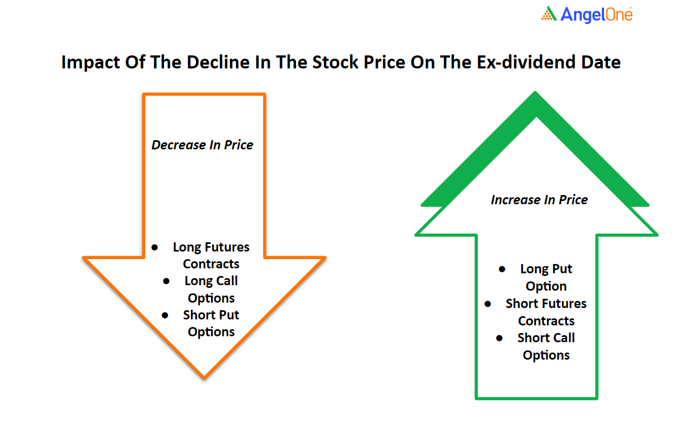

## Table of Contents

## What are dividends and how do they work?

Dividends are payments that companies give to their shareholders, usually from the profits they make. When a company earns money, it can choose to reinvest that money back into the business or share it with the people who own its stocks. If the company decides to share the profits, it will declare a dividend, which means each shareholder will get a portion of the money based on how many shares they own.

The process of paying dividends usually happens on a regular schedule, like quarterly or annually. When a company announces a dividend, it sets a date called the "record date." If you own the stock on this date, you are eligible to receive the dividend. After the record date, the company will distribute the money to the shareholders, often by depositing it directly into their brokerage accounts. This way, shareholders can earn money from their investments without selling their stocks.

## How do dividends affect stock prices in the short term?

When a company announces a dividend, it can affect the stock price in the short term. Right after the announcement, the stock price might go up a bit because investors see the dividend as a sign that the company is doing well and making profits. They might want to buy the stock to get the dividend, which can push the price higher.

But, there's also something called the "ex-dividend date." This is the first day the stock trades without the dividend. On this day, the stock price usually drops by about the amount of the dividend. This happens because new buyers after this date won't get the upcoming dividend, so the stock is worth a bit less to them. So, in the short term, dividends can make the stock price go up a bit at first, but then drop on the ex-dividend date.

## What is the ex-dividend date and its impact on stock prices?

The ex-dividend date is the first day a stock trades without the right to the next dividend. If you buy the stock on or after this date, you won't get the upcoming dividend payment. This date is usually set one business day before the record date, which is when the company checks who owns the stock to see who gets the dividend.

On the ex-dividend date, the stock price usually goes down by about the amount of the dividend. This happens because the stock is now worth less to new buyers since they won't get the dividend. So, if a stock was trading at $50 and the dividend is $1, you might see the stock price drop to around $49 on the ex-dividend date.

## Can dividends influence investor behavior and stock demand?

Dividends can definitely affect how investors act and how much people want to buy a stock. When a company starts paying dividends or raises them, it can make the stock more attractive to investors. People might see the dividends as a sign that the company is doing well and making good profits. This can make more people want to buy the stock, which can push the stock price up because there's more demand for it.

On the other hand, if a company cuts its dividends or stops paying them, it can scare investors away. They might think the company is not doing so well if it can't afford to pay dividends anymore. This can make people sell their stocks, which can lower the demand and make the stock price go down. So, dividends can really sway what investors do and how popular a stock is.

## How do dividend announcements typically affect stock prices?

When a company says it will pay a dividend, the stock price often goes up a little right away. This happens because people see the dividend as a good sign. It means the company is making money and sharing it with people who own the stock. More people might want to buy the stock to get that dividend, so the price can go up because more people want it.

But there's a day called the ex-dividend date when the stock price usually drops. This is the first day the stock is traded without the right to the next dividend. If you buy the stock on or after this date, you won't get the dividend. So, the stock is worth a bit less to new buyers, and the price drops by about the amount of the dividend. For example, if a stock is $50 and the dividend is $1, the price might drop to around $49 on the ex-dividend date.

## What is the relationship between dividend yield and stock valuation?

Dividend yield is a way to see how much money you get back from a stock in dividends compared to what you paid for it. It's like a percentage. You find it by taking the yearly dividend and dividing it by the stock's price. If a stock costs $100 and pays $5 a year in dividends, the dividend yield is 5%. A high dividend yield can make a stock look like a good deal because you're getting more money back for what you paid.

But, a high dividend yield doesn't always mean the stock is a good buy. Sometimes, a high yield can mean the stock price has gone down a lot because people think the company is not doing well. If the stock price drops but the dividend stays the same, the yield goes up. So, you need to look at why the yield is high. Is it because the company is doing great and paying big dividends, or because the stock price has fallen and people are worried about the company? Understanding this can help you figure out if the stock is really a good value or if it's risky.

## How do different types of dividends (e.g., regular, special) impact stock prices differently?

Regular dividends are the ones companies pay on a schedule, like every three months or once a year. When a company announces a regular dividend, it can make the stock price go up a bit right away. People see it as a good sign that the company is making money and sharing it with shareholders. But on the ex-dividend date, the day when the stock trades without the right to the next dividend, the stock price usually drops by about the amount of the dividend. This is because new buyers won't get that dividend, so the stock is worth a bit less to them.

Special dividends are one-time payments that a company might give out if it has extra money or wants to reward shareholders. When a company announces a special dividend, it can make the stock price jump up more than with a regular dividend. People get excited about the extra money coming their way. But just like with regular dividends, the stock price will usually drop by the amount of the special dividend on the ex-dividend date. The big difference is that special dividends can cause bigger jumps and drops in stock prices because they're not expected and can be much larger than regular dividends.

## What role do dividends play in the total return of a stock?

Dividends are a big part of the total return you get from owning a stock. Total return is all the money you make from a stock, including how much the stock price goes up and the dividends you get. If a company pays dividends, those payments add to your total return. For example, if you buy a stock for $100 and it goes up to $110 in a year, and you also get $5 in dividends, your total return is $15, or 15%.

Some people like to invest in stocks that pay good dividends because it's like getting paid to wait for the stock price to go up. Over time, dividends can really add up and make a big difference in your total return. Even if the stock price doesn't go up much, the dividends can still give you a good return on your investment. So, when you're thinking about buying a stock, it's smart to look at both how much the stock might grow and how much it pays in dividends.

## How do market expectations of future dividends influence current stock prices?

Market expectations of future dividends can really affect what a stock is worth right now. If people think a company will pay bigger dividends in the future, they might want to buy the stock now. This makes more people want the stock, which can push the price up. It's like how you might pay more for a ticket to a concert if you think the band will be even better next time.

On the other hand, if people think a company might cut its dividends or stop paying them, they might not want to buy the stock. This can make the price go down because fewer people want it. So, what people think about future dividends can change how much they're willing to pay for the stock today, even before the company makes any announcements.

## What are the tax implications of dividends and how do they affect stock prices?

When you get dividends, you have to pay taxes on them. In the U.S., there are two kinds of dividends: qualified and non-qualified. Qualified dividends are taxed at a lower rate, like the rate for long-term capital gains, which can be 0%, 15%, or 20% depending on your income. Non-qualified dividends are taxed at your regular income tax rate, which can be higher. The type of dividend you get depends on things like how long you've owned the stock and what kind of company it is. Because of these taxes, the actual money you keep from dividends might be less than what the company pays out.

Taxes on dividends can affect how much people want to buy a stock. If the tax on dividends goes up, people might not want to buy stocks that pay a lot of dividends because they'll keep less of the money after taxes. This can make the stock price go down because fewer people want it. On the other hand, if the tax on dividends goes down, more people might want to buy stocks that pay dividends because they'll get to keep more of the money. This can make the stock price go up because more people want it. So, changes in tax laws can really change how people feel about stocks that pay dividends.

## How do dividends fit into different investment strategies and their impact on stock price volatility?

Dividends can be a big part of different ways people choose to invest their money. Some people like to invest in stocks that pay good dividends because it's like getting paid to wait for the stock price to go up. They might pick stocks with high dividend yields, which means they get a lot of money back compared to what they paid for the stock. This kind of investing can be good for people who want steady income from their investments, like retirees. But, if a company cuts its dividends, it can make these investors sell their stocks, which can make the stock price go down a lot.

Dividends can also affect how much a stock's price goes up and down, which we call [volatility](/wiki/volatility-trading-strategies). When a company announces a dividend, the stock price might go up a bit because people get excited about the extra money. But on the ex-dividend date, the day when the stock trades without the right to the next dividend, the price usually drops by about the amount of the dividend. This can make the stock price move around more than usual. Also, if people think a company might change its dividends in the future, it can make the stock price go up or down based on what they expect. So, dividends can make a stock's price more unpredictable.

## Can historical data on dividends and stock prices be used to predict future trends?

Historical data on dividends and stock prices can sometimes help us guess what might happen in the future, but it's not perfect. People look at past numbers to see if there are any patterns. For example, if a company usually raises its dividends every year and the stock price goes up after that, people might think it will happen again. But, things like the economy, what the company is doing, and what people think can change, so the past doesn't always tell us what will happen next.

Even though historical data can give us some clues, it's tricky to use it to predict the future. Sometimes, a company might have a good history of paying dividends, but then something unexpected happens, like a big drop in profits or a new law that changes things. So, while looking at past data can help us make better guesses, we have to remember that the stock market can be unpredictable and lots of things can change how stocks and dividends behave.

## What is the impact of dividends on stock prices?

Dividends can significantly influence stock prices due to their role in enhancing the investment's attractiveness. When a company announces a dividend, it sends a signal of financial health and profitability, which can increase investor interest. Typically, the announcement of a dividend prompts an upward trend in stock prices, especially as the ex-dividend date approaches. This phenomenon occurs because investors desire to own the stock before the ex-dividend date to secure the dividend payout themselves.

Mathematically, the behavior of stock prices around dividends can be explained through the concept of the ex-dividend date, a critical date in dividend processes. The ex-dividend date is the cutoff point for determining which investors are eligible to receive the dividend. To capture the dividend, investors must purchase the stock before this date. Hence, stock prices often experience a rise leading up to this date, known as the cum-dividend price. Let's denote:

- $P_{\text{cum}}$ as the price just before the ex-dividend date.
- $D$ as the dividend per share.

Immediately after the ex-dividend date, buyers of the stock are ineligible for the dividend. Consequently, this leads to a reduction in the stock price, which is expected to drop by approximately the dividend amount $D$. The post-ex-dividend stock price, $P_{\text{ex}}$, can be represented as:

$$
P_{\text{ex}} = P_{\text{cum}} - D
$$

This price drop reflects the adjustment for the dividend payout, creating a temporary decline in the stock's market price. While this price behavior is typically observed, other factors such as market conditions, investor sentiment, and broader economic indicators can also influence stock prices around dividend dates. Furthermore, the tax treatment of dividends may affect investor preferences and trading motivations, adding another layer of complexity to how dividends impact stock prices.

In summary, dividends contribute to stock market dynamics by influencing investor behavior around announcement periods and key dates like the ex-dividend date. Through these mechanisms, dividends serve as important elements in shaping stock valuations and investor strategies.

## What are some Dividend Investing Strategies?

Investors can employ a variety of dividend investment strategies to enhance their portfolios. Some of the most prevalent strategies include dividend capture, dividend growth investing, and targeting high-dividend yield stocks. Each approach has distinct characteristics, risks, and potential rewards based on the investor's objectives and market conditions.

**Dividend Capture Strategy**: This method focuses on purchasing shares before the ex-dividend date to receive the dividend and then selling them shortly afterward. Investors aim to benefit from the dividend itself while minimizing exposure to the broader market movements. The effectiveness of this strategy hinges on the stock's price behavior post-ex-dividend date and transaction costs. Algorithmic trading can optimize dividend capture by automating trades at precise timings, minimizing human error, and reducing latency in execution.

**Dividend Growth Investing**: This strategy targets companies with a strong history of increasing dividend payouts over time. Investors prioritize firms with sustainable and growing earnings, indicating potential for continued dividend growth. This method suits long-term investors seeking steady income and capital appreciation. Investors often use financial metrics such as the dividend payout ratio and dividend growth rate to evaluate potential investments:

$$
\text{Dividend Payout Ratio} = \frac{\text{Annual Dividends per Share}}{\text{Earnings per Share}}
$$

By analyzing these factors, investors can identify companies with stable dividend growth. Algorithmic trading can enhance this strategy by continuously monitoring financial indicators and market conditions, suggesting optimal buying and holding decisions.

**High-Dividend Yield Targeting**: Investors pursuing this strategy look for stocks with relatively high dividend yields. This approach can provide substantial income, especially in low-interest-rate environments. However, high dividend yields may signal financial distress if a company's share price is declining, potentially indicating unsustainable dividends. To assess opportunities, investors employ the dividend yield formula:

$$
\text{Dividend Yield} = \frac{\text{Annual Dividends per Share}}{\text{Price per Share}} \times 100\%
$$

Algorithmic models can screen for stocks that meet specific yield criteria, adjusting for market trends and risk factors.

Algorithmic trading significantly enhances these dividend strategies by leveraging data analysis and computational precision. Algorithms can process historical dividends, price trends, and macroeconomic indicators to identify trading opportunities that align with defined strategy parameters. This technology allows for rapid responses to market changes, optimizing entry and [exit](/wiki/exit-strategy) points with minimal delay.

In summary, dividend investing strategies offer varied paths to achieving financial goals, each with unique benefits and risks. Algorithmic trading acts as a complementary tool, refining strategy execution for improved outcomes in dividend-focused investments.

## How can AI be leveraged in dividend forecasting?

Artificial intelligence (AI) enhances dividend forecasting by utilizing advanced techniques to process and analyze vast amounts of financial and market data. This capability significantly improves the precision of predicting future dividend growth rates, which in turn aids investors in making informed decisions. AI employs [machine learning](/wiki/machine-learning) algorithms to identify patterns in historical data, assess company financials, and evaluate macroeconomic indicators that influence dividend policies.

Machine learning models, such as regression analysis, neural networks, and ensemble methods, are commonly applied in this context. These models can process diverse and complex datasets to discern trends and relationships that may not be immediately apparent through traditional analysis. For example, a [neural network](/wiki/neural-network) might use historical dividend data, earnings reports, interest rates, and economic growth figures to predict future dividend increases or decreases.

Consider a simplified linear regression model for predicting dividend growth:

$$
\text{Dividend Growth} = \beta_0 + \beta_1 \times \text{Net Income Growth} + \beta_2 \times \text{Cash Flow Stability} + \epsilon
$$

Here, $\beta_0$ denotes the intercept, $\beta_1$ and $\beta_2$ are coefficients for predictors like net income growth and cash flow stability, and $\epsilon$ represents the error term.

Despite its advantages, AI in dividend forecasting faces challenges such as data quality and model bias. Data quality issues arise when input data is incomplete, outdated, or inaccurately reported. Improving data collection methodologies and integrating real-time data feeds can mitigate these problems. Model bias, which occurs when a model's predictions systematically favor certain outcomes, requires careful attention during the training phase. This issue can be addressed by using well-balanced datasets and employing techniques like cross-validation to ensure robust model performance.

Continuous advancements in AI technology are making it possible to overcome these challenges. Techniques such as [deep learning](/wiki/deep-learning) and [reinforcement learning](/wiki/reinforcement-learning) are being explored to further refine dividend forecasts. Additionally, improvements in natural language processing (NLP) enable the analysis of unstructured data, such as earnings call transcripts, providing deeper insights into a company's future dividend policies.

As AI technology continues to evolve, its application in dividend forecasting will likely become even more sophisticated, offering investors enhanced tools for optimizing their dividend investment strategies.

## References & Further Reading

[1]: Bergstra, J., Bardenet, R., Bengio, Y., & Kégl, B. (2011). ["Algorithms for Hyper-Parameter Optimization."](https://papers.nips.cc/paper/4443-algorithms-for-hyper-parameter-optimization) Advances in Neural Information Processing Systems 24.

[2]: ["Advances in Financial Machine Learning"](https://www.amazon.com/Advances-Financial-Machine-Learning-Marcos/dp/1119482089) by Marcos Lopez de Prado

[3]: ["Evidence-Based Technical Analysis: Applying the Scientific Method and Statistical Inference to Trading Signals"](https://www.amazon.com/Evidence-Based-Technical-Analysis-Scientific-Statistical/dp/0470008741) by David Aronson

[4]: ["Machine Learning for Algorithmic Trading"](https://github.com/stefan-jansen/machine-learning-for-trading) by Stefan Jansen

[5]: ["Quantitative Trading: How to Build Your Own Algorithmic Trading Business"](https://www.amazon.com/Quantitative-Trading-Build-Algorithmic-Business/dp/1119800064) by Ernest P. Chan