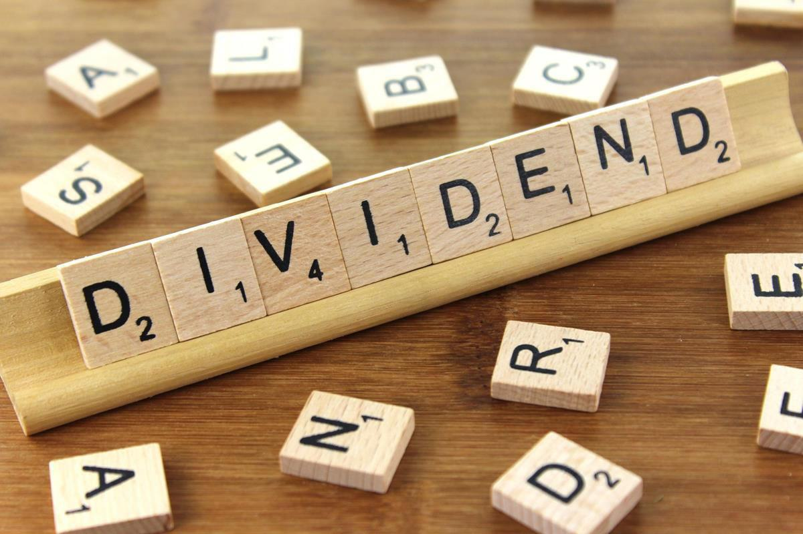

In the dynamic world of financial markets, investors are consistently looking for ways to maximize returns, minimize risk, and ensure a steady stream of income. Dividends play a crucial role in these investment strategies by providing shareholders with a share of a company’s earnings. Acting as a bridge between corporate profitability and investor rewards, dividends appeal to both income-focused and growth-oriented investors.

A dividend is a distribution of a portion of a company’s earnings to its shareholders, which can be in the form of cash payments or additional shares. This practice not only serves as a potential source of income but also acts as a signal of a company’s financial health and long-term viability. Historically, companies with a consistent track record of dividend payments are perceived as stable and reliable, attracting investors who prefer a buy-and-hold strategy.



The relationship between dividends, stock prices, and algorithmic trading marks a significant evolution in investment strategies. Stock prices often reflect investor sentiment towards dividends. Prices tend to rise prior to the ex-dividend date as investors purchase shares to qualify for upcoming payouts. Following the ex-dividend date, there is typically a price adjustment as the shares trade without the immediate benefit of the dividend.

Algorithmic trading represents an advanced approach in this context, employing data-driven models to make high-speed, precise trading decisions. By leveraging algorithms, investors can efficiently execute dividend-focused strategies, such as capturing dividends and identifying growth opportunities. As technology continues to advance, the landscape of dividend investing is increasingly shaped by algorithmic and artificial intelligence (AI) tools, which enhance forecasting accuracy and optimize portfolio performance. In this evolving environment, integrating dividends into a broader investment strategy presents numerous advantages, contributing significantly to income stability and growth potential.

## Table of Contents

## Understanding Dividends

Dividends are payments that corporations distribute to their shareholders, primarily sourced from the profits earned by the company. They represent a share of the company's earnings and are generally seen as a reward for investors providing capital to the firm. Dividends can be distributed in several forms, most commonly as cash, but also as additional shares in the company’s stock. While cash dividends provide immediate liquidity to shareholders, stock dividends can enhance the overall equity stake of the investor, potentially leading to capital appreciation if the company's stock price rises.

The issuance of dividends serves multiple key purposes in the financial ecosystem. Primarily, it is a signal of a company's financial health and stability. Regular and increasing dividend payments may indicate robust corporate earnings and a positive long-term outlook, suggesting to investors that the company is operating efficiently and generating consistent profits. This predictable income stream is particularly attractive to buy-and-hold investors, who prioritize long-term investment stability and capital preservation.

Moreover, dividends can influence investor behavior and company valuation in the financial markets. Companies with a strong track record of paying dividends are often viewed as lower risk, as they are perceived to have steady cash flows and prudent management practices. This perception can lead to a higher demand for the company’s stock, often resulting in increased stock prices. For investors seeking steady income or those nearing retirement, dividends offer an appealing investment option that can provide a form of passive income, supplementing other sources of retirement funds. 

The reliability of dividend payouts can often reflect a company's commitment to returning value to its shareholders, further enhancing its attractiveness to conservative investors who prioritize income generation over high-risk capital gains. Due to these considerations, dividends remain a pivotal aspect of investment strategies, influencing decisions both at the individual and institutional levels.

## Impact of Dividends on Stock Prices

Dividends can significantly influence stock prices due to their role in enhancing the investment's attractiveness. When a company announces a dividend, it sends a signal of financial health and profitability, which can increase investor interest. Typically, the announcement of a dividend prompts an upward trend in stock prices, especially as the ex-dividend date approaches. This phenomenon occurs because investors desire to own the stock before the ex-dividend date to secure the dividend payout themselves.

Mathematically, the behavior of stock prices around dividends can be explained through the concept of the ex-dividend date, a critical date in dividend processes. The ex-dividend date is the cutoff point for determining which investors are eligible to receive the dividend. To capture the dividend, investors must purchase the stock before this date. Hence, stock prices often experience a rise leading up to this date, known as the cum-dividend price. Let's denote:

- $P_{\text{cum}}$ as the price just before the ex-dividend date.
- $D$ as the dividend per share.

Immediately after the ex-dividend date, buyers of the stock are ineligible for the dividend. Consequently, this leads to a reduction in the stock price, which is expected to drop by approximately the dividend amount $D$. The post-ex-dividend stock price, $P_{\text{ex}}$, can be represented as:

$$
P_{\text{ex}} = P_{\text{cum}} - D
$$

This price drop reflects the adjustment for the dividend payout, creating a temporary decline in the stock's market price. While this price behavior is typically observed, other factors such as market conditions, investor sentiment, and broader economic indicators can also influence stock prices around dividend dates. Furthermore, the tax treatment of dividends may affect investor preferences and trading motivations, adding another layer of complexity to how dividends impact stock prices.

In summary, dividends contribute to stock market dynamics by influencing investor behavior around announcement periods and key dates like the ex-dividend date. Through these mechanisms, dividends serve as important elements in shaping stock valuations and investor strategies.

## Dividend Investing Strategies

Investors can employ a variety of dividend investment strategies to enhance their portfolios. Some of the most prevalent strategies include dividend capture, dividend growth investing, and targeting high-dividend yield stocks. Each approach has distinct characteristics, risks, and potential rewards based on the investor's objectives and market conditions.

**Dividend Capture Strategy**: This method focuses on purchasing shares before the ex-dividend date to receive the dividend and then selling them shortly afterward. Investors aim to benefit from the dividend itself while minimizing exposure to the broader market movements. The effectiveness of this strategy hinges on the stock's price behavior post-ex-dividend date and transaction costs. Algorithmic trading can optimize dividend capture by automating trades at precise timings, minimizing human error, and reducing latency in execution.

**Dividend Growth Investing**: This strategy targets companies with a strong history of increasing dividend payouts over time. Investors prioritize firms with sustainable and growing earnings, indicating potential for continued dividend growth. This method suits long-term investors seeking steady income and capital appreciation. Investors often use financial metrics such as the dividend payout ratio and dividend growth rate to evaluate potential investments:

$$
\text{Dividend Payout Ratio} = \frac{\text{Annual Dividends per Share}}{\text{Earnings per Share}}
$$

By analyzing these factors, investors can identify companies with stable dividend growth. Algorithmic trading can enhance this strategy by continuously monitoring financial indicators and market conditions, suggesting optimal buying and holding decisions.

**High-Dividend Yield Targeting**: Investors pursuing this strategy look for stocks with relatively high dividend yields. This approach can provide substantial income, especially in low-interest-rate environments. However, high dividend yields may signal financial distress if a company's share price is declining, potentially indicating unsustainable dividends. To assess opportunities, investors employ the dividend yield formula:

$$
\text{Dividend Yield} = \frac{\text{Annual Dividends per Share}}{\text{Price per Share}} \times 100\%
$$

Algorithmic models can screen for stocks that meet specific yield criteria, adjusting for market trends and risk factors.

Algorithmic trading significantly enhances these dividend strategies by leveraging data analysis and computational precision. Algorithms can process historical dividends, price trends, and macroeconomic indicators to identify trading opportunities that align with defined strategy parameters. This technology allows for rapid responses to market changes, optimizing entry and [exit](/wiki/exit-strategy) points with minimal delay.

In summary, dividend investing strategies offer varied paths to achieving financial goals, each with unique benefits and risks. Algorithmic trading acts as a complementary tool, refining strategy execution for improved outcomes in dividend-focused investments.

## Role of Algorithmic Trading

Algorithmic trading employs sophisticated algorithms to execute trades with remarkable speed and precision, taking advantage of minor market inefficiencies that human traders might miss. In the context of dividend investing, these algorithms play a crucial role by analyzing historical dividend distributions, market trends, and other financial data to predict future dividend payouts. This capability allows traders to make informed decisions about which stocks to purchase prior to the ex-dividend date, thereby optimizing the timing of their investments to capitalize on dividend distributions.

Algorithmic trading systems can process vast amounts of historical data to identify patterns and correlations that might indicate a potential increase or decrease in future dividends. For instance, [machine learning](/wiki/machine-learning) algorithms may be used to build predictive models that take into account previous dividend announcements, earnings reports, macroeconomic indicators, and even social sentiment to forecast upcoming dividend payments.

The automation inherent in [algorithmic trading](/wiki/algorithmic-trading) also enhances the efficiency of dividend capture strategies. The dividend capture strategy involves buying a stock just before the ex-dividend date and then selling it shortly after, thereby qualifying for the dividend payout while incurring minimal exposure to the stock's price movement. Given the rapid execution capability of algorithmic trading systems, they can implement these trades with minimal slippage and at optimal pricing, maximizing the potential return on investment.

Consider an example of a simple dividend capture algorithm:

```python
import yfinance as yf
import pandas as pd

# Define the symbol and period for the stock data
symbol = 'AAPL'
period = '1y'

# Fetch historical stock data
stock_data = yf.download(symbol, period=period)

# Identify ex-dividend dates and calculate the price change
ex_dividend_dates = stock_data[stock_data['Dividends'] > 0].index
price_changes = []

for date in ex_dividend_dates:
    pre_price = stock_data.loc[date - pd.Timedelta(days=1), 'Close']
    post_price = stock_data.loc[date + pd.Timedelta(days=1), 'Close']
    price_change = post_price - pre_price
    price_changes.append(price_change)

# Display the potential price changes around ex-dividend dates
print(price_changes)
```

In this example, the algorithm captures the stock price movement around ex-dividend dates, enabling traders to evaluate if the dividend capture approach could have yielded a favorable return.

Overall, the integration of algorithmic trading in dividend investing not only streamlines operational processes but also potentially increases the robustness and profitability of investment strategies. As technology evolves, these systems are likely to become even more adept at leveraging diverse data sources, ultimately enhancing their predictive power and strategic execution.

## Leveraging AI in Dividend Forecasting

Artificial intelligence (AI) enhances dividend forecasting by utilizing advanced techniques to process and analyze vast amounts of financial and market data. This capability significantly improves the precision of predicting future dividend growth rates, which in turn aids investors in making informed decisions. AI employs machine learning algorithms to identify patterns in historical data, assess company financials, and evaluate macroeconomic indicators that influence dividend policies.

Machine learning models, such as regression analysis, neural networks, and ensemble methods, are commonly applied in this context. These models can process diverse and complex datasets to discern trends and relationships that may not be immediately apparent through traditional analysis. For example, a [neural network](/wiki/neural-network) might use historical dividend data, earnings reports, interest rates, and economic growth figures to predict future dividend increases or decreases.

Consider a simplified linear regression model for predicting dividend growth:

$$
\text{Dividend Growth} = \beta_0 + \beta_1 \times \text{Net Income Growth} + \beta_2 \times \text{Cash Flow Stability} + \epsilon
$$

Here, $\beta_0$ denotes the intercept, $\beta_1$ and $\beta_2$ are coefficients for predictors like net income growth and cash flow stability, and $\epsilon$ represents the error term.

Despite its advantages, AI in dividend forecasting faces challenges such as data quality and model bias. Data quality issues arise when input data is incomplete, outdated, or inaccurately reported. Improving data collection methodologies and integrating real-time data feeds can mitigate these problems. Model bias, which occurs when a model's predictions systematically favor certain outcomes, requires careful attention during the training phase. This issue can be addressed by using well-balanced datasets and employing techniques like cross-validation to ensure robust model performance.

Continuous advancements in AI technology are making it possible to overcome these challenges. Techniques such as [deep learning](/wiki/deep-learning) and [reinforcement learning](/wiki/reinforcement-learning) are being explored to further refine dividend forecasts. Additionally, improvements in natural language processing (NLP) enable the analysis of unstructured data, such as earnings call transcripts, providing deeper insights into a company's future dividend policies.

As AI technology continues to evolve, its application in dividend forecasting will likely become even more sophisticated, offering investors enhanced tools for optimizing their dividend investment strategies.

## Conclusion

Incorporating dividends into a broader investment strategy offers multifaceted advantages, particularly in terms of income stability and growth potential. Dividends provide a consistent revenue stream that can cushion investors against market [volatility](/wiki/volatility-trading-strategies), contributing to a stable financial foundation. Furthermore, reinvesting dividends often leads to compounding returns, enhancing the growth potential of an investment portfolio.

Algorithmic and AI-driven trading strategies have become pivotal in optimizing returns from dividend investments. These advanced technologies allow investors to leverage historical data and predict future trends with greater accuracy. Through sophisticated models, algorithmic trading identifies ideal entry and exit points in the market, allowing investors to capitalize on short-term inefficiencies. For instance, algorithms can execute dividend capture strategies with precision, buying shares just before the ex-dividend date and selling them afterward to secure the dividend while minimizing holding time.

Moreover, AI-driven analytics provide a deeper understanding of dividend patterns and global market factors influencing dividend yields. AI algorithms analyze vast datasets to forecast potential dividend hikes or cuts, delivering insights that enhance decision-making processes. Challenges, such as ensuring data quality and mitigating model bias, are ever-present, but ongoing advancements in AI and machine learning aim to overcome these hurdles.

As financial technology continues to evolve, investors can increasingly rely on algorithmic and AI tools to enhance portfolio performance. These technologies not only streamline trading processes but also offer improved risk management and return optimization. The integration of AI and algorithmic trading into dividend strategies promises a future where investment decisions are not only more informed but also more profitable. Consequently, investors equipped with these tools are better positioned to achieve their financial objectives in an increasingly competitive market landscape.

## References & Further Reading

[1]: Bergstra, J., Bardenet, R., Bengio, Y., & Kégl, B. (2011). ["Algorithms for Hyper-Parameter Optimization."](https://papers.nips.cc/paper/4443-algorithms-for-hyper-parameter-optimization) Advances in Neural Information Processing Systems 24.

[2]: ["Advances in Financial Machine Learning"](https://www.amazon.com/Advances-Financial-Machine-Learning-Marcos/dp/1119482089) by Marcos Lopez de Prado

[3]: ["Evidence-Based Technical Analysis: Applying the Scientific Method and Statistical Inference to Trading Signals"](https://www.amazon.com/Evidence-Based-Technical-Analysis-Scientific-Statistical/dp/0470008741) by David Aronson

[4]: ["Machine Learning for Algorithmic Trading"](https://github.com/stefan-jansen/machine-learning-for-trading) by Stefan Jansen

[5]: ["Quantitative Trading: How to Build Your Own Algorithmic Trading Business"](https://www.amazon.com/Quantitative-Trading-Build-Algorithmic-Business/dp/1119800064) by Ernest P. Chan