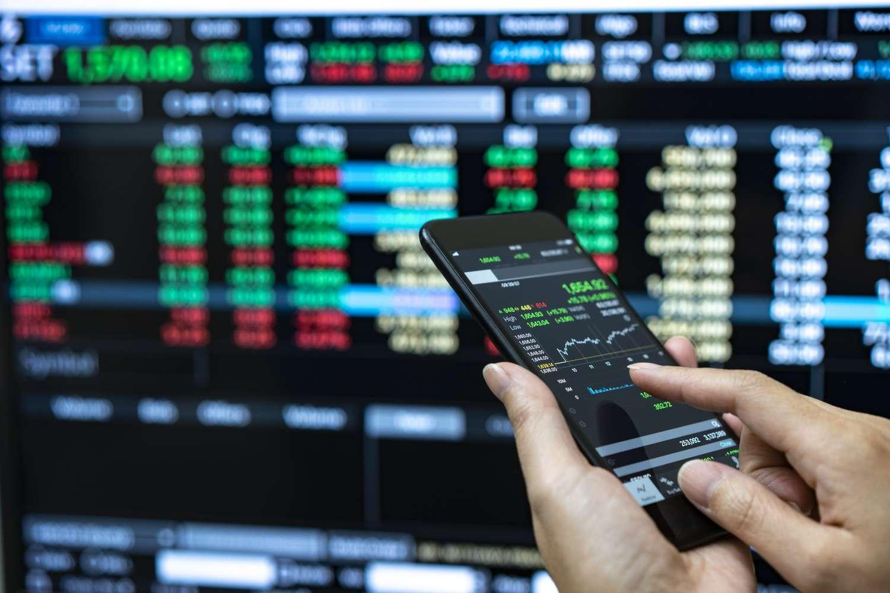

In today's financial landscape, technology has significantly transformed how we trade equities and foreign exchange (FX) markets. At the forefront of this transformation is algorithmic trading, often referred to as algo trading. This sophisticated approach utilizes computer programs to execute trades based on predefined strategies, eliminating human error and emotional biases from trading decisions. Algo trading is pivotal in enhancing the efficiency of trades and the execution of complex strategies, thereby offering substantial advantages over traditional methods.

Equities and the FX market are interconnected, with equities influencing currency valuations and market dynamics. In this context, understanding the role of algo trading becomes crucial as it not only enhances transaction execution but also aids in navigating the complex interplay between equities and the FX market.

This article aims to explore how equities impact the FX market and the growing importance of algorithmic trading in this sector. We will analyze the benefits, challenges, and the latest innovations in algo trading, providing valuable insights for investors looking to optimize their trading strategies. By examining how these elements interact, investors can gain a better understanding of market movements and the potential opportunities within the trading landscape.

Exploring these topics in depth can provide a comprehensive understanding of the financial markets' continuously evolving nature and the strategic role of algorithmic trading. Investing in the knowledge of how these technologies and market dynamics intersect can empower investors to make informed decisions and harness the full potential of modern trading methodologies.

## Table of Contents

## The Interconnection Between Equities and FX Markets

Equity markets significantly affect FX markets by serving as a mirror of underlying economic conditions. These markets offer critical insights into the economic health of a country, and this interrelationship can be observed through several key factors.

Firstly, multinational corporations that are publicly traded across national borders have a profound impact on currency demand and supply. For instance, when these corporations engage in international trade, they often require foreign currencies to conduct business operations in various countries. This leads to fluctuating demand and supply dynamics in the FX market, which can impact currency values. For example, an increase in exports by a large multinational firm may lead to an increased demand for the currency of that firm's home country, hence affecting its value.

Moreover, investment patterns in equities frequently reflect anticipations of currency strength or weakness, which in turn influence [FX](/wiki/fx-anomaly) market trends. Investors tend to shift capital into the equities of countries where they foresee a strengthening currency, aiming to capitalize on favorable exchange rate movements. Conversely, perceptions of a weakening currency might dissuade investment, contributing to shifts in FX market trends.

Analyzing the performance of equity markets can provide predictive insights into FX market movements. Equity indices, which aggregate the performance of stocks, often react to economic data releases and geopolitical developments that are also pertinent to FX markets. A bullish equity market might indicate investor confidence in economic stability and growth, potentially leading to an appreciation of that country's currency as foreign investments pour in.

The detailed reports available in equity markets can further enhance a trader’s understanding of currency fluctuation trends. Financial statements and earnings reports of publicly traded companies provide critical data points indicating the financial health of key sectors and industries. An upward trend in revenues and profitability could suggest a robust domestic economy, likely encouraging a stronger national currency. Conversely, negative earnings surprises or profit warnings could foreshadow economic issues, potentially influencing currency depreciation.

In summary, the interplay between equities and FX markets is complex and multifaceted, driven by the movement of capital across borders, investor sentiment regarding currency strength, and comprehensive market analysis. Understanding this interconnectedness is crucial for both equity and FX traders striving to make informed investment decisions.

## Understanding Algorithmic Trading

Algorithmic trading, often termed as algo trading, refers to the use of computer algorithms to execute trading orders. These algorithms are designed to perform a sequence of instructions based on predetermined criteria, such as timing, price, or quantity, without the need for human intervention. The primary aim of algo trading is to increase the speed and precision of trades, effectively removing the emotional bias that often clouds human judgment in trading decisions.

One of the core advantages of [algorithmic trading](/wiki/algorithmic-trading) is the enhancement of transaction speed and accuracy. Computers can process vast volumes of data and execute orders much faster than humans, enabling traders to take advantage of fleeting market opportunities. Additionally, algorithms can manage multiple trades across various markets and instruments simultaneously, optimizing the execution process.

Various strategies are employed in algorithmic trading, including trend-following, [arbitrage](/wiki/arbitrage), and market-making. Trend-following strategies capitalize on [momentum](/wiki/momentum) in the market, buying securities in an upward trend and selling in a downward trend. Arbitrage strategies exploit price discrepancies across different markets or instruments, aiming to make a profit from the price differential. Market-making involves providing [liquidity](/wiki/liquidity-risk-premium) by simultaneously offering to buy and sell a certain quantity of an asset, [earning](/wiki/earning-announcement) a profit from the spread between the bid and ask prices.

Backtesting is a crucial element of algorithmic trading. It involves testing the strategy on historical data to evaluate its potential effectiveness before applying it in live markets. This process helps traders understand the strengths and weaknesses of their strategies, allowing for fine-tuning and improvement. Moreover, scalability is a significant advantage of algorithmic trading, as algorithms can easily handle increased trading volumes without a corresponding rise in cost.

The deployment of algorithms allows for the automatic and swift handling of vast data volumes. Advanced algorithms can analyze market conditions, identify trading opportunities, and execute trades within milliseconds. This capability is invaluable in markets characterized by high [volatility](/wiki/volatility-trading-strategies) and liquidity, where rapid decision-making is essential.

In conclusion, algorithmic trading introduces a systematic approach to trading, leveraging technology to enhance trading efficiency and accuracy. By utilizing predefined strategies and performing automated trades, it allows traders to focus on strategy development and risk management, thereby optimizing their trading performance.

## Algorithmic Trading in the FX Market

Algorithmic trading has fundamentally transformed the foreign exchange (FX) market, becoming a predominant force driving trading activity. Its integration into the FX landscape results from its ability to enhance price discovery while reducing market impact and transaction costs. The use of computer algorithms to execute trades allows traders to handle complex trading scenarios with a precision that manual processes cannot achieve.

The FX market, with its around-the-clock operation, is particularly suited to algorithmic trading systems. Unlike equity markets, which have fixed trading sessions, the FX market operates continuously, providing a seamless platform for algorithms to function efficiently across different time zones. This continuous operation facilitates effective time arbitrage strategies and accommodates various trading styles, from high-frequency trading to long-term strategizing.

Algorithmic trading in FX typically involves sophisticated models that can parse vast amounts of market data in real-time, optimizing the timing and execution of trades. These algorithms contribute significantly to enhanced price discovery, where more accurate and timely information is used to ascertain the fair value of currency pairs. Moreover, they help to minimize the market impact by spreading out large trades, which would otherwise disrupt the market equilibrium.

Furthermore, traders leverage low-touch and high-touch execution models that algorithms provide. Low-touch trading involves minimal human intervention, automating simpler trades primarily intended for large volumes, whereas high-touch trading requires human oversight for complex trades that demand a strategic approach. The flexibility of shifting between these models gives traders the ability to execute trades more effectively based on their specific objectives and market conditions.

Advanced algorithms are deployed to analyze and execute these trading activities, often incorporating [machine learning](/wiki/machine-learning) and [artificial intelligence](/wiki/ai-artificial-intelligence) to enhance predictive capabilities. This enables them to conduct a thorough analysis of historical data patterns and adjust strategies dynamically to maximize returns from trading activities.

In this dynamic environment, the deployment of algorithmic systems ensures rapid processing capabilities, crucial for analyzing and reacting to news releases, economic data, and geopolitical events which can influence currency valuations. As a result, the FX market becomes more efficient, with tighter bid-ask spreads and enhanced liquidity, ultimately benefiting all market participants.

## Advantages and Risks of Algo Trading

Algorithmic trading offers numerous advantages that have made it a desirable method in modern financial markets. One of the primary benefits is speed. Algorithms can execute trades within milliseconds, far quicker than human execution, giving significant advantages in fast-moving markets. This speed ensures better pricing by leveraging the rapid acquisition and analysis of market data, thus facilitating immediate decision-making.

Efficiency is another notable advantage. Algorithms can handle a multitude of orders effortlessly, ensuring optimal execution without the constraints associated with manual trading. They enhance liquidity by continuously scanning for potential trading opportunities across various markets and time zones, thus enabling round-the-clock trading and maximizing the utilization of market opportunities. Moreover, algo trading eliminates emotional bias from trading decisions, an aspect that often hampers manual trading. By adhering strictly to predetermined strategies, algorithms foster consistent decision-making devoid of psychological influences.

Additionally, algorithmic trading promotes improved [backtesting](/wiki/backtesting) of strategies. Traders can evaluate historical data to test their algorithm's performance, allowing for strategy refinement before real capital deployment. This capability significantly reduces the risks associated with speculative trading activities.

Despite these advantages, algorithmic trading is not without its risks. Technical failures represent a significant concern. The reliance on sophisticated trading algorithms means that any technical glitch could lead to erroneous trades, potentially causing substantial financial losses. Overfitting is another risk, where a trading strategy is too closely tailored to past data, potentially resulting in decreased effectiveness under current or future market conditions.

The potential market impact of algo trading cannot be overstated. High-frequency trading ([HFT](/wiki/high-frequency-trading-strategies)), a subset of algorithmic trading, can lead to liquidity fragmentation during periods of high volatility. This fragmentation may result in unusual market behavior, such as "flash crashes," where prices plunge rapidly within a short period, only to recover quickly. Such events underscore the importance of understanding the intricate balance of high-frequency trades to minimize adverse effects on market stability.

Mitigating these risks necessitates robust risk management strategies. Traders and financial institutions must implement fail-safes and conduct thorough testing to ensure algorithm reliability under various market conditions. Monitoring and adapting strategies in real-time can also help manage risks associated with unexpected market developments.

In conclusion, while algorithmic trading presents substantial advantages in speed, efficiency, and error reduction, awareness and management of its inherent risks are crucial for long-term success in financial markets.

## Future Trends and Innovations

The continuous development of advanced algorithms is reshaping the financial trading landscape, offering new avenues and opportunities for enhancing efficiency and precision in the equities and foreign exchange (FX) markets. Machine learning and artificial intelligence (AI) are becoming integral components of algorithmic trading strategies. These technologies drive data analysis, allowing traders to identify patterns and predict market movements with greater accuracy. Machine learning algorithms continually refine themselves by learning from historical data, adapting to changing market conditions, and enhancing decision-making processes in real time.

Moreover, customizable algorithms are becoming more prevalent, catering to a diverse range of trading styles and objectives. Traders can now tailor algorithms to specific strategies, whether they are focused on arbitrage, trend-following, or market-making. This customization enables traders to address unique market conditions and investor goals, thereby optimizing trading outcomes.

A notable trend is the expansion of algorithmic trading into emerging markets. As financial markets in these regions become more integrated into the global economy, the adoption of algorithmic trading systems is accelerating. This trend allows for increased market participation and liquidity, providing both local and international investors with new opportunities. Emerging markets present unique challenges and opportunities, requiring algorithms to adapt to different regulatory environments and market structures.

Financial institutions are also concentrating on enhancing their algorithmic offerings to meet the growing demands of clients. By expanding their range of algorithmic services, these institutions aim to provide more sophisticated tools for risk management, portfolio optimization, and performance analysis. This focus on innovation is driven by clients seeking to leverage technology for competitive advantages in trading.

The continuous evolution of algorithms promises to further transform trading strategies by integrating new techniques and expanding into new markets. As the trading environment becomes increasingly complex, staying updated with these technological advancements is crucial for investors seeking to harness the full potential of algorithmic trading.

## Conclusion

The combination of equities and foreign exchange (FX) markets, when influenced by algorithmic trading, presents a compelling strategy for investors. Equities offer valuable insights into macroeconomic conditions and can significantly influence currency movements. For instance, fluctuations in stock markets often reflect investor sentiment regarding a country's economic health, which can lead to shifts in currency demand and supply. Meanwhile, algorithmic trading maximizes trading efficiency by leveraging computer-programmed strategies to execute trades with speed and precision, minimizing human error.

Staying informed about the latest developments in trading technologies and market dynamics is crucial for navigating these complex markets effectively. The rapid evolution of trading algorithms, especially those incorporating machine learning and artificial intelligence, necessitates continuous learning and adaptation. Investors who keep abreast of these trends can better position themselves to capitalize on market opportunities and mitigate potential risks.

However, in leveraging algorithmic trading, investors must carefully balance its advantages against potential risks, such as technical failures or overfitting strategies that may not perform well in dynamic market conditions. This balance is pivotal for integrating algo trading into broader investment strategies successfully. 

Ultimately, the success of these trading strategies requires adaptability and the continuous refinement of algorithms. Markets are inherently unpredictable, making it essential for traders to adjust their algorithms in response to market changes. A successful trading strategy blends robust market analysis derived from equities with the speed and precision of algorithmic trading, ensuring a dynamic and responsive approach to investing. By refining algorithms to adapt to ever-changing market conditions, investors can both optimize returns and sustain a competitive edge in the financial landscape.

## References & Further Reading

[1]: ["Advances in Financial Machine Learning"](https://www.amazon.com/Advances-Financial-Machine-Learning-Marcos/dp/1119482089) by Marcos Lopez de Prado

[2]: ["Machine Learning for Algorithmic Trading"](https://www.amazon.com/Machine-Learning-Algorithmic-Trading-alternative/dp/1839217715) by Stefan Jansen

[3]: ["Quantitative Trading: How to Build Your Own Algorithmic Trading Business"](https://github.com/LucindaYa/quant-resources/blob/master/Quantitative%20Trading%20How%20to%20Build%20Your%20Own%20Algorithmic%20Trading%20Business.pdf) by Ernest P. Chan

[4]: [Bergstra, J., Bardenet, R., Bengio, Y., & Kégl, B. (2011). "Algorithms for Hyper-Parameter Optimization."](https://dl.acm.org/doi/10.5555/2986459.2986743) Advances in Neural Information Processing Systems 24.

[5]: ["Evidence-Based Technical Analysis: Applying the Scientific Method and Statistical Inference to Trading Signals"](https://www.amazon.com/Evidence-Based-Technical-Analysis-Scientific-Statistical/dp/0470008741) by David Aronson