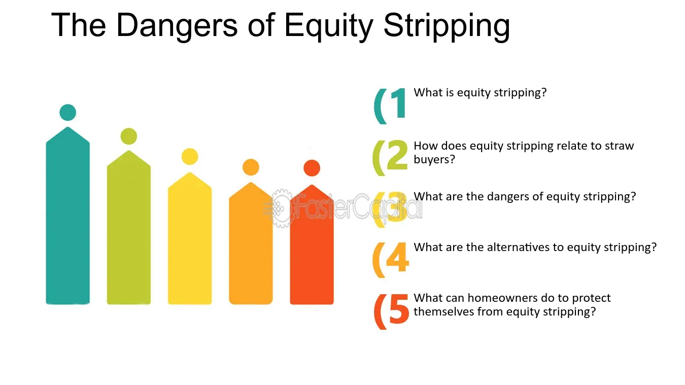

## Table of Contents

## What is equity stripping?

Equity stripping is a way to protect your home from being taken if you owe money. It works by making it look like your home is worth less than it really is. You do this by taking out loans against your home and using the money to pay off other debts or buy things that can't be taken away, like a car.

This method can be helpful if you are worried about someone taking your home because of money you owe. But, it can also be risky. If you don't manage the loans well, you might end up losing your home anyway. It's important to think carefully and maybe talk to a financial advisor before deciding to use equity stripping.

## How does equity stripping work?

Equity stripping works by reducing the amount of equity, or ownership value, you have in your home. You do this by taking out loans against your home's value. The money from these loans is then used to pay off other debts or to buy things that can't be easily taken away, like a car or essential home improvements. By doing this, you make your home look less valuable to creditors because there's less equity left in it. If someone tries to take your home because you owe them money, they might find it's not worth as much as they thought.

This method can be a way to protect your home from being seized, but it comes with risks. If you don't keep up with the payments on the new loans, you could still lose your home. Also, using up all your home's equity means you won't have that money available for other needs in the future. It's a strategy that needs careful thought and planning. Talking to a financial advisor can help you understand if equity stripping is a good choice for your situation.

## What are the common methods used in equity stripping?

Equity stripping involves taking out loans against your home to reduce its equity. One common method is taking out a home equity loan or a home equity line of credit (HELOC). You use the money from these loans to pay off other debts, like credit cards or personal loans. By doing this, you lower the amount of equity in your home, making it less attractive to creditors who might want to seize it.

Another method is to use the money from these loans to buy assets that are harder for creditors to take away. For example, you might use the loan money to buy a car or make essential home improvements. These assets can't be easily seized, which helps protect your overall financial situation. However, this strategy carries risks. If you can't keep up with the payments on the new loans, you could still lose your home. It's important to think carefully and maybe talk to a financial advisor before using equity stripping.

## Who typically engages in equity stripping?

People who often use equity stripping are those who are worried about losing their homes because they owe money. They might be facing lawsuits or have a lot of debt. By taking out loans against their home's value, they can pay off these debts and make their home look less valuable to creditors. This way, if someone tries to take their home, it won't be worth as much to the creditor.

Equity stripping can be a helpful strategy for people in tough financial spots, but it's not without risks. If someone doesn't manage the new loans well, they could still lose their home. It's a method that needs careful planning and understanding. Talking to a financial advisor can help someone decide if equity stripping is the right choice for them.

## What are the immediate effects of equity stripping on a property?

When you use equity stripping on your home, it immediately reduces the amount of money you actually own in it. This happens because you take out loans against your home's value. The money from these loans is used to pay off other debts or to buy things that are hard for others to take away, like a car. By doing this, you make your home look less valuable to people who might want to take it because you owe them money.

This can help protect your home from being taken, but it also means you have less money tied up in your home. If you can't keep up with the payments on these new loans, you could still lose your home. It's important to think carefully about this because using up all your home's equity means you won't have that money for other needs later on. Talking to someone who knows about money can help you decide if this is a good idea for you.

## How does equity stripping impact creditors?

When someone uses equity stripping, it makes their home look less valuable to creditors. This happens because the person takes out loans against their home and uses the money to pay off other debts or buy things that can't be easily taken away. By doing this, the home has less equity, or money tied up in it. This makes it less attractive for creditors who might want to take the home to get back the money they are owed.

Creditors can find it harder to recover what they are owed if the home's equity is low. If they try to take the home, they might find it's not worth as much as they thought. This can make it less likely for them to go after the home because it won't help them get their money back as much. However, if the person who used equity stripping can't keep up with the new loan payments, the creditors might still be able to take the home.

## Can equity stripping be considered fraudulent, and under what circumstances?

Equity stripping can be considered fraudulent if it's done to trick or harm others. For example, if someone takes out loans against their home and uses the money to hide assets from creditors on purpose, that could be seen as fraud. This is because they are trying to make their home look less valuable so creditors can't get their money back. If the person knows they can't pay back the new loans and are just trying to delay or avoid paying what they owe, this could also be seen as fraudulent behavior.

However, not all equity stripping is fraud. If someone is just trying to protect their home because they are in a tough financial spot and they plan to pay back the loans, it might not be considered fraudulent. The key is the person's intent and whether they are trying to deceive or harm others. If they are honest about their situation and are trying to manage their debts in a responsible way, equity stripping might be seen as a legitimate financial strategy.

## What legal protections exist for creditors against equity stripping?

Creditors have some legal protections against equity stripping. One main protection is the law against fraudulent transfers. If someone uses equity stripping to hide money from creditors on purpose, this can be seen as a fraudulent transfer. Creditors can go to court to challenge these actions and try to get the money back. Courts can undo these transfers if they find that the person did it to avoid paying what they owe.

Another protection for creditors is the right to put a lien on the property. A lien is a legal claim on the home that says the creditor has a right to some of the money if the home is sold. If someone tries to strip the equity from their home, the creditor can still use the lien to get paid from any money left after the home is sold. This makes it harder for someone to use equity stripping to avoid paying their debts.

## How can creditors identify potential equity stripping?

Creditors can identify potential equity stripping by looking at the person's financial actions. If someone suddenly takes out big loans against their home and pays off a lot of other debts or buys things that can't be easily taken away, like a car, this might be a sign of equity stripping. Creditors should also look at the timing of these actions. If the person does this right before they know they will be sued or have to pay a lot of money, it could mean they are trying to hide money from creditors.

Another way creditors can spot equity stripping is by checking the person's loan documents and credit reports. If the person has taken out many loans against their home in a short time, and the money from these loans is used in ways that make the home look less valuable, this is a red flag. Creditors should also talk to the person and ask about their financial plans. If the person seems to be avoiding questions or acting in a way that suggests they are trying to trick creditors, this might mean they are using equity stripping to avoid paying what they owe.

## What are the long-term financial implications of equity stripping for creditors?

Equity stripping can have big effects on creditors over time. If someone uses equity stripping to make their home look less valuable, it can be harder for creditors to get their money back. When creditors try to take the home to pay off what they are owed, they might find it's not worth as much as they thought. This means they might not get all the money they are owed, or it might take longer to get it. This can hurt the creditor's business because they need to get their money back to keep going.

In the long run, creditors might have to spend more time and money trying to get their money back. They might need to go to court to challenge the equity stripping and try to undo it. This can be expensive and take a lot of time. If creditors keep facing equity stripping, they might have to change how they lend money or even raise their prices to cover these extra costs. This can make it harder for them to do business and help people who need loans.

## What strategies can creditors employ to mitigate the risks of equity stripping?

Creditors can protect themselves from equity stripping by being careful about who they lend money to. They should check a person's financial history and see if they have a lot of debt or if they have taken out big loans against their home before. If someone seems like they might use equity stripping, creditors can ask for more money upfront or set up the loan so it's harder to use the money to hide assets. They can also keep a close eye on the person's financial actions and ask questions if they see anything that looks like equity stripping.

Another way creditors can lower the risks of equity stripping is by putting a lien on the home. A lien is like a claim that says the creditor gets some of the money if the home is sold. This makes it harder for someone to use equity stripping to avoid paying their debts. If creditors think someone might be trying to trick them, they can go to court and ask to undo the equity stripping. This can help them get their money back, but it might take time and cost money. By being careful and using these strategies, creditors can better protect themselves from the risks of equity stripping.

## How have recent legal cases influenced the approach to equity stripping and creditor rights?

Recent legal cases have changed how people think about equity stripping and what rights creditors have. Courts have looked at cases where people used equity stripping to hide money from creditors. They decided that if someone does this on purpose to avoid paying what they owe, it can be seen as fraud. This means creditors can go to court and ask to undo the equity stripping. They can try to get their money back, which makes it harder for people to use equity stripping to trick creditors.

Because of these cases, creditors are now more careful about who they lend money to. They check people's financial history more closely to see if they might use equity stripping. Creditors also use things like liens on homes to protect themselves. A lien is like a claim that says the creditor gets some of the money if the home is sold. This makes it harder for someone to use equity stripping to avoid paying their debts. These changes help creditors feel safer when they lend money, but it also means people need to be more careful about how they manage their finances.

## References & Further Reading

1: Adkisson, J., & Riser, C. "Asset Protection: Concepts & Strategies for Protecting Your Wealth." This comprehensive guide provides insights into the mechanisms and strategies used to shield assets from potential creditors, highlighting legal frameworks and ethical considerations essential for responsible asset protection.

2: Bergstra, J., et al. "Algorithms for Hyper-Parameter Optimization." This paper presents advanced algorithms for optimizing hyper-parameters in machine learning models, showcasing techniques that enhance the performance of algorithmic trading systems through efficient parameter tuning.

3: Lopez de Prado, M. "Advances in Financial Machine Learning." This book explores cutting-edge techniques in financial machine learning, offering practical guidance on implementing sophisticated algorithms that improve decision-making processes in asset management and algorithmic trading.

4: Chan, E. P. "Quantitative Trading: How to Build Your Own Algorithmic Trading Business." This resource provides a step-by-step approach to designing and implementing algorithmic trading systems, emphasizing the integration of data-driven strategies for improved financial outcomes.

5: Jansen, S. "Machine Learning for Algorithmic Trading." This book explains the application of machine learning techniques in the development of trading algorithms, focusing on predictive analytics to identify profitable trading opportunities and optimize investment portfolios.

