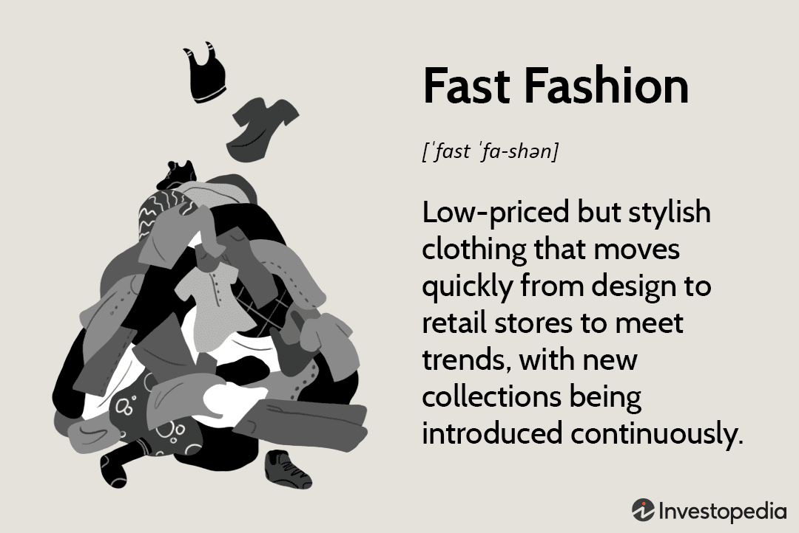

The retail manufacturing industry comprises the activities and processes involved in producing consumer goods for direct sale to the end-user. It is a critical component of the modern economy, serving as a bridge between raw material suppliers and consumers. This sector is characterized by its broad spectrum of products, ranging from clothing and electronics to food and household items, reflecting the diverse needs and preferences of society. As consumer demand continuously evolves, the retail manufacturing industry adapts by leveraging innovation and technology to enhance efficiency, quality, and accessibility, contributing significantly to global economic output and employment.

Fast fashion, a pivotal concept in contemporary retail trends, represents a business model that emphasizes rapid production and distribution of fashion items in response to shifting styles and trends. Characterized by its quick turnaround times, fast fashion enables consumers to access the latest styles at affordable prices. This model has reshaped the global fashion industry, influencing retail trends by prioritizing speed and cost-effectiveness over traditional fashion cycles. However, the fast fashion industry faces criticism for its environmental and ethical implications, including significant waste generation, resource consumption, and labor concerns.



Algorithmic trading, or algo trading, refers to the use of computer algorithms to automate trading decisions in financial markets. These algorithms can analyze vast amounts of data at unimaginable speeds, making trades based on predetermined criteria without human intervention. This technology has dramatically transformed market dynamics by increasing trading efficiency, liquidity, and precision. In retail markets, algo trading influences stock valuations and investment flows by quickly responding to market patterns and economic signals, thereby impacting the financial aspect of retail businesses.

The interconnectedness between the retail manufacturing industry, fast fashion, and algorithmic trading highlights the complexities of modern market economies. Fast fashion drives changes in production processes and consumer expectations, while algo trading affects market stability and company valuations. The interaction between these sectors presents unique challenges and opportunities, emphasizing the need for stakeholders to understand their synergies and conflicts. By analyzing the convergence of fast fashion and algo trading, this article seeks to offer insights into the evolving dynamics within retail manufacturing.

Understanding the interaction between fast fashion and algorithmic trading within retail manufacturing is essential for navigating the current economic landscape. These sectors collectively shape consumer experiences and market performance, urging businesses to innovate and adapt rapidly. By exploring their intersection, stakeholders can better grasp the opportunities for strategic growth and sustainable practices, ensuring continued relevance in a competitive and fast-paced marketplace.

## Table of Contents

## Overview of the Retail Manufacturing Industry

The retail manufacturing industry is a dynamic sector at the heart of the global economy, involving the production of goods for direct consumption. Key players in this industry range from established multinationals like Nike, H&M, and Zara, to emerging brands leveraging e-commerce and digital platforms for market entry. The industry serves as a crucial component of the supply chain, transforming raw materials into finished products ready for retail distribution. This transformation relies heavily on efficient manufacturing processes and logistics networks to meet consumer demand promptly.

Technology has played a transformational role in the retail manufacturing industry. Automation and robotics have been integrated into production lines to enhance efficiency and precision while reducing labor costs. Technologies like Artificial Intelligence (AI) and the Internet of Things (IoT) are increasingly deployed to optimize operations. AI is used for predictive maintenance and quality control, while IoT devices enable real-time data collection and monitoring of manufacturing processes. These technological interventions have significantly reduced production times and costs, allowing for more agile manufacturing operations.

Despite these advancements, the industry faces several challenges. Sustainability is a prominent concern, as traditional manufacturing processes often involve significant environmental impacts, including high energy consumption and waste generation. There is an increasing demand for eco-friendly practices, prompting companies to innovate with sustainable materials and production techniques. Supply chain management is another critical challenge, exacerbated by global events such as the COVID-19 pandemic, which highlighted vulnerabilities in reliance on global suppliers and just-in-time inventory systems. Companies are now seeking resilient supply chain strategies, including diversifying supplier bases and adopting digital supply chain solutions.

Innovations are continuously revolutionizing manufacturing processes within retail. Additive manufacturing, or 3D printing, is beginning to play a role in prototyping and small-batch production, offering customization options and reducing material waste. Advanced data analytics enables precise demand forecasting, allowing manufacturers to align production schedules with consumer demand trends effectively. Additionally, blockchain technology is being explored for increased transparency and traceability in supply chains, addressing consumer demand for ethically produced goods.

The industry must adapt to changing consumer behaviors and preferences, driven by digitalization and a shift towards online shopping. Consumers today demand personalized products and experiences, pushing manufacturers to adopt flexible production techniques. The rise of sustainable consumerism has also prompted retailers to prioritize ethical production processes, further influencing manufacturing practices. Companies are increasingly engaging directly with consumers through digital platforms to anticipate preferences and adjust their manufacturing strategies accordingly.

Overall, the retail manufacturing industry is undergoing significant transformation, driven by technological advancements and evolving consumer expectations. The sector continues to seek innovative approaches to maintain competitiveness while addressing sustainability and supply chain challenges.

## Fast Fashion: Catalyzing Change in Retail Manufacturing

Fast fashion is a segment of the retail manufacturing industry characterized by the rapid production and distribution of clothing collections. This business model emphasizes speed, affordability, and responsiveness to emerging trends, enabling retailers to swiftly move designs from the runway to stores. Fast fashion leverages a vertical integration strategy, allowing companies to compress the conventional design-to-retail cycle, typically spanning several months, into a matter of weeks or even days. Notable companies operating under this model include Zara, H&M, and Forever 21, which have optimized their supply chains to prioritize efficiency and agility [1].

The acceleration of production cycles in fast fashion significantly impacts manufacturing timelines. By adopting just-in-time production techniques and utilizing data-driven decision-making processes, retailers can minimize lead times and cost barriers. This model excels in capitalizing on new consumer trends, facilitating frequent turnover of inventory that aligns with current fashion demands. The outcome is a perpetual refreshment of merchandise, maintaining consistent customer engagement and driving repeat purchases.

However, the fast fashion model raises environmental and ethical concerns. The intensive resource utilization involved in rapid production cycles contributes to significant environmental degradation. For example, the textile industry is one of the largest contributors to water pollution, with massive volumes of chemical waste discharged into ecosystems [2]. Moreover, the demand for quick, low-cost production often results in labor practices that raise ethical questions, including substandard working conditions and fair wage violations within supplier factories [3].

Economically, fast fashion provides both benefits and drawbacks for retail manufacturers. On the positive side, it boosts sales [volume](/wiki/volume-trading-strategy) and ensures high inventory turnover, resulting in increased revenue streams. The model enables retailers to capture market share quickly by reacting to fashion trends and consumer preferences. Nonetheless, these benefits may be offset by potential drawbacks such as market saturation, decreasing brand loyalty due to constant product cycling, and the inherent instability in over-reliance on trend [volatility](/wiki/volatility-trading-strategies).

To address growing consumer awareness regarding sustainability, retailers are increasingly adapting by implementing more sustainable practices in fast fashion. This includes adopting eco-friendly materials, reducing waste through recycling programs and second-hand markets, and enhancing supply chain transparency to ensure ethical sourcing. Innovation in sustainable manufacturing technologies, such as 3D knitting and digital textile printing, further supports retailers' efforts to reduce their ecological footprint [4]. Additionally, some brands are beginning to explore circular fashion systems, encouraging garment reuse, repair, and recycling to extend product life cycles.

In conclusion, while fast fashion catalyzes change in retail manufacturing by driving production efficiency and responsiveness to trends, it simultaneously challenges the industry to reconcile economic growth with environmental and ethical responsibilities. Moving forward, retailers must balance the pressures of rapid fashion cycles with the imperatives of sustainable and ethical production.

References:
1. Hauge, A. (2021). Fast Fashion: Business Model Overview. Journal of Retailing and Consumer Services.
2. Greenpeace International. (2011). 'Dirty Laundry: Unravelling the Corporate Connections to Toxic Water Pollution in China.'
3. Clean Clothes Campaign. (2020). "Tailored Wages 2019: The State of Pay in the Global Garment Industry."
4. Ellen MacArthur Foundation. (2017). 'A New Textiles Economy: Redesigning Fashion's Future.'

## Algorithmic Trading in the Retail Context

Algorithmic trading, often referred to as algo trading, involves the use of computer algorithms to execute trading orders based on predefined conditions, such as timing, price, or quantity. These algorithms can analyze multiple markets and securities simultaneously, making split-second decisions that are beyond human capabilities. In financial markets, this approach allows traders to optimize their strategies by identifying price patterns, predicting market trends, and executing trades with precision and speed. Algorithms operate on a set of rules derived from quantitative analysis, which may include historical data, statistical models, and [machine learning](/wiki/machine-learning) techniques.

In the context of retail stock markets, [algorithmic trading](/wiki/algorithmic-trading) technologies are increasingly applied to manage and execute trades for retail investors. Platforms and brokers offer retail clients access to algo trading tools and APIs that automate trading strategies. These technologies have democratized access to advanced trading strategies previously available only to institutional investors. Algorithms can automatically monitor and act upon real-time data events, allowing retail traders to implement strategies such as [market making](/wiki/market-making), [arbitrage](/wiki/arbitrage), and [trend following](/wiki/trend-following) without constant human oversight.

Algo trading significantly influences retail company valuations and investment flows by enabling traders to respond rapidly to market news and pricing anomalies. High-frequency trading ([HFT](/wiki/high-frequency-trading-strategies)), a subset of algorithmic trading, can affect stock prices through rapid buying and selling actions. This market activity often increases [liquidity](/wiki/liquidity-risk-premium), which can narrow bid-ask spreads, providing potential cost savings for investors. However, it can also lead to increased volatility, as rapid trades can amplify price movements in response to market stimuli. Moreover, algorithms can contribute to price discovery, helping align stock prices with their fair market value more efficiently.

The benefits of algo trading for retail businesses include enhanced trading efficiency, improved liquidity, and reduced transaction costs. Algorithms execute trades quickly and at optimal prices, minimizing market impact and the potential for human error. They also enable scalability, allowing traders to manage trades across multiple stocks and markets concurrently. However, the risks include susceptibility to technical failures, such as software bugs or network outages, which could result in significant financial losses. There is also the danger of amplifying systemic risks during market anomalies, as evidenced in events like the Flash Crash of 2010.

Integrating algo trading technologies into retail market strategies presents various opportunities. Companies can leverage big data analytics to refine their trading models, using inputs from social media, economic indicators, and consumer behavior trends. Innovations in machine learning and [artificial intelligence](/wiki/ai-artificial-intelligence) could further enhance predictive capabilities, allowing traders to anticipate shifts in supply and demand. Retail businesses can develop custom trading algorithms in Python, using libraries such as Pandas for data manipulation, NumPy for numerical calculations, and Scikit-learn for machine learning.

```python
import pandas as pd
import numpy as np
from sklearn.linear_model import LinearRegression

# Example of using linear regression for predicting stock price movements
def predict_stock_movement(data):
    # Assume data is a Pandas DataFrame with columns 'Time', 'Price', 'Volume'
    X = data[['Time', 'Volume']]
    y = data['Price']

    model = LinearRegression()
    model.fit(X, y)

    predictions = model.predict(X)
    return predictions

# Sample usage
# stock_data = pd.read_csv('stock_data.csv') # Load your market data
# predictions = predict_stock_movement(stock_data)
```

As markets become increasingly interconnected, the integration of algo trading into retail strategies can facilitate more informed decision-making and advanced risk management techniques. By harnessing the power of data and technology, retail businesses can not only enhance their trading strategies but also navigate the complexities of modern financial markets more effectively.

## Impact of Fast Fashion and Algo Trading on Retail Manufacturing

Fast fashion has significantly altered market dynamics within the retail manufacturing industry by accelerating production cycles, reducing the time from design to shelf, and demanding quick adaptability from manufacturers. This model saturates markets with trendy, affordable apparel that drives high consumer turnover rates. Consequently, retail manufacturers must agilely respond to ever-shorter product life cycles and fluctuating consumer demands, creating a challenging environment that pressures supply chains and manufacturing processes.

Algorithmic trading (algo trading) plays a critical role in predicting fashion trends and evaluating stock performance. By utilizing large datasets and machine learning algorithms, traders can identify emerging fashion trends, consumer preferences, and even predict market reactions to new collections. This predictive capability assists retail companies and investors in making informed decisions about stocking, inventory management, and investment opportunities. Predictive modeling can influence decisions related to fabric procurement, production scheduling, and marketing efforts, thereby impacting the entire manufacturing pipeline.

Case studies illuminate instances where fast fashion and algo trading intersect in retail decisions. For example, Zara's integration of real-time data analytics to optimize inventory and manage supply chains demonstrates the symbiotic relationship between swift fashion cycles and data-driven decision-making in retail environments. Similarly, some hedge funds use algo trading systems to analyze social media trends and sentiment analysis, aligning their investment strategies based on forecasted fashion trends. 

The potential synergies between fast fashion and algo trading lie in the shared emphasis on real-time data utilization and rapid response mechanisms. Integration of automated trading systems and advanced analytics enables retail manufacturers to synchronize production with real-time demand forecasting, resulting in optimized stock levels and reduced waste. However, conflicts may arise due to the inherent volatility of fashion trends and the ethically contentious practices linked to fast fashion, such as overproduction and environmental degradation.

To redefine strategic approaches within this context, stakeholders in retail manufacturing must leverage the predictive analytics capabilities of algo trading while addressing the demand for sustainable fashion practices. This can be achieved by investing in technologies that enhance supply chain transparency, streamline production processes, and reduce environmental impacts. Additionally, aligning retail strategies with ethical considerations and consumer preferences for sustainability can foster innovation and competitiveness. The integration of fast fashion's dynamic adaptability with the analytical prowess of algo trading marks a transformative approach to evolving retail manufacturing towards a more responsive and responsible future.

## Future Outlook: Integration and Innovation

The future of retail manufacturing is poised for significant transformation as fast fashion and algorithmic trading continue to assert their influence. As these sectors evolve, they bring a wave of technological advancements set to redefine traditional processes in profound ways.

Technological advancements such as artificial intelligence (AI) and machine learning (ML) algorithms are expected to revolutionize the retail manufacturing industry. AI-driven analytics can improve demand forecasting, allowing manufacturers to optimize their inventory levels and production schedules. This computational power can also identify emerging fashion trends by analyzing vast datasets from social media, online sales, and consumer feedback. Algorithmic trading, which efficiently processes financial data to identify trends and patterns, could be adapted to predict fashion trends, giving retailers a competitive edge in a rapidly changing market.

The potential for collaboration between fashion designers and technology innovators is expected to grow. Designers armed with data analytics tools can better understand consumer preferences, enabling them to create lines that resonate more effectively with their target markets. This collaboration may generate a hybrid of quick-response manufacturing and design precision, reducing lead times and waste.

Consumer demand for transparency and ethical production is driving the adoption of blockchain technology in the retail manufacturing sector. Blockchain provides a decentralized ledger that ensures products can be traced from origin to completion, offering consumers visibility into labor practices and environmental impact. This transparency fosters greater trust and aligns with the growing consumer preference for sustainable and ethically sourced products.

The integration of these technological advancements can significantly enhance sustainable retail practices. Fast fashion's traditional model, characterized by rapid production with low-cost labor, faces increasing scrutiny for its environmental and social impacts. By employing data-driven solutions and innovative technologies, retailers can improve their operational efficiency, reduce waste, and meet sustainability goals. For example, 3D printing and automated manufacturing can minimize excess material usage and energy consumption, contributing to a more sustainable production cycle.

In conclusion, the confluence of fast fashion and algorithmic trading presents both challenges and opportunities for the retail manufacturing industry. The continued evolution of technology will likely usher in an era of increased efficiency, sustainability, and consumer-centric development. As these trends unfold, stakeholders must remain agile and open to innovation to successfully navigate the future landscape of retail manufacturing.

## Conclusion

The interplay between fast fashion and algorithmic trading within retail manufacturing reveals a dynamic landscape characterized by rapid change and technological innovation. Fast fashion has dramatically reshaped retail manufacturing, emphasizing speed and cost-effectiveness, but also raising significant ethical and environmental concerns. Understanding these dynamics is crucial as the industry seeks to balance consumer demand with sustainable practices.

Algorithmic trading, traditionally associated with financial markets, offers new perspectives for retail. Its application in predicting stock trends and valuation, coupled with its potential integration into retail strategies, underscores the synergy between finance and fashion. This interaction promotes innovative approaches that could redefine retail strategies.

The convergence of fast fashion and algorithmic trading presents opportunities for enhancing efficiency and competitiveness. Stakeholders must remain proactive in adapting to evolving market conditions. As both sectors continue to influence retail manufacturing, embracing technological advancements becomes essential for driving positive change.

Ongoing research and monitoring of trends are critical. By staying informed and agile, businesses can not only navigate challenges but also capitalize on emerging opportunities. This strategic foresight will be vital for fostering an industry that aligns with modern consumer expectations and ethical standards, paving the way for a sustainable future in retail manufacturing.

## References & Further Reading

[1]: Cline, E. L. (2012). ["Overdressed: The Shockingly High Cost of Cheap Fashion."](https://books.google.com/books/about/Overdressed.html?id=G_NvDwAAQBAJ) Portfolio Hardcover.

[2]: Fletcher, K. (2014). ["Sustainable Fashion and Textiles: Design Journeys."](https://katefletcher.com/publications/books/sustainable-fashion-and-textiles-design-journeys/) Routledge.

[3]: Fisher, M., Hammond, J., Obermeyer, W., & Raman, A. (1994). ["Making Supply Meet Demand in an Uncertain World."](https://hbr.org/1994/05/making-supply-meet-demand-in-an-uncertain-world) Harvard Business Review.

[4]: Arnaboldi, F., & Rossignoli, C. (2015). ["Algorithmic Trading and Market Quality: A Literature Review."](https://www.semanticscholar.org/paper/1-Financial-innovation-in-banking-Arnaboldi-Rossignoli/6819cb83555d96832df24ddd7c4ae8f3d44dc313) Physica A: Statistical Mechanics and its Applications, 419, 95-105.

[5]: Greenpeace. (2011). ["Dirty Laundry: Unravelling the Corporate Connections to Toxic Water Pollution in China."](https://www.greenpeace.org/static/planet4-international-stateless/2011/07/3da806cc-dirty-laundry-report.pdf)

[6]: MacArthur, E. (2017). ["A New Textiles Economy: Redesigning Fashion's Future."](https://ellenmacarthurfoundation.org/a-new-textiles-economy) Ellen MacArthur Foundation.

[7]: Lopez de Prado, M. (2018). ["Advances in Financial Machine Learning."](https://www.amazon.com/Advances-Financial-Machine-Learning-Marcos/dp/1119482089) Wiley.