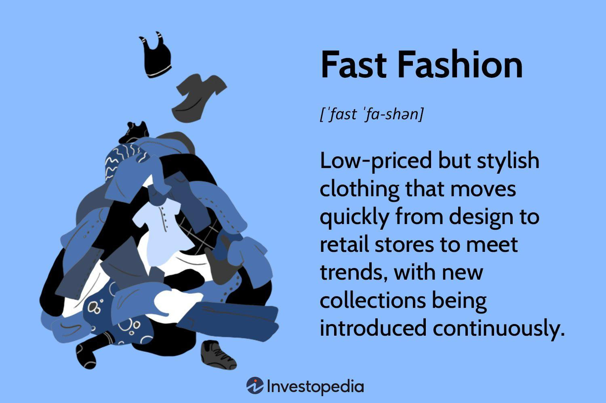

## Table of Contents

## What is fast fashion?

Fast fashion is when clothes are made and sold very quickly to keep up with the latest trends. Companies that do fast fashion make a lot of clothes, and they are usually cheap. People can buy new clothes all the time because the styles change fast. But this means the clothes don't last long and are not good quality.

This way of making clothes can be bad for the environment. It uses a lot of resources like water and energy, and it creates a lot of waste. Also, the people who make the clothes might not be paid fairly or work in safe places. So, while fast fashion lets people have new clothes often, it can harm the planet and the workers.

## How has fast fashion changed the retail manufacturing industry?

Fast fashion has changed the retail manufacturing industry a lot. Before, making clothes took a long time, and new styles came out slowly. But with fast fashion, companies make new clothes very quickly. They can copy the latest trends from fashion shows and get them into stores in just a few weeks. This means stores always have new clothes, and people want to buy them because they are new and cheap.

This change has made the industry move faster and grow bigger. Companies now make more clothes than ever before. But this has also caused problems. Making clothes quickly uses a lot of resources like water and energy, and it creates a lot of waste. Also, the people who make the clothes often work in bad conditions and get paid very little. So, while fast fashion has made the industry bigger, it has also brought challenges that need to be fixed.

## What are the environmental impacts of fast fashion on manufacturing?

Fast fashion has a big impact on the environment. Making clothes quickly uses a lot of resources like water and energy. For example, it takes a lot of water to grow the cotton that is used to make clothes. Also, factories use a lot of energy to run machines and make the clothes. All of this adds up to a lot of resources being used up very fast.

Another problem is waste. Fast fashion companies make a lot of clothes, and people often throw them away after wearing them just a few times. This creates a lot of trash. Some of this trash ends up in landfills, where it can take hundreds of years to break down. Also, when clothes are thrown away, they can release harmful chemicals into the environment. So, fast fashion not only uses up a lot of resources but also creates a lot of waste that harms the planet.

## How does fast fashion affect labor conditions in manufacturing?

Fast fashion affects labor conditions in manufacturing a lot. Companies want to make clothes quickly and cheaply, so they often hire workers in countries where they can pay them less money. These workers might work long hours, sometimes up to 16 hours a day, and they might not get breaks or time off. They often do not get paid enough to live well, and their jobs can be very hard and tiring.

Also, the places where these workers make the clothes can be unsafe. Factories might not have good safety rules, so workers can get hurt easily. Sometimes, the buildings where they work are not safe and could fall down. This has happened before, and many workers have been hurt or even died. So, while fast fashion makes it easy for people to buy new clothes, it can be very hard on the people who make them.

## What are the economic implications of fast fashion for retail manufacturers?

Fast fashion has big economic effects on retail manufacturers. It lets them make a lot of money because they can make and sell clothes quickly. People want to buy new clothes all the time, so stores can sell a lot of them. This means more money for the companies. Also, because the clothes are cheap to make, the companies can keep their prices low and still make a profit. This helps them grow bigger and sell more clothes around the world.

But there are also some problems. Making clothes quickly and cheaply can hurt the companies in the long run. If they focus too much on making cheap clothes, they might not spend enough money on making good quality clothes that last longer. This can make people stop trusting the brand. Also, if people start caring more about the environment and fair work, they might not want to buy fast fashion clothes anymore. This could mean less money for the companies in the future. So, while fast fashion can make a lot of money now, it also brings risks that companies need to think about.

## How does fast fashion influence consumer behavior and demand in retail?

Fast fashion changes how people buy clothes. It makes people want to buy new clothes all the time because the styles change so fast. Stores always have new clothes, and they are cheap, so people can buy them without spending a lot of money. This makes people want to keep up with the latest trends and buy more clothes than they need. They might wear the clothes just a few times before getting tired of them and buying more.

This way of buying clothes can make people think that clothes are not important and can be thrown away easily. It makes people care less about the quality of the clothes and more about having the newest styles. This can lead to a lot of waste because people throw away clothes that are still good but not in style anymore. So, fast fashion makes people buy more and care less about what happens to the clothes after they are done with them.

## What are the technological advancements driven by fast fashion in manufacturing?

Fast fashion has made companies use new technology to make clothes faster. They use machines that can sew and cut fabric very quickly. These machines help make a lot of clothes in a short time. Also, computers help plan how to make the clothes and keep track of everything. This makes it easier to change designs fast and get new styles into stores quickly.

Another big change is using technology to talk to other parts of the business. Companies use the internet to share information with their factories and stores around the world. This helps them know what people want to buy and make sure they have enough clothes ready. So, fast fashion has pushed companies to use new technology to make and sell clothes faster and better.

## How do fast fashion trends affect supply chain management in retail manufacturing?

Fast fashion makes supply chain management in retail manufacturing move very fast. Companies need to get new clothes into stores quickly to keep up with the latest trends. This means they have to plan and make clothes faster than before. They use computers and the internet to talk to their factories and stores all over the world. This helps them know what people want to buy and make sure they have enough clothes ready. But it can be hard to keep everything moving so fast without making mistakes.

Also, fast fashion can make supply chains more complicated. Companies might have factories in many different countries to keep costs low. This means they have to manage a lot of different parts of the supply chain at the same time. They need to make sure the fabric and other materials get to the right place on time. If something goes wrong, like a delay or a problem at a factory, it can mess up the whole supply chain. So, while fast fashion helps companies sell more clothes, it also makes managing the supply chain more challenging.

## What are the challenges faced by traditional manufacturers due to fast fashion?

Traditional manufacturers face big challenges because of fast fashion. They used to take their time making good quality clothes that last a long time. But now, people want new clothes all the time, and fast fashion companies can make them quickly and cheaply. This means traditional manufacturers have to try to make clothes faster too, or they might lose customers. They have to change how they work and maybe even use new machines to keep up, which can be hard and expensive.

Another problem is that fast fashion companies often make clothes in countries where it's cheaper. This can make it hard for traditional manufacturers to compete on price. They might have to pay their workers more and follow strict rules about how they make clothes, which makes their costs higher. If they can't make their clothes as cheap as fast fashion companies, people might not want to buy them. So, traditional manufacturers have to find a way to show that their clothes are worth the extra money, maybe by focusing on quality or being good to the environment.

## How can retail manufacturers adapt to the fast fashion model sustainably?

Retail manufacturers can adapt to the fast fashion model in a sustainable way by focusing on making better quality clothes that last longer. Instead of making a lot of cheap clothes that people throw away quickly, they can make fewer clothes that are well-made and can be worn for a long time. This way, they use fewer resources and create less waste. They can also use materials that are better for the environment, like organic cotton or recycled fabrics. By doing this, they can still make money but also help the planet.

Another way to be sustainable is to treat workers fairly. Retail manufacturers can make sure the people who make the clothes work in safe places and get paid enough money to live well. They can also work with factories that follow good rules about how they treat workers. This can help them build a good name for their brand, and people might want to buy their clothes because they know they are made in a fair way. So, by focusing on quality, using better materials, and treating workers well, retail manufacturers can adapt to fast fashion while also being sustainable.

## What are the future predictions for fast fashion's impact on retail manufacturing?

In the future, fast fashion might keep changing how retail manufacturing works. Companies might use even more new technology to make clothes faster and cheaper. They could use robots and smart machines to make clothes without needing as many people to help. This could make it easier for them to keep up with the latest trends and get new clothes into stores quickly. But it might also mean fewer jobs for people who make clothes, and it could make the problems with resources and waste even worse.

At the same time, more people might start caring about the environment and fair work. They might not want to buy fast fashion clothes if they know they are bad for the planet or the people who make them. This could make companies change how they do things. They might start making better quality clothes that last longer and use materials that are good for the environment. They could also pay their workers more and make sure they work in safe places. So, while fast fashion might keep growing, it could also push companies to be more sustainable and fair.

## How do global regulations and policies impact fast fashion and retail manufacturing?

Global regulations and policies can change how fast fashion and retail manufacturing work. Some countries have rules about how much pollution factories can make. This means companies have to be careful about how they make clothes and use less water and energy. They might have to pay more money to follow these rules, which can make their clothes more expensive. Also, some places have laws about how much workers should be paid and how safe their workplaces should be. If companies don't follow these rules, they might get in trouble or have to pay fines. This can make it harder for them to make clothes quickly and cheaply.

But these rules can also help make things better. When countries have strict rules about the environment and workers' rights, it can push companies to be more sustainable and fair. They might start using better materials and treating their workers well to follow the rules. This can make people want to buy their clothes because they know they are good for the planet and the people who make them. So, while global regulations can make it harder for fast fashion companies to keep their costs low, they can also help make the industry better for everyone.

## References & Further Reading

[1]: Cline, E. L. (2012). ["Overdressed: The Shockingly High Cost of Cheap Fashion."](https://books.google.com/books/about/Overdressed.html?id=G_NvDwAAQBAJ) Portfolio Hardcover.

[2]: Fletcher, K. (2014). ["Sustainable Fashion and Textiles: Design Journeys."](https://katefletcher.com/publications/books/sustainable-fashion-and-textiles-design-journeys/) Routledge.

[3]: Fisher, M., Hammond, J., Obermeyer, W., & Raman, A. (1994). ["Making Supply Meet Demand in an Uncertain World."](https://hbr.org/1994/05/making-supply-meet-demand-in-an-uncertain-world) Harvard Business Review.

[4]: Arnaboldi, F., & Rossignoli, C. (2015). ["Algorithmic Trading and Market Quality: A Literature Review."](https://www.semanticscholar.org/paper/1-Financial-innovation-in-banking-Arnaboldi-Rossignoli/6819cb83555d96832df24ddd7c4ae8f3d44dc313) Physica A: Statistical Mechanics and its Applications, 419, 95-105.

[5]: Greenpeace. (2011). ["Dirty Laundry: Unravelling the Corporate Connections to Toxic Water Pollution in China."](https://www.greenpeace.org/static/planet4-international-stateless/2011/07/3da806cc-dirty-laundry-report.pdf)

[6]: MacArthur, E. (2017). ["A New Textiles Economy: Redesigning Fashion's Future."](https://ellenmacarthurfoundation.org/a-new-textiles-economy) Ellen MacArthur Foundation.

[7]: Lopez de Prado, M. (2018). ["Advances in Financial Machine Learning."](https://www.amazon.com/Advances-Financial-Machine-Learning-Marcos/dp/1119482089) Wiley.