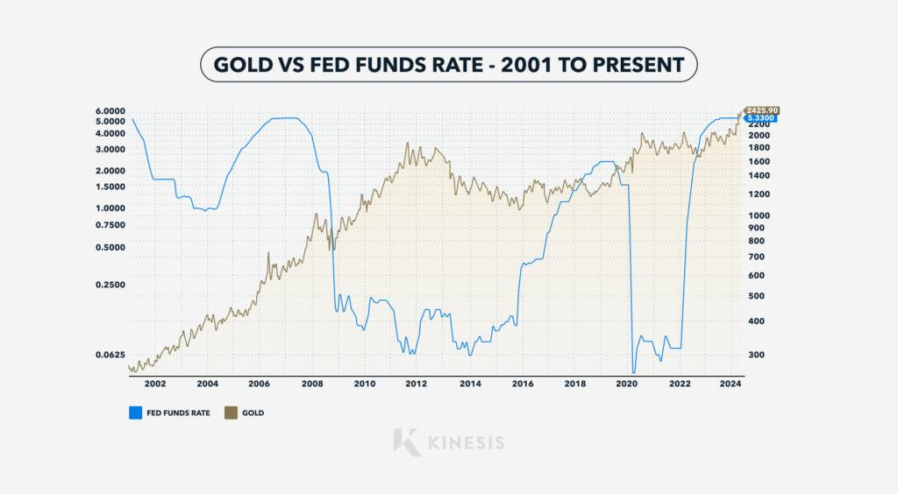

Interest rate hikes and their impact on gold prices have been debated for many years, largely due to the complex interplay between monetary policy and market dynamics. The Federal Funds Rate, set by the Federal Reserve, is a critical tool used to control inflation and stabilize the economy by influencing short-term interest rates. This rate affects borrowing costs, consumer spending, and business investments, ultimately impacting various asset classes, including gold.

Gold is traditionally viewed as a safe-haven asset, sought after during times of economic uncertainty. However, its relationship with interest rates is not linear. A prevalent hypothesis suggests that as interest rates rise, the opportunity cost of holding non-yielding assets like gold increases, leading to a decline in demand and price. Despite this general assumption, historical data and trends indicate that the relationship is far more nuanced, with periods where both interest rates and gold prices have increased simultaneously.



The advent of algorithmic trading has further complicated this relationship. Algorithms can process vast amounts of financial data almost instantaneously, responding to market signals and economic indicators such as interest rate changes. These automated systems can exacerbate price volatility, making it more challenging to predict gold price movements based solely on interest rate fluctuations.

This article explores the intricate relationships between interest rate hikes, the Federal Funds Rate, and the rise of algorithmic trading, assessing their collective influence on the gold market. By understanding these dynamics, investors can better navigate the complexities of gold trading within the context of an evolving financial landscape.

## Table of Contents

## Historical Relationship Between Interest Rates and Gold Prices

A common belief is that when interest rates rise, gold prices fall due to increased competition from fixed-income investments, like bonds, which offer better returns. This belief stems from the expectation that higher interest rates make non-yielding assets, such as gold, less attractive to investors seeking returns. However, historical data indicate that the correlation between interest rates and gold prices is not as straightforward as this commonly accepted notion suggests.

Historical analysis reveals periods when both interest rates and gold prices rose simultaneously, challenging the conventional wisdom. In the 1970s, both interest rates and gold prices increased, highlighting complexities in their relationship. For instance, during this period, inflation was a significant driving [factor](/wiki/factor-investing) that pushed nominal interest rates higher. Simultaneously, the high inflation environment eroded the purchasing power of currencies, leading investors to seek gold as a hedge against inflation. The increase in demand for gold resulted in higher prices, despite the rise in interest rates.

Moreover, market dynamics, including inflation expectations, geopolitical tensions, and economic conditions, often have profound influences on gold prices, sometimes outweighing the impact of changing interest rates. Inflation, in particular, can simultaneously cause [interest rate](/wiki/interest-rate-trading-strategies) hikes while driving investment into gold as a protective asset. Thus, while the theoretical basis for an inverse relationship between interest rates and gold prices exists, real-world data depict a far more nuanced interaction influenced by a spectrum of economic variables beyond merely the interest rates alone. 

Ultimately, these complexities underscore the necessity for investors and analysts to carefully consider a multitude of factors beyond just interest rate movements when assessing gold market trends.

## Factors Influencing Gold Prices Beyond Interest Rates

Gold prices are impacted by a complex interplay of factors extending beyond interest rates, with supply and demand dynamics being one of the primary determinants. The availability of gold is ultimately finite, and variations in mining output can cause fluctuations in prices. For example, if mining output decreases, the reduced supply can lead to higher gold prices, assuming stable or increasing demand.

Investor sentiment profoundly influences gold prices. During times of market uncertainty or economic turmoil, gold is often perceived as a "safe haven" asset. This perception can drive increased buying activity, elevating gold prices. Conversely, when investor confidence in traditional financial markets is high, demand for gold may wane, leading to price reductions.

Geopolitical stability plays a significant role, as conflicts or tensions can elevate gold demand due to its status as a stable store of value. For instance, geopolitical events that threaten global stability often result in upward [momentum](/wiki/momentum) in gold prices as investors seek to mitigate risk.

Macroeconomic trends, such as inflation and gross domestic product (GDP) growth, also have impactful effects. High inflation typically boosts gold prices as investors look to gold as a hedge against the decreasing purchasing power of fiat currencies. Conversely, robust economic growth might divert investor capital to equity markets, thereby reducing gold demand and prices.

The strength of the U.S. dollar inversely affects gold prices because gold is predominantly dollar-denominated. A strong U.S. dollar can make gold more expensive for foreign investors, reducing international demand and causing prices to drop. Conversely, a weak dollar makes gold cheaper in other currencies, potentially increasing demand and driving prices higher. This inverse relationship can be statistically measured through correlation coefficients, providing insights into anticipated gold price movements relative to fluctuations in the U.S. dollar's value. 

Overall, understanding these multifaceted influences is essential for anyone involved in gold investment or trading, as they can significantly impact market behavior independently of interest rate movements.

## Impact of Federal Funds Rate Hikes on Gold

The Federal Funds Rate, established by the Federal Reserve, serves as a crucial economic indicator that influences a wide range of financial instruments, including gold. This rate impacts short-term borrowing costs, which, in turn, affect consumer and business lending. When the Federal Reserve raises the Federal Funds Rate, it aims to control inflation and stabilize economic growth. However, the relationship between interest rate hikes and gold prices is complex and not consistently direct.

Historically, there is no uniform pattern that rate hikes result in declining gold prices. This can be attributed to various macroeconomic factors that intersect with interest rates to influence gold's market performance. For example, during periods of heightened economic uncertainty, gold is often perceived as a safe-haven asset. Investors may flock to gold even amid rising interest rates as a hedge against potential economic instability or inflation.

Market responses to Federal Funds Rate hikes can be unpredictable. While bond yields become more attractive due to higher interest rates, the demand for gold can be sustained by geopolitical tensions, currency fluctuations, or expectations of future economic distress. This phenomenon underscores the importance of investor sentiment in gold market dynamics.

The inverse relationship between the U.S. dollar's strength and gold prices further complicates the impact of interest rate adjustments. Since gold prices are dollar-denominated, an increase in the Federal Funds Rate can lead to a stronger dollar, which might depress gold prices. However, this effect can be counterbalanced by the aforementioned safe-haven demand.

Overall, the effect of Federal Funds Rate hikes on gold prices illustrates the intricate interplay of monetary policy and market psychology. Investors must consider a wide array of variables beyond interest rates, such as geopolitical events and market sentiment, when evaluating gold as an investment during periods of rate adjustments.

## Role of Algorithmic Trading in Gold Markets

Algorithmic trading has significantly transformed financial markets, playing a crucial role in commodities trading, notably gold. These sophisticated trading systems rely on algorithms to execute trades at speeds and frequencies far beyond the capacity of human traders. Algorithms are designed to process vast amounts of data in real-time, including market news, interest rate changes, and historical price patterns, and they react almost instantaneously to these inputs to affect price movements in the gold market.

The influence of [algorithmic trading](/wiki/algorithmic-trading) on gold prices is multifaceted. Algorithms utilize statistical models and [machine learning](/wiki/machine-learning) techniques to predict future price movements. For example, they might analyze historical data to detect patterns or correlations, such as the relationship between interest rate changes and gold prices. An algorithm could be programmed to buy or sell gold futures based on expected interest rate hikes anticipated by analyzing minutes from Federal Reserve meetings or economic indicators signaling inflation adjustments.

To illustrate how algorithms might interpret interest rate data, consider a simple Python-based model that reacts to changes in interest rates. The algorithm could include conditions where, if interest rates increase above a certain threshold, the program decreases gold holdings due to the expectation of rising yields on fixed-income securities:

```python
def adjust_gold_holdings(interest_rate, current_gold_holdings):
    if interest_rate > 0.03:  # Assuming a threshold of 3%
        return current_gold_holdings * 0.9  # Reduce holdings by 10%
    else:
        return current_gold_holdings

# Example usage
current_interest_rate = 0.035
gold_holdings = 100  # hypothetical value in ounces

new_gold_holdings = adjust_gold_holdings(current_interest_rate, gold_holdings)
print(f"Adjusted Gold Holdings: {new_gold_holdings}")
```

Such strategies can lead to swift adjustments in market prices, as numerous algorithmic systems react in potentially similar ways, creating self-reinforcing trends.

Moreover, these trading systems harness natural language processing (NLP) to interpret unstructured data, like economic reports or news articles, which might influence market sentiment regarding future Federal Reserve policy moves. In this way, algorithms may anticipate interest rate changes before they are officially announced, pre-emptively adjusting positions and impacting gold prices.

While the precise behavior of algorithmic trading systems often remains proprietary, understanding that these algorithms are primarily driven by data - including interest rate information - offers valuable insights. Their rapid response times and data-driven decisions mean that gold's price can experience heightened [volatility](/wiki/volatility-trading-strategies) in reaction to economic indicators or forecasts perceived to impact interest rates.

In conclusion, algorithmic trading, through its reliance on rapid data processing and advanced predictive models, plays a pivotal role in shaping the gold market. Traders and investors must acknowledge the impact of these technologies to navigate the market effectively, especially in light of interest rate changes and other economic variables.

## Conclusion

Interest rate hikes exhibit a complex and often indirect impact on gold markets. This complexity arises from the multifaceted interactions between interest rates, investor behavior, and market dynamics. While traditional views suggest that rising interest rates might render gold less attractive due to the increased appeal of interest-bearing assets, historical and contemporary data reveal that this relationship is not consistently linear.

Comprehensive trading strategies need to incorporate a broader spectrum of factors beyond interest rates alone. Algorithmic trading, which now dominates a significant portion of financial transactions, uses advanced models to process vast amounts of data at rapid speeds. These algorithms often react to interest rate announcements almost instantaneously, influencing gold price movements in ways that might not align with traditional expectations. Understanding and anticipating these algorithmic trends can provide traders with a strategic advantage in navigating the gold market.

Investors are urged to remain vigilant, taking into account not only macroeconomic indicators, such as inflation rates and currency fluctuations, but also technological developments that shape trading environments. Gold, traditionally seen as a safe haven during economic uncertainty, requires investors to adopt a nuanced approach that considers both established economic theories and modern technological influences.

Ultimately, successful investment in gold necessitates a balanced consideration of diverse influences. Combining insights from historical data, macroeconomic variables, and advanced trading technologies can better equip investors to make informed decisions in an ever-evolving financial landscape.

## References & Further Reading

[1]: ["The Role of Gold as a Financial Investment"](https://www.sciencedirect.com/science/article/pii/S2405851321000519) by Lawrence Carlson, Financial Analysts Journal. 

[2]: ["The Influence of Interest Rates on Gold"](https://goldtrends.net/how-interest-rates-impact-gold-prices-a-comprehensive-guide/) by Ehsan Nikbakht, Global Finance Journal.

[3]: ["The Economics of Gold Price Movements"](https://www.semanticscholar.org/paper/The-Economics-of-Gold-Price-Movements-Abken/12a7c175c41d5b6cd521f6fbb52996bde2cae1cb) by Alex C. Chew, Asian Economic Policy Review.

[4]: ["Algorithmic Trading and Market Dynamics"](https://www.cmegroup.com/education/files/Algo_and_HFT_Trading_0610.pdf) by Charles Unser, ACM Transactions on Economics and Computation.

[5]: ["Understanding the Relationship between Federal Funds Rate and Commodities"](https://www.investopedia.com/terms/f/federalfundsrate.asp) by Jennifer Burley, Journal of Economics and Business.

[6]: ["The Federal Funds Rate and Its Impact on Markets"](https://www.businessinsider.com/personal-finance/investing/what-is-the-federal-funds-rate) by Aaron Bernstein, Brookings Institution.