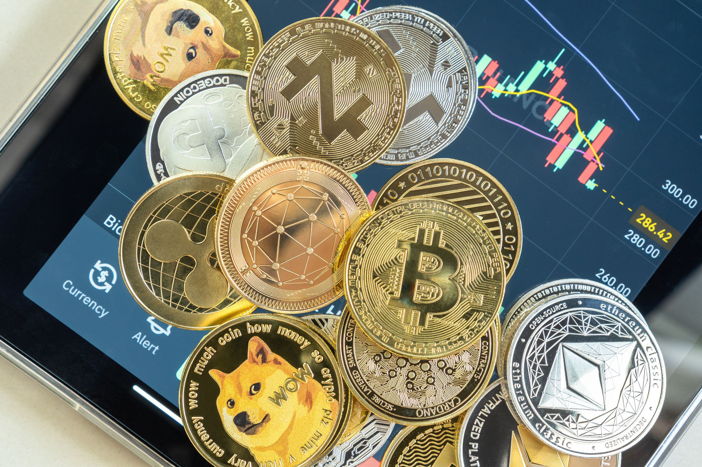

Fiat currency crises are increasingly prevalent in today's global economy, manifesting starkly in countries like Venezuela and Iran. These crises typically arise from factors such as hyperinflation, misguided economic policies, and external sanctions, leading to severe economic instability and a significant devaluation of national currencies. As a result, affected populations face diminished purchasing power and economic growth stagnation, creating an urgent need for alternative financial solutions.

In such turbulent economic environments, cryptocurrencies have emerged as a compelling alternative, offering a decentralized and inflation-resistant financial system. Unlike traditional fiat currencies, cryptocurrencies like Bitcoin operate independently of centralized financial institutions, providing users with a means to preserve wealth and conduct transactions across borders, often without the restrictive controls imposed by their governments.



The cryptocurrency market is characterized by high volatility, presenting both opportunities and challenges for investors. To navigate this volatility effectively, many are turning to algorithmic trading (algo trading), a method that leverages computer algorithms to execute trades at optimal times. Algo trading offers precision and speed in trading operations, enabling investors to capitalize on market inefficiencies and arbitrage opportunities, which are abundant in the constantly shifting crypto landscape.

This article examines the nexus between fiat currency crises and cryptocurrency adoption, analyzing how these financial upheavals drive people toward alternative digital assets. It further explores the role of algorithmic trading in facilitating the transition to cryptocurrencies, making it a pivotal tool for both institutional and individual investors aiming to manage risks and enhance returns in the cryptocurrency market. Through this discussion, we aim to shed light on the evolving financial terrain and the potential for cryptocurrencies and advanced trading technologies to reshape the economic futures of nations grappling with fiat currency instability.

## Table of Contents

## Understanding Fiat Currency Crises

Fiat currency crises arise when the stability of a national currency is compromised. This instability predominantly stems from factors such as rampant inflation, mismanagement of economic policies, or external pressures like international sanctions. Inflation erodes the value of money, leading to a diminished purchasing power for citizens. This decline in currency value can be expressed by the formula:

$$
\text{Real Value} = \frac{\text{Nominal Value}}{1 + \text{Inflation Rate}}
$$

In instances where inflation accelerates uncontrollably, economies can be thrust into hyperinflation, a condition characterized by an exceedingly rapid increase in prices. Hyperinflation undermines trust in the currency and its governance, forcing businesses and individuals to resort to foreign currencies or barter systems.

Countries like Venezuela and Iran exemplify the severe economic consequences of hyperinflation. Venezuela's economic turmoil, exacerbated by declining oil prices and extensive use of monetary financing, saw its currency, the bolívar, rendered practically worthless. This has led to dire shortages of basic goods, skyrocketing unemployment, and mass emigration as citizens sought economic refuge elsewhere. The Central Bank's inability to control the inflation spiral further plunged the nation's economy into chaos.

Iran faces similar pressures, albeit from a combination of domestic policy imbalances and external economic sanctions aimed at curtailing its international trade. These sanctions limit Iran's access to global financial systems, exacerbating inflation and currency devaluation. In both nations, currency instability has led to a soaring cost of living, reduced economic growth, and constrained opportunities for international trade.

The consequence of a fiat currency crisis extends beyond immediate economic hardship. It can lead to increased governmental control over capital, which often results in further restricting individual economic freedoms. Societies experiencing such crises generally endure prolonged periods of instability, often necessitating structural economic reforms or relief from external entities to regain a semblance of stability.

## The Economic Impact of Fiat Currency Crises

Fiat currency crises have profound implications on economic systems, primarily manifesting through hyperinflation, which sharply diminishes the purchasing power of a currency. This depreciation results in rapidly increasing prices for goods and services, creating an environment where wages struggle to keep pace with inflation rates. Consequently, individuals experience a significant reduction in their real income, adversely affecting their standard of living. Furthermore, the erosion of savings becomes inevitable as money held in financial institutions loses value, undermining long-term financial security and leading citizens to seek alternative stores of value.

Amid a fiat currency crisis, governments often react by imposing stringent controls over capital to stabilize the economy. These measures can include restricting the flow of money across borders, limiting withdrawals from financial institutions, or pegging the currency to a more stable foreign counterpart. While these actions aim to protect national reserves and curtail inflation, they often curtail economic freedom, making it difficult for businesses and individuals to move capital or invest externally.

The precipitous decline in a currency's value also exacerbates the cost of international trade. Importing necessary goods becomes increasingly expensive, which can lead to shortages of essential items, further inflating domestic prices and contributing to a vicious cycle of economic contraction. Exporters might initially benefit from a weaker currency due to more competitive pricing on the global market; however, the instability and lack of investor confidence often overshadow these benefits, leading to decreased overall trade activity.

These economic challenges illustrate the broader implications of fiat currency crises, underscoring the necessity for stable and alternative financial mechanisms to safeguard individual wealth and maintain economic stability.

## Cryptocurrency as an Alternative

Cryptocurrencies have emerged as a viable alternative to traditional fiat currencies, particularly amid fiscal instability and hyperinflation. Their decentralized and essentially inflation-resistant nature makes them attractive to individuals and institutions seeking security from erratic government policies and currency devaluations.

Bitcoin, the most prominent [cryptocurrency](/wiki/cryptocurrency), exemplifies how digital currencies can serve as a safe harbor during economic turbulence. Its decentralized architecture ensures that no central authority can manipulate its supply or value. This inherent characteristic is a significant contrast to fiat currencies, which can suffer inflationary pressures due to poor monetary policy or excessive money printing.

Venezuela provides a pertinent example of how cryptocurrencies can offer relief in crisis situations. Faced with hyperinflation that has eroded the national currency's value, Venezuelans have increasingly turned to Bitcoin for financial transactions and wealth preservation. This shift allows citizens to circumvent stringent capital controls and access global markets, which are typically unavailable through conventional financial systems. Bitcoin transactions can bypass the local banking system's limitations, providing an international reach without the need for foreign exchange intermediaries.

Cryptocurrency adoption has broader implications as a pathway to economic stability and independence. In countries where national currencies can no longer be relied upon due to inconsistent valuations or governmental overreach, cryptocurrencies offer a more stable alternative. Their resistance to inflation and potential for seamlessly facilitating international transactions present opportunities for economic empowerment and autonomy.

While cryptocurrencies are not free from risks, such as [volatility](/wiki/volatility-trading-strategies) and regulatory uncertainties, their potential as a replacement or complement to failing fiat systems is increasingly being recognized. As such, the adoption of cryptocurrencies could redefine the future financial architectures of countries grappling with persistent monetary crises.

## Case Studies: Venezuela, Iran, and El Salvador

### Venezuela

Venezuela's hyperinflation crisis, one of the most severe globally, has severely devalued the national currency, the Bolivar. This economic instability pushed citizens to explore alternative means of preserving their wealth. Cryptocurrencies, particularly Bitcoin, emerged as a viable option due to their decentralized nature and resistance to hyperinflationary pressures. Despite Venezuela's governmental attempts to control and regulate the crypto space, such as introducing its own state-backed cryptocurrency, the Petro, citizens have increasingly relied on Bitcoin and other cryptocurrencies for both wealth preservation and daily transactions. According to reports, the [volume](/wiki/volume-trading-strategy) of Bitcoin traded in Venezuela has surged, highlighting its adoption as a financial lifeline amidst an unstable economic environment.

### Iran

Iran has experienced significant inflationary pressure over the years, driven by factors such as economic sanctions and volatile oil prices. This situation has led to increased interest in Bitcoin as an alternative investment and currency. In Iran, the government's stance on cryptocurrencies is notably complex. On one hand, the Iranian government has promoted the use of cryptocurrencies, seeing potential to bypass economic sanctions and participate in international trade. It has even granted licenses to crypto miners operating in the country. On the other hand, there have been attempts to restrict and control usage, primarily due to fears of capital flight and challenges in monetary policy control. This dual approach has resulted in a fluctuating but steadily increasing Bitcoin adoption rate among Iranians seeking financial stability and international transaction capabilities.

### El Salvador

El Salvador took an unprecedented step in cryptocurrency adoption by becoming the first country to adopt Bitcoin as legal tender in September 2021. This strategic move was aimed at achieving greater economic independence and reducing the costs associated with remittances, which constitute a significant portion of the country's GDP. The government introduced Bitcoin alongside the US Dollar, hoping to foster financial inclusion and attract investments. This policy enables residents to use Bitcoin for everyday transactions and remittances, benefiting from the lower transaction fees associated with crypto transfers compared to traditional remittance services. While the adoption has attracted global attention and offered potential economic benefits, it has also faced criticism and challenges, particularly regarding Bitcoin's volatility and potential risks to economic stability.

## The Role of Algorithmic Trading in Crypto Adoption

Algorithmic trading, often referred to as algo trading, involves the use of computer algorithms to execute trades based on predefined criteria. This approach is particularly advantageous in the cryptocurrency market, which is characterized by its high volatility and rapid price fluctuations.

Algo trading provides a systematic means for investors to manage risks in the crypto market. By employing algorithms that can process large amounts of data and respond to market conditions in real-time, investors can minimize human error and emotional decision-making. This is crucial in a market where prices can change dramatically within seconds.

One of the primary benefits of algo trading is its ability to exploit [arbitrage](/wiki/arbitrage) opportunities. Cryptocurrencies are traded across numerous exchanges worldwide, often leading to price discrepancies. Algorithms can swiftly identify and execute trades to profit from these inefficiencies. For instance, if Bitcoin is priced at $50,000 on one exchange and $50,200 on another, an algo trading system can buy on the lower-priced exchange and sell on the higher-priced one, pocketing the difference. The mathematical principle underlying this is simple: 

$$
\text{Profit} = \text{Sell Price} - \text{Buy Price}
$$

Let's express this using a basic Python code snippet:

```python
def arbitrage_opportunity(buy_price, sell_price):
    if sell_price > buy_price:
        return sell_price - buy_price
    else:
        return 0

buy = 50000
sell = 50200
profit = arbitrage_opportunity(buy, sell)
print(f"Profit: ${profit}")
```

This script calculates the profit from a simple arbitrage opportunity, showcasing how algorithms can be designed to identify profitable trades.

Moreover, the speed and precision offered by [algorithmic trading](/wiki/algorithmic-trading) are unmatched by human traders. Algorithms can execute orders at a pace that far surpasses manual trading, making them indispensable in a market where milliseconds can make a difference in profitability. This rapid execution reduces the risk of slippage, where the price changes between the initiation and completion of a trade.

Algorithmic trading is not only beneficial for institutional investors but also for individual traders. Retail trading platforms increasingly offer tools and resources that enable individual investors to leverage algorithmic strategies. These tools democratize access to sophisticated trading techniques, making the crypto market more accessible to all participants.

In summary, algorithmic trading is a pivotal component in the adoption of cryptocurrencies, providing a disciplined and efficient approach to navigating the inherent volatility of digital assets. By capitalizing on market inefficiencies and offering precise, rapid execution of trades, algo trading enhances the potential for profitability and risk management in the evolving landscape of crypto finance.

## Challenges and Future Prospects

Cryptocurrencies, despite their potential to address fiat currency crises, are accompanied by several challenges that require careful consideration. Regulatory frameworks pose significant challenges as governments worldwide grapple with how to classify, monitor, and tax digital currencies. The regulatory landscape remains fragmented, creating uncertainty that can deter investors and hinder mainstream adoption. For example, while some countries embrace cryptocurrencies, others have imposed strict regulations or outright bans, contributing to a patchwork of rules that can be difficult to navigate.

Technological complexities further complicate the adoption and widespread use of cryptocurrencies. Blockchain technology, which underpins most cryptocurrencies, demands robust infrastructure and technical expertise. Scalability issues, such as those related to transaction speed and network congestion, persist and can limit the functionality of cryptocurrencies for everyday transactions. Additionally, security concerns, including vulnerabilities to hacking and fraud, necessitate continued advancements in cybersecurity measures.

Market volatility remains a core concern, as the value of cryptocurrencies can fluctuate wildly over short periods. This inherent volatility can result in significant financial risks for investors and users who rely on cryptocurrencies for stability. The lack of historical data and the speculative nature of cryptocurrency investments further amplify these risks.

The future of cryptocurrency adoption in response to fiat currency crises hinges on several key factors. Regulatory developments will play a crucial role, with more coherent and comprehensive regulations potentially fostering trust and wider acceptance. Technological advancements that address current limitations, such as improved scalability and enhanced security features, are essential to support the growth of the crypto market. Furthermore, global economic conditions, including the stability of traditional financial systems and geopolitical dynamics, will influence the pace and extent of cryptocurrency adoption.

Despite these challenges, the trend towards cryptocurrency use is gaining [momentum](/wiki/momentum), particularly in countries experiencing economic instability and fiat currency crises. As these digital assets become more integrated into the financial system, we may witness transformative changes in how value is stored and transacted globally. The evolution of cryptocurrencies and associated technologies like algorithmic trading holds promise for reshaping the financial landscapes of affected nations, potentially offering innovative solutions to longstanding economic challenges.

## Conclusion

Fiat currency crises have catalyzed a noticeable migration toward cryptocurrencies, driven by their decentralized nature and potential to preserve wealth amid economic instability. As nations grapple with financial turmoil, the advantages of cryptocurrencies, particularly their resistance to inflation and ability to function independently of traditional banking systems, become increasingly appealing. The transition toward a global financial landscape that integrates cryptocurrencies seems imminent as more countries experience the repercussions of fiat currency instability. This shift could fundamentally alter how individuals and institutions manage and transfer wealth.

Algorithmic trading (algo trading) has emerged as an indispensable element in this evolving financial ecosystem. Its systematic and automated approach to trading allows investors to manage the inherent volatility of cryptocurrency markets effectively. By leveraging advanced algorithms, traders can capitalize on price discrepancies and market inefficiencies, thereby enhancing profitability. Moreover, the speed and precision offered by algo trading systems enable both individual and institutional investors to execute trades with minimal latency, providing a significant advantage in the fast-paced world of cryptocurrency trading.

As cryptocurrencies become more integrated into global finance, and as fiat currency crises persist, the reliance on algo trading is expected to grow. These technologies not only facilitate the navigation of volatile markets but also promise more robust financial outcomes. They equip investors with the tools to achieve greater efficiency and effectiveness in their trading strategies, potentially reshaping the future of financial markets. This progression underscores a transformative period marked by technological innovation and adaptation to new types of currency, signaling profound changes in how economic systems may operate in times of crisis.

## References & Further Reading

[1]: Amadeo, K. (2020). ["Venezuela's Economic Crisis: What You Need to Know."](https://news.sky.com/story/venezuela-crisis-11476739) The Balance.

[2]: Bishop, S. (2019). ["How Cryptocurrencies Help Venezuelans Cope with Hyperinflation."](https://www.nbcnews.com/news/latino/nonprofits-turn-cryptocurrency-help-needy-venezuelans-n1008726) Forbes.

[3]: Corbet, S., Lucey, B., Urquhart, A., & Yarovaya, L. (2019). ["Cryptocurrencies as a Financial Asset: A Systematic Analysis."](https://www.sciencedirect.com/science/article/pii/S1057521918305271) International Review of Financial Analysis.

[4]: Shaban, M., & Munir, Q. (2021). ["Impacts of Financial Sanctions on Iran: A Discussion of the Efficacy of US Policies."](https://onlinelibrary.wiley.com/doi/full/10.1111/roie.12724) Journal of Security and Financial Studies.

[5]: Narayanan, A., Bonneau, J., Felten, E., Miller, A., & Goldfeder, S. (2016). ["Bitcoin and Cryptocurrency Technologies: A Comprehensive Introduction."](https://press.princeton.edu/books/hardcover/9780691171692/bitcoin-and-cryptocurrency-technologies) Princeton University Press.

[6]: Lopez de Prado, M. (2018). ["Advances in Financial Machine Learning."](https://www.amazon.com/Advances-Financial-Machine-Learning-Marcos/dp/1119482089) Wiley.

[7]: Turk, A., & Lewis, S. (2020). ["El Salvador's Adoption of Bitcoin: Economic Considerations and Potential Implications."](https://www.nature.com/articles/s41599-024-03908-3) World Economic Forum.