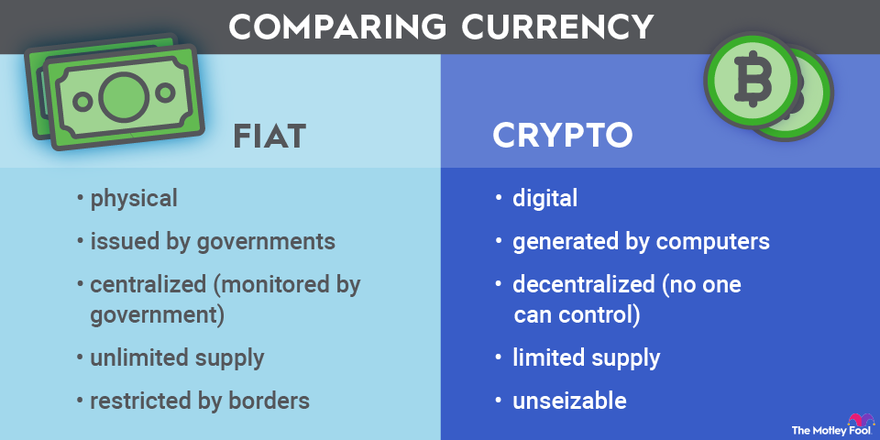

## Table of Contents

## What is fiat currency?

Fiat currency is money that a government says is worth something, even though it's not backed by a physical thing like gold. It's called "fiat" because the government declares it as legal tender, meaning people have to accept it when they buy or sell things. Most countries use fiat currency today, like the US dollar, the Euro, and the Japanese yen.

The value of fiat currency comes from people trusting that it can be used to buy things. If lots of people believe in it, it stays valuable. But if too much money is printed, it can lose value, which is called inflation. Governments and central banks try to manage this by controlling how much money is in circulation.

## What is a fiat currency crisis?

A fiat currency crisis happens when people start to lose trust in their country's money. This can happen if too much money is printed, causing prices to go up a lot, which is called hyperinflation. When people see that their money is worth less and less, they might start using other things to buy stuff, like foreign money or even things like gold or cigarettes. This makes the country's money even less valuable, and it can lead to big problems for the economy.

Governments and central banks try to stop these crises by controlling how much money is made and by setting interest rates. But sometimes, if a country has a lot of debt or if its economy is not doing well, it can be hard to keep the money stable. If people lose faith completely, the currency can collapse, which means it becomes almost worthless. This can cause a lot of trouble for people living in that country, making it hard for them to buy things they need.

## What is cryptocurrency?

Cryptocurrency is a type of digital money that uses special math to keep it safe and private. Unlike regular money from banks, cryptocurrencies work on the internet and don't need a bank or government to control them. People use computers to send and receive these digital coins, and everything is recorded on a big list called a blockchain. This list is shared with lots of people, so it's hard for anyone to cheat or change the records.

There are many kinds of cryptocurrencies, like Bitcoin, Ethereum, and Dogecoin. People can use them to buy things online, trade them like stocks, or just keep them as a way to save money. Because they're not controlled by any one person or group, they can be risky. The value of cryptocurrencies can go up and down a lot, and sometimes they can be used for things that aren't allowed by the law. But many people like them because they offer a new way to handle money without needing to trust big banks or governments.

## How does a fiat currency crisis affect the economy?

A fiat currency crisis can hurt the economy a lot. When people lose trust in their money, they might start using other things to buy stuff, like foreign money or gold. This makes the country's money worth even less. Prices can go up really fast, which is called hyperinflation. When this happens, people's savings become worth less, and it's harder for them to buy things they need. Businesses might have a hard time too, because it's tough to plan when prices are changing so much.

This can lead to big problems for the whole country. People might not want to spend money because they're worried it will be worth less tomorrow. This can slow down the economy, making it hard for businesses to grow and for people to find jobs. The government might also have a hard time paying its bills if it borrowed money in its own currency, because now it needs more of that money to pay back what it owes. If the crisis gets really bad, the currency might collapse, which can cause chaos and make life very hard for everyone in the country.

## What are the reasons people might turn to cryptocurrencies during a fiat currency crisis?

During a fiat currency crisis, people might turn to cryptocurrencies because they want a safer place to keep their money. When the value of their country's money is going down fast, cryptocurrencies like Bitcoin can seem like a good choice. They are not controlled by any government or bank, so people think they might be safer from the problems that are making their own money lose value. Also, cryptocurrencies can be sent anywhere in the world quickly and without needing a bank, which is helpful if the banks in their country are having problems too.

Another reason is that cryptocurrencies can sometimes go up in value a lot when a country's money is in trouble. People might see this as a chance to make money or at least keep their savings from losing value. Even though cryptocurrencies can be risky and their value can go up and down a lot, some people think it's worth trying during a crisis. They hope that by using cryptocurrencies, they can protect their money and maybe even make it grow, even when everything else seems to be falling apart.

## Can you provide historical examples where fiat currency crises led to increased cryptocurrency adoption?

In Venezuela, there was a big problem with their money, the bolivar, starting around 2016. Prices were going up very fast, and people's money was becoming worth less and less. This made life very hard for people in Venezuela. Because of this, many started using Bitcoin and other cryptocurrencies to keep their money safe. They could use these digital coins to buy things online or even pay for stuff in shops that started accepting them. The use of cryptocurrencies grew a lot because people needed a way to protect their savings from the crazy prices.

Another example is in Zimbabwe, where the money, called the Zimbabwean dollar, lost almost all its value in the late 2000s. People could not trust their money anymore, and prices were going up so fast that they had to use huge amounts of money just to buy basic things. During this time, some people in Zimbabwe started using Bitcoin. It was a way to keep their money safe and to be able to buy things without worrying about the Zimbabwean dollar losing value every day. Even though not everyone used cryptocurrencies, those who did found it helped them a lot during the crisis.

## What are the potential benefits of adopting cryptocurrencies during a fiat currency crisis?

When a country's money is losing value fast, using cryptocurrencies can help people keep their savings safe. Cryptocurrencies like Bitcoin are not controlled by any government or bank, so they can be a good choice when the local money is in trouble. People can use them to buy things online or even in some shops that start accepting them. This way, they don't have to worry about their money becoming worth less every day. It's like having a safe place to keep their money when everything else seems to be falling apart.

Another benefit is that cryptocurrencies can sometimes go up in value a lot during a crisis. People might see this as a chance to not only keep their money safe but also maybe even make it grow. Even though cryptocurrencies can be risky and their value can change a lot, some people think it's worth trying during a crisis. They hope that by using cryptocurrencies, they can protect their money and maybe even make more money, which can be really helpful when their country's money is not doing well.

## What are the risks and challenges of using cryptocurrencies as an alternative during a fiat currency crisis?

Using cryptocurrencies during a fiat currency crisis can be risky. One big problem is that the value of cryptocurrencies can go up and down a lot. This means people might lose money if they buy cryptocurrencies and the price goes down. Also, not everyone knows how to use cryptocurrencies safely. If they make a mistake, they could lose their money forever because there's no bank to help them get it back. Another challenge is that not all shops or businesses accept cryptocurrencies. So, even if people have them, they might still need the local money to buy things they need every day.

Another risk is that governments might not like people using cryptocurrencies. They might make new rules or even ban them, which could make it hard for people to use them. This can be a big problem during a crisis when people need a safe way to keep their money. Also, using cryptocurrencies can be hard because they need good internet and special tools like digital wallets. In a country with a bad economy, not everyone might have these things. So, even though cryptocurrencies can help, they also come with many risks and challenges that people need to think about carefully.

## How do government regulations impact the adoption of cryptocurrencies during fiat currency crises?

Government rules can make it harder for people to use cryptocurrencies during a fiat currency crisis. If a government doesn't like cryptocurrencies, they might make new laws to stop people from using them. This can scare people away from trying them, even if they need a safe place to keep their money. For example, if the government says it's illegal to use cryptocurrencies, people might be afraid to use them and could get in trouble if they do. This makes it tough for cryptocurrencies to help people during a crisis.

On the other hand, if a government makes rules that help cryptocurrencies, more people might start using them. Clear rules can make people feel safer about trying cryptocurrencies because they know what is allowed and what isn't. If the government lets people use cryptocurrencies and even helps them learn how to use them safely, more people might see them as a good way to protect their money during a crisis. But, even with good rules, there are still risks because cryptocurrencies can go up and down in value a lot.

## What role do technological advancements play in facilitating the adoption of cryptocurrencies in response to fiat currency crises?

Technological advancements make it easier for people to use cryptocurrencies during a fiat currency crisis. When a country's money is losing value, people need a safe place to keep their savings. New technology like smartphones and better internet helps people use cryptocurrencies without needing a bank. They can download apps to buy, sell, and keep their digital money safe. This means even people in places with bad economies can try to protect their money using cryptocurrencies.

Also, technology makes it easier for shops and businesses to accept cryptocurrencies. With new tools, they can quickly change cryptocurrencies into the local money they need. This helps more people use cryptocurrencies to buy things they need every day. But even with these advancements, using cryptocurrencies can still be risky because their value can change a lot. So, while technology helps, people need to be careful and learn how to use cryptocurrencies safely.

## How might the widespread adoption of cryptocurrencies affect the global financial system during a fiat currency crisis?

If lots of people start using cryptocurrencies during a fiat currency crisis, it could change the global money system a lot. When a country's money is losing value fast, people might turn to cryptocurrencies to keep their savings safe. This could make the country's money even less valuable because fewer people are using it. If this happens in many countries at the same time, it could shake up the whole world's money system. Banks and governments might have a harder time controlling money and keeping it stable, which could lead to more problems.

On the other hand, widespread use of cryptocurrencies could also help during a crisis. They can be sent anywhere in the world quickly and without needing a bank, which is helpful if a country's banks are having problems. This could make it easier for people to buy things they need and keep their money safe. But, because cryptocurrencies can go up and down in value a lot, they can also be risky. So, while they might help in some ways, they could also make things more uncertain for the global money system during a crisis.

## What future trends can we anticipate regarding the interplay between fiat currency crises and cryptocurrency adoption?

In the future, we might see more people turning to cryptocurrencies when their country's money is in trouble. As more people learn about cryptocurrencies and how to use them, they could become a common way to keep money safe during a crisis. Technology will keep getting better, making it easier for people to use cryptocurrencies even in places with bad internet or few banks. This could mean that during a fiat currency crisis, more people will try to use cryptocurrencies to protect their savings and buy things they need.

However, there will still be big challenges. Governments might try to control or even stop people from using cryptocurrencies, which could make it hard for them to help during a crisis. Also, because the value of cryptocurrencies can go up and down a lot, they will always be risky. People will need to learn how to use them safely and understand the risks. Even with these challenges, the way people use money during a crisis could change a lot because of cryptocurrencies, making the global money system more complicated but also more flexible.

## What is the understanding of Fiat Currency Crises?

Fiat currency crises arise when the stability of a national currency is compromised. This instability predominantly stems from factors such as rampant inflation, mismanagement of economic policies, or external pressures like international sanctions. Inflation erodes the value of money, leading to a diminished purchasing power for citizens. This decline in currency value can be expressed by the formula:

$$
\text{Real Value} = \frac{\text{Nominal Value}}{1 + \text{Inflation Rate}}
$$

In instances where inflation accelerates uncontrollably, economies can be thrust into hyperinflation, a condition characterized by an exceedingly rapid increase in prices. Hyperinflation undermines trust in the currency and its governance, forcing businesses and individuals to resort to foreign currencies or barter systems.

Countries like Venezuela and Iran exemplify the severe economic consequences of hyperinflation. Venezuela's economic turmoil, exacerbated by declining oil prices and extensive use of monetary financing, saw its currency, the bolívar, rendered practically worthless. This has led to dire shortages of basic goods, skyrocketing unemployment, and mass emigration as citizens sought economic refuge elsewhere. The Central Bank's inability to control the inflation spiral further plunged the nation's economy into chaos.

Iran faces similar pressures, albeit from a combination of domestic policy imbalances and external economic sanctions aimed at curtailing its international trade. These sanctions limit Iran's access to global financial systems, exacerbating inflation and currency devaluation. In both nations, currency instability has led to a soaring cost of living, reduced economic growth, and constrained opportunities for international trade.

The consequence of a fiat currency crisis extends beyond immediate economic hardship. It can lead to increased governmental control over capital, which often results in further restricting individual economic freedoms. Societies experiencing such crises generally endure prolonged periods of instability, often necessitating structural economic reforms or relief from external entities to regain a semblance of stability.

## What is the role of algorithmic trading in crypto adoption?

Algorithmic trading, often referred to as algo trading, involves the use of computer algorithms to execute trades based on predefined criteria. This approach is particularly advantageous in the [cryptocurrency](/wiki/cryptocurrency) market, which is characterized by its high [volatility](/wiki/volatility-trading-strategies) and rapid price fluctuations.

Algo trading provides a systematic means for investors to manage risks in the crypto market. By employing algorithms that can process large amounts of data and respond to market conditions in real-time, investors can minimize human error and emotional decision-making. This is crucial in a market where prices can change dramatically within seconds.

One of the primary benefits of algo trading is its ability to exploit [arbitrage](/wiki/arbitrage) opportunities. Cryptocurrencies are traded across numerous exchanges worldwide, often leading to price discrepancies. Algorithms can swiftly identify and execute trades to profit from these inefficiencies. For instance, if Bitcoin is priced at $50,000 on one exchange and $50,200 on another, an algo trading system can buy on the lower-priced exchange and sell on the higher-priced one, pocketing the difference. The mathematical principle underlying this is simple: 

$$
\text{Profit} = \text{Sell Price} - \text{Buy Price}
$$

Let's express this using a basic Python code snippet:

```python
def arbitrage_opportunity(buy_price, sell_price):
    if sell_price > buy_price:
        return sell_price - buy_price
    else:
        return 0

buy = 50000
sell = 50200
profit = arbitrage_opportunity(buy, sell)
print(f"Profit: ${profit}")
```

This script calculates the profit from a simple arbitrage opportunity, showcasing how algorithms can be designed to identify profitable trades.

Moreover, the speed and precision offered by [algorithmic trading](/wiki/algorithmic-trading) are unmatched by human traders. Algorithms can execute orders at a pace that far surpasses manual trading, making them indispensable in a market where milliseconds can make a difference in profitability. This rapid execution reduces the risk of slippage, where the price changes between the initiation and completion of a trade.

Algorithmic trading is not only beneficial for institutional investors but also for individual traders. Retail trading platforms increasingly offer tools and resources that enable individual investors to leverage algorithmic strategies. These tools democratize access to sophisticated trading techniques, making the crypto market more accessible to all participants.

In summary, algorithmic trading is a pivotal component in the adoption of cryptocurrencies, providing a disciplined and efficient approach to navigating the inherent volatility of digital assets. By capitalizing on market inefficiencies and offering precise, rapid execution of trades, algo trading enhances the potential for profitability and risk management in the evolving landscape of crypto finance.

## References & Further Reading

[1]: Amadeo, K. (2020). ["Venezuela's Economic Crisis: What You Need to Know."](https://news.sky.com/story/venezuela-crisis-11476739) The Balance.

[2]: Bishop, S. (2019). ["How Cryptocurrencies Help Venezuelans Cope with Hyperinflation."](https://www.nbcnews.com/news/latino/nonprofits-turn-cryptocurrency-help-needy-venezuelans-n1008726) Forbes.

[3]: Corbet, S., Lucey, B., Urquhart, A., & Yarovaya, L. (2019). ["Cryptocurrencies as a Financial Asset: A Systematic Analysis."](https://www.sciencedirect.com/science/article/pii/S1057521918305271) International Review of Financial Analysis.

[4]: Shaban, M., & Munir, Q. (2021). ["Impacts of Financial Sanctions on Iran: A Discussion of the Efficacy of US Policies."](https://onlinelibrary.wiley.com/doi/full/10.1111/roie.12724) Journal of Security and Financial Studies.

[5]: Narayanan, A., Bonneau, J., Felten, E., Miller, A., & Goldfeder, S. (2016). ["Bitcoin and Cryptocurrency Technologies: A Comprehensive Introduction."](https://press.princeton.edu/books/hardcover/9780691171692/bitcoin-and-cryptocurrency-technologies) Princeton University Press.

[6]: Lopez de Prado, M. (2018). ["Advances in Financial Machine Learning."](https://www.amazon.com/Advances-Financial-Machine-Learning-Marcos/dp/1119482089) Wiley.

[7]: Turk, A., & Lewis, S. (2020). ["El Salvador's Adoption of Bitcoin: Economic Considerations and Potential Implications."](https://www.nature.com/articles/s41599-024-03908-3) World Economic Forum.