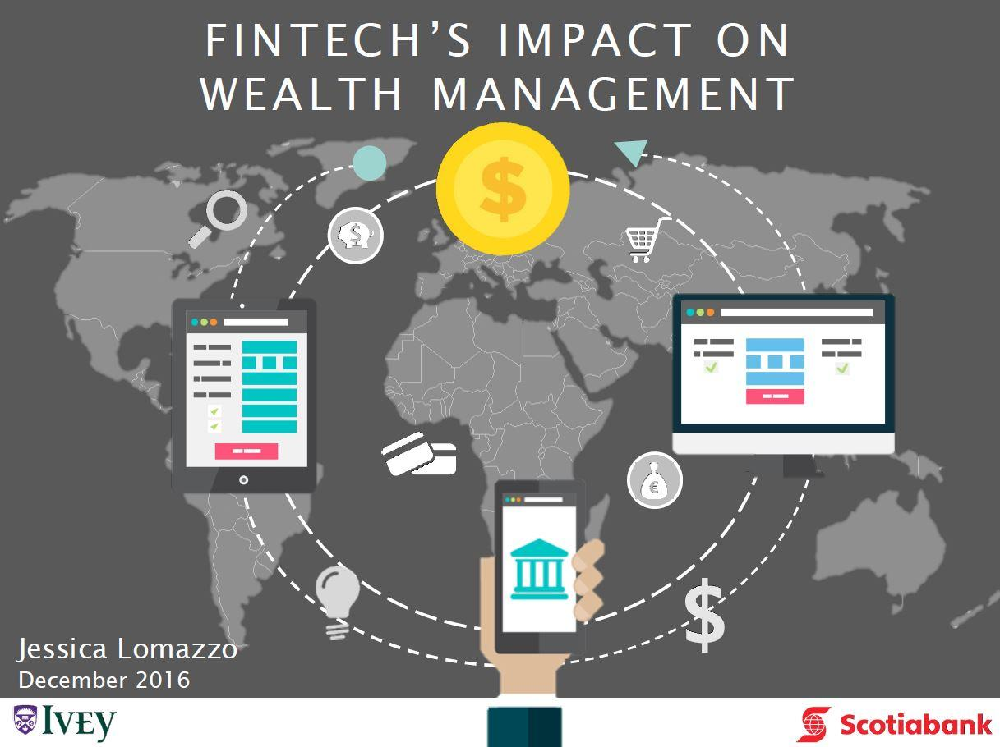

In today's rapidly evolving financial landscape, the convergence of wealth management, financial technology (fintech), and algorithmic trading is shaping new opportunities and challenges. This transformation is driven by technological advancements that are reshaping industry practices, offering enhanced tools and strategies for both advisors and clients. With the integration of fintech into wealth management, processes have become more efficient and personalized, democratizing access to financial services. This shift is not only making financial services more accessible to a broader audience but also redefining the traditional models of financial advisory.

Algorithmic trading is another crucial component of this transformation. Utilizing computer algorithms and the power of machine learning, it enables the analysis of vast datasets to identify market trends and execute trades with unprecedented speed and accuracy. This has led to a reconfiguration of investment strategies, providing new avenues for executing rapid, precise trading activities. The role of artificial intelligence and big data in this context cannot be overstated. These technologies are essential for processing and interpreting extensive amounts of financial data, leading to more informed decision-making.

As we navigate this era of technological advancement, the financial services industry is witnessing a paradigm shift. This evolution signifies not only advancements in technology but also a reimagining of how wealth is managed and traded in today's digital economy. It is essential for financial advisors and firms to embrace these changes to continue thriving in a fintech-dominated landscape. This ongoing transformation highlights the importance of adaptation in the financial services industry, offering a glimpse into the future directions that fintech, wealth management, and algorithmic trading may undertake.

## Table of Contents

## The Rise of Fintech in Wealth Management

The advent of financial technology, commonly known as fintech, has markedly transformed the field of wealth management, ushering in an era of increased efficiency and personalized financial services. At the forefront of this transformation are robo-advisors, which have gained popularity for their ability to provide automated investment advice through sophisticated algorithms. These digital platforms are designed to analyze an investor’s profile, including risk tolerance and financial goals, and construct personalized investment portfolios. Their cost-effectiveness and accessibility have made them attractive to a wide range of investors, particularly younger demographics and those previously underserved by traditional financial services.

Fintech’s democratizing effect on financial services is one of its most significant contributions to wealth management. Services that were once the preserve of high-net-worth individuals are now accessible to a broader audience. For example, individuals can now engage with financial markets and manage their wealth through digital platforms that offer low minimum investment thresholds and transparent fee structures. This democratization is enabled by technologies that streamline processes and reduce overhead costs, allowing financial institutions to offer services at a reduced rate.

A critical feature underpinning fintech’s impact on wealth management is the incorporation of advanced data analytics. By leveraging big data and machine learning algorithms, fintech companies can provide more informed decision-making to their clients. These technologies process vast amounts of financial data to identify patterns, forecast trends, and optimize investment strategies. Such capabilities enhance portfolio management by offering insights that would be unattainable through traditional methods. For example, predictive analytics can provide early warnings about market volatility, allowing investors to adjust their portfolios proactively.

The historical evolution of fintech in the wealth management sector highlights a gradual but profound shift from conventional advisory models to technology-driven solutions. Initially, wealth management was characterized by face-to-face interactions and manual processes. However, the rise of the internet and subsequent digital platforms paved the way for e-commerce in financial services, reducing entry barriers and fostering innovation. This progression continued with the development of mobile applications, further increasing consumer accessibility to financial services anytime and anywhere.

Traditional financial advisory models have felt the impact of fintech’s rise, as they must now compete with or integrate new technologies to remain relevant. Financial advisors find themselves integrating digital tools to enhance their offerings, increasingly adopting a hybrid advisory approach that combines human expertise with technological efficiency. This shift not only augments the capabilities of traditional advisors but also enhances client engagement through personalized and real-time insights delivered via digital channels.

In summary, the rise of fintech in wealth management is characterized by its ability to offer efficient, personalized, and accessible financial services, empowered by data analytics and algorithm-driven insights. The transformation from traditional models to fintech-enabled solutions has provided both challenges and opportunities for financial advisors, prompting them to adapt and innovate in a rapidly changing industry landscape.

## Fintech and Financial Advisors: New Roles and Opportunities

The integration of financial technology (fintech) into the wealth management sector is fundamentally altering the traditional roles of financial advisors, presenting both challenges and emerging opportunities. Financial advisors are increasingly required to adapt to these changes by amalgamating digital tools with their established expertise, leading to the advent of hybrid advisory services. This hybrid model facilitates enhanced client engagement through automation and personalization, enabling advisors to design bespoke investment strategies tailored to individual client needs and preferences.

In this evolving environment, financial advisors are leveraging digital platforms to offer clients seamless online access and real-time information, which aligns with modern client expectations for convenience and transparency. This shift towards digital collaboration necessitates a transformation in how advisors interact with their clients, emphasizing the importance of building relationships that are both technologically and personally engaging.

To remain competitive in a fintech-dominated market, financial advisors are exploring several strategies. These strategies include adopting [artificial intelligence](/wiki/ai-artificial-intelligence) (AI) and [machine learning](/wiki/machine-learning) algorithms to analyze vast amounts of financial data, which helps in making informed predictions and recommendations. Furthermore, advisors are integrating robo-advisory capabilities to automate routine tasks, thereby allowing them to focus on more strategic, value-added services.

Advisors are also increasing their digital literacy and embracing continuous learning to keep pace with technological advancements. This involves acquiring new skills related to data analytics, cybersecurity, and digital communication to better serve their clients in this digital age. Moreover, they are cultivating partnerships with fintech firms, enabling them to leverage innovative solutions and expand their service offerings.

Overall, the role of financial advisors is rapidly transforming as fintech becomes an integral part of wealth management. By embracing digital tools and maintaining a client-centric approach, advisors can navigate this transition effectively, securing their relevance and value in the contemporary financial landscape.

## The Impact of Algorithmic Trading in Fintech

Algorithmic trading, or algo trading, has significantly transformed financial markets by employing computer algorithms to automate trade execution. This technology uses mathematical models and takes advantage of advancements like big data and machine learning, enabling the processing of large datasets to identify market patterns, optimize the timing of trades, and execute them with remarkable speed and accuracy. The efficiency gained through such automation enhances decision-making by reducing human error, and by exploiting small price discrepancies across markets.

High-frequency trading ([HFT](/wiki/high-frequency-trading-strategies)) represents a prominent subset of [algorithmic trading](/wiki/algorithmic-trading), characterized by extremely rapid trade initiation and completion, often within microseconds. High-frequency traders leverage sophisticated algorithms and high-speed networks to perform numerous transactions that capitalize on minimal price movements, aiming for small gains on each trade that accumulate to significant profits due to the sheer [volume](/wiki/volume-trading-strategy) of trades.

Despite its advantages, algorithmic trading presents challenges, notably concerning market [volatility](/wiki/volatility-trading-strategies) and fairness. The automated nature of these trades can amplify market movements, sometimes leading to dramatic price fluctuations as observed in the 2010 "Flash Crash". Moreover, the competitive edge provided by faster technology raises questions about equal access among market participants, potentially disadvantaging slower, less technologically advanced traders.

Regulatory measures have evolved to address these complexities associated with automated trading systems. Regulatory bodies worldwide are implementing rules that aim to enhance transparency and reliability in financial markets. For instance, requirements for algo traders to register their algorithms, perform stress tests, and implement kill-switches to halt trades during market anomalies are becoming common. Furthermore, the introduction of circuit breakers helps to curb excessive volatility by pausing trading in the event of substantial market swings.

Despite these challenges, the incorporation of algorithmic trading in the fintech landscape continues to thrive, driving efficiency and innovation. The ability to process a vast amount of data quickly and execute informed trading decisions enhances the overall [liquidity](/wiki/liquidity-risk-premium) and functionality of financial markets and aligns with the growing trend towards automation and data-driven strategies in the broader financial ecosystem. As regulatory measures continue to adapt, they aim to balance the benefits and risks, ensuring a stable yet dynamic market environment.

## Client-Centric Fintech Solutions

Fintech solutions are progressively becoming more client-centric, emphasizing enhanced user experience and transparency. These solutions are designed to empower clients, offering them unprecedented control over their financial futures and improving advisor-client relationships.

One of the primary benefits of fintech is the ability to provide clients with sophisticated digital platforms. These platforms enable users to monitor their portfolios seamlessly, offering real-time insights through advanced data visualization tools. Clients can now make informed financial decisions by accessing detailed analytics and forecasts that were previously available only to professionals.

Moreover, fintech innovations have introduced significant cost efficiencies, ultimately benefiting clients. By reducing operational costs and optimizing processes, fintech firms can offer their services at lower fees compared to traditional financial institutions. This increase in cost efficiency does not compromise the quality of services; instead, it enhances the overall service delivery. Clients enjoy a more streamlined experience, characterized by faster transactions and timely access to important financial information.

Case studies of successful fintech companies illustrate the transformative power of their innovations. For instance, companies like Robinhood and Wealthfront have revolutionized the client experience by offering commission-free trading and automated investment solutions, respectively. Robinhood's platform, with its user-friendly interface, allows clients to trade stocks, ETFs, and cryptocurrencies without traditional brokerage fees, thus democratizing access to financial markets. Wealthfront leverages automated strategies to provide personalized investment advice, making sophisticated financial planning accessible to a wider audience.

Another example is Mint, a personal finance app that aggregates user financial data to provide comprehensive budget tracking and spending insights. By offering personalized tips and financial recommendations, Mint empowers clients to manage their finances effectively, fostering a sense of financial autonomy and transparency.

In summary, fintech solutions focus on client-centric innovation by enhancing user experiences, offering lower fees, and providing greater control over financial decisions. As technology continues to advance, the relationship between clients and financial advisors will likely evolve, with fintech playing a pivotal role in shaping the future of wealth management.

## Future Prospects and Conclusion

The future of wealth management is increasingly driven by the intersection of technology and finance, highlighting the transformative role of financial technology (fintech). As the landscape evolves, emerging technologies—particularly artificial intelligence (AI) and blockchain—are expected to introduce more sophisticated tools that enhance wealth management and trading practices. AI, with its ability to process and analyze vast datasets, offers predictive analytics and personalized investment strategies, enhancing decision-making processes for both financial advisors and clients. Blockchain technology, known for its transparency and security, has the potential to improve transaction efficiency and trustworthiness, revolutionizing how financial records are maintained and shared.

Financial advisors and firms must embrace agility to thrive in this changing environment. The ability to adapt and integrate new technologies is crucial for maintaining a competitive edge and delivering value to clients. This adaptation involves not only adopting cutting-edge technologies but also rethinking business models and service offerings to align with the digital preferences of modern clients. Fintech is driving a shift towards more dynamic, responsive, and client-centric approaches, necessitating a willingness to innovate and redefine traditional advisory roles.

Reflecting on these trends, it becomes evident that adaptation is central to the financial services industry's continued relevance and success. The integration of fintech into wealth management and algorithmic trading signals a paradigm shift, characterized by increased efficiency, accessibility, and personalization. By embracing fintech innovations, financial institutions can unlock new opportunities for growth and sustainability.

In conclusion, the ongoing transformation within wealth management, powered by fintech, indicates a promising future. The fusion of technology and finance is set to create a more inclusive and efficient financial ecosystem, enhancing the experiences of both advisors and clients. As these technologies mature, the industry's ability to adapt will be key to harnessing their full potential, paving the way for a new era in financial services where wealth is managed and traded with unprecedented sophistication and clarity.

## References & Further Reading

[1]: Bergstra, J., Bardenet, R., Bengio, Y., & Kégl, B. (2011). ["Algorithms for Hyper-Parameter Optimization."](https://dl.acm.org/doi/10.5555/2986459.2986743) Advances in Neural Information Processing Systems 24.

[2]: ["Advances in Financial Machine Learning"](https://www.amazon.com/Advances-Financial-Machine-Learning-Marcos/dp/1119482089) by Marcos Lopez de Prado

[3]: ["Evidence-Based Technical Analysis: Applying the Scientific Method and Statistical Inference to Trading Signals"](https://www.amazon.com/Evidence-Based-Technical-Analysis-Scientific-Statistical/dp/0470008741) by David Aronson

[4]: ["Machine Learning for Algorithmic Trading"](https://github.com/stefan-jansen/machine-learning-for-trading) by Stefan Jansen

[5]: ["Quantitative Trading: How to Build Your Own Algorithmic Trading Business"](https://www.amazon.com/Quantitative-Trading-Build-Algorithmic-Business/dp/1119800064) by Ernest P. Chan