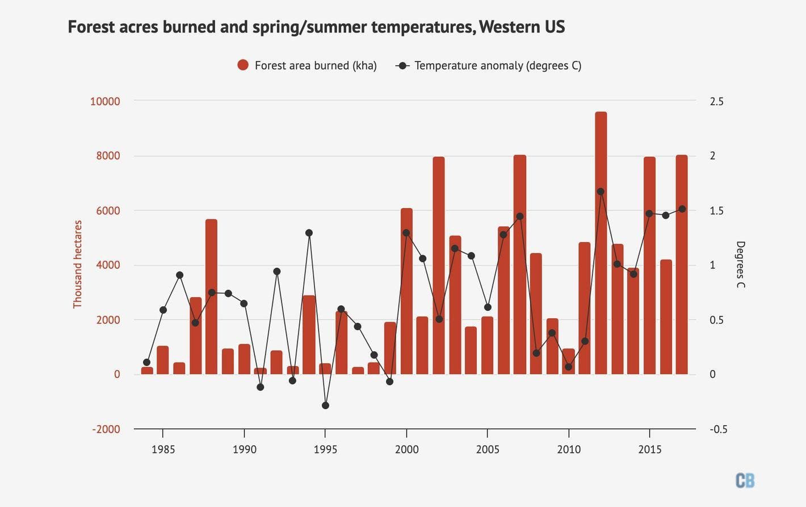

## Table of Contents

## What is the fire season and when does it typically occur?

The fire season is the time of year when wildfires are most likely to happen. It happens because the weather is hot, dry, and windy. These conditions make it easy for fires to start and spread quickly.

In many places, the fire season usually happens in the summer months. For example, in California, the fire season often starts in June and can last until November. But, because of climate change, the fire season is getting longer and can start earlier or end later than usual.

## How does the fire season affect local businesses and industries?

The fire season can really hurt local businesses and industries. When there are wildfires, people might have to leave their homes, and this means fewer customers for shops, restaurants, and hotels. Also, the smoke and bad air quality can make people stay inside, so they don't go out to spend money. Businesses that depend on tourists, like those in places known for their beautiful nature, can lose a lot of money because people won't want to visit during a fire season.

Industries like farming and logging can also be hit hard by wildfires. Fires can destroy crops, trees, and equipment, which means farmers and loggers lose money and have to start over. It can take a long time for the land to recover, so these businesses might struggle for years. Plus, if roads and other ways to move goods are blocked by fires, it can be hard to get products to market, making things even tougher for local industries.

## What are the direct economic costs associated with wildfires?

Wildfires can cause a lot of direct economic costs. When a wildfire happens, it can burn down homes, businesses, and other buildings. This means people have to spend money to fix or rebuild what was lost. The government also has to pay for things like fighting the fires and helping people who had to leave their homes. All these costs add up quickly and can be very expensive.

Another big cost comes from damage to the environment and natural resources. Wildfires can destroy forests, which are important for logging and other industries. They can also harm the soil and water, making it harder for farmers to grow crops. When these natural resources are damaged, it can take a long time and a lot of money to fix them. This affects not just the people who live in the area, but also the economy as a whole.

## How do wildfires impact tourism and related economic activities?

Wildfires can really hurt tourism. When there are big fires, people don't want to visit places that are smoky and dangerous. This means hotels, restaurants, and shops that depend on tourists lose a lot of money. For example, if a popular national park is closed because of a wildfire, all the businesses around it will see fewer customers. This can be a big problem for small towns that rely on tourists to make money.

The impact can last a long time, too. Even after the fires are out, it can take years for the area to look nice again. Tourists might be scared to come back because they remember the fires. This means the local economy can struggle for a long time. Businesses might have to close, and people might lose their jobs. It's a tough situation for everyone involved.

## What are the long-term economic effects of fire seasons on a region?

Fire seasons can have big long-term effects on a region's economy. After the fires are gone, it can take a long time for things to go back to normal. The land might be damaged, and it can be hard for farmers to grow crops or for loggers to cut down trees. This means less money coming in from these industries, and it can take years for them to recover. People might also move away because they lost their homes or jobs, which can make the area's economy even weaker.

Tourism can also be hurt for a long time. Even after the fires are out, people might be scared to visit because they remember the bad times. This means fewer tourists, which is bad for hotels, restaurants, and shops that need visitors to make money. If these businesses close, it can be hard for the local economy to get better. It's a tough situation, and it can take a long time for things to get back to how they were before the fires.

## How do fire seasons influence agricultural productivity and food prices?

Fire seasons can really hurt farming. When wildfires burn through fields, they can destroy crops and damage the soil. This means farmers can't grow as much food as they used to. It can take a long time for the land to heal, so farmers might not be able to plant new crops for a while. This loss of crops can make it hard for farmers to make money, and it can also mean less food is available for everyone.

When there's less food because of wildfires, the price of food can go up. If a lot of crops are destroyed, there's not enough to go around, so stores have to charge more for what they have. This can make it harder for people to afford food, especially if they're already struggling. The higher prices can last for a while, until the farms can start growing food again and the supply goes back to normal.

## What role does government spending play in managing the economic impact of fire seasons?

The government spends a lot of money to help during fire seasons. They pay for firefighters to put out the fires and for emergency services to help people who have to leave their homes. This spending is important because it helps keep people safe and stops the fires from getting worse. The government also gives money to people and businesses that lost things in the fires, so they can start to rebuild. This helps the local economy because it means people can get back to work and businesses can open again.

But government spending can only do so much. It can take a long time for the money to reach everyone who needs it, and sometimes it's not enough to fix everything that was lost. The government has to be careful with how they spend the money because they have to help a lot of people and fix a lot of things. Even with all this help, the economy in the area can still struggle for a long time after the fires are out.

## How do insurance companies adjust their policies and premiums due to increased fire risks?

Insurance companies change their policies and premiums when fire risks go up. They might raise the price of insurance in areas where wildfires happen a lot. This is because they have to pay more money to fix things after a fire. If someone lives in a place that's more likely to have wildfires, their insurance might cost more. Insurance companies do this to make sure they can still make money, even if a lot of people need to use their insurance because of fires.

Sometimes, insurance companies might not want to cover homes or businesses in areas with high fire risks. They might say no to new customers or not renew policies for people who already have insurance. This can be hard for people who need insurance to protect their homes or businesses. But insurance companies do this because they don't want to lose too much money if a big wildfire happens. They have to balance helping people with making sure they can stay in business.

## What are the economic benefits, if any, of fire seasons to certain industries?

Fire seasons can actually help some businesses make more money. Companies that fight fires, like those that sell firefighting equipment or provide firefighting services, can get more work during fire seasons. They might sell more gear or be hired to help put out fires. Also, construction companies can benefit because they get more jobs rebuilding homes and businesses that were destroyed by fires. This means more money for these businesses, even though it's a tough time for others.

Another industry that can see some benefits is the one that deals with emergency services and disaster relief. When there are wildfires, the government and other groups need to help people quickly. This means they buy more supplies and hire more people to help with things like food, shelter, and medical care. While it's sad that people need help because of fires, it does mean more work for these emergency and relief services. So, even though fire seasons can cause a lot of problems, they can also bring some economic benefits to certain industries.

## How do fire seasons affect real estate markets and property values in affected areas?

Fire seasons can make real estate markets and property values go down in places where wildfires happen a lot. When a big fire burns through an area, it can destroy homes and buildings. People might not want to buy homes in places that could burn down again. This means there are fewer people wanting to buy, so the prices of homes can drop. Also, insurance companies might charge more for homes in these areas, which makes it harder for people to afford them. All these things can make the real estate market in the area weaker.

But, after the fires are out, some places can start to recover. If the area is fixed up and made safer, people might want to buy homes there again. Sometimes, the government helps by giving money to rebuild, which can make the area look better and attract new buyers. But it can take a long time for the real estate market to get back to how it was before the fires. Until then, property values might stay low, and it can be hard for people to sell their homes for a good price.

## What are the global economic implications of increased fire seasons due to climate change?

When fire seasons get longer and happen more often because of climate change, it can affect the whole world's economy. Wildfires can destroy crops and forests in one country, which means there's less food and wood to sell to other countries. This can make food and wood prices go up everywhere. Also, when big fires happen, countries might have to spend a lot of money to help people and fix things. This can make it harder for them to spend money on other things, like helping other countries or buying things from them. So, the global economy can feel the effects of wildfires, even if they happen far away.

Another way fire seasons can affect the world's economy is by making it harder for people to travel and do business. When there are wildfires, airports might close, and roads might be blocked. This can make it hard for businesses to get their products to other countries. It can also scare tourists away from visiting places that have a lot of fires, which hurts the tourism industry. All these things can slow down the global economy and make it harder for countries to work together and grow.

## How can economic models be used to predict and mitigate the financial impact of future fire seasons?

Economic models can help us guess how bad the money problems from future fire seasons might be. These models look at things like how much it costs to fight fires, how much damage they do to homes and businesses, and how they affect farming and tourism. By using past data, these models can predict how much money might be lost and where the biggest problems will be. This helps governments and businesses plan ahead. They can save money or make rules to make the damage less bad. For example, they might spend more on firefighting equipment or help farmers grow crops that are less likely to burn.

Using these models, we can also try to stop the money problems from getting too big. Governments can use the predictions to decide where to spend money to help people and businesses before the fires even start. They might give money to places that are likely to have fires, so they can be ready. Businesses can use the models to change their plans, like buying insurance that covers fire damage or moving important things to safer places. By planning ahead with these models, we can make the financial impact of fire seasons smaller and help everyone recover faster.

## References & Further Reading

[1]: Stephens, S. L., Agee, J. K., Fule, P. Z., North, M. P., Romme, W. H., Swetnam, T. W., & Turner, M. G. (2013). ["Managing Forests and Fire in Changing Climates."](https://www.science.org/doi/10.1126/science.1240294) Nature, 499, 356-365.

[2]: Westerling, A. L., Hidalgo, H. G., Cayan, D. R., & Swetnam, T. W. (2006). ["Warming and Earlier Spring Increase Western U.S. Forest Wildfire Activity."](https://www.science.org/doi/10.1126/science.1128834) Science, 313(5789), 940-943.

[3]: Finucane, M.L. (2008). ["The Inextricable Link between Climate Change and Wildfires,"](https://www.sciencedirect.com/science/article/abs/pii/S0377221705003577) Climatic Change, 87, 309–326.

[4]: Kajiura, M., Kaluwange, K., & Woodbridge, A. (2021). ["Algorithmic Trading in the Context of Emerging Market Developments."](https://www.researchgate.net/publication/378287610_Machine_learning_in_financial_markets_A_critical_review_of_algorithmic_trading_and_risk_management) Emerging Markets Journal, 11(2), 86-98.

[5]: ["Wildfire Risk and Economic Vulnerability in the USA"](https://ajph.aphapublications.org/doi/10.2105/AJPH.2023.307286) by Hanan M. J. & Matteson, N. Nature Geoscience.