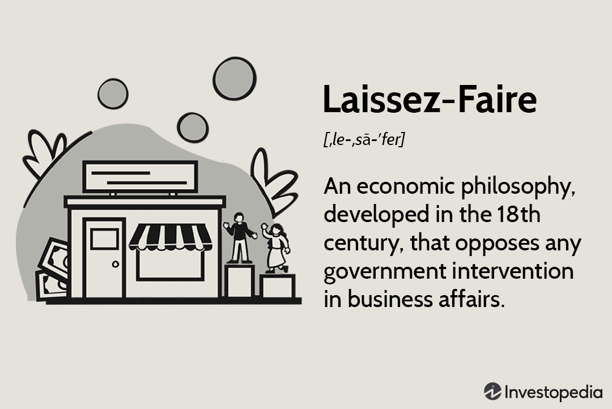

The increasing frequency and intensity of wildfires have significant repercussions on economies, environmental conditions, and human life. As these destructive events become more prevalent, understanding their multifaceted impact is crucial. In this article, we explore the interplay between fire season, economic repercussions of wildfires, and the growing relevance of algorithmic trading in managing these challenges.

Historically, wildfires have served as a natural component of many terrestrial ecosystems, shaping landscapes and influencing ecological processes. However, the advent of climate change, along with various anthropogenic factors, has magnified the frequency and intensity of these events. Factors such as rising global temperatures, prolonged drought periods, and shifts in land use have contributed to an exacerbated fire season, straining natural and human systems alike.

The economic ramifications of wildfires are diverse and substantial. They extend beyond the immediate damage to property and infrastructure to influence broader economic sectors. Agriculture, tourism, and public health are just a few of the areas affected by these natural disasters. The interconnectedness of today's global economy means that the impact of wildfires is not confined to the regions directly affected. Supply chains can be disrupted, commodity prices may fluctuate, and investor sentiment can shift rapidly, causing ripples across international markets.

In navigating these economic challenges, modern technology offers innovative solutions. Algorithmic trading, a method that uses computer programs to execute stock trades at high speeds, is increasingly utilized to anticipate and respond to market fluctuations triggered by environmental disruptions, such as wildfires. This technique can help stabilize markets by predicting and acting on trends that human traders might miss due to the sheer speed at which they occur.

Understanding the economic impacts of wildfires and the potential of algorithmic responses can aid in both preparing for and mitigating the financial risks associated with these natural disasters. As wildfires continue to shape our economic landscape, an integrated approach that combines sustainable policies, advanced technological tools, and resilient economic strategies becomes imperative.

## Table of Contents

## Understanding Fire Seasons and Wildfires

Fire seasons refer to specific periods when wildfires are most likely to occur, being heavily influenced by climatic conditions and seasonal patterns. These seasons vary globally, depending largely on regional environmental factors. For instance, in the western United States, fire seasons traditionally occur from late spring to early fall, while in Australia, the summer months are more prone to bushfires.

The intensification of wildfire occurrences is attributed to several significant factors. Prolonged droughts increase the flammability of vegetation, creating tinderbox conditions ripe for wildfires. Climate change exacerbates this by producing hotter, drier conditions, and altering precipitation patterns—often leading to early snowmelt and reduced snowpack. Such changes can significantly prolong the fire season, especially in areas like California, which have recently experienced some of the largest wildfires recorded in history.

Historically, the geographical distribution of wildfires has shifted, primarily influenced by climate variations and human interventions. Regions such as the Mediterranean, parts of Africa, and North America have always experienced wildfires, but the frequency and severity have increased markedly in recent decades. The American West, southern Europe, and southeastern Australia are particularly vulnerable, having recorded unprecedented fire activity and damage in the past few decades. 

Human activities are a critical [factor](/wiki/factor-investing) in the increasing occurrence and severity of wildfires. Urban sprawl into forested areas elevates the risk of fires due to increased human presence and potential ignition sources. Land-use changes, such as deforestation and agricultural expansion, disrupt natural fire regimes and alter ecosystems, making them more susceptible to fires. Additionally, the suppression of natural fires over time has led to an accumulation of combustible material in many forests, increasing the potential intensity of subsequent fires.

Ecologically, fires play a dual role, acting as both a destruction mechanism and a regenerative force. Many ecosystems depend on the natural cycle of fires to maintain health and biodiversity. For example, certain plant species have evolved fire-resistant traits or require fire to germinate. However, the increasing frequency and severity of wildfires can disrupt these beneficial processes, leading to longer recovery times, soil degradation, and loss of flora and fauna, ultimately threatening environmental stability. 

Understanding these factors is crucial in developing predictive models and prevention strategies, ensuring better management of fire seasons and mitigating their impact on human society and natural environments.

## Economic Impact of Wildfires

Wildfires present a significant economic challenge, manifesting through direct and indirect costs that affect various facets of society. The most immediate economic impact of wildfires is the destruction of property. This includes residential homes, commercial establishments, and public infrastructure such as roads, bridges, and utility lines. The cost of these damages can run into billions of dollars. For instance, the 2018 Camp Fire in California caused an estimated $8.5 billion in property losses alone. Moreover, the rebuilding process is financially demanding and time-consuming, further straining economic resources.

Beyond direct property damage, wildfires exert broader economic implications by disrupting productivity and reducing tourism in affected regions. Businesses in wildfire-prone areas may experience operational halts due to evacuation orders or infrastructure damage, leading to revenue loss and potential layoffs. The agricultural sector can also suffer, with fires destroying crops and affecting food supply. Furthermore, regions dependent on tourism can see a decline in visitors, as the aesthetic and ecological damage deters potential tourists, causing a dip in local economies reliant on tourism-related revenue.

Wildfire smoke poses an often-overlooked economic burden through air pollution and healthcare costs. The particulate matter from smoke can exacerbate respiratory conditions, leading to increased hospital admissions and healthcare spending. A study by the National Institutes of Health indicated that air pollution from wildfires could result in substantial public health costs, including both acute healthcare needs and long-term health consequences. This pollution also affects outdoor activities, which can further impact economic activities dependent on clean air and favorable environmental conditions.

Long-term economic shifts owing to wildfires are evident in the alteration of regional housing markets and shifts in population dynamics. Areas frequently affected by wildfires may see a decline in property values as potential buyers consider the risk of future fires. This can lead to an exodus of residents seeking safer locales, thereby affecting the demographic and economic composition of regions. Conversely, safer areas may experience increased demand, driving up housing prices and potentially creating affordability issues.

Overall, wildfires impose a multifaceted economic impact that necessitates comprehensive risk management and investment in both preventive measures and adaptive strategies to minimize their financial repercussions.

## Algorithmic Trading and Wildfire Economics

Algorithmic trading, a method of executing trades using automated, pre-programmed strategies, plays an increasingly significant role in economic markets. As natural disasters like wildfires disrupt these markets, the adaptability of algorithms becomes crucial. Designed to react to market fluctuations swiftly, [algorithmic trading](/wiki/algorithmic-trading) systems have begun incorporating environmental factors, such as wildfire occurrences, into their strategies.

Wildfires prompt sudden changes in supply and demand dynamics, impacting sectors from agriculture to logistics. Algorithms can process vast amounts of data in real-time, identifying patterns and anomalies indicative of market shifts due to environmental factors. By analyzing satellite data, weather reports, and social media feeds, algorithms can anticipate market movements, adjusting strategies accordingly. This capability is vital for mitigating potential losses in affected industries or capitalizing on emerging opportunities.

Case studies highlight the use of algorithmic trading post-environmental disruptions. For instance, during the Australian bushfires of 2019-2020, certain trading firms utilized algorithms to monitor agricultural indices and energy stocks heavily influenced by fire damage. By swiftly reallocating resources, these firms managed to stabilize their portfolios, protecting against devastating losses while some competitors floundered.

Yet, the reliance on algorithmic trading during natural disasters raises ethical concerns and potential limitations. The inability to fully predict human and ecological costs might lead to priorities that only serve the interest of financial gains. There's also the risk of exacerbating market [volatility](/wiki/volatility-trading-strategies) if algorithms collectively respond to indicators inaccurately, forming a feedback loop.

To mitigate these risks, advancements in [artificial intelligence](/wiki/ai-artificial-intelligence) (AI) and [machine learning](/wiki/machine-learning) (ML) provide promising avenues. AI models that incorporate more sophisticated risk assessments, including potential human and environmental impacts, could offer more balanced approaches. For example, developing algorithms that consider regional fire forecasts or infrastructure resilience data can provide more nuanced responses.

Future progress will involve integrating AI with predictive analytics, sensor technologies, and machine learning models that learn from past fire seasons and their economic impacts. Such integrations could render algorithms capable of not just responding to, but anticipating wildfire-related market fluctuations. Encouragingly, this direction suggests a path towards more resilient economic systems amid increasing wildfire frequencies.

## The Role of Policy and Prevention

Wildfire management and prevention policies are critical to mitigating both the frequency and severity of wildfires. These policies are implemented by governments and organizations to safeguard human life, property, and the environment. 

### Current Policies and Their Impact

Current government strategies often include a combination of proactive and reactive measures. Proactive measures, such as controlled burns and forest thinning, are essential for reducing excess vegetation that serves as fuel for wildfires. These practices, supported by policies like the National Cohesive Wildland Fire Management Strategy in the United States, aim to create resilient landscapes by restoring natural fire regimes and promoting healthy ecosystems.

Reactive policies focus on improving firefighting response capabilities. Investment in advanced firefighting equipment, technology for early detection, and well-trained personnel are mandated under various national policies. For example, Australia’s comprehensive bushfire management plan integrates both community engagement and firefighting resources, effectively minimizing potential economic losses.

### Importance of Investment in Fire Prevention Strategies

Economic studies repeatedly show that every dollar invested in fire prevention can save multiple dollars in disaster response and recovery. Preventive strategies help avert the destruction of infrastructure and reduce healthcare costs associated with wildfire smoke. Investing in proactive measures such as educating communities about fire safety and developing fire-resistant infrastructure can contribute significantly to reducing overall economic impacts.

### Environmental Regulations and Forest Management Practices

Environmental regulations play a pivotal role in wildfire risk reduction. They enforce sustainable logging practices, limit urban expansion into wildfire-prone areas, and mandate the maintenance of firebreaks. Forest management practices such as prescribed burns and selective logging reduce fuel loads and increase the resilience of forests to wildfires. In California, initiatives have been taken to balance environmental concerns with fire safety through integrated land management policies, which have shown success in decreasing the rate of fire spread and intensity.

### International Collaboration

The global nature of environmental challenges necessitates international cooperation in wildfire management. Collaborative fire management agreements allow countries to share knowledge, resources, and strategies. The Global Wildland Fire Network facilitates this by promoting information exchange between countries. This collaboration can be instrumental when fires cross national borders or when there is a sudden need for additional firefighting resources.

### Successful Case Studies

Several successful case studies demonstrate the efficacy of policy interventions. In Portugal, the implementation of a national forest fire protection program, which includes community involvement, forest clearing, and strict land-use regulations, has led to a significant decrease in wildfire incidents and associated economic costs. Similarly, Canada’s FireSmart program encourages community education and residential modifications to improve defense against wildfires, resulting in decreased property losses.

In conclusion, comprehensive wildfire management policies combining prevention, regulation, and collaboration, are crucial for reducing the economic impacts of wildfires. Continued investment and international cooperation are vital to enhancing these efforts, ensuring both environmental preservation and economic resilience in the face of increasingly frequent and severe wildfire events.

## Conclusion

The intricate web of wildfire seasons, economic impacts, and technological advancements underscores the necessity for comprehensive strategies in managing and mitigating risks associated with wildfires. Wildfires, once largely natural phenomena, are now increasingly intensified by human-induced climate change, leading to more frequent and severe fire seasons. This intensification poses significant challenges that are economic in nature, ranging from direct property damage to broader impacts on health, productivity, and market stability.

A multi-faceted approach is critical in addressing these challenges. Prevention, technology, and policy must work in concert to reduce the economic toll of wildfires. Preventive measures, including strategic land management and investment in firebreak infrastructure, are essential to mitigate potential damages. Policies that enforce rigorous environmental regulations and promote sustainable land use can play a pivotal role in reducing wildfire risks.

As climate patterns continue to shift, adaptive strategies become increasingly important. The ability to anticipate changes in fire behavior and implement responsive measures can significantly enhance the resilience of affected communities and economies. Technological innovations, particularly in the fields of data analytics and artificial intelligence, have the potential to transform wildfire management. For example, algorithmic systems can analyze vast datasets to predict fire occurrences, optimize resource allocation, and simulate potential fire spread, thereby informing effective response strategies.

The promise of these technologies highlights the need for substantial investment and research. A commitment to developing advanced predictive tools and incorporating them into wildfire management practices can protect economies from the mounting threat of wildfires. Encouraging interdisciplinary collaboration between scientists, policymakers, and technologists is vital in crafting solutions that are both effective and equitable.

In conclusion, as wildfires become an ever-more pressing issue on the global stage, a robust, integrated approach encompassing prevention, technology, and policy is indispensable. The stakes are high, and the need for action is urgent. By prioritizing investment in cutting-edge technology and comprehensive prevention strategies, societies can not only shield their economies from the devastating impacts of wildfires but also foster a resilient future in an era of climate uncertainty.

## References & Further Reading

[1]: Stephens, S. L., Agee, J. K., Fule, P. Z., North, M. P., Romme, W. H., Swetnam, T. W., & Turner, M. G. (2013). ["Managing Forests and Fire in Changing Climates."](https://www.science.org/doi/10.1126/science.1240294) Nature, 499, 356-365.

[2]: Westerling, A. L., Hidalgo, H. G., Cayan, D. R., & Swetnam, T. W. (2006). ["Warming and Earlier Spring Increase Western U.S. Forest Wildfire Activity."](https://www.science.org/doi/10.1126/science.1128834) Science, 313(5789), 940-943.

[3]: Finucane, M.L. (2008). ["The Inextricable Link between Climate Change and Wildfires,"](https://www.sciencedirect.com/science/article/abs/pii/S0377221705003577) Climatic Change, 87, 309–326.

[4]: Kajiura, M., Kaluwange, K., & Woodbridge, A. (2021). ["Algorithmic Trading in the Context of Emerging Market Developments."](https://www.researchgate.net/publication/378287610_Machine_learning_in_financial_markets_A_critical_review_of_algorithmic_trading_and_risk_management) Emerging Markets Journal, 11(2), 86-98.

[5]: ["Wildfire Risk and Economic Vulnerability in the USA"](https://ajph.aphapublications.org/doi/10.2105/AJPH.2023.307286) by Hanan M. J. & Matteson, N. Nature Geoscience.