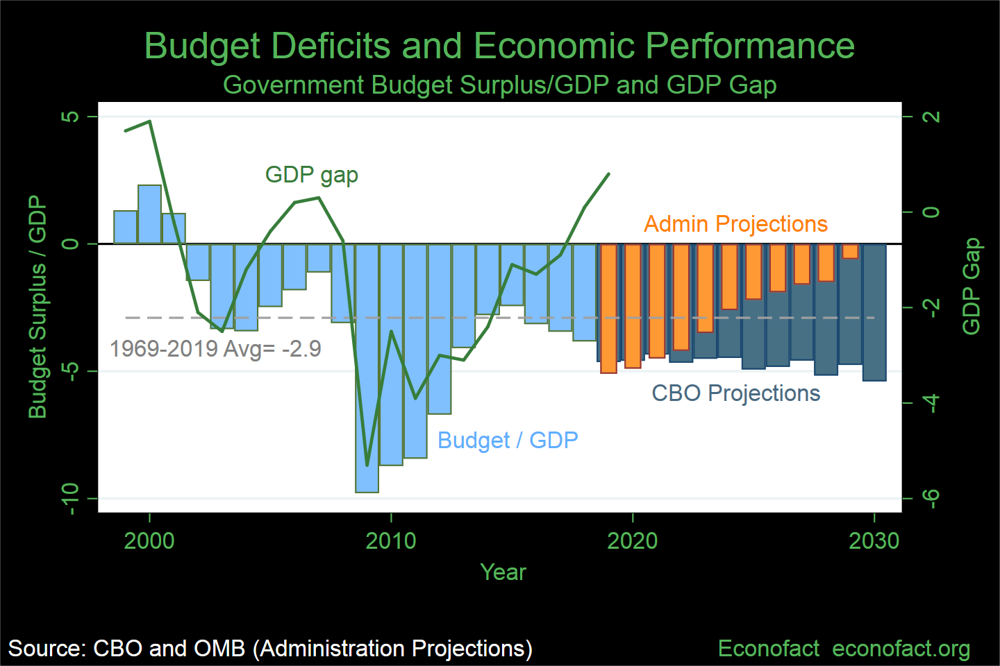

## Table of Contents

## What is a fiscal deficit?

A fiscal deficit happens when a government spends more money than it earns in a year. The government earns money from taxes and other sources, but if this is not enough to cover all its spending, it has a fiscal deficit. To make up for this, the government might borrow money by selling bonds or taking loans.

Having a fiscal deficit is not always bad. Sometimes, governments choose to spend more to help the economy grow or to provide important services like healthcare and education. But if the deficit is too big for too long, it can lead to problems. The government might have to pay a lot of interest on its debt, and this could mean less money for other important things.

## How is fiscal deficit calculated?

To calculate a fiscal deficit, you need to know how much money the government has coming in and how much it is spending. The money coming in is called revenue, and it comes from things like taxes, fees, and other sources. The money going out is called expenditure, and it covers things like salaries, infrastructure projects, and social programs. The fiscal deficit is simply the difference between the government's total expenditure and its total revenue. If the expenditure is more than the revenue, you have a fiscal deficit.

For example, if a government earns $100 billion in a year but spends $120 billion, the fiscal deficit would be $20 billion. This calculation helps governments and economists understand how much the government needs to borrow to cover its spending. It's an important number because it shows whether the government is living within its means or if it's relying on borrowed money to function.

## What is economic growth?

Economic growth means that a country's economy is getting bigger over time. It happens when the total value of all the goods and services made in a country goes up. This is usually measured by something called Gross Domestic Product, or GDP. When GDP grows, it means people are making and buying more things, and this can lead to more jobs and higher incomes for people.

Economic growth is important because it can make life better for people. When the economy grows, businesses can expand and hire more workers. This means more people can find jobs and earn money to support their families. But economic growth also has to be managed carefully. If it grows too fast, it can lead to problems like inflation, where prices go up a lot. If it grows too slowly, it can lead to unemployment and other issues. So, governments and economists work to find the right balance to keep the economy growing in a healthy way.

## How is economic growth measured?

Economic growth is usually measured by looking at the Gross Domestic Product, or GDP. GDP is the total value of all the goods and services produced in a country in a year. When GDP goes up, it means the economy is growing. Economists often look at the percentage change in GDP from one year to the next to see how fast the economy is growing.

Besides GDP, other things can be used to measure economic growth. One is Gross National Product, or GNP, which is similar to GDP but includes income from investments abroad. Another way is to look at changes in people's income or how much they are spending. These different measures help give a fuller picture of how the economy is doing and whether it is growing in a way that benefits everyone.

## What are the basic theories linking fiscal deficits to economic growth?

One basic theory says that fiscal deficits can help economic growth. This happens when the government spends more than it earns, often on things like building roads, schools, and hospitals. This spending can create jobs and make businesses busier. When people have jobs, they earn money and spend it, which can make the economy grow faster. This theory suggests that a fiscal deficit can be good if it's used to invest in things that help the economy in the long run.

Another theory warns that big fiscal deficits can hurt economic growth. If the government keeps borrowing money to cover its deficits, it might have to pay a lot of interest on its debt. This can take money away from other important things like education and healthcare. Also, if people think the government is borrowing too much, they might worry about the economy and spend less. This can slow down economic growth. So, this theory says that too much deficit can be bad for the economy in the long run.

In summary, these two theories show that the link between fiscal deficits and economic growth is not simple. It depends on how the government uses the money it borrows and how much it borrows. A small, well-managed deficit might help the economy grow, but a big, uncontrolled deficit could cause problems.

## Can fiscal deficits stimulate economic growth in the short term?

Yes, fiscal deficits can stimulate economic growth in the short term. When the government spends more money than it earns, it can put that extra money into things like building roads, schools, and hospitals. This spending creates jobs for people who work on these projects. When people have jobs, they earn money and spend it on things they need, like food and clothes. This spending helps businesses, and when businesses do well, they might hire more people. So, the economy starts to grow because of the extra spending from the government.

However, this boost to the economy might not last long. If the government keeps spending more than it earns, it will have to borrow a lot of money. Borrowing money means the government has to pay interest, and this can take money away from other important things like education and healthcare. Also, if people see the government borrowing too much, they might worry about the economy and start spending less. This can slow down the growth that the fiscal deficit helped start. So, while fiscal deficits can help in the short term, they need to be managed carefully to avoid problems later on.

## What are the potential long-term effects of sustained fiscal deficits on economic growth?

If a government keeps running big fiscal deficits for a long time, it can lead to problems that might slow down economic growth. When the government borrows a lot of money, it has to pay interest on that debt. This means less money for important things like schools, hospitals, and roads. If the government spends too much on interest, it might have to cut back on these services, which can make life harder for people and hurt the economy. Also, if people and businesses see the government borrowing too much, they might worry about the future and spend less money. This can slow down the economy and make it harder for it to grow.

Another problem with long-term fiscal deficits is that they can make inflation worse. When the government spends a lot of borrowed money, it puts more money into the economy. If there's too much money chasing too few goods, prices can go up a lot. This is called inflation, and it can make things more expensive for everyone. High inflation can make people feel poorer because their money doesn't go as far. It can also make it harder for businesses to plan and invest, which can slow down economic growth. So, while fiscal deficits might help in the short term, they need to be managed carefully to avoid these long-term problems.

## How do fiscal deficits affect interest rates and investment?

When the government runs a fiscal deficit, it means it is spending more money than it is [earning](/wiki/earning-announcement). To cover this gap, the government often borrows money by selling bonds. When the government borrows a lot, it can push up interest rates. This happens because there is more demand for money, and lenders want to be paid more to lend it out. Higher interest rates can make it more expensive for everyone, including businesses, to borrow money. If businesses have to pay more to borrow, they might decide to invest less in new projects or equipment.

If businesses invest less because of high interest rates, it can slow down economic growth. When businesses invest, they create jobs and help the economy grow. But if they hold back because borrowing is too expensive, fewer jobs are created, and the economy might not grow as fast. Also, if interest rates go up a lot, people might decide to save more and spend less, which can also slow down the economy. So, big fiscal deficits can lead to higher interest rates, which can make businesses invest less and slow down economic growth.

## What role does the size of the fiscal deficit play in its impact on economic growth?

The size of a fiscal deficit matters a lot when it comes to how it affects economic growth. A small fiscal deficit might not be a big problem. If the government borrows a little money to spend on things like building roads or schools, it can help the economy grow. This spending creates jobs and makes businesses busier. When people have jobs, they spend money, which helps the economy keep growing. So, a small, well-managed fiscal deficit can be good for the economy in the short term.

However, a big fiscal deficit can cause problems. If the government keeps borrowing a lot of money, it has to pay a lot of interest on its debt. This can take money away from important things like education and healthcare. Also, if people see the government borrowing too much, they might worry about the economy and spend less. This can slow down economic growth. So, while a small deficit might help, a big one can hurt the economy in the long run by making interest rates go up and making businesses invest less.

## How do different economic models predict the impact of fiscal deficits on growth?

Different economic models have different ideas about how fiscal deficits affect economic growth. One model, called Keynesian economics, says that fiscal deficits can help the economy grow, especially when it's not doing well. If the government spends more money than it earns, it can create jobs and make businesses busier. This spending can help the economy get back on track. But this model also says that deficits should be used carefully and not all the time, because too much borrowing can cause problems later.

Another model, called neoclassical economics, warns that big fiscal deficits can hurt economic growth in the long run. This model says that when the government borrows a lot of money, it can push up interest rates. Higher interest rates make it more expensive for businesses to borrow money, so they might invest less. If businesses invest less, it can slow down the economy. This model suggests that the government should try to keep its spending and earnings balanced to avoid these problems.

A third model, called the Ricardian equivalence, takes a different view. It says that fiscal deficits might not have much effect on economic growth at all. According to this model, people know that if the government borrows money now, it will have to pay it back later with taxes. So, people might save more money now to pay for those future taxes, which means they spend less. If people spend less, the extra spending from the government might not help the economy grow as much as expected.

## What empirical evidence exists on the relationship between fiscal deficits and economic growth?

Studies have looked at how fiscal deficits affect economic growth, and the results are mixed. Some research shows that in the short term, fiscal deficits can help the economy grow. When the government spends more than it earns, it can put money into things like building roads and schools. This spending creates jobs and makes businesses busier. When people have jobs, they earn money and spend it, which can help the economy grow faster. This is especially true when the economy is not doing well, and the government's spending can help it get back on track.

However, other studies suggest that big fiscal deficits can hurt economic growth in the long run. If the government keeps borrowing a lot of money, it has to pay a lot of interest on its debt. This can take money away from important things like education and healthcare. Also, when the government borrows a lot, it can push up interest rates. Higher interest rates make it more expensive for businesses to borrow money, so they might invest less. If businesses invest less, it can slow down the economy. So, while a small, well-managed deficit might help, a big one can cause problems later on.

Overall, the evidence shows that the impact of fiscal deficits on economic growth depends on many things, like how big the deficit is, how the government uses the money it borrows, and how healthy the economy is. A small deficit might help the economy grow in the short term, but a big deficit can lead to problems in the long run. It's important for the government to manage its spending and borrowing carefully to avoid hurting the economy.

## How do fiscal deficits in developed economies differ in their impact on growth compared to developing economies?

In developed economies, the impact of fiscal deficits on economic growth can be different from developing economies. In rich countries, governments often have better access to money markets and can borrow at lower interest rates. This means they can run larger deficits without causing big problems like high interest rates. Sometimes, a fiscal deficit can help the economy grow, especially if the money is spent on things like building roads or helping people during a recession. But if the deficit is too big for too long, it can still lead to problems like higher interest rates and less money for important services.

In developing economies, fiscal deficits can have a bigger impact on growth. These countries often have less money to borrow and might have to pay higher interest rates. If the government runs a big deficit, it can push up interest rates a lot, making it hard for businesses to borrow money and invest. This can slow down the economy. But on the other hand, if the government uses the borrowed money wisely to build things like schools and hospitals, it can help the economy grow. So, managing fiscal deficits carefully is even more important in developing countries to avoid hurting the economy.

Overall, while fiscal deficits can help both developed and developing economies grow in the short term, the risks and benefits are different. In developed countries, the impact might be less severe because of better borrowing conditions. In developing countries, the effects can be more immediate and potentially harmful if not managed well. It's important for governments in both types of economies to balance their spending and borrowing to keep their economies growing in a healthy way.

## References & Further Reading

[1]: Krugman, P. (2009). ["The Return of Depression Economics and the Crisis of 2008."](https://archive.org/details/returnofdepressi0000krug) W. W. Norton & Company.

[2]: Blanchard, O., Dell'Ariccia, G., & Mauro, P. (2010). ["Rethinking Macroeconomic Policy."](https://www.imf.org/external/pubs/ft/spn/2010/spn1003.pdf) IMF Staff Position Note.

[3]: Keynes, J. M. (1936). ["The General Theory of Employment, Interest, and Money."](https://link.springer.com/book/10.1007/978-3-319-70344-2) Palgrave Macmillan.

[4]: Lopez de Prado, M. (2018). ["Advances in Financial Machine Learning."](https://www.amazon.com/Advances-Financial-Machine-Learning-Marcos/dp/1119482089) Wiley.

[5]: Reinhart, C. M., & Rogoff, K. S. (2009). ["This Time is Different: Eight Centuries of Financial Folly."](https://www.nber.org/system/files/working_papers/w13882/w13882.pdf) Princeton University Press.

[6]: Chan, E. P. (2009). ["Quantitative Trading: How to Build Your Own Algorithmic Trading Business."](https://github.com/ftvision/quant_trading_echan_book) Wiley Trading.

[7]: Aronson, D. R. (2006). ["Evidence-Based Technical Analysis: Applying the Scientific Method and Statistical Inference to Trading Signals."](https://onlinelibrary.wiley.com/doi/book/10.1002/9781118268315) Wiley Trading.

[8]: Jansen, S. (2018). ["Machine Learning for Algorithmic Trading."](https://github.com/stefan-jansen/machine-learning-for-trading) Packt Publishing.