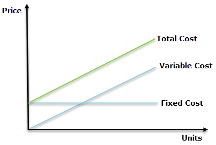

Algorithmic trading, commonly known as algo trading, represents a multifaceted area within the financial sector where computer algorithms are employed to execute trades at high speeds and volumes, far beyond the capacity of human traders. This method relies heavily on complex mathematical models and high-speed data analysis to make trading decisions.

A crucial aspect of succeeding in algorithmic trading involves understanding the intricate cost structures that can significantly impact profitability. Among these, variable costs, marginal costs, and fixed costs are key concepts that traders must consider. These economic principles can profoundly affect trading strategies and outcomes.



Variable costs in algo trading, such as transaction fees, data feed expenses, and the cost of system maintenance, vary with trading activity levels. Monitoring and managing these costs is essential, as they can fluctuate based on trading volume and market dynamics. 

Marginal cost is another pivotal concept, referring to the additional cost incurred when executing one more trade. Analyzing marginal costs allows traders to optimize their algorithms and evaluate the viability of increasing their trading activities.

On the other hand, fixed costs, which include expenses like software development, server leasing, and personnel salaries, remain constant irrespective of trading volumes. Grasping the influence of these costs helps in establishing stable financial plans.

By exploring how variable costs, marginal costs, and fixed costs interrelate within the context of algorithmic trading, this article aims to provide traders with valuable insights and practical knowledge to better manage their resources, optimize trading strategies, and ultimately, enhance profitability.

## Table of Contents

## Understanding Variable Costs in Algo Trading

Variable costs in [algorithmic trading](/wiki/algorithmic-trading) are dynamic expenses that vary directly with the [volume](/wiki/volume-trading-strategy) of trading activities. These costs are crucial for traders to manage effectively, as they can have a significant impact on profitability.

### Key Components of Variable Costs

1. **Transaction Fees**: These are fees that traders incur each time a transaction is executed. Transaction fees are usually charged by exchanges and brokers and can vary depending on the trading volume, the type of securities being traded, and the specific terms set by the brokerage firm. High-frequency trading, which involves a large number of transactions, often leads to higher cumulative transaction costs.

2. **Data Feed Subscriptions**: Access to real-time market data is essential for algorithmic trading. Data feed subscriptions provide traders with the necessary market information to make informed decisions. Costs for these subscriptions can vary depending on the provider and the level of detail or frequency of data updates required. A robust data feed is crucial for minimizing latency and ensuring the accuracy of trading signals.

3. **System Maintenance**: Maintaining the hardware and software infrastructure required for algorithmic trading incurs variable costs. This includes expenses for software updates, server upkeep, and cybersecurity measures. As trading strategies evolve and technological advancements occur, regular updates and maintenance are necessary to keep systems efficient and secure.

### Monitoring and Managing Variable Costs

Effective monitoring of variable costs is essential for cost management and enhancing efficiency in algo trading. Traders should develop strategies to minimize transaction fees, perhaps by choosing brokers that offer volume discounts or optimizing trade execution times. For data feed subscriptions, balancing the cost with the quality and speed of the data provided is vital. Additionally, ensuring that system maintenance is both timely and cost-effective can prevent unexpected disruptions or security breaches.

Python Example for Monitoring Transaction Fees:

```python
def calculate_transaction_fees(trades, fee_rate):
    total_fees = sum(trade['volume'] * fee_rate for trade in trades)
    return total_fees

trades = [{'volume': 1000}, {'volume': 500}, {'volume': 1500}]
fee_rate = 0.001  # example fee rate
print(f"Total Transaction Fees: {calculate_transaction_fees(trades, fee_rate)}")
```

This sample code calculates the total transaction fees based on the volume of trades and a predefined fee rate, illustrating how traders can keep track of one component of variable costs.

Understanding and strategically managing these variable costs can significantly enhance the efficiency and profitability of algorithmic trading endeavors. By keeping a close watch on these expenses and optimizing trading strategies accordingly, traders can achieve more consistent returns.

## Exploring the Concept of Marginal Cost

Marginal cost is a fundamental concept in economics that plays a critical role in algorithmic trading. It represents the additional cost incurred when executing one more trade. In the context of algorithmic trading, marginal cost can be influenced by several factors including transaction fees, market impact, and the opportunity cost of capital.

Transaction fees are direct costs associated with executing trades. These fees can vary depending on the trading platform, the type of financial instrument, and the volume of the trade. As traders increase their trading activity, they should carefully calculate these fees to understand their impact on overall profitability.

Market impact refers to the change in the price of a security caused by executing a trade. Large trades can move markets, potentially resulting in less favorable prices for subsequent trades. Algorithmic traders must consider the market impact as it directly affects the marginal cost of additional trades. Sophisticated algorithms often incorporate strategies to minimize market impact, such as breaking large orders into smaller ones to be executed over time.

The opportunity cost of capital is another consideration when evaluating marginal costs. This involves the potential returns lost when capital is used for one investment instead of an alternative. Traders should assess whether the expected returns from additional trades justify the use of capital, considering both the risk and the opportunity cost involved.

Understanding marginal cost helps traders optimize their algorithms and assess the viability of increasing trading activities. For instance, if the marginal cost of an additional trade is lower than the expected profit, the trade is likely worthwhile. Conversely, if the marginal cost exceeds the expected profit, the trade might not be advisable. 

Traders can use Python to model and analyze marginal costs. By simulating different trading scenarios, they can estimate transaction fees, market impact, and potential returns. This approach allows for precise calibration of strategies and contributes to effective decision-making.

```python
def calculate_marginal_cost(transaction_fee, market_impact_cost, opportunity_cost):
    return transaction_fee + market_impact_cost + opportunity_cost

# Example
transaction_fee = 0.01  # Hypothetical per trade fee
market_impact_cost = 0.005  # Hypothetical market impact
opportunity_cost = 0.02  # Hypothetical opportunity cost

marginal_cost = calculate_marginal_cost(transaction_fee, market_impact_cost, opportunity_cost)
print(f"The marginal cost of an additional trade is: {marginal_cost}")
```

By integrating marginal cost analysis into their strategies, traders can make informed decisions about scaling their operations. This understanding enables them to balance costs and benefits effectively, leading to sustainable growth and improved profitability in algorithmic trading.

## Fixed Costs and Their Impact on Algo Trading

Fixed costs are core financial obligations that remain static regardless of trading volume in algorithmic trading. These encompass expenses such as software development, server leasing, and salaries for skilled personnel. Unlike variable costs, which fluctuate based on activity, fixed costs provide a predictable financial framework. This stability enables traders to formulate effective budgets.

Understanding fixed costs is pivotal as they form the backbone of any trading operation. For instance, developing reliable algorithmic trading software often requires significant investment at the outset. This includes research and development costs, testing stages, and eventual deployment. Once established, these costs do not vary with the number of trades executed. This is in contrast to transaction fees, which are considered variable costs.

Server leasing is another critical fixed cost. High-frequency trading necessitates robust IT infrastructure. Whether a trader is executing hundreds or thousands of trades, the server leasing expense remains constant. This ensures consistent performance and minimal downtime, both crucial for maintaining competitive advantage in markets.

Hiring skilled personnel presents another layer of fixed costs. The talent needed for algorithmic trading—such as quantitative analysts, software engineers, and risk management experts—represents a significant financial commitment. These personnel costs are fixed, providing stability in operational budgeting.

Efficiently managing fixed costs is crucial. By minimizing unnecessary expenditures and negotiating favorable terms for leasing and services, traders can enhance their operational efficiency. Tools such as cost-benefit analysis and budgeting software aid in identifying and controlling these expenses. For example, a trader might use financial software to simulate scenarios with different fixed-cost structures to determine the optimal setup for profitability.

Strategically managing these fixed costs lays a stable foundation and allows traders to focus on optimizing their variable costs and improving trading algorithms. This comprehensive approach is vital for sustaining operations and achieving long-term financial goals in the competitive world of algorithmic trading.

## Integrating Cost Structures into Algo Trading Strategies

Integrating cost structures into algorithmic trading strategies is essential for improving profitability. A detailed understanding of cost components—variable costs, fixed costs, and marginal costs—facilitates the creation of effective trading models. Variable costs, such as transaction fees and data subscription costs, depend on trading volume and market conditions. By contrast, fixed costs, including software development and server leasing, remain constant within a certain activity range.

For optimal algorithmic trading, traders should construct models that accurately reflect these costs. A practical approach is to develop a cost function $C = \text{Fixed Costs} + \text{Variable Costs}$, where variable costs can be represented as $V(t) = c \times t$. Here, $V(t)$ represents variable costs as a function of transaction volume $t$, and $c$ is the cost per transaction.

Marginal cost analysis is crucial when deciding on additional trading activities. In algorithmic trading, the marginal cost $MC = \frac{dC}{dt}$ must be assessed. This formula helps in evaluating whether executing additional trades results in net gains. Lowering marginal costs often involves technological upgrades or algorithm improvements.

Constantly analyzing and iterating upon these models ensures they align with market dynamics. This adaptability is crucial in coping with the [volatility](/wiki/volatility-trading-strategies) and unpredictability inherent to the financial markets. Employing [machine learning](/wiki/machine-learning) techniques could evolve these models further—continuous data input and recalibration allow for the fine-tuning of cost predictions.

Effective cost management juxtaposes models’ output with real-world results. By systematically refining strategies, traders can maximize returns while minimizing cost-related inefficiencies. Incorporating these principles fosters more consistent returns and sustainable growth within highly competitive trading environments. As technologies advance, adopting rigorous cost structure analyses will serve as a foundational pillar for successful algorithmic trading strategies.

## Conclusion

Navigating the intricate world of algorithmic trading is no small feat. To achieve success, traders must thoroughly understand and manage the various cost structures associated with their trading activities. This includes variable costs, which fluctuate with trade volume, such as transaction fees and data subscriptions, and fixed costs, which remain constant, such as software development and server leasing. By gaining a keen understanding of these costs, traders can build robust and profitable strategies.

Marginal cost analysis further enhances trading efficiency by helping traders assess the viability and potential return of executing additional trades. Recognizing these economic principles allows traders to create models that effectively balance costs, optimize trading operations, and adapt to market changes. Incorporating a systematic approach to cost management can critically increase returns and facilitate sustainable growth.

As the market environment continues to evolve, a detailed knowledge of cost analysis sets successful traders apart. Mastering these fundamentals in algorithmic trading processes will not only lead to optimized strategies and improved financial performance but also serve as a significant competitive advantage. Embracing these concepts is essential for traders aspiring to achieve their financial goals in the dynamic world of algorithmic trading.

## References & Further Reading

[1]: Bergstra, J., Bardenet, R., Bengio, Y., & Kégl, B. (2011). ["Algorithms for Hyper-Parameter Optimization."](https://papers.nips.cc/paper/4443-algorithms-for-hyper-parameter-optimization) Advances in Neural Information Processing Systems 24.

[2]: ["Advances in Financial Machine Learning"](https://www.amazon.com/Advances-Financial-Machine-Learning-Marcos/dp/1119482089) by Marcos Lopez de Prado

[3]: ["Evidence-Based Technical Analysis: Applying the Scientific Method and Statistical Inference to Trading Signals"](https://www.amazon.com/Evidence-Based-Technical-Analysis-Scientific-Statistical/dp/0470008741) by David Aronson

[4]: ["Machine Learning for Algorithmic Trading"](https://github.com/stefan-jansen/machine-learning-for-trading) by Stefan Jansen

[5]: ["Quantitative Trading: How to Build Your Own Algorithmic Trading Business"](https://www.amazon.com/Quantitative-Trading-Build-Algorithmic-Business/dp/1119800064) by Ernest P. Chan