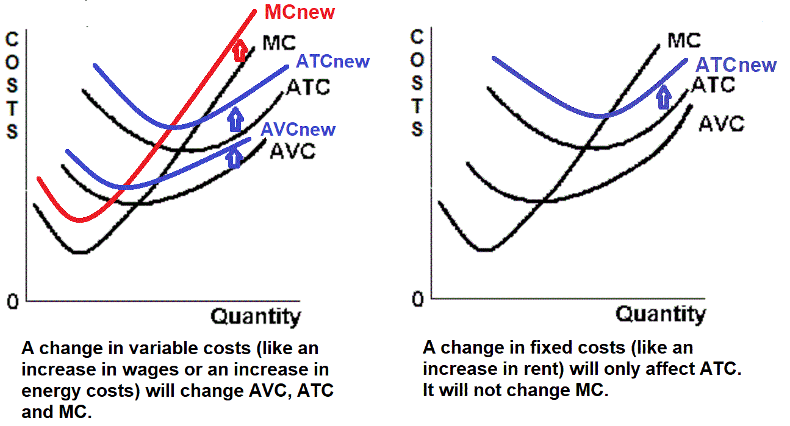

## Table of Contents

## What are fixed costs?

Fixed costs are expenses that stay the same no matter how much a business produces or sells. These costs do not change with the level of output or sales. For example, rent for a store or office is a fixed cost because it remains the same each month, regardless of how many products are sold.

Understanding fixed costs is important for businesses because it helps them plan their budgets and predict profits. If a business knows its fixed costs, it can figure out how many products it needs to sell to cover those costs and start making a profit. Fixed costs are different from variable costs, which do change with the level of production or sales.

## What are variable costs?

Variable costs are expenses that change depending on how much a business produces or sells. If a business makes more products, its variable costs go up. If it makes fewer products, these costs go down. For example, the cost of materials like wood or fabric would be a variable cost because the more products a business makes, the more materials it needs.

Understanding variable costs is important for businesses because it helps them figure out how much it costs to make each product. This information is useful for setting prices and planning how much to produce. By knowing both fixed and variable costs, a business can better manage its finances and make smarter decisions about production and sales.

## How do fixed costs affect total cost?

Fixed costs are the costs that stay the same no matter how much a business makes or sells. They are like a steady bill that a business has to pay every month. When you add up all the costs of running a business, fixed costs are always part of that total. So, if a business has high fixed costs, like a big rent for their store, the total cost of running the business will be higher.

Even if a business doesn't make or sell anything, it still has to pay its fixed costs. This means that fixed costs can make the total cost go up, even if the business isn't doing much. But, if a business can sell a lot of products, the fixed costs get spread out over more items. This can make the cost per item go down, which is good for the business.

## How do variable costs affect total cost?

Variable costs are the costs that change depending on how much a business makes or sells. If a business makes more products, its variable costs go up because it needs more materials and might have to pay more for things like electricity or labor. For example, if a bakery makes more cakes, it will need more flour and sugar, which increases the total cost.

When you add up all the costs of running a business, variable costs are a big part of that total. If a business makes a lot of products, the total cost will be higher because of the higher variable costs. But, if a business can sell all those products, the higher total cost might be okay because the business can make more money. So, variable costs can make the total cost go up and down, depending on how much the business produces.

## What is marginal cost?

Marginal cost is the extra cost that comes from making one more item. If a business makes a lot of products, each new product might cost a little more to make because of things like needing more materials or working longer hours. For example, if a toy factory makes one more toy, the cost of the plastic and the time it takes to make it is the marginal cost.

Understanding marginal cost is important for businesses because it helps them decide if making more products is a good idea. If the cost of making one more item is less than the price they can sell it for, then it makes sense to make more. But if the marginal cost is higher than the selling price, the business might lose money by making more items. So, businesses use marginal cost to help them make smart choices about how much to produce.

## How is marginal cost calculated?

Marginal cost is figured out by looking at how much the total cost changes when you make one more item. You do this by taking the total cost of making a certain number of items, then making one more item and seeing what the new total cost is. The difference between the two total costs is the marginal cost of that one extra item.

For example, if it costs $100 to make 10 toys and $107 to make 11 toys, the marginal cost of the 11th toy is $7. This number helps businesses decide if it's worth it to make more toys. If they can sell the 11th toy for more than $7, it makes sense to make it. But if they can only sell it for less than $7, they might lose money by making that extra toy.

## How do fixed costs impact marginal cost?

Fixed costs are the costs that stay the same no matter how many items a business makes. Things like rent or salaries for managers are fixed costs. Because these costs don't change when you make one more item, they don't affect the marginal cost. Marginal cost is all about the extra cost of making one more item, and fixed costs don't add to that extra cost.

So, when you're figuring out the marginal cost, you can ignore the fixed costs. Only the costs that change, like materials or extra labor, matter for marginal cost. This makes it easier for businesses to plan because they know that their fixed costs won't mess up their calculations for making one more item.

## How do variable costs directly influence marginal cost?

Variable costs are the costs that change when a business makes more or fewer items. Things like materials, extra labor, or electricity are variable costs. When a business decides to make one more item, these variable costs go up. For example, if a bakery makes one more cake, it needs more flour and sugar, which costs more money. This extra cost for the materials and labor to make that one more item is what we call the marginal cost.

Because variable costs change with how much a business makes, they directly affect the marginal cost. If the cost of materials goes up, the marginal cost of making one more item will also go up. For example, if the price of flour goes up, the cost of making one more cake will be higher. So, businesses need to keep an eye on their variable costs because they can change the marginal cost and affect how much it costs to make each new item.

## Can fixed costs ever affect marginal cost? If so, how?

Fixed costs are the costs that stay the same no matter how many items a business makes. Things like rent or salaries for managers are fixed costs. Usually, fixed costs don't affect the marginal cost because they don't change when you make one more item. Marginal cost is all about the extra cost of making one more item, and fixed costs don't add to that extra cost.

However, in some special cases, fixed costs can affect marginal cost. For example, if a business reaches the limit of what its fixed resources can handle, like if a factory is working at full capacity, making one more item might mean the business needs to buy more machines or rent more space. These new costs would be fixed costs, but they would also add to the cost of making that one more item, so they would affect the marginal cost. So, while fixed costs usually don't affect marginal cost, they can in situations where the business needs to expand its fixed resources to make more items.

## What are the implications of high fixed costs on marginal cost in the long run?

High fixed costs can have a big impact on marginal cost in the long run. If a business has high fixed costs, like a big rent or expensive equipment, it might need to make a lot more items to spread out those costs. If the business wants to make more items, it might need to buy more machines or rent more space. These new costs would be fixed costs, but they would also add to the cost of making that one more item, so they would affect the marginal cost. This means that in the long run, high fixed costs can make the marginal cost go up if the business needs to expand to make more items.

In the long run, businesses with high fixed costs need to think carefully about how much to produce. If they can make a lot more items without needing to expand, the high fixed costs won't affect the marginal cost. But if they need to buy more machines or rent more space to make more items, the marginal cost will go up. This can make it harder for the business to decide if making more items is a good idea, because the cost of making each new item will be higher. So, high fixed costs can make things more complicated for businesses when they're planning for the future.

## How does the proportion of fixed to variable costs affect a company's pricing strategy?

The mix of fixed and variable costs can really change how a company decides to set its prices. If a company has a lot of fixed costs, like a big rent or expensive equipment, it needs to make sure it sells enough to cover those costs. So, it might set its prices higher to make sure it can pay for those fixed costs. But if the company can make a lot of items without needing to spend more on fixed costs, it might be able to lower its prices a bit to sell more items and spread out those fixed costs over more products.

On the other hand, if a company has a lot of variable costs, like materials or extra labor, its prices might change more often. This is because the cost of making each item can go up or down depending on how much it costs to get the materials or pay for the extra work. So, the company might need to change its prices to match these changes in costs. This can make pricing more complicated, but it also gives the company a chance to adjust its prices to stay competitive and make sure it's making enough money to cover all its costs.

## In what scenarios might a change in fixed or variable costs significantly alter the marginal cost curve?

A change in fixed costs can significantly alter the marginal cost curve if a business needs to expand its fixed resources to make more items. For example, if a factory is already working at full capacity and wants to make more products, it might need to buy new machines or rent more space. These new fixed costs would add to the cost of making each additional item, causing the marginal cost curve to shift upward. This means that the cost of making one more item would be higher than before, which could affect the business's decisions about how much to produce.

Changes in variable costs can also have a big impact on the marginal cost curve. If the price of materials or labor goes up, the cost of making each new item will go up too. This would make the marginal cost curve shift upward because it costs more to make one more item. On the other hand, if the price of materials or labor goes down, the marginal cost curve would shift downward, making it cheaper to make each new item. These changes in variable costs can make a big difference in how much it costs to produce more items, which can affect a business's pricing and production decisions.

## References & Further Reading

[1]: Bergstra, J., Bardenet, R., Bengio, Y., & Kégl, B. (2011). ["Algorithms for Hyper-Parameter Optimization."](https://papers.nips.cc/paper/4443-algorithms-for-hyper-parameter-optimization) Advances in Neural Information Processing Systems 24.

[2]: ["Advances in Financial Machine Learning"](https://www.amazon.com/Advances-Financial-Machine-Learning-Marcos/dp/1119482089) by Marcos Lopez de Prado

[3]: ["Evidence-Based Technical Analysis: Applying the Scientific Method and Statistical Inference to Trading Signals"](https://www.amazon.com/Evidence-Based-Technical-Analysis-Scientific-Statistical/dp/0470008741) by David Aronson

[4]: ["Machine Learning for Algorithmic Trading"](https://github.com/stefan-jansen/machine-learning-for-trading) by Stefan Jansen

[5]: ["Quantitative Trading: How to Build Your Own Algorithmic Trading Business"](https://www.amazon.com/Quantitative-Trading-Build-Algorithmic-Business/dp/1119800064) by Ernest P. Chan