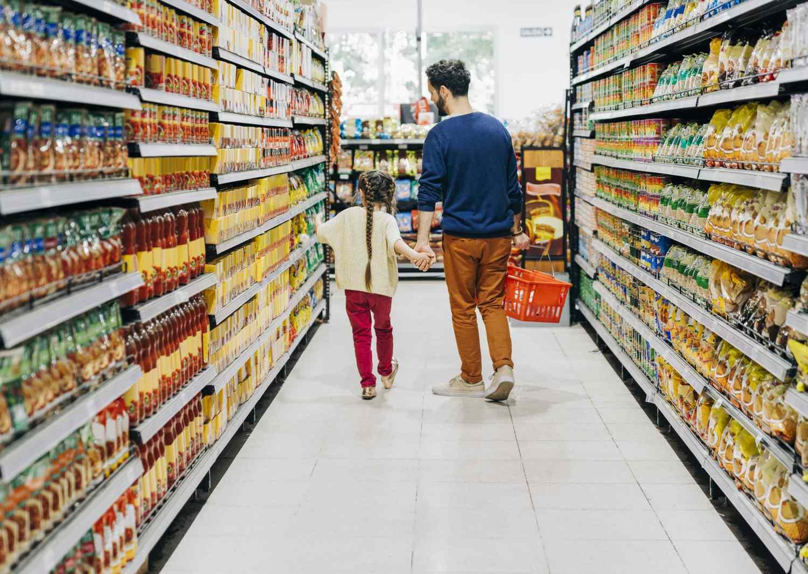

## Table of Contents

## What is food insecurity?

Food insecurity is when people don't have enough food or can't get the right kind of food they need to stay healthy. It happens when they don't have enough money to buy food or when they live in places where it's hard to find good food. This can make people feel hungry a lot and can make them sick if they don't get the nutrients they need.

Many things can cause food insecurity, like losing a job, having a low income, or living in a poor area. It can affect anyone, but it's more common in certain groups, like families with kids, older people, and people who are out of work. Governments and charities try to help by giving out food or money, but it's a big problem that needs a lot of work to fix.

## How does food insecurity affect individuals and communities?

Food insecurity can make life really hard for people. When someone doesn't have enough food, they might feel hungry all the time and have trouble thinking clearly or doing their job well. This can lead to health problems like being too skinny or too heavy, getting sick more often, and even feeling sad or worried a lot. Kids who don't get enough food might not grow properly and can have a hard time in school because they can't focus.

Communities also feel the impact of food insecurity. When a lot of people in a neighborhood don't have enough food, it can make the whole area struggle. Stores might not want to sell fresh food there because people can't afford it, which makes it even harder for people to find good food. This can lead to more crime and make the community feel less safe and happy. Everyone in the community, from kids to older people, can feel the stress and worry that comes with not knowing where their next meal will come from.

## What are stock markets and how do they function?

Stock markets are places where people can buy and sell pieces of companies, called stocks or shares. When you buy a stock, you own a little bit of that company. The price of a stock goes up and down depending on how well the company is doing and what people think about it. Stock markets help companies get money to grow by selling these stocks to people who want to invest in them. They also let people make money if the stock price goes up or if the company pays them part of its profits, called dividends.

Stock markets work a lot like big auctions. If more people want to buy a stock than sell it, the price goes up. If more people want to sell, the price goes down. People who work at stock markets, called brokers, help people buy and sell stocks. There are also big computers that keep track of all the buying and selling, making sure everything is fair and correct. Stock markets are important because they help the economy by letting money move around and helping companies grow.

## Can food insecurity influence stock market performance?

Food insecurity can affect stock market performance because it shows how well people are doing. When a lot of people don't have enough food, it means they might not have much money. This can make them spend less on things they don't need, like new clothes or gadgets. When people spend less, companies make less money, and their stock prices might go down. So, if food insecurity is bad in a country, it can make the stock market go down too.

Also, food insecurity can make the whole economy feel shaky. If people are worried about getting enough food, they might save their money instead of spending it or investing in stocks. This can slow down the economy and make companies less sure about their future. When companies are unsure, they might not want to grow or start new projects, which can make their stock prices drop. So, food insecurity can make the stock market less stable and affect how well it does.

## What are some examples of food insecurity events that have impacted stock markets?

One big example of food insecurity affecting stock markets happened during the global food crisis in 2007-2008. Prices for food like wheat, corn, and rice went way up because of bad weather, more people wanting food, and countries not wanting to share their food. This made it hard for a lot of people to buy enough food, especially in poor countries. As people had less money to spend on other things, companies that make those things saw their sales go down. This made their stock prices drop, and the whole stock market felt the strain.

Another example is the food insecurity caused by the COVID-19 pandemic starting in 2020. When the virus spread, a lot of people lost their jobs and couldn't afford food. This made food insecurity worse in many places. At the same time, the stock market got really shaky because people were worried about the economy. Companies that make or sell food, like grocery stores and restaurants, had a hard time because people were buying less or differently. This uncertainty made stock prices go up and down a lot, showing how food insecurity can mess with the stock market.

## How do investors react to news about food insecurity?

When investors hear about food insecurity, they often start to worry about the economy. They know that if a lot of people can't afford food, those people will spend less money on other things too. This can make companies sell less stuff, which means those companies might not make as much money. When investors think companies will make less money, they might sell their stocks in those companies, which can make stock prices go down.

Sometimes, news about food insecurity can make investors think about which companies might do better or worse. For example, if food prices are going up, investors might buy stocks in companies that make or sell food because they think those companies will make more money. But they might sell stocks in companies that make things people don't need as much, like fancy clothes or big TVs, because they think people will buy less of those things when they're worried about food. So, food insecurity news can make investors change what they buy and sell in the stock market.

## What sectors of the stock market are most affected by food insecurity?

The food and agriculture sector is one of the most affected by food insecurity. When people can't afford food, companies that grow, process, or sell food might see changes in how much they sell. If food prices go up, these companies might make more money, but if people can't buy enough food, they might make less. This can make their stock prices go up and down a lot. Also, companies that make things like fertilizers or farming equipment might be affected because farmers might not buy as much if they're worried about selling their crops.

Another sector that feels the impact of food insecurity is retail. Stores that sell food, like supermarkets, might see more people coming in if food prices are high, but they might also see people buying less of other things. This can make their profits go up and down. Stores that sell non-food items, like clothes or electronics, might sell less because people are spending their money on food instead. This can make their stock prices drop if investors think they won't make as much money.

The restaurant and hospitality sector is also affected. When people are worried about food, they might eat out less often, which can hurt restaurants and hotels. This can lead to lower profits for these businesses and make their stock prices fall. Investors might sell their stocks in these companies if they think people will keep spending less on eating out and traveling.

## How do government policies on food security influence stock markets?

Government policies on food security can have a big impact on stock markets. When governments make rules to help people get enough food, like giving out food stamps or helping farmers, it can make people feel more sure about the future. This can make them spend more money on other things, which is good for companies. When companies do well, their stock prices might go up, and the whole stock market can feel more stable. But if the government doesn't do enough to help with food security, people might worry more about getting enough to eat. This can make them spend less money, which can hurt companies and make their stock prices go down.

Sometimes, government policies can directly affect certain parts of the stock market. For example, if the government gives money to farmers to grow more food, companies that make farming equipment or sell seeds might do better. This can make their stock prices go up. On the other hand, if the government puts taxes on food to make it more expensive, companies that sell food might make less money, and their stock prices could go down. So, what the government does about food security can change how investors feel about different companies and affect the stock market in big ways.

## What role do global trade and supply chains play in the relationship between food insecurity and stock markets?

Global trade and supply chains are really important when it comes to food insecurity and how it affects stock markets. When countries trade food with each other, it can help make sure people have enough to eat. But if something goes wrong, like a bad harvest or a problem with shipping, it can make food prices go up and cause food insecurity. This can make people spend less money on other things, which can hurt companies and make their stock prices go down. Investors watch these things closely because they know that problems with global trade can shake up the stock market.

Supply chains are also a big deal. They are like the paths that food takes from farms to stores. If there's a problem in the supply chain, like a factory closing or a ship getting stuck, it can make it hard to get food to people. This can make food more expensive and cause food insecurity. When this happens, companies that make or move food might not make as much money, and their stock prices can go down. Investors pay attention to supply chain news because it can tell them a lot about what might happen to the stock market.

## How can predictive models be used to assess the impact of food insecurity on stock markets?

Predictive models can help us guess how food insecurity might affect stock markets by looking at past data and finding patterns. These models use information like food prices, how much people are spending, and how well companies are doing to make guesses about what might happen next. For example, if a model sees that when food prices go up, people spend less on other things, it can predict that stock prices for companies that make those other things might go down. By using these models, investors and companies can get ready for changes in the stock market caused by food insecurity.

These models can also help by looking at global trade and supply chains. If a model sees that problems in one part of the world, like a bad harvest, can make food prices go up everywhere, it can predict how this might affect different sectors of the stock market. For example, if food gets more expensive because of a problem in the supply chain, the model might predict that companies that sell food will do better, but companies that make things people don't need as much might do worse. This way, predictive models give us a way to see into the future a little bit and make smarter choices about investing and planning.

## What are the long-term economic implications of food insecurity on stock market stability?

Food insecurity can make the stock market less stable over a long time. When a lot of people don't have enough food, they spend less money on things they don't need. This can make companies sell less stuff and make less money, which can make their stock prices go down. If this keeps happening, it can make the whole stock market feel shaky because people are worried about the economy. Investors might start selling their stocks more often, which can make the stock market go up and down a lot. This can make it hard for companies to plan for the future and grow, which can keep the stock market from being stable.

Over time, food insecurity can also change how people think about investing. If people see that food insecurity keeps causing problems in the stock market, they might decide to invest their money in other ways, like saving it or buying things that are safer. This can make less money go into the stock market, which can make it harder for companies to get the money they need to grow. When companies can't grow, it can slow down the whole economy. So, if food insecurity keeps being a big problem, it can make the stock market less stable and affect how well the economy does in the long run.

## How can companies and investors mitigate the risks associated with food insecurity in their investment strategies?

Companies and investors can reduce the risks from food insecurity by keeping a close eye on what's happening with food prices and how much people are spending. They can use special tools, like predictive models, to guess what might happen next. If they see that food prices might go up, they can change their plans. For example, companies might start selling more food or cheaper food to help people who can't afford much. Investors might decide to put their money into companies that make or sell food because those companies might do better when food prices go up. By watching and planning ahead, companies and investors can be ready for changes caused by food insecurity.

Another way to lower the risks is by spreading out investments. Instead of putting all their money into one kind of company, investors can put it into different kinds of companies. This way, if food insecurity hurts some companies, the investor's other investments might still do well. Companies can also work on making their supply chains stronger so they can still get food to people even if something goes wrong. By being ready for problems and having a plan to deal with them, companies and investors can make their investments safer and help keep the economy stable even when food insecurity is a big issue.

## References & Further Reading

[1]: Von Braun, J. (2009). ["Addressing the food crisis: Governance, market functioning, and investment in public goods."](https://link.springer.com/article/10.1007/s12571-008-0001-z) Food Security, 1(1), 9-15.

[2]: Baker, M., & Wurgler, J. (2007). ["Investor sentiment in the stock market."](https://www.jstor.org/stable/30033721) Journal of Economic Perspectives, 21(2), 129-151.

[3]: Giller, K. E., et al. (2009). ["The challenge of feeding 9 billion people."](https://www.sciencedirect.com/science/article/abs/pii/S0378429009001701) Science, 327(5967), 812-818.

[4]: Alderman, H., & Paxson, C. H. (1992). ["Do the poor insure? A synthesis of the literature on risk and consumption in developing countries."](https://documents1.worldbank.org/curated/en/682441468765261969/pdf/multi0page.pdf) The World Bank Economic Review, 6(1), 1-23.

[5]: Paris, Q., & Caputo, M. R. (2006). ["Agricultural production and risk preferences: Theoretical and empirical findings."](https://papers.ssrn.com/sol3/papers.cfm?abstract_id=1677060) Springer.

[6]: Lin, J. Y., & Ravallion, M. (2004). ["Understanding the impact of food prices on world hunger."](https://cepr.org/voxeu/columns/work-martin-ravallion-poverty-and-inequality) World Bank Publications.

[7]: Menkveld, A. J. (2013). ["High Frequency Trading and the New-Market Makers."](https://www.sciencedirect.com/science/article/pii/S1386418113000281) The Review of Financial Studies, 27(11), 3268-3336.