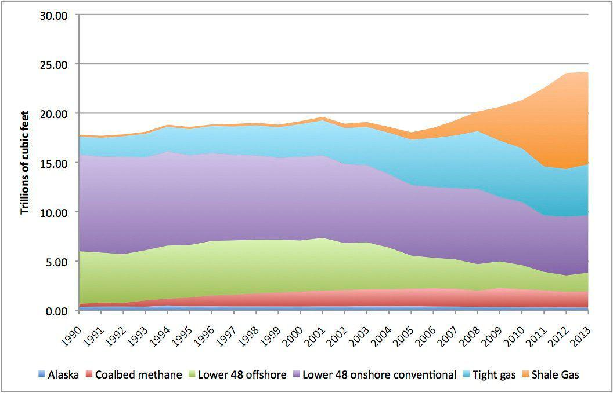

The modern energy market is a complex ecosystem where natural gas prices play a significant role. As one of the primary sources of energy, natural gas is a critical component in the production of electricity, heating, and as industrial feedstock. The intricacies of its pricing are influenced by several factors, including supply and demand dynamics, geopolitical events, and regional production capacities. These factors create a multifaceted market where strategic decisions are paramount for both producers and consumers.

Fracking, or hydraulic fracturing, has been pivotal in reshaping the energy landscape. This method involves the extraction of natural gas from shale formations by injecting high-pressure fluid to fracture rock layers, thereby releasing trapped hydrocarbons. The advent of fracking technologies in the early 2000s significantly increased natural gas production, particularly in the United States, thereby altering global energy economies and supply chains. This increase in supply has often contributed to stabilization and in some cases reduction of natural gas prices, influencing economic and environmental policies across nations.



Algorithmic trading has emerged as a game-changer in the energy market, offering efficiency and precision in trading operations. By employing complex algorithms, market participants can execute high-frequency trades and optimize their portfolios in milliseconds, thereby enhancing price discovery and market liquidity. This technological advancement allows traders to capitalize on small price movements and manage risks associated with market volatility.

In this article, we explore how these elements interact and impact the broader energy industry. By examining the relationship between natural gas prices, fracking, and algorithmic trading, we can better understand the current and future dynamics of the energy market. This analysis is essential for stakeholders aiming to navigate the complexities of the modern energy ecosystem and make informed decisions that align with economic growth and environmental sustainability.

## Table of Contents

## Understanding Natural Gas Prices

Natural gas prices are a critical factor in the global energy market, influenced by a multitude of determinants that contribute to their dynamic nature. Among the primary factors affecting natural gas prices are supply, demand, and geopolitical events.

Supply and demand dynamics play a fundamental role in shaping natural gas prices. On the supply side, the availability of natural gas is largely driven by production capabilities and technological advancements in extraction methods. For instance, innovations such as hydraulic fracturing (fracking) have substantially increased the supply of natural gas, particularly in the United States, leading to shifts in global supply patterns. An oversupply in the market often results in decreased prices, whereas a reduction in supply may cause prices to surge.

Demand for natural gas is equally significant and is shaped by factors such as weather conditions, economic growth, and fuel-switching capabilities. In colder seasons, the demand typically rises as natural gas is a primary source for heating. Additionally, economic expansion generally leads to increased energy consumption, thereby elevating the demand for natural gas.

Geopolitical events also have the potential to profoundly impact natural gas prices. Tensions in key producing regions can lead to supply disruptions, causing prices to fluctuate. For example, political instability in the Middle East or sanctions on major producing countries can constrict supply chains, leading to heightened market [volatility](/wiki/volatility-trading-strategies).

The regional nature of the natural gas market is another important consideration. Unlike other energy commodities, natural gas prices are often confined to regional constraints due to limited storage capabilities and transport logistics. In many cases, these markets operate independently, with prices being closely tied to regional production and consumption patterns. For instance, natural gas prices in North America may differ from those in Europe due to distinct supply sources, infrastructure, and consumption behaviors.

Transportation logistics are pivotal in determining natural gas pricing, particularly regarding pipeline availability and associated costs. The construction and maintenance of pipeline infrastructure entail significant investment, and limited pipeline availability can restrict the flow of natural gas, thus affecting its market price. Furthermore, transport costs, including those associated with shipping liquefied natural gas (LNG) to distant markets, are crucial in price formulation. In regions where pipeline infrastructure is underdeveloped, reliance on LNG increases, often leading to higher prices due to additional processing and transport expenses.

In conclusion, numerous factors influence natural gas prices, with supply and demand dynamics, geopolitical events, regional market characteristics, and transportation logistics being among the most pivotal. The complex interplay between these elements ensures that natural gas markets remain dynamic and often unpredictable, necessitating continuous monitoring and analysis to effectively navigate their fluctuations.

## The Role of Fracking in the Energy Market

Fracking, or hydraulic fracturing, has emerged as a transformative technology in the energy market, particularly in the extraction of natural gas. This method involves injecting a high-pressure mixture of water, sand, and chemicals into underground rock formations, typically shale, to create fissures. These fissures allow natural gas, which had previously been trapped, to flow more freely to the production wells, substantially increasing the accessibility of these resources.

Over the past decades, fracking has led to a significant surge in the supply of natural gas, especially in the United States, which is home to vast shale formations. Prior to the adoption of fracking techniques, these resources were not economically viable due to the costs and technological limitations associated with traditional drilling methods. This boom in supply has had a corresponding impact on natural gas prices, generally contributing to a decrease in costs for consumers and industries reliant on natural gas. 

Technological advancements have been pivotal in enhancing the efficiency of fracking operations. Horizontal drilling, for example, allows the wells to extend across long distances within the shale layers, maximizing extraction from a single site and reducing the footprint of drilling operations. Additionally, improvements in seismic imaging have enabled companies to better map underground formations, thereby optimizing the placement of wells and increasing the yield of gas extraction.

Further innovations have also focused on elevating the cost-effectiveness of fracking. By fine-tuning the composition of the fracturing fluid and using more precise pumping techniques, companies can extract natural gas more effectively while minimizing equipment wear and operational downtime. These advancements have critical implications for natural gas pricing, as they facilitate greater production volumes at lower costs.

The rapid expansion of fracking has also sparked debates regarding environmental concerns, including the potential for groundwater contamination, induced seismic activity, and the increased use of water resources. These issues highlight the need for regulatory frameworks to manage and mitigate the environmental impacts associated with fracking operations. Nonetheless, the economic implications of fracking—such as job creation in the energy sector and improved energy security through domestic production—remain significant factors shaping energy policies and market dynamics.

## Algorithmic Trading in the Energy Market

Algorithmic trading has emerged as a transformative force in the energy market. This approach leverages sophisticated algorithms to execute automated trading decisions, significantly enhancing the efficiency of trading activities. Unlike traditional trading, which relies heavily on human intervention, [algorithmic trading](/wiki/algorithmic-trading) utilizes mathematical models and algorithms that analyze various market factors at a remarkable speed, allowing for rapid decision-making.

One clear advantage of algorithmic trading is the improvement in price formation and increased market [liquidity](/wiki/liquidity-risk-premium). By automating trades, algorithms reduce the time between decision-making and execution, minimizing human-induced delays. This leads to more precise pricing, as algorithms can swiftly process the vast amount of market data to identify optimal trade opportunities. Algorithmic trading also promotes greater market liquidity by enabling faster execution of orders, thereby narrowing bid-ask spreads and providing more consistent market conditions.

The adoption of algorithmic trading has been accelerated by the volatility introduced by renewable energy sources. Renewable energy, while integral to the energy transition, is subject to unpredictable fluctuations due to its dependence on weather conditions. This inherent volatility presents significant challenges for traders relying solely on traditional methods. Algorithmic trading, however, is well-suited to handle such volatility. Algorithms can process high-frequency data and analyze complex patterns, allowing traders to swiftly adjust their strategies in response to rapid changes in supply and demand dynamics.

The nature of algorithmic trading in energy markets often involves both statistical and [machine learning](/wiki/machine-learning) techniques. For example, algorithms might use historical data to predict future price movements or employ natural language processing to gauge market sentiment from news sources. Machine learning, in particular, can enhance algorithms by allowing them to improve and adapt based on new data inputs, further refining trading strategies over time.

In summary, algorithmic trading stands as a pivotal development in the energy market, improving trading efficiency, price accuracy, and liquidity. The volatility of renewable energy sources has acted as a catalyst for the wider adoption of these automated strategies. As the energy market continues to evolve, algorithmic trading is likely to play an increasingly integral role, enabling traders to navigate complex market dynamics with greater precision and speed.

## Interplay Between Fracking, Natural Gas Prices, and Algorithmic Trading

Fracking, or hydraulic fracturing, has fundamentally altered the dynamics of natural gas supply, particularly in regions like the United States. This technique has significantly increased the availability of natural gas by unlocking reserves previously considered inaccessible. As a result, the substantial boost in supply has exerted downward pressure on natural gas prices, often keeping them at relatively low levels.

The volatility introduced by fluctuating natural gas prices, influenced by the supply surges from fracking, poses challenges and opportunities for market participants. Algorithmic trading emerges as a vital tool in this context. It employs sophisticated algorithms to execute trades at high speed and precision, effectively navigating the volatility inherent in the energy markets. By analyzing vast datasets and implementing automated trading strategies, algorithmic trading enhances market efficiency, facilitates better price discovery, and augments liquidity.

Mathematically, algorithmic trading involves optimization techniques to identify optimal buy and sell points. Consider a simplified model where traders use historic price data to predict trends:

```python
import numpy as np

# Example: Simple Moving Average Strategy
def moving_average_strategy(prices, window=5):
    signals = np.zeros(len(prices))
    for i in range(window, len(prices)):
        if prices[i] > np.mean(prices[i-window:i]):
            signals[i] = 1  # Buy signal
        elif prices[i] < np.mean(prices[i-window:i]):
            signals[i] = -1  # Sell signal
    return signals

# Sample natural gas prices
prices = np.array([3.2, 3.3, 3.1, 3.0, 3.4, 3.3, 3.5, 3.6])
signals = moving_average_strategy(prices)
print(signals)
```

The interplay between fracking, natural gas prices, and algorithmic trading illustrates a complex ecosystem where traditional methods of energy extraction and cutting-edge financial technologies intersect. Fracking's ability to maintain an abundant supply and low pricing of natural gas enables traders using algorithmic techniques to capitalize on the inherent market volatility. Consequently, the combination of these elements contributes to a more dynamic and intricate energy marketplace, reflecting both the advancements of modern technology and the enduring influence of resource extraction industries.

## Challenges and Opportunities

Fracking has undeniably bolstered the energy market, offering substantial economic benefits through increased natural gas supply. However, this extraction method poses significant environmental concerns that must be addressed. Fracking operations can lead to water contamination, increased seismic activity, and methane emissions, challenging the sustainable development of the energy sector (Vidic et al., 2013). There is a pressing need for adopting advanced technologies and regulatory frameworks to minimize these environmental impacts.

On the other hand, algorithmic trading has transformed the efficiency of energy markets but introduces risks such as market manipulation and flash crashes. The complexity and speed of algorithms require robust regulatory oversight to ensure market stability and fairness (Hendershott et al., 2011). Regulatory bodies must implement stringent measures and monitoring systems to mitigate these risks while enabling the advantages of algorithmic trading.

The ongoing transition to renewable energy sources presents both challenges and opportunities. Renewables like solar and wind introduce unpredictability in supply due to their dependence on weather conditions. This variance necessitates innovative forecasting methods and risk management strategies within trading algorithms to accommodate fluctuating energy outputs (Wang et al., 2016).

Despite these challenges, the shift towards renewable energy offers significant opportunities for the development of sophisticated trading strategies. Algorithmic trading can harness advancements in machine learning and [artificial intelligence](/wiki/ai-artificial-intelligence) to improve prediction models for renewable energy supply, enhancing the overall stability and efficiency of the energy market.

In conclusion, while fracking and algorithmic trading present challenges, they are instrumental in shaping a dynamic energy market. Addressing environmental concerns, enhancing regulatory measures, and embracing technological advancements can provide a pathway to a sustainable and efficient energy future.

## Conclusion

Fracking and algorithmic trading are exerting profound influence on the natural gas market. These two elements are contributing to the creation of a more dynamic and responsive market landscape. Fracking has unlocked vast reserves of natural gas, notably in the United States, leading to increased supply and relatively stable prices. This abundance has altered global energy dynamics, providing an alternative to more traditional energy sources and contributing to energy security.

Algorithmic trading plays a crucial role in this transformed market by enhancing the efficiency of trading operations. Through the use of complex algorithms, market participants can process vast amounts of data rapidly, allowing for accurate pricing and increased liquidity. This technological advancement supports the absorption and reaction to market changes instigated by varying natural gas prices due to fracking and other factors.

The interaction between fracking and algorithmic trading supports a sophisticated market environment that adapts quickly to supply changes, regional discrepancies, and global events. This convergence creates opportunities but also necessitates vigilance among stakeholders. As these components reshape the market, understanding their synergies is critical for navigating future energy market dynamics.

Stakeholders must carefully balance the pursuit of economic growth with the obligation to address environmental and ethical concerns. Fracking, while economically beneficial, poses environmental challenges, such as potential water contamination and increased seismic activity, which must be managed. Likewise, algorithmic trading, despite its efficiencies, brings risks of market manipulation and necessitates effective regulatory frameworks to maintain market integrity.

To ensure a sustainable energy market, industry participants, policymakers, and investors must collaboratively address these challenges. This may involve developing more sustainable fracking practices, enhancing regulatory oversight of trading activities, and investing in renewable energy innovations. By doing so, a harmonious balance between technological advancement and environmental stewardship can be achieved, fostering a resilient and ethical energy future.

## References & Further Reading

[1]: Vidic, R.D., Brantley, S.L., Vandenbossche, J.M., Yoxtheimer, D., & Abad, J.D. (2013). ["Impact of Shale Gas Development on Regional Water Quality."](https://pubmed.ncbi.nlm.nih.gov/23687049/) Science, 340(6134), 1235009.

[2]: Hendershott, T., Jones, C.M., & Menkveld, A.J. (2011). ["Does Algorithmic Trading Improve Liquidity?"](https://onlinelibrary.wiley.com/doi/full/10.1111/j.1540-6261.2010.01624.x) Journal of Finance, 66(1), 1-33.

[3]: Wang, J., Zhong, H., Wu, Q., Yang, G., & Zhao, P. (2016). ["Wind Power Forecasting Using Time Series and Ensemble Learning Methods."](https://www.sciencedirect.com/science/article/pii/S0263822319339248) Energy, 118, 575-587.

[4]: ["Advances in Financial Machine Learning"](https://www.amazon.com/Advances-Financial-Machine-Learning-Marcos/dp/1119482089) by Marcos Lopez de Prado

[5]: ["Quantitative Trading: How to Build Your Own Algorithmic Trading Business"](https://www.amazon.com/Quantitative-Trading-Build-Algorithmic-Business/dp/1119800064) by Ernest P. Chan