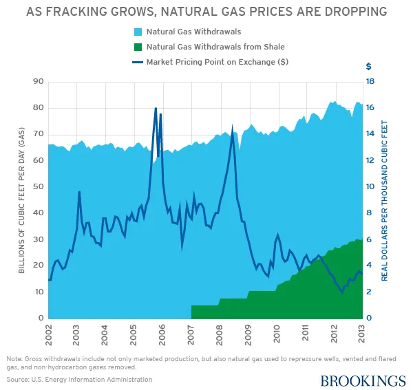

## Table of Contents

## What is fracking and how does it work?

Fracking, short for hydraulic fracturing, is a way to get oil and gas out of the ground. It's used when the oil and gas are trapped in rock deep underground. To do fracking, people drill a deep hole into the ground and then turn the drill to go sideways. This makes a long, horizontal tunnel.

Once the tunnel is made, a special mix of water, sand, and chemicals is pumped down the hole at very high pressure. This pressure cracks the rock and the sand keeps the cracks open. The oil and gas can then flow out of the rock and into the tunnel, where it's pumped up to the surface. Fracking helps get more oil and gas than traditional drilling, but it can also cause problems like using a lot of water and possibly polluting the environment.

## How has fracking changed the global oil supply?

Fracking has made a big difference in the global oil supply. It has helped countries like the United States produce a lot more oil and gas. Before fracking, the U.S. had to buy a lot of oil from other countries. But with fracking, the U.S. can now get more oil from its own land. This has made the U.S. less dependent on foreign oil and has changed the balance of oil supply around the world.

Because of fracking, there is more oil and gas available on the global market. This can make oil prices go down because there is more supply. Countries that used to sell a lot of oil to the U.S. now have to find new buyers or lower their prices. This has also led to changes in how oil is traded and has affected the economies of countries that rely on oil exports.

## What impact has fracking had on oil prices in the last decade?

Fracking has helped lower oil prices over the last ten years. By making it easier to get oil out of the ground, fracking has added a lot more oil to the world's supply. When there is more oil available, the price usually goes down. For example, in the early 2010s, oil prices started to drop because of the extra oil coming from fracking in the U.S. This made it cheaper for people to fill up their cars and for businesses to run their machines.

But fracking's effect on oil prices isn't always simple. Sometimes, other things like wars, new laws, or big changes in how much oil people use can push prices up or down. Even though fracking adds more oil to the market, these other factors can still make prices go up and down a lot. So while fracking has generally helped keep oil prices lower than they might have been, the price of oil can still change a lot because of other things happening around the world.

## Can fracking lead to oil price volatility?

Fracking can make oil prices go up and down a lot. It does this because it adds more oil to the market, but how much oil comes from fracking can change quickly. If a lot of oil comes from fracking, prices might go down. But if something happens and less oil comes from fracking, like if it costs too much to keep doing it, then prices might go up.

Other things can also make oil prices change a lot, even with fracking. Things like wars, new laws, or big changes in how much oil people use can push prices around. So, while fracking can help keep more oil on the market, all these other things can still make oil prices jump around a lot.

## How do fracking costs compare to traditional oil extraction methods?

Fracking costs can be different from traditional oil extraction methods. Traditional methods, like drilling straight down into the ground, can be cheaper to start because they don't need as much special equipment. But, these methods might not work as well if the oil is trapped in hard-to-reach places. Fracking, on the other hand, needs a lot of water, sand, and chemicals, plus special machines to pump everything into the ground at high pressure. This can make fracking more expensive to start.

Even though fracking can cost more to begin with, it can be worth it in the long run. Fracking can get oil out of places where traditional methods can't reach. This means that fracking can make more oil available, which can help pay for the higher starting costs. But, the price of oil matters a lot. If oil prices are low, fracking might not be worth it because the cost to get the oil out might be more than what the oil is worth. So, fracking can be a good choice when oil prices are high enough to cover the costs.

## What role does fracking play in the U.S. energy independence?

Fracking has helped the U.S. become more energy independent. Before fracking, the U.S. had to buy a lot of oil from other countries. But fracking lets the U.S. get more oil from its own land. This means the U.S. doesn't have to rely as much on other countries for oil. It's like having your own garden instead of always going to the store to buy food.

Because of fracking, the U.S. now produces a lot more oil and gas than it used to. This has made the country less dependent on foreign oil and has changed how the U.S. thinks about energy. It's not just about having more oil; it's also about feeling more secure because the U.S. can control its own energy supply better. This has been a big change for the country's energy future.

## How do environmental regulations affect the economics of fracking?

Environmental regulations can make fracking more expensive. These rules are made to protect the environment and people's health. They might say that companies need to use special equipment to clean up the water they use or to control the chemicals they put into the ground. All this extra work and equipment can cost a lot of money. If the rules are very strict, it might even make fracking too expensive to do in some places.

But, these regulations can also help in the long run. If companies follow the rules and do fracking safely, it can make people feel better about it. This can mean that people and governments are more likely to let fracking happen. Also, if the rules help keep the environment clean, it can save money that might have been spent on fixing problems later. So, while environmental regulations can make fracking cost more at first, they can also make it more sustainable and acceptable over time.

## What are the long-term sustainability issues related to fracking and oil prices?

Fracking can help get more oil out of the ground, but it also has some problems that can affect how long it can be used. One big issue is that fracking uses a lot of water. If we keep fracking, we might run out of water in some places. Also, the chemicals used in fracking can pollute the ground and water if they are not handled carefully. This can harm the environment and make it harder to keep fracking going in the long run. If the oil prices are low, it might not be worth the cost and risk to keep fracking, because the money made from the oil might not cover all the expenses.

Another thing to think about is that oil is not a never-ending resource. Even with fracking, we will run out of oil someday. If we keep using fracking to get more oil now, we might use up the oil faster. This means that in the future, there might be less oil left, and the prices could go up a lot. So, while fracking can help keep oil prices lower for now, it might make things harder later on. It's important to think about other kinds of energy that can last longer and are better for the environment.

## How does the global demand for oil influence the impact of fracking on prices?

The global demand for oil plays a big role in how fracking affects oil prices. When a lot of people around the world want oil, the demand goes up. If fracking is adding more oil to the market at the same time, it can help keep prices from going too high. But if the demand for oil is low, the extra oil from fracking can make prices drop a lot. So, how much people want oil can make fracking's impact on prices go up or down.

Even though fracking can add more oil to the market, other things can change how it affects prices. For example, if there's a big change in how much oil people use, like if more people start driving electric cars, the demand for oil might go down. This can make the extra oil from fracking less important and push prices down even more. On the other hand, if something happens that makes people use more oil, like if there's a big cold snap and people need more heating oil, the extra oil from fracking might not be enough to keep prices low. So, the global demand for oil is always changing, and it can make fracking's impact on prices different at different times.

## What are the geopolitical implications of fracking on oil pricing strategies?

Fracking has changed how countries think about oil prices and their strategies. Before fracking, some countries that had a lot of oil, like those in the Middle East, could control oil prices more easily. They could decide to produce more or less oil to make prices go up or down. But now, with fracking, the U.S. can produce a lot more oil, which means those countries can't control prices as much as before. This has made the oil market more competitive and has changed how countries plan their oil strategies.

Countries that used to sell a lot of oil to the U.S. now have to think about new ways to sell their oil. They might have to lower their prices to find new buyers or try to sell to different countries. This can affect their economies because they might not make as much money from oil as before. Also, because fracking can make oil prices go up and down a lot, countries have to be ready for these changes and plan how to deal with them. So, fracking has made the world of oil politics more complicated and has forced countries to come up with new strategies to stay strong in the global oil market.

## How do technological advancements in fracking affect oil market dynamics?

Technological advancements in fracking have made it easier and cheaper to get oil out of the ground. New tools and methods help drill deeper and in more places, so we can find oil that was hard to reach before. These improvements also mean that fracking companies can use less water and fewer chemicals, which can save money. When it's cheaper to frack, more oil can come onto the market, which can help keep oil prices lower.

But these technological improvements can also make the oil market more unpredictable. Because fracking can now be done more quickly and in more places, the amount of oil coming from fracking can change a lot. If a new technology makes fracking even cheaper, more oil might come onto the market fast, which can make prices drop suddenly. On the other hand, if something goes wrong with the new technology, less oil might come from fracking, and prices could go up. So, while technology can help keep more oil available, it can also make oil prices go up and down more than before.

## What predictive models exist for forecasting the impact of fracking on future oil prices?

There are different models that people use to guess how fracking will affect oil prices in the future. One type of model looks at how much oil fracking can produce and how much it costs to do fracking. These models try to see if the oil from fracking will be enough to change the price of oil around the world. They also think about things like how much oil people will want to use and what other countries are doing with their oil. By putting all this information together, these models can make guesses about what might happen to oil prices.

Another kind of model uses computers and math to look at a lot of different things at once. These models can take into account things like new technology, changes in laws, and even the weather. They try to see how all these things together might change how much oil fracking can produce and what that means for oil prices. While these models can help us understand what might happen, they are not perfect. Things can change quickly, and sometimes what the models predict doesn't happen exactly as expected. But they still give us a good way to think about the future of oil prices with fracking.

## What is the Role of Algorithmic Trading in the Energy Market?

Algorithmic trading, a technological advancement in financial markets, employs sophisticated algorithms and data analytics to execute trading decisions at speeds and volumes beyond human capability. In energy markets, particularly the oil market, [algorithmic trading](/wiki/algorithmic-trading) has introduced significant changes in price dynamics and [volatility](/wiki/volatility-trading-strategies).

Algorithmic trading strategies process extensive datasets, identifying patterns and executing trades based on predefined criteria. This capability allows traders to capitalize on short-term price movements, increasing [liquidity](/wiki/liquidity-risk-premium) but also introducing volatility. The volatility is often due to the rapid execution of trades that amplify existing market trends. For example, [momentum](/wiki/momentum)-based algorithms might exacerbate a price increase by buying into a rising market, or accelerate a decline by selling into a falling market. 

Historical data showcases instances where algorithmic trading significantly influenced oil market dynamics. The 2010 Flash Crash is a notable example, where algorithms were implicated in the rapid downfall and subsequent recovery of market indices. In the oil sector, the operations of high-frequency trading firms can lead to sudden price changes not entirely explained by fundamental supply-demand factors. These rapid changes can confuse market participants and sometimes lead to decisions based on transient rather than stable market conditions.

From a structural standpoint, algorithms typically model price movements using stochastic processes. For instance, the pricing dynamics of oil could be modelled as a Geometric Brownian Motion (GBM), defined as:

$$
dS_t = \mu S_t dt + \sigma S_t dW_t
$$

where $S_t$ is the price of oil at time $t$, $\mu$ is the drift component indicating the expected return, $\sigma$ is the volatility, and $dW_t$ is a Wiener process or Brownian motion. 

Through such mathematical modelling, algorithms forecast future prices, adjusting trading positions to optimize returns. While beneficial for traders, this exacerbates volatility when the models respond to market noise. 

The impact of algorithmic trading isn't restricted solely to instantaneous price movements. Over time, increased algorithmic activity can shift market dynamics, altering the liquidity landscape and changing how markets respond to macroeconomic news. This transformation necessitates caution among market regulators and participants, emphasizing the importance of understanding these algorithms' market impact to maintain stable and efficient trading environments. 

Overall, while algorithmic trading enhances market efficiency through increased liquidity and tighter spreads, its potential to unexpectedly amplify price movements poses challenges for stability in the oil market.

## References & Further Reading

[1]: Yergin, D. (2011). ["The Quest: Energy, Security, and the Remaking of the Modern World."](https://archive.org/details/questenergysecur0000yerg) Penguin Press.

[2]: Zuckerman, G. (2013). ["The Frackers: The Outrageous Inside Story of the New Billionaire Wildcatters."](https://en.wikipedia.org/wiki/The_Frackers) Portfolio.

[3]: Lopez de Prado, M. (2018). ["Advances in Financial Machine Learning."](https://www.amazon.com/Advances-Financial-Machine-Learning-Marcos/dp/1119482089) Wiley.

[4]: ["The Impact of Algorithmic Trading in Securities Market."](https://wjaets.com/sites/default/files/WJAETS-2024-0136.pdf) (2011). OECD Journal: Financial Market Trends.

[5]: Goldstein, M. A., Kumar, P., & Graves, F. C. (2014). ["Computerized and High-Frequency Trading."](https://papers.ssrn.com/sol3/papers.cfm?abstract_id=2379842) Journal of Economic Perspectives, 27(2), 45-66.

[6]: ["Understanding Hydraulic Fracturing."](https://wp.aiu.edu/blog/demystifying-hydraulic-fracturing-an-introductory-guide/) Department of Energy.

[7]: Inajima, T., & Park, S. (2016, February 29). ["Oil Prices Fall to Lowest Since 2004 as Supply Glut Persists."](https://www.weforum.org/stories/2016/03/what-s-behind-the-drop-in-oil-prices/) Bloomberg.