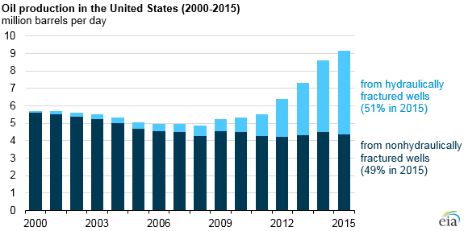

## Table of Contents

## What is fracking and how does it work?

Fracking, short for hydraulic fracturing, is a way to get oil and gas out of the ground. It involves drilling deep into the earth and then using a lot of water, sand, and chemicals to break open rocks underground. This creates tiny cracks in the rocks, which lets the oil and gas trapped inside flow out to where it can be collected.

The process starts with drilling a well, which can go thousands of feet deep. Once the well is drilled, a steel pipe is put in to keep the hole open. Then, a mix of water, sand, and chemicals is pumped down the pipe at very high pressure. This high pressure breaks the rock and the sand keeps the cracks open. The oil and gas then flow up the well to the surface, where they are collected and taken away for use.

## How has fracking contributed to the increase in U.S. oil production?

Fracking has helped the U.S. produce a lot more oil. Before fracking, it was hard to get oil out of tight rock formations. But with fracking, companies can now reach oil that was stuck in these rocks. This has led to a big increase in oil production, especially in places like Texas and North Dakota. These areas have seen a boom in oil drilling and have become major oil producers.

The increase in oil production has also made the U.S. less dependent on oil from other countries. Before, the U.S. had to import a lot of oil, but now it can produce more of its own. This has helped the economy by creating jobs in the oil industry and making energy cheaper for people and businesses. Overall, fracking has played a big role in making the U.S. a leading oil producer in the world.

## What regions in the U.S. have been most affected by fracking?

The regions in the U.S. that have been most affected by fracking are mainly in Texas and North Dakota. In Texas, the Permian Basin has become a big spot for fracking. This area has a lot of oil and gas trapped in tight rock, and fracking has made it possible to get it out. This has brought a lot of jobs and money to the area, but it has also caused some problems like more traffic and worries about water and the environment.

North Dakota's Bakken Formation is another place where fracking has had a big impact. Before fracking, it was hard to get oil out of the Bakken, but now it's one of the biggest oil-producing areas in the U.S. The fracking boom has helped the local economy a lot, but it has also led to issues like housing shortages and strain on local services. Both Texas and North Dakota have seen big changes because of fracking.

Other states like Pennsylvania, Ohio, and Colorado have also been affected by fracking, though not as much as Texas and North Dakota. In Pennsylvania, the Marcellus Shale has been a big focus for fracking, leading to both economic benefits and concerns about the environment. Ohio and Colorado have also seen growth in fracking, with similar effects on their local economies and communities.

## How has fracking impacted U.S. energy independence?

Fracking has helped the U.S. become more energy independent. Before fracking, the U.S. had to buy a lot of oil from other countries. But fracking made it possible to get oil and gas out of tight rock in places like Texas and North Dakota. This meant the U.S. could produce more of its own energy. As a result, the country didn't have to rely as much on foreign oil, which made it more energy independent.

This increase in domestic oil production has also helped the U.S. economy. More oil and gas being produced at home meant more jobs in the oil industry and cheaper energy for people and businesses. This has made the U.S. stronger and less dependent on other countries for energy. Overall, fracking has played a big role in making the U.S. more energy independent and boosting the economy.

## What are the economic benefits of fracking for the U.S. economy?

Fracking has brought a lot of economic benefits to the U.S. One big benefit is more jobs. When companies started fracking, they needed people to drill wells, move equipment, and do other jobs. This created thousands of jobs in places like Texas and North Dakota. People who got these jobs could earn good money, which helped them and their families. The money they spent also helped local businesses like restaurants and stores.

Another benefit is that fracking has made energy cheaper. Before fracking, the U.S. had to buy a lot of oil and gas from other countries, which could be expensive. But with fracking, the U.S. could produce more of its own oil and gas. This meant less money spent on imports and more money staying in the U.S. Cheaper energy also helped businesses because they didn't have to spend as much on fuel and electricity. This saved them money and helped them grow.

Overall, fracking has helped the U.S. economy by creating jobs and making energy more affordable. It has made the country less dependent on other countries for oil and gas, which is good for the economy. While there are some concerns about the environment, the economic benefits of fracking have been very important for the U.S.

## What are the environmental concerns associated with fracking?

Fracking can cause problems for the environment. One big worry is that it uses a lot of water. The water mixed with chemicals is pumped into the ground to break the rock. Sometimes this water can come back up and pollute rivers and lakes. This can harm fish and other animals that live in the water. People who live nearby also worry about their drinking water getting dirty.

Another concern is that fracking can cause earthquakes. When the water and chemicals are pumped into the ground, it can make the earth shake. These earthquakes are usually small, but they can still damage buildings and roads. Also, the air can get polluted from the trucks and machines used in fracking. This can make the air dirty and hard to breathe, which is bad for people's health.

Overall, while fracking has helped the U.S. produce more oil and gas, it has also raised worries about the environment. People are concerned about water pollution, earthquakes, and air quality. These issues need to be carefully managed to make sure fracking is done safely.

## How has fracking affected local communities and their economies?

Fracking has changed local communities a lot. In places like Texas and North Dakota, fracking brought many new jobs. People could work in the oil fields, drive trucks, or help build things. This meant more money for families, which helped them buy things and live better. Local businesses like shops and restaurants also did better because more people had money to spend. But fracking also made life harder in some ways. More trucks on the roads made traffic worse and caused more noise and dust. Some people had trouble finding a place to live because so many workers moved in.

The economy in these areas grew a lot because of fracking. More jobs and money helped the local economy get stronger. But not everything was good. Some people worried about their health because of the air and water pollution that can come with fracking. There were also concerns about earthquakes caused by the fracking process. Even though fracking brought economic benefits, it also caused problems that local communities had to deal with. Balancing these good and bad effects is important for the future of these areas.

## What regulations are in place to manage the impacts of fracking?

To manage the impacts of fracking, the U.S. has rules at both the federal and state levels. The Environmental Protection Agency (EPA) has rules to protect water and air. They make sure that the water used in fracking is treated properly before it's put back into rivers or lakes. The EPA also checks the air to make sure it's not too dirty from the fracking machines and trucks. These rules help keep the environment safe and protect people's health.

States also have their own rules for fracking. For example, Texas and Pennsylvania have laws about where companies can drill and how they have to do it. These rules can be different from one state to another. Some states make companies tell the public what chemicals they use in fracking. This helps people know if the water and air might be polluted. The state rules work together with the federal rules to make sure fracking is done safely and doesn't harm the environment too much.

## How does fracking influence U.S. foreign policy and international relations?

Fracking has changed how the U.S. talks to other countries about energy. Before fracking, the U.S. had to buy a lot of oil from other places. This meant the U.S. had to be careful with countries that had oil. But now, with more oil from fracking, the U.S. doesn't need to buy as much oil from other countries. This gives the U.S. more power in talks about energy. The U.S. can now make deals with other countries to sell its own oil and gas, which helps the U.S. economy and makes it a bigger player in the world.

Fracking also affects how the U.S. works with other countries on climate change. Some countries worry about the environment because fracking can pollute water and air. The U.S. has to talk with these countries about how to frack safely and reduce pollution. This can be hard because some countries want the U.S. to stop fracking altogether. But the U.S. also uses fracking to help other countries that need energy. By selling oil and gas to these countries, the U.S. can build stronger friendships and help them grow their economies.

## What are the long-term sustainability issues related to fracking?

Fracking has helped the U.S. get more oil and gas, but it also brings up questions about how long we can keep doing it. One big issue is that fracking uses a lot of water. This can be a problem in places where water is already hard to come by. If we keep fracking, we might use up too much water, which could hurt farming and make it hard for people to have enough to drink. Also, the chemicals used in fracking can pollute the water if they're not handled carefully. This means we need to find ways to use less water and keep it clean if we want to keep fracking for a long time.

Another long-term worry is what happens to the land after fracking is done. When a well is no longer useful, it needs to be closed properly so it doesn't leak oil or gas. If it's not done right, it can harm the environment for a long time. Also, fracking can cause small earthquakes, which can damage buildings and roads. Over time, these problems can add up and make it harder to keep fracking going. We need to think about how to fix these issues so that fracking can be a part of our energy plan without hurting the environment too much.

## How do technological advancements in fracking affect its efficiency and environmental impact?

Technological advancements in fracking have made it easier and quicker to get oil and gas out of the ground. New tools and methods help drill wells faster and reach oil and gas that used to be hard to get. For example, better drilling rigs and computer programs help find the best places to drill. This makes fracking more efficient, which means companies can produce more oil and gas with less work. It also helps them save money and time, which is good for the economy.

But these new technologies also affect the environment. Some new ways of fracking use less water and fewer chemicals, which is better for the environment. For example, some companies now use recycled water instead of fresh water, which helps save water. Also, new methods help keep the chemicals from getting into rivers and lakes. But even with these improvements, fracking can still cause problems like air pollution and earthquakes. So, while technology has made fracking better in some ways, we still need to be careful about its impact on the environment.

## What are the future prospects for fracking in achieving and maintaining U.S. oil independence?

Fracking has helped the U.S. produce a lot more oil and gas. This has made the country less dependent on oil from other places. In the future, fracking could keep helping the U.S. be more oil independent if new technology keeps making it better and safer. If companies can find more ways to use less water and fewer chemicals, fracking could be a big part of the U.S. energy plan for a long time. But the U.S. will need to keep working on rules to make sure fracking is done safely and doesn't hurt the environment too much.

Even with these improvements, there are still challenges. Fracking uses a lot of water, and in some places, water is already hard to find. If we keep fracking, we need to be careful not to use up too much water that people and farms need. Also, fracking can cause small earthquakes and pollute the air and water if it's not done right. The U.S. will need to find a balance between using fracking to get more oil and gas and making sure it doesn't harm the environment. If we can do this, fracking could help the U.S. stay oil independent for many years to come.

## What is the Role of Algorithmic Trading in the Oil Market?

Algorithmic trading has grown to be a significant component of commodity markets, notably altering how oil is traded. This form of trading essentially employs high-frequency trading algorithms and quantitative models to analyze massive datasets, identifying patterns and executing trades with near-instantaneous speed. This capability is particularly important in the oil markets, which are inherently volatile and influenced by a myriad of factors ranging from geopolitical events to supply-demand dynamics.

The core functionality of [algorithmic trading](/wiki/algorithmic-trading) in the oil market involves using algorithms to process real-time data, such as market quotes, news feeds, and economic indicators. These algorithms can quickly identify inefficiencies or opportunities, executing trades at optimal prices and times, often before human traders have a chance to react. Mathematically, this can be described by the formula:

$$
P(t) = P_0 + \sum_{i=1}^{n} \alpha_i X_i(t)
$$

where $P(t)$ represents the predicted price of oil at time $t$, $P_0$ is the current price, $X_i(t)$ are the various parameters influencing the price, and $\alpha_i$ are the weights assigned to each parameter by the algorithm.

The integration of algorithmic trading in traditional oil markets has implications for price discovery and market efficiency. By increasing the speed and [volume](/wiki/volume-trading-strategy) of trades, algorithmic trading enhances market [liquidity](/wiki/liquidity-risk-premium), making it easier for participants to enter and [exit](/wiki/exit-strategy) positions without significantly affecting prices. However, this can also lead to increased [volatility](/wiki/volatility-trading-strategies), as algorithms may react instantaneously to market movements or news events, creating rapid price fluctuations.

One Python example of a simple trading algorithm might look like this:

```python
import pandas as pd

# Load historical oil prices
data = pd.read_csv('oil_prices.csv')
data['moving_average'] = data['price'].rolling(window=50).mean()

# Example trading signal based on moving average crossover
def generate_signals(data):
    buy_signals = []
    sell_signals = []
    signal = 0

    for i in range(len(data)):
        if data['price'][i] > data['moving_average'][i] and signal != 1:
            buy_signals.append(i)
            signal = 1
        elif data['price'][i] < data['moving_average'][i] and signal != -1:
            sell_signals.append(i)
            signal = -1

    return buy_signals, sell_signals

buy, sell = generate_signals(data)
```

This example demonstrates a basic algorithm that generates buy and sell signals based on the crossover of the oil price above or below its moving average, a common technical indicator used in trading.

Despite its advantages, algorithmic trading also poses risks, including the possibility of "flash crashes"—sudden, drastic price drops—and systemic risks whereby intertwined algorithms might lead to market instability. Regulatory frameworks continue to evolve to address these challenges, ensuring market integrity while fostering innovation.

In conclusion, the fusion of algorithmic trading with traditional methods in the oil market presents both opportunities and challenges. As technology advances, the potential for increased efficiency and improved trading strategies grows, though it will require careful management of associated risks and regulatory oversight.

## References & Further Reading

[1]: Mankiw, N. G. (2009). ["Principles of Economics"](https://books.google.com/books/about/Principles_of_Economics.html?id=KQfFDwAAQBAJ). Cengage Learning.

[2]: Zuckerman, G. (2013). ["The Frackers: The Outrageous Inside Story of the New Billionaire Wildcatters"](https://en.wikipedia.org/wiki/The_Frackers). Penguin Press.

[3]: U.S. Energy Information Administration. ["U.S. Crude Oil Production"](https://www.eia.gov/dnav/pet/PET_CRD_CRPDN_ADC_MBBL_M.htm).

[4]: CFTC and SEC. (2010). ["Findings Regarding the Market Events of May 6, 2010"](https://www.sec.gov/news/studies/2010/marketevents-report.pdf). 

[5]: Clark, C. E., & Veil, J. A. (2009). ["Produced Water Volumes and Management Practices in the United States"](https://www.osti.gov/biblio/1007397). Argonne National Laboratory.

[6]: United States Environmental Protection Agency. (2016). ["Hydraulic Fracturing for Oil and Gas: Impacts from the Hydraulic Fracturing Water Cycle on Drinking Water Resources in the United States"](https://www.epa.gov/sites/production/files/2016-12/documents/hfdwa_executive_summary.pdf).

[7]: United States Geological Survey. ["Induced Earthquakes"](https://www.usgs.gov/programs/earthquake-hazards/science/induced-earthquakes).

[8]: Calcano, P., & Lo, A. W. (2010). ["Algorithm Aversion: People Erroneously Avoid Algorithms After Seeing Them Err"](https://pubmed.ncbi.nlm.nih.gov/25401381/). Journal of Experimental Psychology.