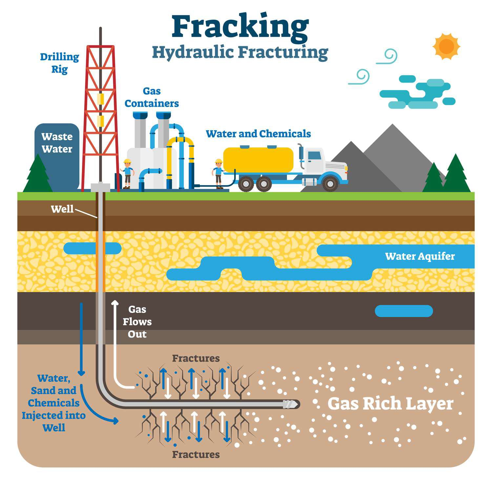

The quest for U.S. oil independence has been a pivotal topic for decades, intertwining energy security with political and economic concerns. As global geopolitical dynamics and market fluctuations continue to highlight vulnerabilities in relying on foreign oil, the United States has undertaken significant measures to enhance its energy autonomy. A key component of this national strategy has been the advancement of fracking technology. Known formally as hydraulic fracturing, fracking has emerged as a transformative process in boosting domestic oil production. By accessing previously inaccessible oil and gas deposits in shale formations, fracking has shifted the U.S. towards greater energy self-sufficiency.

In parallel, the financial aspects of the oil market have seen substantial evolution due to the rise of algorithmic trading. This modern trading technology utilizes complex mathematical models and vast datasets to make transaction decisions, thereby influencing oil prices and market strategies. Algorithmic trading has the potential to reshape market dynamics, offering new avenues in pursuing oil independence.



This article investigates how these technological advancements—fracking and algorithmic trading—contribute to U.S. oil independence. By examining their roles and interactions within the broader energy framework, it underscores how they are integral to bolstering the nation’s energy security while navigating environmental considerations and market complexities.

## Table of Contents

## The Evolution of Fracking Technology

Fracking, or hydraulic fracturing, is a technique that uses a high-pressure fluid mixture to create fractures in underground rock formations, thereby releasing trapped oil and gas deposits. This technology has experienced significant advancements over the years, fundamentally altering its application and impact on oil production.

The history of fracking dates back to the late 1940s when the first experimental applications were conducted. However, the technology gained prominence in the past few decades with the advent of horizontal drilling and sophisticated fracturing fluids. Horizontal drilling allows for greater access to oil and gas deposits by drilling laterally across rock layers, increasing the surface area of the well exposed to the resource. 

One of the key innovations in fracking technology is the development of more effective fracturing fluids. These fluids typically consist of water, sand, and a variety of chemical additives that perform specific functions, such as reducing friction and preventing bacterial growth. The optimization of these fluids has been crucial in improving the efficiency and effectiveness of the fracturing process.

Moreover, microseismic monitoring has emerged as a pivotal technology in enhancing fracking operations. By analyzing the seismic activity induced by the fracturing process, operators can better understand the extent and orientation of fractures, allowing for more precise application and reducing the risk of unintentional environmental impact.

Economically, fracking has significantly boosted U.S. domestic oil production, turning previously inaccessible shale oil and gas deposits into commercially viable sources. The prolific production of shale oil, primarily from formations like the Bakken, Marcellus, and Permian Basin, has been instrumental in decreasing the U.S.'s reliance on foreign oil. This surge in domestic production has not only contributed to energy security but has also had substantial implications for global oil markets, influencing supply dynamics and price structures.

Despite its economic benefits, fracking remains a controversial practice due to environmental and societal concerns. Issues such as potential groundwater contamination, induced seismicity, and high water usage present challenges that continue to spark debate among policymakers, industry leaders, and environmental advocates.

In summary, fracking technology has evolved considerably, driven by advancements in drilling techniques and fracturing fluid formulations. Its economic impact on reducing the U.S.'s foreign oil dependence is undeniable, yet it is accompanied by environmental challenges that require careful management and regulation.

## Impact of Fracking on U.S. Oil Independence

The rise of fracking has significantly reshaped the United States' position in the global energy landscape by bolstering domestic oil production. This technological innovation, which involves extracting oil and gas from shale rock formations, has been instrumental in reducing the nation's dependency on foreign oil imports. The increased domestic oil output afforded by fracking has enabled the U.S. to move closer toward energy self-sufficiency. According to data from the U.S. Energy Information Administration (EIA), the country's [crude oil](/wiki/crude-oil) production ramped up from approximately 5 million barrels per day in 2008 to about 12 million barrels per day in 2019, primarily due to advancements in hydraulic fracturing and horizontal drilling techniques [1].

As domestic oil production surged, U.S. oil imports declined, reflecting this shift towards energy independence. The strategic advantage of reducing foreign oil dependency is evident in international relations, where countries reliant on imported energy sources may face geopolitical vulnerabilities. This decrease in reliance allows the U.S. greater flexibility and strength in negotiating international agreements and responding to global oil price fluctuations.

Nonetheless, while fracking presents undeniable economic benefits, it continues to spark discussions regarding its environmental and societal impacts. The technology's success in driving domestic energy production is counterbalanced by concerns over potential environmental damages, such as groundwater contamination and increased seismic activity. These issues underscore the need for a cautious approach that carefully weighs economic gains against environmental and societal costs. Thus, while fracking has made significant contributions to U.S. oil independence, it necessitates ongoing scrutiny and regulation to ensure sustainable practices.

[1] U.S. Energy Information Administration, "U.S. Crude Oil Production," www.eia.gov.

## Fracking and Environmental Challenges

Fracking, or hydraulic fracturing, has significantly boosted U.S. oil production by enabling access to previously unreachable shale formations. However, this technology does not come without its environmental concerns. One major criticism of fracking is the potential for groundwater contamination. During the fracking process, a mixture of water, sand, and chemicals is injected underground at high pressure to fracture rock formations. This raises concerns about chemicals seeping into nearby groundwater sources. The Environmental Protection Agency (EPA) notes that the migration of these chemicals into water supplies could pose serious health risks.[^1^]

Additionally, fracking has been linked to induced seismicity, commonly referred to as human-caused earthquakes. While natural earthquakes originate from tectonic forces, the deep injection of wastewater, a byproduct of fracking, has been associated with increased seismic activity. According to the United States Geological Survey (USGS), states such as Oklahoma have experienced a notable rise in earthquake frequency, correlating with the increase in wastewater disposal wells.[^2^]

In response to these environmental challenges, regulatory measures have been established at both state and federal levels to mitigate risks. These include stricter requirements for well construction, chemical disclosure mandates, and limits on wastewater disposal. Yet, public and scientific debates persist over the sufficiency and enforcement of these regulations, with some stakeholders advocating for a complete ban on fracking due to potential environmental threats.

Another pressing environmental issue with fracking is its extensive water usage, particularly problematic in arid regions. Fracking operations can consume millions of gallons of water per well, putting a strain on local water resources. This water scarcity adds another layer of complexity as communities and industries vie for limited water supplies. The challenge intensifies in drought-prone areas, where the allocation of water for fracking may conflict with agricultural and municipal needs.

Ultimately, the quest for U.S. energy independence relies heavily on fracking, yet the environmental implications demand careful scrutiny. Policymakers and industry leaders face the formidable challenge of balancing the benefits of increased domestic oil production with the need for responsible environmental management. Continued advancements in technology and regulatory frameworks will be essential in achieving a sustainable coexistence between energy independence and environmental stewardship.

[^1^]: "Hydraulic Fracturing for Oil and Gas: Impacts from the Hydraulic Fracturing Water Cycle on Drinking Water Resources in the United States," U.S. Environmental Protection Agency, 2016.
[^2^]: "Induced Earthquakes," United States Geological Survey, updated April 23, 2021.

## The Role of Algorithmic Trading in the Oil Market

Algorithmic trading has grown to be a significant component of commodity markets, notably altering how oil is traded. This form of trading essentially employs high-frequency trading algorithms and quantitative models to analyze massive datasets, identifying patterns and executing trades with near-instantaneous speed. This capability is particularly important in the oil markets, which are inherently volatile and influenced by a myriad of factors ranging from geopolitical events to supply-demand dynamics.

The core functionality of [algorithmic trading](/wiki/algorithmic-trading) in the oil market involves using algorithms to process real-time data, such as market quotes, news feeds, and economic indicators. These algorithms can quickly identify inefficiencies or opportunities, executing trades at optimal prices and times, often before human traders have a chance to react. Mathematically, this can be described by the formula:

$$
P(t) = P_0 + \sum_{i=1}^{n} \alpha_i X_i(t)
$$

where $P(t)$ represents the predicted price of oil at time $t$, $P_0$ is the current price, $X_i(t)$ are the various parameters influencing the price, and $\alpha_i$ are the weights assigned to each parameter by the algorithm.

The integration of algorithmic trading in traditional oil markets has implications for price discovery and market efficiency. By increasing the speed and [volume](/wiki/volume-trading-strategy) of trades, algorithmic trading enhances market [liquidity](/wiki/liquidity-risk-premium), making it easier for participants to enter and [exit](/wiki/exit-strategy) positions without significantly affecting prices. However, this can also lead to increased [volatility](/wiki/volatility-trading-strategies), as algorithms may react instantaneously to market movements or news events, creating rapid price fluctuations.

One Python example of a simple trading algorithm might look like this:

```python
import pandas as pd

# Load historical oil prices
data = pd.read_csv('oil_prices.csv')
data['moving_average'] = data['price'].rolling(window=50).mean()

# Example trading signal based on moving average crossover
def generate_signals(data):
    buy_signals = []
    sell_signals = []
    signal = 0

    for i in range(len(data)):
        if data['price'][i] > data['moving_average'][i] and signal != 1:
            buy_signals.append(i)
            signal = 1
        elif data['price'][i] < data['moving_average'][i] and signal != -1:
            sell_signals.append(i)
            signal = -1

    return buy_signals, sell_signals

buy, sell = generate_signals(data)
```

This example demonstrates a basic algorithm that generates buy and sell signals based on the crossover of the oil price above or below its moving average, a common technical indicator used in trading.

Despite its advantages, algorithmic trading also poses risks, including the possibility of "flash crashes"—sudden, drastic price drops—and systemic risks whereby intertwined algorithms might lead to market instability. Regulatory frameworks continue to evolve to address these challenges, ensuring market integrity while fostering innovation.

In conclusion, the fusion of algorithmic trading with traditional methods in the oil market presents both opportunities and challenges. As technology advances, the potential for increased efficiency and improved trading strategies grows, though it will require careful management of associated risks and regulatory oversight.

## Conclusion

The path towards U.S. oil independence is multifaceted, blending technological advancements with market dynamics and environmental considerations. Fracking technology has significantly increased domestic oil production, propelling the United States closer to energy independence. However, the environmental impacts of fracking, such as groundwater contamination and induced seismicity, necessitate comprehensive management strategies to mitigate negative effects. These environmental challenges highlight the need for ongoing research and the development of cleaner and more efficient extraction techniques.

At the intersection of technology and market dynamics lies algorithmic trading, which offers innovative methods for handling the complexities of the oil market. By utilizing sophisticated algorithms to analyze large datasets, algorithmic trading can optimize trading strategies, enhance liquidity, and influence price formation. This technologically driven approach complements traditional trading methods and presents opportunities to streamline operations within the oil industry.

The strategic integration of fracking advancements and algorithmic trading technologies could enhance U.S. energy security in a global landscape that is continually evolving. Such integration requires a balanced approach, considering both the economic benefits and the environmental responsibilities associated with increased oil production. As the industry progresses, future advancements in technology and regulatory frameworks will be pivotal in achieving a sustainable form of energy independence. Ensuring that innovation aligns with sustainability goals will be key for policymakers and industry leaders aiming to secure a resilient energy future for the United States.

## References & Further Reading

[1]: Mankiw, N. G. (2009). ["Principles of Economics"](https://books.google.com/books/about/Principles_of_Economics.html?id=KQfFDwAAQBAJ). Cengage Learning.

[2]: Zuckerman, G. (2013). ["The Frackers: The Outrageous Inside Story of the New Billionaire Wildcatters"](https://en.wikipedia.org/wiki/The_Frackers). Penguin Press.

[3]: U.S. Energy Information Administration. ["U.S. Crude Oil Production"](https://www.eia.gov/dnav/pet/PET_CRD_CRPDN_ADC_MBBL_M.htm).

[4]: CFTC and SEC. (2010). ["Findings Regarding the Market Events of May 6, 2010"](https://www.sec.gov/news/studies/2010/marketevents-report.pdf). 

[5]: Clark, C. E., & Veil, J. A. (2009). ["Produced Water Volumes and Management Practices in the United States"](https://www.osti.gov/biblio/1007397). Argonne National Laboratory.

[6]: United States Environmental Protection Agency. (2016). ["Hydraulic Fracturing for Oil and Gas: Impacts from the Hydraulic Fracturing Water Cycle on Drinking Water Resources in the United States"](https://www.epa.gov/sites/production/files/2016-12/documents/hfdwa_executive_summary.pdf).

[7]: United States Geological Survey. ["Induced Earthquakes"](https://www.usgs.gov/programs/earthquake-hazards/science/induced-earthquakes).

[8]: Calcano, P., & Lo, A. W. (2010). ["Algorithm Aversion: People Erroneously Avoid Algorithms After Seeing Them Err"](https://pubmed.ncbi.nlm.nih.gov/25401381/). Journal of Experimental Psychology.