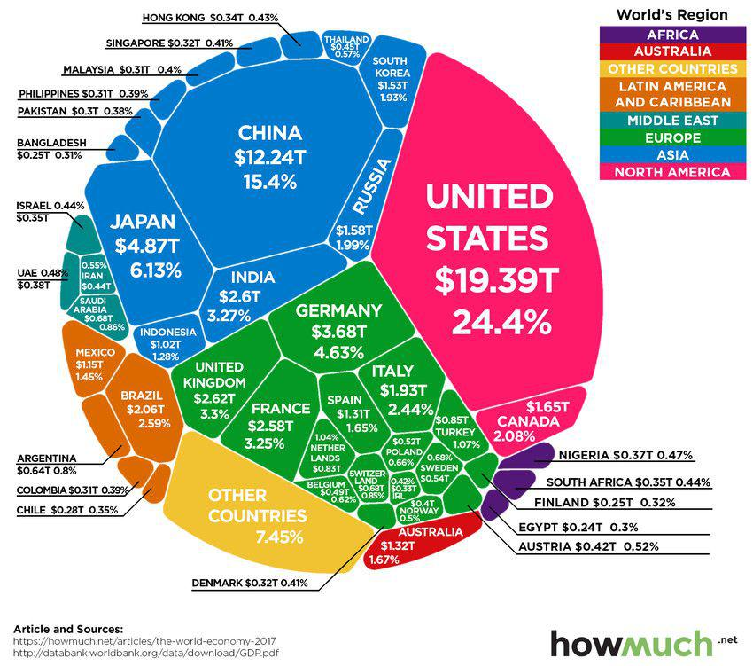

## Table of Contents

## What is GDP and how is it calculated?

GDP, or Gross Domestic Product, is the total value of all goods and services produced within a country's borders in a specific time period, usually a year. It's like adding up everything that everyone in the country made or did for money during that time. GDP helps us understand how well a country's economy is doing. If the GDP is growing, it usually means the economy is doing well, and people are making and buying more things.

To calculate GDP, there are a few different ways, but one common method is called the expenditure approach. This method adds up all the spending in the economy. It includes what consumers spend on things like food and clothes, what businesses spend on equipment and buildings, what the government spends on things like schools and roads, and the difference between what a country exports and imports. Another way to calculate GDP is the income approach, which adds up all the income earned in the country, like wages, profits, and taxes. Both methods should give you the same total if done correctly.

## How does GDP relate to the standard of living?

GDP can give us an idea about the standard of living in a country. The standard of living is how well people live, including things like how much money they have, the quality of their homes, and their access to healthcare and education. When a country's GDP is high, it often means there's more money to go around, which can lead to a better standard of living. People might have more money to spend on things they want and need, and the government might have more money to spend on public services like schools and hospitals.

However, GDP doesn't tell the whole story. It doesn't show how evenly the money is spread out among people. In some countries, a high GDP might mean that a few people are very rich, but many others are still poor. Also, GDP doesn't measure things like happiness, free time, or the environment. So, while a higher GDP can suggest a better standard of living, it's important to look at other factors too to really understand how well people are living.

## Can GDP growth alone improve the standard of living?

GDP growth can help improve the standard of living because it means the economy is doing better. When the economy grows, there's usually more money for people to spend on things they need and want, like better food, bigger houses, and more fun activities. It also means the government might have more money to spend on important things like schools, hospitals, and roads, which can make life better for everyone.

But, GDP growth alone isn't enough to make sure everyone's life gets better. If the money from the growing economy only goes to a few rich people, then many others might not see any improvement in their lives. Also, GDP doesn't tell us about things like how happy people are, how much free time they have, or if the environment is getting worse. So, while GDP growth can help, we need to look at other things too to really improve the standard of living for everyone.

## What are the limitations of using GDP as a measure of standard of living?

GDP is a good way to see how much money an economy is making, but it doesn't tell us everything about how well people are living. One big problem is that GDP doesn't show how the money is shared. If a country's GDP goes up, but only a few people get richer while many others stay poor, then the standard of living for most people might not get better. Also, GDP counts all spending the same way, so it might go up if people have to spend more on things like healthcare because they're sick, even though that doesn't mean their lives are better.

Another limitation is that GDP doesn't measure things that are important for a good life but don't cost money. For example, it doesn't count the value of free time, happiness, or a clean environment. If people have to work long hours to make more money, their GDP might go up, but they might not be happier or healthier. Also, if a country's GDP grows because of more factories, but those factories pollute the air and water, then the standard of living might actually go down even though the GDP is higher.

So, while GDP can give us a rough idea about how an economy is doing, it's not enough to understand the standard of living fully. We need to look at other things like how fair the money is shared, how happy and healthy people are, and how well the environment is being taken care of to really know if people's lives are getting better.

## How does income inequality affect the relationship between GDP and standard of living?

Income inequality can make the relationship between GDP and standard of living more complicated. When a country's GDP grows, it means the total amount of money in the economy is going up. But if that money goes mostly to a few rich people, then the standard of living for everyone else might not get better. This means that even though the country is making more money, many people might not feel like their lives are improving because they're not getting a fair share of that money.

Income inequality can also make people feel unhappy and stressed, which can lower their standard of living even if the GDP is growing. When there's a big gap between the rich and the poor, it can lead to problems like crime and poor health. So, even if the GDP is going up, if the money isn't shared fairly, the overall quality of life for many people might not improve. This shows that just looking at GDP isn't enough to understand how well people are really living.

## What role does government policy play in translating GDP growth into improved living standards?

Government policy is really important for turning GDP growth into better living standards. When the economy grows and GDP goes up, the government can use policies to make sure that the money is shared more evenly among people. For example, the government can raise taxes on the rich and use that money to help the poor, like giving them better healthcare, education, and housing. This can make everyone's life better, not just a few people's.

Also, the government can make rules to protect things that GDP doesn't measure, like the environment and people's happiness. They can make laws to stop pollution and encourage companies to be more eco-friendly. They can also support things like parks, libraries, and community centers that make life more enjoyable for everyone. By doing these things, the government can help make sure that when the economy grows, people's lives get better too.

## How do non-economic factors like health and education influence the impact of GDP on standard of living?

Non-economic factors like health and education play a big role in how GDP growth affects the standard of living. When people are healthy and well-educated, they can work better and earn more money. This means that even if the GDP is growing, if people don't have good health or education, they might not be able to take full advantage of the growing economy. Good health services help people stay strong and productive, while good education helps them get better jobs and earn more money. So, if the government spends money from GDP growth on health and education, it can really help improve people's lives.

But health and education are important for more than just [earning](/wiki/earning-announcement) money. They also make life better in other ways that GDP doesn't measure. When people are healthy, they feel happier and can enjoy their lives more. When they're well-educated, they can understand the world better and make smarter choices. So, even if the GDP is growing, if people are sick or uneducated, their standard of living might not improve much. That's why it's important for governments to focus on these non-economic factors to really make sure everyone's life gets better when the economy grows.

## What are some case studies of countries where high GDP has not translated into high standards of living?

One example is Russia. Russia has a pretty high GDP, but many people there don't feel like their lives are getting better. A big reason is that the money from the growing economy goes mostly to a few rich people, while many others stay poor. Also, the government doesn't spend enough on things like healthcare and education, so people's health and knowledge aren't as good as they could be. Even though the country makes a lot of money, the standard of living for many people doesn't go up because the money isn't shared fairly and important services are not well-funded.

Another example is South Africa. South Africa's GDP has grown over the years, but a lot of people still live in poverty. The problem is that there's a big gap between the rich and the poor, and many people don't have good jobs or enough money. Also, the government struggles to provide good healthcare and education for everyone. So, even though the economy is growing, the standard of living for many South Africans doesn't improve because the benefits of that growth don't reach everyone and the country faces challenges in providing essential services.

## How does the distribution of GDP across different sectors of the economy affect living standards?

The way GDP is spread across different parts of the economy can really change how it affects people's lives. If a lot of the GDP comes from industries like farming or mining, but not much from services like healthcare or education, then people might not have good access to these important services. This means that even if the country's GDP is high, people's lives might not get better because they can't get the help they need to stay healthy or learn new things. On the other hand, if more of the GDP comes from service industries, then there might be more money and jobs in areas that directly help improve people's lives.

For example, if a country's GDP grows mostly because of big factories making things to sell to other countries, the money might go to the people who own the factories, but not to the workers or the community. This can make the gap between rich and poor even bigger, and many people might not see any improvement in their lives. But if the GDP growth comes from more people getting good jobs in healthcare, education, or other services, then more people can have better lives because they have access to the things that really matter for their well-being. So, it's important for the GDP to be spread across different sectors in a way that helps everyone, not just a few.

## What are the long-term effects of GDP growth on sustainability and environmental quality, and how do these impact standard of living?

When a country's GDP grows, it often means more factories, more cars, and more people using energy. This can hurt the environment because it can cause more pollution and use up natural resources faster. If the air and water get dirty, it can make people sick and lower their quality of life. Also, if we use up resources too quickly, there might not be enough for future generations. So, while GDP growth can make the economy bigger, it can also make the environment worse, which can hurt people's lives in the long run.

To make sure GDP growth doesn't harm the environment too much, countries need to find ways to grow their economies without hurting the planet. This can mean using cleaner energy, like wind or solar power, and making rules to stop pollution. If a country can grow its GDP while also keeping the environment healthy, then people can have a better standard of living now and in the future. It's important to balance economic growth with taking care of the environment so that everyone can enjoy a good life.

## How do international comparisons of GDP and standard of living help in understanding global economic dynamics?

When we compare the GDP and standard of living of different countries, we can learn a lot about how the world's economy works. GDP tells us how much money a country makes, but looking at how that money affects people's lives helps us see which countries are doing well and which ones need help. For example, if two countries have the same GDP but one has a much better standard of living, we might see that one country shares its money more fairly or spends more on things like healthcare and education. This helps us understand why some countries are happier and healthier even if they don't make as much money.

These comparisons also show us how countries are connected. If one country's economy grows a lot, it might help other countries by buying more of their products. But if a big country's economy slows down, it can hurt smaller countries that depend on selling things to it. By looking at these patterns, we can see how global trade and economic policies affect people's lives everywhere. Understanding these connections helps countries work together to make the world a better place for everyone.

## What advanced economic models exist that attempt to better correlate GDP with actual improvements in standard of living?

One advanced economic model that tries to better show how GDP affects people's lives is the Human Development Index (HDI). The HDI looks at more than just money. It measures things like how long people live, how much education they get, and how much money they have. By looking at these things together, the HDI gives a better idea of how well people are living, not just how much money their country makes. This helps us see that even if a country's GDP is high, if people don't live long, healthy lives or don't have good education, their standard of living might not be as good as the GDP suggests.

Another model is the Genuine Progress Indicator (GPI). The GPI tries to fix some of the problems with GDP by adding and subtracting things that GDP doesn't count. For example, it adds the value of things like volunteer work and housework, which make people's lives better but don't cost money. It also subtracts things like pollution and crime, which make life worse even if they increase GDP. By doing this, the GPI gives a more complete picture of how well people are living, showing that economic growth needs to be balanced with other important factors to really improve people's lives.

## What is GDP and what role does it play?

GDP, or Gross Domestic Product, is a fundamental metric used to quantify the total economic output of a country. It reflects the market value of all final goods and services produced within a nation in a given period, typically a year or a quarter. GDP is often regarded as a key measure of economic success because it provides a comprehensive snapshot of a nation’s economic activity. By aggregating production data, GDP helps to evaluate a country's economic efficiency and vitality.

While GDP serves as a broad indicator of economic activity, it possesses inherent limitations. One significant shortcoming is its inability to capture nuances such as wealth distribution within a population. GDP growth may indicate increased economic activity, but it does not reveal how equitably that income is distributed. High GDP can coexist with significant income inequality, masking underlying socio-economic issues.

Moreover, GDP does not account for environmental impacts. For instance, activities that boost GDP might also contribute to environmental degradation, yet GDP calculations do not deduct the cost of environmental damage. This discrepancy has prompted discussions about the sustainability of relying solely on GDP as a measure of prosperity.

Economists employ various adjustments to address these limitations. Real GDP, a common adjustment, accounts for inflation and provides a more accurate measure of economic output over time. Real GDP is calculated by adjusting nominal GDP using a price index to strip out the effects of inflation, allowing for comparisons across different periods.

$$
\text{Real GDP} = \frac{\text{Nominal GDP}}{\text{GDP deflator}}
$$

Additionally, metrics like Purchasing Power Parity (PPP) adjust GDP figures based on the relative cost of living and inflation rates across countries. PPP provides a more nuanced comparison by reflecting what a unit of currency can purchase in different economies, thereby offering a better assessment of economic well-being.

Despite these limitations, GDP remains an indispensable tool for policymakers and economists. It serves as a benchmark for economic policy and a point of reference for international comparisons. GDP data is crucial in designing fiscal and monetary policies and forms the basis for various economic projections and analyses. Although alternative metrics continue to emerge, GDP’s simplicity and historical precedence make it a persistent facet of economic analysis.

## What is the Standard of Living: A Broader Perspective?

Standard of living is a multifaceted concept that encompasses various dimensions beyond mere economic factors. It considers aspects such as health, education, and environmental quality, offering a broader perspective on the overall well-being of individuals within a society. While Gross Domestic Product (GDP) per capita is frequently employed as a proxy for standard of living, it presents significant limitations.

GDP per capita is calculated as:

$$
\text{GDP per capita} = \frac{\text{Total GDP}}{\text{Population}}
$$

Although it provides a quantitative measure of average economic output per person, GDP per capita does not account for non-market transactions, such as household labor and volunteering, or the value of leisure time, all of which significantly contribute to a society's quality of life. Consequently, relying solely on GDP per capita can obscure disparities in economic well-being and neglect important aspects of social progress.

To address these limitations, alternative indices such as the Human Development Index (HDI) have been developed. The HDI offers a more comprehensive measure of well-being by incorporating additional factors including life expectancy, education levels, and per capita income. The HDI is calculated using the following formula:

$$
\text{HDI} = \sqrt[3]{\text{Life Expectancy Index} \times \text{Education Index} \times \text{Income Index}}
$$

Each component index is derived from specific indicators, ensuring a multidimensional evaluation of human development. The inclusion of these factors in the HDI allows for a more nuanced understanding of societal progress, acknowledging that economic growth alone does not guarantee improvements in the quality of life.

The limitations of GDP as a solitary measure highlight the necessity for alternative metrics that better capture the quality of life. These measures provide a more accurate reflection of the diverse elements that contribute to human well-being and can guide policymakers in pursuing strategies for holistic development. By integrating broader indicators, societies can more effectively address issues such as inequality, education access, healthcare quality, and environmental sustainability, ultimately fostering a higher standard of living for all citizens.

## References & Further Reading

[1]: Stiglitz, J. E., Sen, A., & Fitoussi, J. P. (2009). ["Report by the Commission on the Measurement of Economic Performance and Social Progress."](https://ec.europa.eu/eurostat/documents/8131721/8131772/Stiglitz-Sen-Fitoussi-Commission-report.pdf) 

[2]: Malkiel, B. G., & Fama, E. F. (1970). ["Efficient Capital Markets: A Review of Theory and Empirical Work."](https://onlinelibrary.wiley.com/doi/abs/10.1111/j.1540-6261.1970.tb00518.x) The Journal of Finance, 383-417.

[3]: Galbraith, J. K. (1992). ["The Affluent Society."](https://www.amazon.com/Affluent-Society-John-Kenneth-Galbraith/dp/0395925002) Houghton Mifflin Harcourt.

[4]: O'Hara, M. (2015). ["High-Frequency Trading and Its Impact on Markets."](https://www.tandfonline.com/doi/abs/10.2469/faj.v70.n3.6) Annual Review of Financial Economics, 6, 133-152.

[5]: Sen, A. (1999). ["Development as Freedom."](https://books.google.com/books/about/Development_as_Freedom.html?id=NQs75PEa618C) Oxford University Press.

[6]: Perez, T. (2013). ["The Role of Algorithmic Trading in School Cash Markets."](https://www.jstor.org/stable/43303831) International Review of Financial Analysis, 30, 66-80.

[7]: Schumpeter, J. A. (1934). ["The Theory of Economic Development: An Inquiry into Profits, Capital, Credit, Interest, and the Business Cycle."](https://www.semanticscholar.org/paper/The-Theory-of-Economic-Development:-An-Inquiry-into-Schumpeter/309f113adecd8b3d8d1f430a1ec0bfcae8a83c39) Harvard University Press.