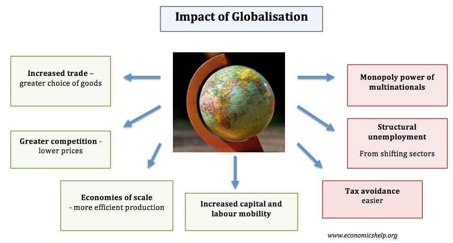

Globalization, defined as the process by which businesses or other organizations develop international influence or start operating on an international scale, has profoundly transformed the economic landscape over recent decades. This transformative process has been particularly influential in developed countries, integrating economies, influencing financial markets, and fostering technological advancement.

The impact of globalization on developed nations can be characterized by increased economic interconnectedness and the proliferation of multinational corporations. These entities have significantly contributed to capital flow, technological exchange, and the efficient functioning of global supply chains.

In the context of financial markets, globalization has facilitated the emergence and growth of algorithmic trading. Algorithmic trading, or algo trading, involves the use of complex algorithms and high-speed computational technology to execute trades automatically. This mechanized trading approach enhances market efficiency, reduces transaction costs, and increases liquidity, thereby altering traditional financial trading paradigms. Consequently, algorithmic trading has become a hallmark of modern globalized financial markets, further integrating these markets across boundaries.

This article investigates into the multifaceted impact of globalization on developed countries, specifically focusing on economic growth and the evolution of financial markets, with an emphasis on algorithmic trading. We will explore both the economic benefits and challenges that globalization presents, as well as its overall influence on developed nations. Through examining these dynamics, the aim is to provide a comprehensive understanding of how globalization interplays with economic activity and technological advancements in developed economies.

## Table of Contents

## Globalization and Economic Impact on Developed Countries

Developed countries have reaped significant benefits from globalization, as evidenced by substantial increases in trade volumes, Gross Domestic Product (GDP), and technological advancements. The expansion of multinational companies has played a pivotal role in this process, facilitating the flow of capital across borders. This international reach allows corporations to scale their production processes efficiently and reduce operational costs by leveraging global supply chains. For instance, the ability to source raw materials from countries where they are abundant and cheap while manufacturing where labor is cost-effective has optimized production strategies.

Globalization has intensified competition among businesses, driving them to innovate and enhance efficiency in their production and service delivery. The competitive pressure encourages research and development, leading to technological innovations that not only benefit individual companies but also contribute to economic growth. An example of this is the tech industry, where rapid advancements and a constant demand for novel products and services have spurred economic progress in several developed nations.

However, the interconnectedness brought about by globalization is not without its challenges. One major concern is domestic job displacement. As companies move their manufacturing processes to countries with lower labor costs, workers in developed countries may find themselves unemployed or compelled to accept lower wages. This shift often leads to a decline in traditional manufacturing jobs in favor of roles requiring advanced technical skills, necessitating workforce retraining programs.

Additionally, the global integration of economies introduces increased economic [volatility](/wiki/volatility-trading-strategies). Financial markets are interlinked, meaning crises in one nation can quickly spread to others. The 2008 financial crisis exemplified this, where the collapse of financial institutions in the United States had repercussions worldwide. This volatility poses a risk to economic stability and requires robust policy measures to mitigate potential adverse effects.

In summary, while globalization has bestowed numerous advantages upon developed countries by facilitating economic growth and technological exchange, it also presents challenges that require strategic management to ensure that the benefits are sustainable and equitably distributed.

## Algorithmic Trading: A Byproduct of Globalized Economies

Algorithmic trading, often regarded as a hallmark of modern financial markets, has emerged as a byproduct of globalization. The rapid advancements in technology, coupled with the liberalization of financial markets, have paved the way for the proliferation of algo trading. This automated form of trading leverages computer algorithms to execute trades at speeds and frequencies far beyond human capacity, fundamentally transforming how securities are traded on stock exchanges.

In developed countries, [algorithmic trading](/wiki/algorithmic-trading) now accounts for a substantial portion of trading activities. According to a report by the Bank for International Settlements, algorithmic trading executes approximately 60-73% of equity trade volumes in the U.S. and E.U. regions [BIS, 2020]. This dominance highlights the vital role algo trading plays in enhancing market operations.

One of the primary benefits of algorithmic trading is its role in increasing market efficiency. By processing and acting upon vast amounts of data almost instantaneously, algorithmic trading minimizes the time between market changes and their reflection in securities prices. This efficiency leads to more accurate pricing, reducing the instances of mispricing and ensuring that markets reflect all available information. It also enhances [liquidity](/wiki/liquidity-risk-premium), as algorithms can place buy and sell orders simultaneously across multiple markets, thereby narrowing bid-ask spreads.

Additionally, the reduction in transaction costs is a significant advantage. Automated trading systems can execute orders precisely and instantaneously, reducing the need for manual intervention and lowering the costs associated with trading. For instance, traditional trading could involve broader spreads and higher fees due to human error or slower execution times, costs minimized by high-frequency trading ([HFT](/wiki/high-frequency-trading-strategies)) algorithms.

Despite these advantages, algorithmic trading is not without risks. It can exacerbate market volatility, as evidenced by incidents such as the 2010 "Flash Crash," where the Dow Jones Industrial Average experienced a swift and intense downturn, only to recover rapidly within minutes. Such events are often attributed to the feedback loops created by high-frequency trading algorithms acting upon each other's decisions without human oversight.

Furthermore, the gap between high-frequency traders and retail investors can widen due to the inherent advantages HFT firms enjoy, such as access to cutting-edge technology and data. These disparities can lead to perceptions of an uneven playing field, where sophisticated algorithms overshadow traditional trading methods.

Market manipulation poses an additional risk, as algorithms can be programmed to execute strategies that may be deemed unethical or illegal. Techniques like spoofing—placing substantial orders with the intention to cancel before execution to mislead the market—highlight the potential for misuse of algorithmic trading.

In conclusion, while algorithmic trading harnesses globalization's benefits through increased efficiency and reduced costs, it necessitates robust regulatory frameworks to minimize associated risks. By implementing stringent guidelines and monitoring systems, regulators can mitigate concerns such as market manipulation and inequality, ensuring that algorithmic trading continues to contribute positively to global financial markets.

## The Role of Developed Nations in Shaping Global Economic Policies

Developed countries significantly influence the formulation of global economic policies and standards that shape international trade and finance. Their economic stature allows them to exert considerable leverage over major global institutions such as the World Trade Organization (WTO) and the International Monetary Fund (IMF). By wielding this influence, developed nations can negotiate and implement trade policies that often favor their economic interests, reinforcing their economic stability and growth.

One of the primary ways developed countries shape global policies is through strategic trade agreements. These agreements often lower trade barriers, such as tariffs and quotas, enabling easier access to international markets for their goods and services. By doing so, developed nations can stimulate economic growth and maintain a competitive edge in the global market. For instance, economic partnerships like the Transatlantic Trade and Investment Partnership (TTIP) exemplify how developed countries leverage their economic prowess to craft favorable terms that promote trade and investment.

Additionally, developed nations play a pivotal role in setting international financial standards and regulations. Their prominent status within organizations like the IMF allows them to influence monetary policies and financial assistance programs. This can provide stability to global markets, especially during financial crises. For example, during the 2008 financial crisis, coordinated efforts by developed countries through the G20 and the IMF were crucial in stabilizing the global economy.

However, the policies shaped by developed nations do not always result in equitable benefits across the global economy. The influence these countries exert can lead to outcomes that marginalize developing nations, which often struggle to compete on equal terms. Trade agreements and financial policies are sometimes structured to maintain the competitive advantage of developed nations, making it challenging for less developed countries to benefit from globalization.

Furthermore, the economic policies advocated by developed countries often prioritize industrial and service sectors where they have significant expertise, potentially sidelining the agricultural sectors vital for many developing nations. This can exacerbate economic disparities, as developing countries face hurdles in gaining equitable access to global markets.

In conclusion, while developed countries play a crucial role in shaping global economic policies that reinforce international economic stability, there remains a need for greater inclusivity. Ensuring that the benefits of globalization and international trade are distributed more equitably requires a balanced approach that considers the needs and challenges faced by developing nations.

## Challenges and Criticisms of Globalization

Globalization, while offering numerous economic advancements, poses considerable challenges that intensify discussions among economists and policymakers. One significant concern is the exacerbation of inequality, manifesting both within and between nations. As multinational corporations expand, they often accrue benefits that favor shareholders and executives rather than the broader workforce. This tends to widen income disparities, as high-skilled workers in developed nations reap disproportionate rewards compared to their low-skilled counterparts and workers in less affluent nations [(Stiglitz, 2012)](https://economics.missouri.edu/working-papers/2012/wp1205.pdf). 

Moreover, globalization increases reliance on global markets, making economies susceptible to international market fluctuations. For instance, a disruption in the global supply chain, whether due to geopolitical tensions or environmental disasters, can have cascading effects, highlighting vulnerabilities in the global economic structure. This interdependence can lead to significant economic volatility, as observed during the 2008 financial crisis, when financial systems were deeply interconnected across borders [(Blinder, 2013)](https://pubs.aeaweb.org/doi/pdf/10.1257/jep.27.2.49).

Another critical issue linked with globalization is environmental degradation. The expansion of industrial activities to meet global demands often leads to widespread deforestation, pollution, and a looming carbon footprint. According to the United Nations Environment Programme, the pressure on natural resources increases with rising production and consumption patterns driven by global trade [(UNEP, 2019)](https://www.resourcepanel.org/reports/global-resources-outlook). This environmental impact stresses the urgency for sustainable development policies.

Critics of globalization also point out that it predominantly benefits wealthy individuals and large corporations, thereby marginalizing small enterprises and the average worker. Small businesses struggle to compete with large multinational corporations that possess significant resources and technological advantages, leading to decreased market diversity and innovation at the grassroots level [(Rodrik, 2011)](https://drodrik.scholar.harvard.edu/files/dani-rodrik/files/feasible_globalizations.pdf).

Cultural homogenization is another concern, with globalization leading to a more uniform global culture, often at the expense of local traditions and diversity. This can result in the erosion of local industries that are essential to cultural identity, as traditional practices and products are replaced by globalized alternatives. The proliferation of global brands and media has contributed significantly to cultural homogenization, threatening the richness of cultural heritage around the world [(Tomlinson, 1999)](https://www.amazon.com/Globalization-Culture-Cultural-Live/dp/0226807681).

This spectrum of challenges necessitates a balanced approach to globalization, where economic development does not overshadow social equity and sustainability. Addressing these issues effectively requires coordinated efforts from government bodies, international organizations, and the private sector to ensure that the benefits of globalization are more evenly distributed and do not compromise future generations' welfare.

## Mitigating the Risks: A Look into the Future

To effectively address the challenges posed by globalization, developed countries must undertake comprehensive policy reforms that aim to distribute wealth more equitably, promote sustainable practices, and encourage economic diversification. A multifaceted approach is crucial in order to mitigate the risks associated with globalization and ensure long-term economic resilience. 

Equitable wealth distribution can be achieved through progressive taxation and social welfare programs designed to support lower-income populations. Implementing redistributive policies can help reduce inequality within countries and provide a more inclusive economic environment where all citizens benefit from globalization. 

Sustainable practices should be prioritized to counteract the environmental degradation often associated with globalized industrial activities. By investing in green technologies and adopting stricter environmental regulations, developed nations can lead the charge towards a more sustainable global economy. For example, incentivizing renewable energy sources and implementing carbon pricing mechanisms are effective strategies to reduce carbon footprints and promote environmental stewardship.

Economic diversification is essential in reducing over-reliance on global markets and enhancing economic stability. Developed countries can foster innovation and support emerging sectors through research and development investments, thereby bolstering domestic industries and reducing susceptibility to external economic shocks.

Moreover, harnessing innovative technologies such as algorithmic trading must be done judiciously. While algorithmic trading can improve market efficiency and liquidity, it is crucial to regulate its application to prevent market manipulation and ensure fair access for all market participants. By establishing robust regulatory frameworks and encouraging ethical algorithmic practices, financial markets can operate more transparently and reliably.

Collaboration between nations further plays a pivotal role in addressing global challenges. International cooperation can facilitate the creation of global standards and policies that enhance economic stability and promote the equitable distribution of globalization's benefits. Institutions such as the World Trade Organization (WTO) and the International Monetary Fund (IMF) can foster dialogue and cooperation, ensuring that global trade practices are fair and inclusive. 

Ultimately, the future of globalization relies on the ability of developed countries to reform and adapt policies that balance national interests with global economic integration. Through strategic policy initiatives and international collaboration, globalization can be steered towards serving the broader global community equitably and sustainably.

## Conclusion

Globalization and algorithmic trading have become pivotal forces in shaping the economic frameworks of developed nations. As globalization fosters interconnected markets and cross-border trade, it generates significant economic opportunities by enhancing efficiency, productivity, and access to a broader array of resources and consumers. However, alongside these benefits are persistent challenges that must be addressed. The widening inequality within and between nations highlights the need for policies that ensure equitable distribution of globalization's benefits. Additionally, economic volatility can arise from intertwined global markets, necessitating robust mechanisms to mitigate potential disruptions.

Algorithmic trading, as a product of technological advancement, epitomizes the fusion of finance and technology. By leveraging computational power, algorithmic trading enhances market efficiency, reduces transaction costs, and adds liquidity to financial markets. Nonetheless, these advancements come with inherent risks. The potential for market manipulation, flash crashes, and the disparity between high-frequency traders and average investors are concerns that must be managed with careful regulation and oversight. 

Looking ahead, achieving a harmonious balance between global economic integration and safeguarding national interests will be crucial. Effective strategies should focus on harnessing technological advances in finance, such as algorithmic trading, to drive economic growth while diligently managing the associated risks. This can be achieved through international collaboration, informed policy-making, and adopting sustainable practices that prioritize long-term stability and inclusion. In doing so, the overarching aim should be to ensure that globalization contributes positively to societal progress, benefiting a broader spectrum of stakeholders.

## References & Further Reading

[1]: Stiglitz, J. E. (2012). ["The Price of Inequality: How Today's Divided Society Endangers Our Future."](https://business.columbia.edu/sites/default/files-efs/imce-uploads/Joseph_Stiglitz/Price%20of%20Inequality%20for%20Sustainable%20Humanity.pdf) W.W. Norton & Company.

[2]: Blinder, A. S. (2013). ["After the Music Stopped: The Financial Crisis, the Response, and the Work Ahead."](https://www.tandfonline.com/doi/full/10.1080/14697688.2014.949836) Penguin Books.

[3]: UNEP. (2019). ["Global Resources Outlook 2019: Natural Resources for the Future We Want."](https://wedocs.unep.org/handle/20.500.11822/27517) United Nations Environment Programme.

[4]: Rodrik, D. (2011). ["The Globalization Paradox: Democracy and the Future of the World Economy."](https://drodrik.scholar.harvard.edu/publications/globalization-paradox-democracy-and-future-world-economy) W.W. Norton & Company.

[5]: Tomlinson, J. (1999). ["Globalization and Culture."](https://archive.org/details/globalizationcul00toml/globalizationcul00toml) University of Chicago Press.