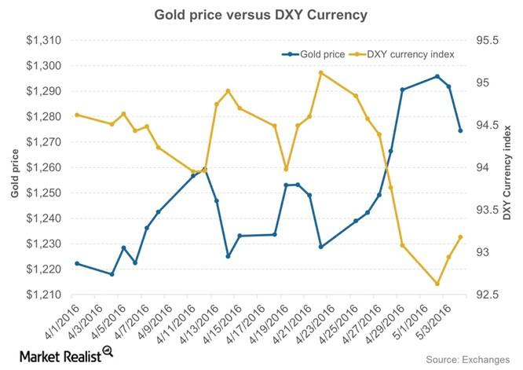

Gold has consistently held a unique position in economies throughout history, transcending its role as a mere commodity to become an integral part of financial systems. Its enduring appeal is rooted in its function as a store of value, a medium of exchange, and a hedge against economic uncertainties. Today, gold's influence extends far beyond traditional boundaries, as modern financial markets integrate sophisticated technologies and trading systems.

The relationship between gold and global economies has evolved into a complex, multi-dimensional interaction. Economic factors, currency exchange movements, and the advent of algorithmic trading have dramatically reshaped the dynamics of gold trading. These elements work in conjunction to define gold's value and its role as an investment asset.



Understanding these dynamics is crucial for traders and investors aiming to effectively navigate the intricacies of the gold market. Economic indicators provide insights into market trends and potential price movements. Currency exchange rates, particularly those involving the U.S. dollar, play a pivotal role in determining gold prices. As the dollar fluctuates, so does the demand for gold, influencing its global market value.

Algorithmic trading, a technological advancement in modern finance, has significantly impacted the gold market. By enhancing market liquidity and enabling rapid trade executions, it adds layers of complexity to market operations, affecting volatility and price stability. Recognizing the influence of these automated systems is vital for developing robust investment strategies.

As we explore how these factors interplay, gold emerges as a beneficial asset amidst the ever-changing landscape of financial markets. Its ability to act as a safeguard during periods of economic instability makes it a valuable inclusion in diversified investment portfolios. Through a comprehensive understanding of the driving forces behind gold's market behavior, investors can make informed decisions to optimize their financial outcomes.

## Table of Contents

## Gold as a Historical Economic Indicator

Gold has played a pivotal role as a historical economic indicator, dating back to ancient civilizations where it was revered for its rarity, malleability, and intrinsic value. Its significance became more pronounced with the establishment of the gold standard, wherein national currencies were directly linked to gold. This system provided a stable foundation for financial systems by ensuring currencies were backed by a tangible asset, thereby instilling trust and promoting international trade stability.

Under the gold standard, countries set specific amounts of gold equivalent to their currency values, facilitating uniform exchange rates and international economic cooperation. This approach helped anchor inflation, as the money supply in gold-standard countries could only grow at the rate of gold reserves. For instance, should a nation increase its currency supply, it needed a corresponding increase in gold holdings, inherently curbing inflationary pressures and maintaining price stability.

The gold standard's abandonment in the 20th century marked a significant shift to fiat currencies. Unlike their gold-backed predecessors, fiat currencies derive their value from government regulation and trust rather than intrinsic worth. This shift influenced modern economic dynamics, particularly impacting inflation and exchange rates. Without the gold standard's constraints, countries gained the flexibility to manage their money supply and economic policies more actively. However, this also introduced susceptibility to inflation, as governments could print money without the checks imposed by gold reserves.

During economic downturns or periods of high inflation, gold retains its appeal as a hedge. Investors often turn to gold to preserve wealth, as it typically maintains or increases in value while fiat currencies may lose purchasing power. Historical data illustrates this behavior; for example, during the 1970s' stagflation, gold prices surged as investors sought refuge from soaring inflation.

In conclusion, gold's historical role as an economic indicator underscores its enduring significance in financial systems. Its transition from a currency standard to an investment hedge reflects the evolving landscape of economic policy and currency valuation. Understanding this evolution helps contextualize gold's lasting influence on global economies and its continued relevance as a stable asset amidst fluctuating economic conditions.

## Impact of Currency Exchange on Gold

Currency exchange rates, with a prominent focus on the U.S. dollar, exert a substantial influence on gold prices. This relationship stems primarily from the fact that gold is internationally traded in U.S. dollars, making its price directly susceptible to dollar fluctuations.

When the U.S. dollar strengthens against other currencies, gold becomes more expensive in those currencies, often diminishing its attractiveness to buyers worldwide. This reduced demand can lead to a decline in gold prices as fewer international buyers can afford the higher costs in their local currencies.

Conversely, during periods of a weakening dollar, the scenario shifts. A softer dollar makes gold less expensive in foreign currencies, spurring increased global purchases. This augmented demand typically elevates gold prices. This inverse correlation between the U.S. dollar and gold prices is a pivotal concept for traders and investors monitoring the gold market.

To illustrate, assume $G$ is the price of gold in U.S. dollars, and $E$ represents the exchange rate between the U.S. dollar and another currency. As the exchange rate $E$ decreases (indicating a weaker dollar), the price of gold in the other currency, denoted as $G_{\text{local}}$, can be expressed as:

$$
G_{\text{local}} = G \times \frac{1}{E}
$$

Here, $\frac{1}{E}$ rises as $E$ falls, reducing $G_{\text{local}}$, thus encouraging increased purchases.

Understanding these dynamics is critical for investors as they navigate the complexities of [forex](/wiki/forex-system) and gold markets. By monitoring currency movements, particularly those involving the U.S. dollar, informed decisions can be made about entering or exiting the gold market, aligning strategies with macroeconomic shifts that influence gold's purchasing power across various economies.

## The Economics of Gold: Supply and Demand

Gold's economic significance is deeply rooted in its supply and demand dynamics, with pricing directly influenced by these factors. The global supply of gold is primarily dictated by leading producers such as China, Australia, and Russia. Production levels from these key players can significantly sway market prices. For example, any disruptions in mining operations due to geopolitical issues, labor unrest, or natural disasters can lead to reduced output. This decreased supply typically results in price increases, as the scarcity of the commodity enhances its value.

On the demand side, gold caters to various sectors. The technology industry, where gold's conductive properties are indispensable, continually drives substantial demand. Moreover, the jewelry sector remains a perennial consumer of gold, underpinning its ornamental value. Festivals, cultural traditions, and economic prosperity in countries with high jewelry consumption, such as India, often see spikes in demand, subsequently impacting prices.

Central banks also play a significant role in the gold market. By adjusting their reserve holdings, these institutions can influence the global supply. When central banks accumulate gold, typically for reserve diversification and risk management, the market experiences increased demand, boosting prices. Conversely, selling activities by these banks can augment supply, potentially exerting downward pressure on prices.

To quantify these dynamics, one can analyze historical data using Python. For instance, considering the correlation between central bank activities and gold prices:

```python
import pandas as pd
import numpy as np
from scipy.stats import pearsonr

# Dummy data: central_bank_gold_reserves and gold_prices can be any historical time series data
central_bank_gold_reserves = np.array([...])
gold_prices = np.array([...])

# Calculate correlation
correlation, _ = pearsonr(central_bank_gold_reserves, gold_prices)
print('Correlation between central bank gold reserves and gold prices:', correlation)
```

This simplistic approach can reveal how these variables interact, although a more comprehensive model would include additional factors such as global economic conditions, currency fluctuations, and interest rates to provide a nuanced understanding of gold's price [volatility](/wiki/volatility-trading-strategies).

In summary, gold's market value is intricately linked to its supply and demand matrix, shaped by production outputs, industrial and ornamental demand, and the strategic decisions of central monetary authorities. These elements collectively frame the economic landscape of gold trading, requiring investors and traders to stay informed about shifts in each [factor](/wiki/factor-investing) to anticipate potential market movements.

## Role of Algorithmic Trading in the Gold Market

Algorithmic trading has significantly transformed the landscape of gold trading by enhancing market [liquidity](/wiki/liquidity-risk-premium) and facilitating rapid trade executions. This mode of trading employs complex algorithms and mathematical models to automate the process of buying and selling gold, allowing traders to execute large volumes of transactions at remarkable speeds. This not only improves the liquidity of the gold market but also ensures that trades can be conducted with greater efficiency and precision.

The introduction of [algorithmic trading](/wiki/algorithmic-trading) systems has added a layer of complexity to market dynamics, influencing both volatility and price stability. Algorithms can respond to market conditions in real time, adjusting their trading strategies based on a variety of factors, including price movements, market trends, and economic indicators. This has the potential to either mitigate or amplify volatility within the gold market, depending on the behavior of competing algorithms. For instance, during periods of high market activity, algorithmic trading can stabilize prices by providing liquidity and narrowing bid-ask spreads. Conversely, in times of market stress, the same algorithms might exacerbate price swings due to rapid and synchronized trading activities.

A deeper understanding of algorithmic trading and its influence on gold prices enables investors to better strategize against market shifts and trends. By analyzing the behavior of algorithms under different market conditions, traders can anticipate potential movements and adjust their portfolios accordingly. This requires investors to not only be familiar with the technical aspects of algorithmic trading but also to maintain a keen awareness of broader market dynamics and economic signals.

Moreover, algorithmic trading has fostered the development of innovative trading strategies, such as statistical [arbitrage](/wiki/arbitrage) and high-frequency trading, which aim to exploit fleeting price discrepancies in the gold market. These strategies rely on sophisticated data analysis techniques and rapid execution capabilities, underscoring the importance of technological proficiency in modern gold trading.

In conclusion, algorithmic trading plays a pivotal role in the evolving dynamics of the gold market, offering both opportunities and challenges. Its impact on market liquidity, volatility, and price stability necessitates a nuanced understanding from investors seeking to navigate the complexities of gold trading effectively. As technology continues to advance, the gold market is poised to experience further changes, making it crucial for traders to stay informed about the latest developments in algorithmic trading techniques and their implications.

## Geopolitical Factors Influencing Gold Prices

Political instability and global tensions are pivotal factors that contribute to the fluctuation of gold prices. Historically, gold has served as a safe haven for investors during periods of uncertainty. Such reliance is rooted in gold's intrinsic value and its historical role as a store of value that transcends volatile socio-political landscapes.

When geopolitical tensions rise, there tends to be an escalated demand for gold as investors seek to mitigate risk. This demand surge can significantly influence gold prices. For example, during the 2008 financial crisis and various global conflicts, gold prices experienced marked increases as investors moved capital into safer assets. According to the World Gold Council, gold investment demand rose significantly during these periods, reflecting its perceived safety [1].

The underlying mechanism can be attributed to several factors. Firstly, during political or military conflicts, the uncertainty surrounding fiat currencies and other traditional investments increases, prompting a shift towards commodity-based securities such as gold. Additionally, any potential impact on global trade, which can destabilize economies, further drives the buying [momentum](/wiki/momentum) for this precious metal.

Another dimension of geopolitical impact pertains to currency fluctuations. Since gold is internationally traded in U.S. dollars, any instability affecting major currencies can lead to a repositioning in the gold market. For example, if a geopolitical event undermines the confidence in the U.S. dollar or another major currency, investors may seek refuge in gold, thereby driving its price upwards. This relationship is complex and interwoven with other economic factors, including interest rates and inflation expectations.

Modeling the impact of geopolitical events on gold prices can involve analyzing historical data and utilizing predictive algorithms. For instance, [machine learning](/wiki/machine-learning) models could be employed to parse through historical geopolitical events, economic metrics, and corresponding gold price movements to forecast potential price changes during new tensions.

In essence, while geopolitical factors are not the sole determinants of gold prices, their influence is undeniable. Investors and traders who consider geopolitical indicators often gain a strategic advantage, enabling them to better hedge against potential risks and opportunistically capitalize on market movements.

[1] World Gold Council: https://www.gold.org/

This section underscores the significance of geopolitical stability in shaping the gold market, highlighting the precious metal's enduring role as a hedge against uncertainty.

## Economic Indicators and Their Effects on Gold

Economic indicators such as interest rates and inflation have a profound influence on gold's attractiveness as an investment compared to yield-based instruments. Gold, which does not offer interest or dividend yields, gains relative appeal during certain economic conditions, particularly when set against traditional yield-bearing assets like bonds and savings accounts.

### Interest Rates

Interest rates denote the cost of borrowing money and are a critical tool used by central banks to control economic growth and inflation. When interest rates are high, fixed-income investments, such as bonds, provide better returns, thereby reducing the appeal of non-yielding assets like gold. Conversely, in an environment where interest rates are low, the opportunity cost of holding gold diminishes, making it more attractive to investors seeking to preserve their capital.

Mathematically, the relationship between interest rates and gold prices can be understood through the formula for the present value of cash flows:

$$
PV = \frac{C}{(1 + r)^n}
$$

where $PV$ is the present value, $C$ the cash flow, $r$ the discount rate (interest rate), and $n$ the period. As $r$ decreases, the present value $PV$ of interest-bearing instruments falls, leading investors to seek alternatives such as gold.

### Inflation

Inflation represents the rate at which the general level of prices for goods and services is rising, eroding purchasing power. Gold is commonly viewed as a hedge against inflation; during high-inflation periods, the value of currency declines, but gold typically retains its purchasing power. This perception stems from historical performance where gold prices often increase in response to rising inflation, protecting wealth as fiat currencies lose value.

For example, consider the Consumer Price Index (CPI) as an indicator of inflation. In periods where CPI signals an upward trend, investors might allocate more resources to gold. The rationale is illustrated through a simple correlation analysis:

```python
import pandas as pd
import numpy as np
from scipy.stats import pearsonr

# Example data
gold_prices = pd.Series([1500, 1550, 1600, 1650], name="Gold Prices")
inflation_rate = pd.Series([1.5, 2.0, 2.5, 3.0], name="Inflation Rate")

# Calculate Pearson correlation
correlation, _ = pearsonr(gold_prices, inflation_rate)
print("Correlation between gold prices and inflation rate:", correlation)
```

Such a model shows the positive relation between gold and inflation, often leading to increased gold demand during inflationary times. Understanding these economic indicators enables investors to make informed decisions regarding the timing and magnitude of their investments in gold as a protective measure against economic uncertainty.

## Conclusion

Gold remains an indispensable asset in the modern financial world, retaining its allure through a myriad of influencing factors. Its unique position arises from the complex interplay of economic, geopolitical, and technological elements. Economic variables, such as interest rates and inflation, are crucial as they directly affect gold's appeal compared to yield-based investments. For instance, during periods of high inflation, investors often turn to gold as a safer alternative, leading to potential increases in its price. Geopolitical instability also plays a significant role. In times of global tension or political uncertainty, gold is frequently sought after as a secure asset, resulting in price surges due to heightened demand.

The advent of technology, particularly algorithmic trading, has added another layer of complexity to the gold market. Algorithmic trading enhances liquidity and facilitates swift trade executions but also introduces new dynamics that can impact volatility and price stability. Understanding how these algorithms function and adapt to market conditions can provide investors with strategic advantages.

For investors looking to effectively navigate the gold trading landscape, comprehension of these interactions is crucial. Staying informed about shifts in economic indicators, geopolitical tensions, and technological advancements allows investors to craft informed investment strategies. By doing so, they can not only capitalize on opportunities in the gold market but also enhance the stability and resilience of their investment portfolios amidst fluctuating market conditions and global uncertainties.

## References & Further Reading

[1]: ["The Role of Gold as a Financial Asset"](https://www.sciencedirect.com/science/article/pii/S2405851321000519) by the World Gold Council

[2]: ["Factors Influencing Gold Prices and Its Interdependency with Crude Prices and Dollar Value"](https://www.chicagofed.org/publications/chicago-fed-letter/2021/464) by Nisha Jain and Kumar Anuj

[3]: ["Historical Gold Prices 1968-2021"](https://www.macrotrends.net/1333/historical-gold-prices-100-year-chart) provided by Macrotrends

[4]: Gürkaynak, Refet S.; Şahinbeyoğlu, Gizem; ["Deflation and Time-Varying Labor Wedge in Gold Standard Period"](https://scholar.google.com/citations?user=S2t1x2oAAAAJ&hl=en) 

[5]: ["Advances in Financial Machine Learning"](https://www.amazon.com/Advances-Financial-Machine-Learning-Marcos/dp/1119482089) by Marcos Lopez de Prado