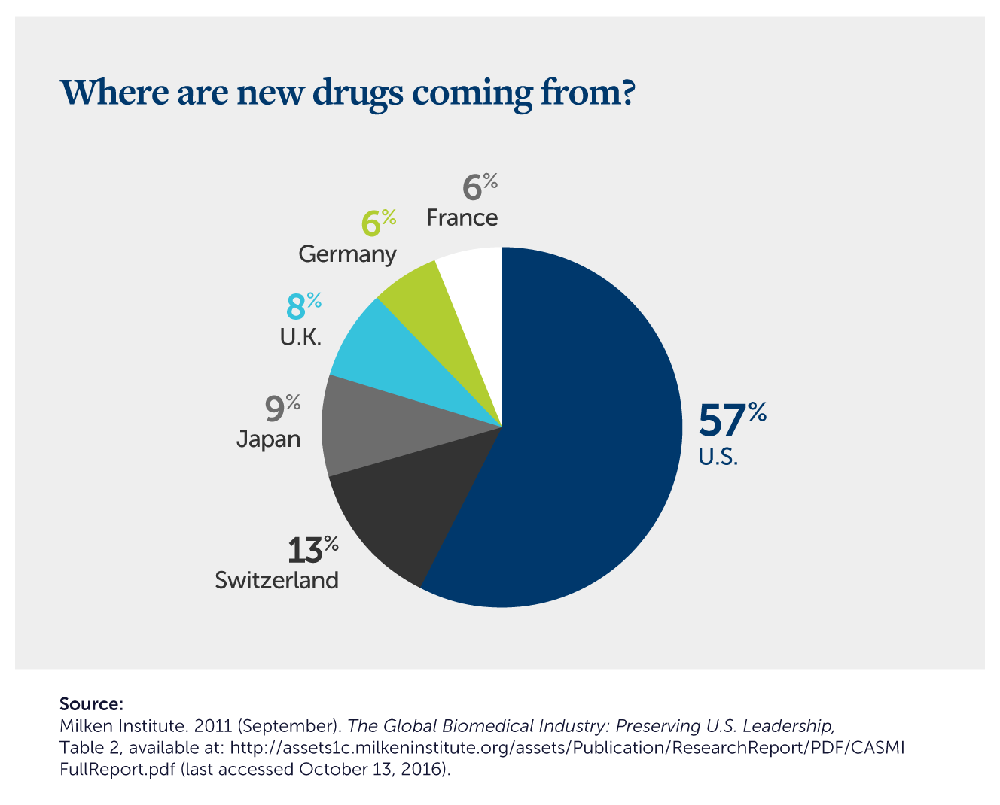

## Table of Contents

## What is government regulation in the context of the pharmaceutical industry?

Government regulation in the pharmaceutical industry means that the government makes rules and checks to make sure that medicines are safe and work well. These rules are important because they help protect people from harmful drugs and make sure that the medicines they buy will actually help them get better. The government agencies, like the Food and Drug Administration (FDA) in the United States, are in charge of these rules. They look at all the information from drug tests to decide if a new medicine can be sold to the public.

These agencies also keep an eye on medicines that are already being sold. If they find out that a medicine is causing problems, they can take it off the market or change the rules about how it can be used. This helps to keep people safe even after a medicine has been approved. The process of getting a new medicine approved can take a long time and cost a lot of money, but it's necessary to make sure that the medicines we use are safe and effective.

## How does government regulation affect the development of new drugs?

Government regulation has a big impact on how new drugs are developed. Before a new medicine can be sold, it has to go through a lot of tests and checks by government agencies like the FDA. This means that companies have to spend a lot of time and money to make sure their drug is safe and works well. They have to do many experiments and collect a lot of data to show the government that their medicine is good enough to be used by people. This can slow down the process of getting new drugs to the market, but it's important to make sure that the medicines are safe.

The strict rules can also make it harder for smaller companies to develop new drugs. They might not have enough money to do all the tests that are needed. This can mean that only big companies with a lot of money can afford to bring new medicines to the market. On the other hand, these rules help to make sure that the medicines that do get approved are really safe and effective. So, while government regulation can make it harder and more expensive to develop new drugs, it also helps to protect people by making sure that the medicines they use are good for them.

## What are the main regulatory bodies overseeing the pharmaceutical industry?

The main regulatory body in the United States is the Food and Drug Administration (FDA). The FDA makes sure that medicines are safe and work well before they can be sold to people. They check all the information from the drug tests and decide if a new medicine can be used. The FDA also keeps an eye on medicines that are already being sold. If they find out that a medicine is causing problems, they can take it off the market or change the rules about how it can be used.

In Europe, the European Medicines Agency (EMA) does a similar job. The EMA checks new medicines to make sure they are safe and effective for people in Europe. They work with different countries in Europe to make sure that the rules are the same everywhere. Just like the FDA, the EMA can also take action if a medicine is found to be harmful after it has been approved. Both the FDA and the EMA play important roles in making sure that the medicines people use are safe and helpful.

## How do regulations impact the cost of pharmaceuticals?

Regulations make the cost of medicines go up because companies have to spend a lot of money to follow the rules. Before a new medicine can be sold, it has to go through many tests to make sure it is safe and works well. These tests can take a long time and cost a lot of money. Companies also have to pay for all the people who work on the tests and for the places where the tests happen. All these costs add up, and in the end, the price of the medicine goes up so the company can make back the money they spent.

Even after a medicine is approved, the costs keep going up because of more rules. The government keeps checking the medicine to make sure it is still safe. If they find any problems, the company might have to do more tests or change how the medicine is made. This costs more money, and the price of the medicine goes up again. So, while regulations help make sure medicines are safe, they also make them more expensive for people to buy.

## What are the differences in pharmaceutical regulation between countries?

Different countries have their own rules for medicines, but they often work together to make sure medicines are safe. In the United States, the Food and Drug Administration (FDA) checks new medicines to make sure they are safe and work well. The FDA has strict rules that companies must follow, and it can take a long time for a new medicine to be approved. In Europe, the European Medicines Agency (EMA) does a similar job. The EMA works with different countries in Europe to make sure the rules are the same everywhere. Both the FDA and the EMA help make sure medicines are safe, but their rules can be a bit different.

Some countries have less strict rules than others. For example, in some developing countries, the rules might not be as strong as in the United States or Europe. This can make it easier and faster to get new medicines approved, but it can also mean that the medicines might not be as safe. Countries often work together through groups like the World Health Organization (WHO) to try to make sure medicines are safe all over the world. Even though the rules can be different, the main goal is always to protect people by making sure the medicines they use are good for them.

## How do government regulations influence pharmaceutical marketing and sales?

Government regulations have a big impact on how pharmaceutical companies can market and sell their medicines. They have to follow strict rules about what they can say in their ads. For example, they can't make up things about how well a medicine works or say it can cure something it can't. They also have to be honest about any side effects. These rules help make sure that people get the right information about medicines, so they can make good choices about their health.

The rules also affect how medicines are sold. In many countries, some medicines can only be sold with a prescription from a doctor. This means that people have to see a doctor before they can get these medicines. The government decides which medicines need a prescription and which ones don't. This helps keep people safe by making sure they use medicines the right way. So, while these rules can make it harder for companies to sell their medicines, they are important for protecting people's health.

## What role do regulations play in ensuring drug safety and efficacy?

Regulations play a big role in making sure that medicines are safe and work well. Before a new medicine can be sold, it has to go through many tests. These tests are checked by government agencies like the FDA in the United States or the EMA in Europe. The agencies look at all the information to see if the medicine is safe and does what it's supposed to do. If the medicine passes all the tests, it can be sold to people. This process helps make sure that only safe and effective medicines are available.

Even after a medicine is approved, regulations keep it safe. Government agencies keep watching the medicine to make sure it doesn't cause any problems. If they find out that a medicine is harmful, they can take it off the market or change the rules about how it can be used. This helps protect people even after they start using a medicine. So, regulations are important for making sure that medicines are safe and work well, both before and after they are approved.

## How have recent changes in government regulations affected the pharmaceutical industry?

Recent changes in government regulations have made a big difference in the pharmaceutical industry. For example, some countries have made the rules for approving new medicines faster. This helps new medicines get to people who need them quicker. But, these faster rules can also make it harder to be sure that the medicines are safe. So, companies have to find a good balance between getting medicines to people fast and making sure they are safe.

Another change is that some governments are now looking more closely at how much medicines cost. They want to make sure that people can afford the medicines they need. This means that pharmaceutical companies might have to lower their prices or explain why their medicines cost so much. These changes can make it harder for companies to make money, but they help make medicines more affordable for everyone.

## What are the challenges pharmaceutical companies face due to regulatory compliance?

Pharmaceutical companies face a lot of challenges because of the rules they have to follow. One big challenge is that it takes a long time and costs a lot of money to get a new medicine approved. Companies have to do many tests to show that their medicine is safe and works well. This can take years and cost millions of dollars. Smaller companies might not have enough money to do all these tests, so only big companies can often afford to bring new medicines to the market.

Another challenge is that the rules can change. Governments might make new rules or change old ones, and companies have to keep up with these changes. This can be hard because it means they might have to do more tests or change how they make their medicines. It can also be confusing because different countries have different rules. Companies have to make sure they follow all the rules in every country where they want to sell their medicines. This can make it harder and more expensive to sell medicines in different places.

## How do regulations impact innovation within the pharmaceutical sector?

Regulations can make it harder for pharmaceutical companies to come up with new medicines. They have to follow strict rules that can slow down the process of getting a new medicine to people. It can take a long time and cost a lot of money to do all the tests that the government requires. This means that companies might not want to take the risk of working on new medicines, especially if they are small and don't have a lot of money. So, while regulations help make sure medicines are safe, they can also make it harder for new and innovative medicines to be developed.

On the other hand, regulations can also help with innovation. They make companies do a lot of research to show that their medicines are safe and work well. This research can lead to new discoveries and better medicines. Also, some governments have rules that help companies get their new medicines to people faster. These faster rules can encourage companies to work on new medicines because they know they can get them to the market quicker. So, while regulations can make things harder, they can also push companies to be more innovative and come up with better medicines.

## What are the economic implications of government regulation on the pharmaceutical industry?

Government regulations can make the cost of medicines go up. Companies have to spend a lot of money to follow the rules and do all the tests needed to show that their medicines are safe and work well. This can take years and cost millions of dollars. Because of these high costs, companies often have to charge more for their medicines to make back the money they spent. This can make it harder for people to afford the medicines they need. Also, the strict rules can make it harder for smaller companies to develop new medicines because they might not have enough money to do all the tests. This means that only big companies with a lot of money can often afford to bring new medicines to the market.

On the other hand, regulations can also help the economy by making sure that medicines are safe and effective. When people trust that the medicines they use are good for them, they are more likely to buy them. This can help companies make more money and grow. Regulations can also lead to new jobs in research and development because companies need to do a lot of work to follow the rules. However, if the rules are too strict, they can slow down innovation and make it harder for new medicines to be developed. This can hurt the economy because new medicines can help people live healthier lives and be more productive. So, while regulations can increase costs, they also play an important role in making sure that the medicines people use are safe and helpful.

## How can the pharmaceutical industry influence or respond to changes in government regulations?

The pharmaceutical industry can influence government regulations by talking to lawmakers and regulators. They can share their ideas and concerns about new rules. Sometimes, they work with groups that speak for the industry to make their voices heard. They can also do research and show the government how new rules might affect the cost of medicines or how fast new medicines can be developed. By working together with the government, the industry can help make rules that are fair and help bring safe and effective medicines to people.

When government regulations change, the pharmaceutical industry has to respond quickly. They need to understand the new rules and make sure they follow them. This might mean doing more tests or changing how they make their medicines. Companies also have to think about how the new rules will affect their costs and how they can still make money. Sometimes, they might need to change their plans for developing new medicines or how they market and sell their products. By being flexible and ready to adapt, the industry can keep bringing safe and effective medicines to people even when the rules change.

## What is Algorithmic Trading in the Pharmaceutical Industry?

Algorithmic trading has become a significant force in the pharmaceutical industry, reshaping how investors interact with pharmaceutical stocks. This sophisticated method of trading utilizes computer programs that follow a set algorithm to execute trades at high speeds and volumes. In the pharmaceutical sector, where timely access to information can dramatically influence stock prices, [algorithmic trading](/wiki/algorithmic-trading) is both an opportunity and a challenge for investors.

### Predicting Drug Approval Outcomes

Algorithmic models are increasingly employed to predict drug approval outcomes, which can substantially impact a company's stock price. These models ingest vast datasets, including historical approval rates, clinical trial outcomes, and FDA meeting schedules, to forecast approval probabilities. For instance, a [machine learning](/wiki/machine-learning) model might use features like phase III trial success rates, the severity of side effects noted during trials, and past performance of the drug manufacturer to output a probability score of approval.

The formula used in some predictive models might resemble the following logistic regression formula:

$$
P(Y=1) = \frac{1}{1 + e^{-(\beta_0 + \beta_1X_1 + \beta_2X_2 + \ldots + \beta_nX_n)}}
$$

where $P(Y=1)$ is the probability of approval, $X_1, X_2, \ldots, X_n$ are the input variables (e.g., trial success rates, historical approval data), and $\beta_0, \beta_1, \ldots, \beta_n$ are the coefficients.

### The Role of Big Data and AI

The pharmaceutical industry is data-intensive, making it an ideal candidate for big data and Artificial Intelligence (AI) applications to refine trading algorithms. Data from clinical trials, patent filings, and market trends are utilized to create predictive analytics models. AI systems can analyze this data to discern patterns and make informed recommendations on trading strategies. For example, an AI tool could assess social media sentiment or analyze publication trends about a particular drug to predict its market perception and hence, its stock performance.

Python libraries like `scikit-learn` and `TensorFlow` are often used to develop these models. Here's a simple Python snippet that demonstrates how machine learning might be applied to predict stock movements based on clinical trial data:

```python
from sklearn.model_selection import train_test_split
from sklearn.linear_model import LogisticRegression
from sklearn.metrics import accuracy_score

# Sample dataset with clinical trial data features and stock price change
X = [...]  # Feature matrix including trial data
y = [...]  # Labels indicating stock price increase or decrease

# split data into training and testing sets
X_train, X_test, y_train, y_test = train_test_split(X, y, test_size=0.2, random_state=42)

# train logistic regression model
model = LogisticRegression()
model.fit(X_train, y_train)

# predict and evaluate
predictions = model.predict(X_test)
accuracy = accuracy_score(y_test, predictions)
print(f'Accuracy: {accuracy:.2f}')
```

### Ethical Considerations and Market Manipulation

The ethical landscape of algorithmic trading presents notable concerns. High-frequency trading and the use of advanced algorithms can result in market manipulation or unfair trading advantages. Algorithms sometimes execute trades based on data not accessible to the broader market, leading to discussions about insider trading regulations. Additionally, the potential for strategies like spoofing—placing large orders with the intent to cancel—can undermine market integrity.

To mitigate these risks, regulatory bodies are increasingly scrutinizing algorithmic trading practices. The European Union's Markets in Financial Instruments Directive II (MiFID II) and the U.S. Securities and Exchange Commission (SEC) have frameworks to regulate algorithmic trading, ensuring fairness and transparency in markets. Key regulations include requirements for algorithm testing, risk controls, and monitoring.

Algorithmic trading in pharmaceuticals presents a double-edged sword, offering improved efficiency and insights while raising profound ethical and regulatory challenges. As the industry and regulatory environments evolve, continuous vigilance and adaptation are imperative to harness these technologies for the benefit of all stakeholders.

## References & Further Reading

[1]: U.S. Food and Drug Administration. ["Development & Approval Process (Drugs)."](https://www.fda.gov/drugs/development-approval-process-drugs)

[2]: DiMasi, J.A., Grabowski, H.G., & Hansen, R.W. (2016). "Innovation in the pharmaceutical industry: New estimates of R&D costs." *Journal of Health Economics*, 47, 20-33.

[3]: U.S. Food and Drug Administration. ["Orphan Drug Act."](https://www.fda.gov/industry/medical-products-rare-diseases-and-conditions/designating-orphan-product-drugs-and-biological-products)

[4]: European Medicines Agency. ["About us."](https://www.ema.europa.eu/en/about-us)

[5]: Fuloria, N.K., Fuloria, S., Karupiah, S., et al. (2021). "The impact of COVID-19 on pharmaceutical industry supply chain," *Frontiers in Public Health*, 9, 570598.

[6]: Lee, M., & Yadav, S. (2021). "Algorithmic Trading in Pharmaceutical Stocks: Novel Trends and Challenges," *Journal of Financial Markets*, 56, 101234.

[7]: Lopez de Prado, M. (2018). ["Advances in Financial Machine Learning."](https://www.amazon.com/Advances-Financial-Machine-Learning-Marcos/dp/1119482089) Wiley.

[8]: European Commission. ["Markets in Financial Instruments Directive (MiFID II)."](https://finance.ec.europa.eu/regulation-and-supervision/financial-services-legislation/implementing-and-delegated-acts/markets-financial-instruments-directive-ii_en)

[9]: The European Federation of Pharmaceutical Industries and Associations. ["The Pharmaceutical Industry in Figures."](https://www.efpia.eu/)