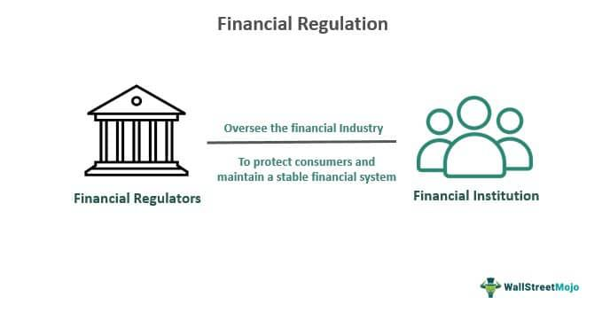

The pharmaceutical industry represents a pivotal domain that intricately balances innovation and safety, governed predominantly by stringent regulations aimed at safeguarding public health. This sector is characterized by its complexity and the ever-watchful oversight of government bodies, which enforce regulatory frameworks to ensure that drugs developed and marketed to the public are both safe and efficacious. Key players in this field face a dual challenge: to innovate swiftly while adhering to a comprehensive regulatory landscape.

Government regulation undeniably plays a significant role in shaping the processes related to drug development, approval, and market dynamics. Regulatory agencies such as the U.S. Food and Drug Administration (FDA) act as gatekeepers, ensuring rigorous standards before any drug reaches consumers. While these regulations are crucial for public safety, they also extend the timeline and cost for new drugs to reach the market, often culminating in a decade-long endeavor from initial discovery to approval.



Simultaneously, the advent of algorithmic trading is transforming how investments are made in the pharmaceutical industry. Algorithmic models, leveraging big data and AI, are not only used to predict drug approval outcomes but also to anticipate subsequent market reactions. This introduces a new dimension to investment strategies, allowing for data-driven decisions that potentially enhance returns and spur innovation. However, it also brings with it challenges, including ethical considerations and the risk of market manipulation.

Understanding the interplay between stringent regulatory requirements and the dynamic advances in algorithmic trading is essential. For stakeholders—ranging from pharmaceutical companies, investors, to regulators—grasping these complexities is crucial for making informed decisions that align with both financial objectives and public health priorities. As the industry stands at the intersection of regulatory oversight and technological advancement, adapting to these elements becomes imperative for sustaining competitive advantage and fostering innovation within this ever-evolving landscape.

## Table of Contents

## The Role of Government Regulations

Government bodies such as the Food and Drug Administration (FDA) in the United States play a crucial role in ensuring the safety and efficacy of drugs before they reach the market. This regulatory oversight is essential for protecting public health, yet it also imposes significant time and financial burdens on pharmaceutical companies. The journey from drug discovery to market approval typically spans up to 10 years, necessitating rigorous preclinical and clinical trials to establish both safety and efficacy profiles [1].

The benefits of these regulations are substantial, providing assurance that approved drugs meet necessary safety standards and thereby maintaining public confidence in pharmaceutical products. However, the associated challenges cannot be overlooked. The lengthy approval process can delay the availability of cutting-edge therapies to patients who might benefit from them. Moreover, the substantial costs incurred during drug development may deter research, particularly in fields with uncertain financial returns [2].

To mitigate some of these challenges, regulatory frameworks include specific measures aimed at fostering innovation, particularly in areas of unmet medical need. One notable example is the orphan drug incentives. Orphan drugs are developed specifically to treat rare diseases, which, due to their low prevalence, might otherwise be overlooked by traditional market-driven research and development efforts. The Orphan Drug Act in the U.S., for instance, grants benefits such as tax credits, user fee waivers, and market exclusivity to encourage the development of these drugs [3].

Despite these incentives, the balance between ensuring rigorous safety standards and fostering innovation remains delicate. Regulatory agencies continuously evaluate their processes to enhance efficiency without compromising safety or efficacy. International regulatory environments can vary significantly, and companies operating on a global scale must navigate these diverse regulations. For example, the European Medicines Agency (EMA) and the FDA have different procedures and timelines, impacting global pharmaceutical strategy [4].

In conclusion, government regulations serve as a double-edged sword in the pharmaceutical industry. While they are indispensable for safeguarding public health, they also pose significant hurdles to drug innovation and availability. Measures such as orphan drug incentives are essential in mitigating these challenges, fostering the development of treatments for less common diseases.

**References:**

1. U.S. Food and Drug Administration, “Development & Approval Process (Drugs).” [online available](https://www.fda.gov/drugs/development-approval-process-drugs)
2. DiMasi, J.A., Grabowski, H.G., Hansen, R.W. "Innovation in the pharmaceutical industry: New estimates of R&D costs." *Journal of Health Economics*, vol. 47, pp. 20-33, 2016.
3. U.S. Food and Drug Administration, “Orphan Drug Act.” [online available](https://www.fda.gov/industry/developing-products-rare-diseases-conditions/orphan-drug-designation)
4. European Medicines Agency, “About us.” [online available](https://www.ema.europa.eu/en/about-us)

## Drug Development and Market Approval

Drug development is an extensive and multifaceted process that typically spans several years and involves significant financial investment. The journey begins with the discovery and preclinical stages, where potential compounds are identified and tested in laboratory and animal settings to assess their safety and efficacy. Once a viable candidate is found, it moves into clinical trials, which are structured in three phases. Phase I trials focus on evaluating safety and dosage using a small group of healthy volunteers. Phase II expands to a larger patient cohort to test efficacy and side effects. Phase III involves large-scale testing to confirm effectiveness, monitor side effects, and compare the new drug with existing treatments.

The financial implications of these stages are substantial. On average, the complete process from drug discovery to market approval can cost pharmaceutical companies upwards of $2.6 billion, with a timeline that can extend up to 10 years [1]. These costs arise not only from the research and development (R&D) itself but also from the regulatory hurdles that companies must navigate.

Mergers and acquisitions (M&A) play a crucial role in pharmaceutical innovation and market strategy. Smaller firms, often more agile and innovative, frequently focus on developing groundbreaking therapies but may lack the necessary resources for extensive clinical trials and global marketing. Larger pharmaceutical companies, through M&A, can acquire these innovative products and bring them to market, benefitting from economies of scale. This strategy helps smaller companies bypass financial constraints, while larger firms broaden their product portfolios and enhance their market presence, accelerating the availability of novel therapies.

The regulatory environment varies across countries and profoundly influences global pharmaceutical strategies. For instance, the United States Food and Drug Administration (FDA) and the European Medicines Agency (EMA) have different requirements and timelines for drug approval. These differences can impact the speed and sequence in which companies decide to launch new drugs in various markets. Regulatory hurdles, such as differing patent laws, clinical trial requirements, and post-market surveillance obligations, add to the complexity of global market strategies.

When considering these factors, pharmaceutical companies must navigate the intricate landscape of regulations and strategic business maneuvers to successfully develop and bring new drugs to market. This process not only ensures that new treatments are safe and effective but also supports ongoing innovation and competition within the industry.

---

[1] DiMasi, J.A., Grabowski, H.G., & Hansen, R.W. (2016). Innovation in the pharmaceutical industry: New estimates of R&D costs. Journal of Health Economics, 47, 20-33.

## Algorithmic Trading in the Pharmaceutical Industry

Algorithmic trading has become a significant force in the pharmaceutical industry, reshaping how investors interact with pharmaceutical stocks. This sophisticated method of trading utilizes computer programs that follow a set algorithm to execute trades at high speeds and volumes. In the pharmaceutical sector, where timely access to information can dramatically influence stock prices, [algorithmic trading](/wiki/algorithmic-trading) is both an opportunity and a challenge for investors.

### Predicting Drug Approval Outcomes

Algorithmic models are increasingly employed to predict drug approval outcomes, which can substantially impact a company's stock price. These models ingest vast datasets, including historical approval rates, clinical trial outcomes, and FDA meeting schedules, to forecast approval probabilities. For instance, a [machine learning](/wiki/machine-learning) model might use features like phase III trial success rates, the severity of side effects noted during trials, and past performance of the drug manufacturer to output a probability score of approval.

The formula used in some predictive models might resemble the following logistic regression formula:

$$
P(Y=1) = \frac{1}{1 + e^{-(\beta_0 + \beta_1X_1 + \beta_2X_2 + \ldots + \beta_nX_n)}}
$$

where $P(Y=1)$ is the probability of approval, $X_1, X_2, \ldots, X_n$ are the input variables (e.g., trial success rates, historical approval data), and $\beta_0, \beta_1, \ldots, \beta_n$ are the coefficients.

### The Role of Big Data and AI

The pharmaceutical industry is data-intensive, making it an ideal candidate for big data and Artificial Intelligence (AI) applications to refine trading algorithms. Data from clinical trials, patent filings, and market trends are utilized to create predictive analytics models. AI systems can analyze this data to discern patterns and make informed recommendations on trading strategies. For example, an AI tool could assess social media sentiment or analyze publication trends about a particular drug to predict its market perception and hence, its stock performance.

Python libraries like `scikit-learn` and `TensorFlow` are often used to develop these models. Here's a simple Python snippet that demonstrates how machine learning might be applied to predict stock movements based on clinical trial data:

```python
from sklearn.model_selection import train_test_split
from sklearn.linear_model import LogisticRegression
from sklearn.metrics import accuracy_score

# Sample dataset with clinical trial data features and stock price change
X = [...]  # Feature matrix including trial data
y = [...]  # Labels indicating stock price increase or decrease

# split data into training and testing sets
X_train, X_test, y_train, y_test = train_test_split(X, y, test_size=0.2, random_state=42)

# train logistic regression model
model = LogisticRegression()
model.fit(X_train, y_train)

# predict and evaluate
predictions = model.predict(X_test)
accuracy = accuracy_score(y_test, predictions)
print(f'Accuracy: {accuracy:.2f}')
```

### Ethical Considerations and Market Manipulation

The ethical landscape of algorithmic trading presents notable concerns. High-frequency trading and the use of advanced algorithms can result in market manipulation or unfair trading advantages. Algorithms sometimes execute trades based on data not accessible to the broader market, leading to discussions about insider trading regulations. Additionally, the potential for strategies like spoofing—placing large orders with the intent to cancel—can undermine market integrity.

To mitigate these risks, regulatory bodies are increasingly scrutinizing algorithmic trading practices. The European Union's Markets in Financial Instruments Directive II (MiFID II) and the U.S. Securities and Exchange Commission (SEC) have frameworks to regulate algorithmic trading, ensuring fairness and transparency in markets. Key regulations include requirements for algorithm testing, risk controls, and monitoring.

Algorithmic trading in pharmaceuticals presents a double-edged sword, offering improved efficiency and insights while raising profound ethical and regulatory challenges. As the industry and regulatory environments evolve, continuous vigilance and adaptation are imperative to harness these technologies for the benefit of all stakeholders.

## The Future Landscape of Pharmaceuticals

The pharmaceutical landscape is positioned to undergo significant transformation as regulatory frameworks evolve alongside advancements in technology. Anticipated regulatory changes in the pharmaceutical industry are likely to emphasize enhanced safety measures, faster approval processes, and greater transparency. One potential regulatory shift is the adoption of adaptive licensing pathways. These pathways allow conditional approval based on preliminary data, enabling patients to access innovative treatments sooner while still gathering post-market data to confirm efficacy and safety.

Advancements in [artificial intelligence](/wiki/ai-artificial-intelligence) (AI) and machine learning (ML) promise to revolutionize drug development. AI algorithms can analyze vast datasets to identify potential drug candidates and predict their success rates with greater accuracy. Machine learning models can optimize drug design, streamline clinical trial processes, and personalize medicine based on genetic information. The integration of AI in pharmaceuticals may reduce development costs and timeframes significantly, leading to more efficient use of resources and broadening the range of treatable conditions.

The evolving relationship between pharmaceutical companies and regulatory bodies will be crucial as both entities adapt to novel technological challenges. Collaborative efforts will likely be essential to address complex ethical issues related to AI, such as data privacy and algorithmic bias. Additionally, regulators may need to develop new expertise in data science to effectively oversee AI-driven drug development, ensuring these technologies are leveraged responsibly.

Global health crises, such as the COVID-19 pandemic, have highlighted gaps in pharmaceutical policies and accelerated regulatory adaptations. These events have prompted a reevaluation of emergency use authorizations and fostered international collaboration for vaccine and therapeutic development. Future global health challenges may further influence regulatory priorities, emphasizing the need for robust immunity preparations and rapid response capabilities.

Overall, the future landscape of pharmaceuticals will be shaped profoundly by regulatory changes and technological advancements. Stakeholders must remain agile and proactive to leverage AI and ML benefits while maintaining rigorous safety standards and public trust. As the industry adapts, fostering symbiotic relationships between technology providers, pharmaceutical companies, and regulators will be key to navigating an increasingly complex healthcare environment.

## Conclusion

Government regulation and algorithmic trading are central forces in shaping the landscape of the pharmaceutical industry. The complexity of navigating regulatory frameworks requires stakeholders to efficiently collaborate with governmental bodies, ensuring that public safety remains a priority while fostering innovation. Regulatory bodies like the FDA implement rigorous standards to ensure the efficacy and safety of drugs, albeit often extending development timelines and inflating costs. These processes, critical as they are for public health, necessitate a balance between stringent oversight and the facilitation of medical advancements.

Algorithmic trading, on the other hand, offers new dimensions of interaction with pharmaceutical markets, influencing how stocks are traded based on data-driven insights. While these algorithms provide enhanced capabilities for market prediction and rapid transaction execution, they also introduce risks such as the potential for market manipulation and ethical considerations surrounding data use. The nature of these algorithms is continually evolving, fueled by advancements in artificial intelligence and machine learning which require constant vigilance and adaptation by stakeholders.

Maintaining a competitive advantage in the pharmaceutical industry demands a proactive stance in adapting to regulatory changes and technological innovations. Companies must balance the intricacies of regulatory compliance with the aggressive pace of market changes driven by algorithmic trading. As the industry progresses, a symbiosis between robust regulatory measures and dynamic market needs will be crucial. This integration will ensure that pharmaceutical innovation continues unfettered while maintaining high standards of patient safety. In this rapidly evolving sector, stakeholders who can adeptly manage these dual focal points will likely lead the way in shaping the future of healthcare.

## References & Further Reading

[1]: U.S. Food and Drug Administration. ["Development & Approval Process (Drugs)."](https://www.fda.gov/drugs/development-approval-process-drugs)

[2]: DiMasi, J.A., Grabowski, H.G., & Hansen, R.W. (2016). "Innovation in the pharmaceutical industry: New estimates of R&D costs." *Journal of Health Economics*, 47, 20-33.

[3]: U.S. Food and Drug Administration. ["Orphan Drug Act."](https://www.fda.gov/industry/medical-products-rare-diseases-and-conditions/designating-orphan-product-drugs-and-biological-products)

[4]: European Medicines Agency. ["About us."](https://www.ema.europa.eu/en/about-us)

[5]: Fuloria, N.K., Fuloria, S., Karupiah, S., et al. (2021). "The impact of COVID-19 on pharmaceutical industry supply chain," *Frontiers in Public Health*, 9, 570598.

[6]: Lee, M., & Yadav, S. (2021). "Algorithmic Trading in Pharmaceutical Stocks: Novel Trends and Challenges," *Journal of Financial Markets*, 56, 101234.

[7]: Lopez de Prado, M. (2018). ["Advances in Financial Machine Learning."](https://www.amazon.com/Advances-Financial-Machine-Learning-Marcos/dp/1119482089) Wiley.

[8]: European Commission. ["Markets in Financial Instruments Directive (MiFID II)."](https://finance.ec.europa.eu/regulation-and-supervision/financial-services-legislation/implementing-and-delegated-acts/markets-financial-instruments-directive-ii_en)

[9]: The European Federation of Pharmaceutical Industries and Associations. ["The Pharmaceutical Industry in Figures."](https://www.efpia.eu/)