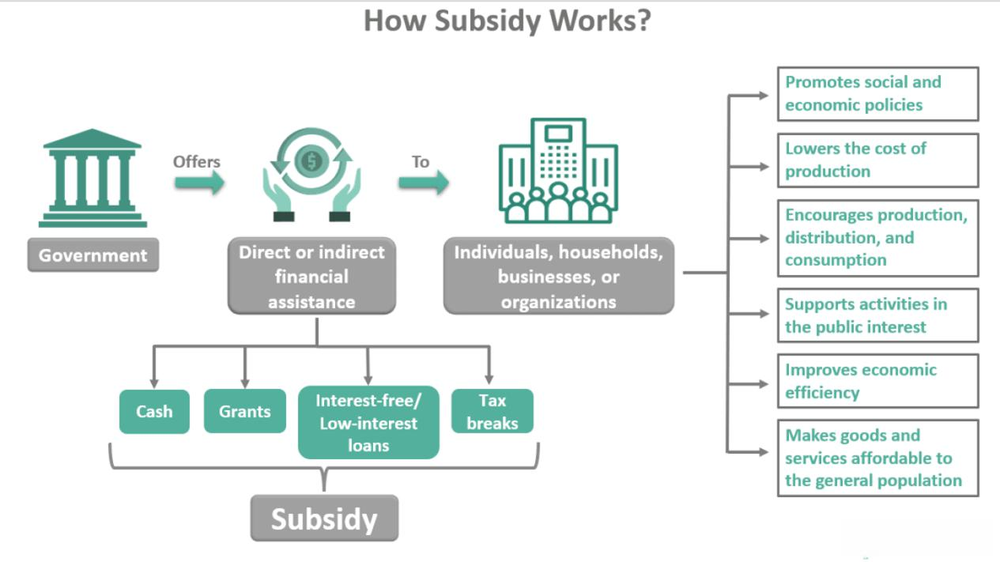

The global economy is a complex web of interactions between various sectors. It involves the production, distribution, and consumption of goods and services across national borders, influenced by factors such as government policies, technological advancements, and consumer behaviors. A critical component of this intricate system is the synergy between government subsidies and industry support. These subsidies, offered by governments, are financial aids meant to empower specific sectors considered vital for economic growth and stability. They can take various forms, such as tax reliefs, direct monetary transfers, or reimbursements, and they aim to bolster industries susceptible to external market pressures. 

Moreover, modern technological advancements, notably algorithmic trading, have profoundly impacted financial markets, reshaping how economic landscapes are configured. Algorithmic trading utilizes computer algorithms to automate trading decisions, increasing market efficiency and liquidity. However, it also brings risks like market volatility and systemic issues. The dynamic interplay between these government interventions and technological innovations influences market conditions, investment flows, and economic health.

This article examines the economic impact of industry support through government subsidies and the transformative role of algorithmic trading. It explores how these factors interact, their potential benefits, and the challenges they pose. As governments strive to stimulate growth and modernize financial instruments, understanding their convergence is imperative for policymakers, industry stakeholders, and investors. Recognizing this complexity allows for strategic decision-making, ensuring these elements collectively contribute to a more robust and resilient global economy.

## Table of Contents

## Understanding Government Subsidies

Government subsidies are assistance programs implemented by national or regional governments to support sectors considered crucial for economic sustainability and development. These programs are established with the intention of enhancing economic stability by mitigating the impact of volatile market forces and fostering growth in industries that might otherwise struggle to remain competitive.

Subsidies manifest in various forms, each designed to address specific needs within a targeted industry. Common types include tax credits, which reduce the tax burden on companies to encourage investment in certain areas; direct cash transfers, which provide immediate financial support to offset production costs; and reimbursements, which compensate firms for expenses incurred in pursuing strategic economic objectives. Each of these forms aims to lower operational costs and create a more conducive environment for industry players to thrive.

Governments often allocate subsidies towards industries susceptible to external market pressures, such as agriculture, renewable energy, and technology. These sectors may experience significant fluctuations due to factors like international competition, environmental conditions, and technological advancements, making them prime candidates for government intervention.

Critics of government subsidies argue that such interventions can lead to market inefficiencies. By artificially lowering costs, subsidies may distort market prices, leading to overproduction or misallocation of resources. This interference can stymie competition by encouraging dependency on governmental support rather than innovation and efficiency improvements.

On the other hand, proponents of subsidies highlight their role in maintaining economic stability, especially in strategic or nascent industries requiring initial support to establish themselves. Subsidies can act as a catalyst for economic diversification and innovation, providing a safety net that encourages experimentation and investment in high-risk areas critical for future growth.

Understanding the dynamics of subsidies is crucial for policymakers, as the challenge lies in designing programs that maximize economic benefits while minimizing potential drawbacks. Balancing support with market competition is essential to ensure that subsidies contribute positively to the overall economic landscape.

## The Economic Impact of Industry Support

Industry support through government subsidies plays a pivotal role in catalyzing economic growth by influencing both the supply and demand sides of the market. Subsidies are financial aids that lessen the burden of production costs for manufacturers, allowing them to increase their output without exerting upward pressure on prices. This setup is critical in stabilizing essential sectors, especially those susceptible to external market fluctuations, thereby ensuring uninterrupted production and supply of goods and services.

On the supply side, subsidies can significantly reduce the marginal cost of production. This reduction enables firms to expand their operations and increase their market supply. The competitive advantage gained through decreased production costs can lead to economies of scale, enabling companies to operate more efficiently and allocate resources optimally. The formula for calculating the marginal cost $MC$ in such scenarios can be represented as:

$$
MC = \frac{\Delta TC - S}{\Delta Q}
$$

where $\Delta TC$ is the change in total cost, $S$ represents subsidies provided, and $\Delta Q$ is the change in quantity produced. Subsidies effectively decrease the effective total cost, hence lowering the marginal cost.

On the demand side, subsidies can reduce the final price paid by consumers, making goods and services more affordable. This accessibility leads to increased consumer spending, which is a crucial component of economic growth. When consumers spend more, it creates a ripple effect throughout the economy, enhancing demand for goods and services and encouraging further production.

The dual impact of subsidies—boosting supply while simultaneously stimulating demand—can lead to a more robust and resilient economy. This phenomenon can encourage innovation as firms seek to leverage subsidies to improve their offerings and reach a broader customer base. As a result, the overall market dynamics transform, fostering a competitive environment that can lead to technological advancements and improved product quality.

Moreover, by supporting industries that are strategically vital for national interest, subsidies can strengthen a nation's economic infrastructure. They can help nascent industries develop and become competitive in the global market. This strategic positioning is crucial for long-term economic resilience and growth, as it fosters self-reliance and reduces dependency on imports for critical sectors. 

In summary, government subsidies are an essential mechanism for providing industry support, crucially influencing economic growth pathways by enhancing supply capabilities and stimulating demand. This synergy not only supports a healthy economic environment but also positions economies to adapt and thrive amidst global challenges and opportunities.

## Algorithmic Trading: Transforming Markets

Algorithmic trading is the employment of computer algorithms to automate trading decisions, which has brought transformative changes to financial markets. This approach has significantly enhanced trading efficiency and [liquidity](/wiki/liquidity-risk-premium), allowing transactions to be executed at a faster pace and with greater precision, thus reducing transaction costs. Algorithms can process volumes of data in milliseconds, enabling the swift execution of trades based on pre-defined criteria, optimizing the decision-making process beyond human capabilities.

The advent of [algorithmic trading](/wiki/algorithmic-trading) has brought about increased liquidity in markets, which is essential for the smooth functioning of trading activities. Liquidity refers to the ability of an asset to be bought or sold quickly without causing significant price changes. With algorithmic trading, large volumes of trades can be executed with minimal market impact, ensuring orders are filled quickly and at the best available prices. This has democratized access to markets by narrowing bid-ask spreads, thereby benefiting both large institutional investors and retail traders.

Despite these advantages, algorithmic trading is not without challenges. One significant risk is market [volatility](/wiki/volatility-trading-strategies), as algorithms can react to market events much faster than humans, potentially exacerbating price swings during periods of instability. This was exemplified during the "Flash Crash" of May 6, 2010, when the Dow Jones Industrial Average experienced a rapid decline and recovery within minutes, partly attributed to algorithmic trading. Such incidents underscore the systemic issues that can arise when algorithms, operating on potentially flawed logic or data, interact dynamically in markets.

Another point of consideration is the application of algorithmic trading within industries supported by government subsidies. The presence of subsidies can act as a stabilizing force, attracting more algorithmic trading due to the perceived reduction in risk. However, this convergence can also amplify potential profits and risks. For instance, if algorithms are designed to capitalize on subsidy-induced price distortions or inefficiencies, they could potentially destabilize markets if many traders execute similar strategies simultaneously.

The integration of algorithmic trading in these contexts necessitates careful regulatory oversight to prevent market manipulation and ensure fairness. Policymakers and industry stakeholders must understand and address the risks introduced by technological advancements to harness their benefits while safeguarding market integrity. This includes implementing safeguards such as circuit breakers, stress testing algorithms, and maintaining transparency in trading activities to mitigate systemic risks.

## The Intersection of Government Subsidies and Algorithmic Trading

Government subsidies can significantly influence algorithmic trading patterns by introducing elements of stability and predictability into the markets they target. Subsidies often act as a safety net for specific industries, reducing financial uncertainty and making these sectors more attractive to investors. This relative stability and reduced risk can lead to increased interest from algorithmic traders, who seek to capitalize on favorable market conditions.

Algorithmic trading systems, which rely on predefined rules and statistical models to guide trade execution, can be particularly sensitive to market conditions shaped by subsidies. These programs often [factor](/wiki/factor-investing) in variables such as price trends, [volume](/wiki/volume-trading-strategy) fluctuations, and volatility indicators. When an industry receives government support, these variables may shift favorably, prompting algorithms to engage more actively in trading within these sectors.

The attractiveness of subsidized industries to algorithmic trading stems from the reduced risk perceptions associated with such government support. With enhanced certainty around business operations and potential profitability, algorithms can optimize trading strategies to maximize gains. For instance, subsidies might lead to lower production costs and stable output, conditions that align well with [quantitative trading](/wiki/quantitative-trading) models focused on exploiting small price differentials at high frequencies.

However, this interaction between government subsidies and algorithmic trading also poses significant challenges, necessitating regulatory oversight. The influx of algorithmic trading in subsidized markets can lead to increased volatility, particularly if the trading activity involves high-frequency or large-volume transactions. Rapid price swings driven by algorithmic trades can destabilize markets, negating some of the intended stabilizing effects of subsidies.

Furthermore, the convergence of government subsidies and algorithmic trading raises concerns about potential market manipulation. Traders equipped with sophisticated algorithms may exploit subsidies, using them to artificially inflate or deflate market prices. This possibility underscores the importance of regulatory frameworks designed to monitor and control the interaction between subsidies and algorithmic trading activities.

For policymakers and industry stakeholders, understanding this intersection is crucial. Effective regulation must balance the benefits of increased market efficiency and liquidity provided by algorithmic trading with the need to prevent its potential adverse effects. Policymakers must also ensure that subsidies achieve their intended goals of economic growth and stability without being undermined by unintended market dynamics.

## Challenges and Critiques

Government subsidies, while instrumental in promoting economic stability and growth, often generate significant criticism due to their potential to distort market competition. Critics argue that subsidies can lead to unfair advantages for certain industries or companies over others, potentially stifalling innovation and deterring market entry for smaller players. By providing financial assistance selectively, governments may inadvertently favor established firms over new entrants, resulting in reduced competition and potential monopolistic tendencies. This can hinder the overall efficiency and dynamism of the market, leading to an economic environment where resources are not allocated optimally.

Algorithmic trading, likewise, has transformed financial markets through increased efficiency and liquidity. However, its rapid automated nature poses risks, most notably exemplified by phenomena such as flash crashes. Flash crashes are scenarios where markets plummet within minutes due to unforeseen algorithm interactions, leading to temporary systemic failures. This risk is compounded by the fact that algorithmic trading may exacerbate market volatility, as large volumes of trades can be executed almost instantaneously in response to market signals or news. Moreover, the opacity of these automated systems can make it challenging for human traders and regulators to predict and mitigate potential market disruptions.

A balanced approach to addressing the intertwining challenges of subsidies and algorithmic trading is essential. Policymakers and industry stakeholders need to ensure these mechanisms together foster economic growth without unintended consequences. This involves enhancing transparency around subsidy allocations to prevent market distortion and promoting fair competition. Similarly, algorithmic trading demands robust oversight and adaptation of existing regulatory frameworks to address the unique risks it presents. Regulatory bodies must ensure that algorithms employed in trading are transparent, accountable, and incorporate fail-safes to prevent catastrophic market events.

For policymakers, addressing these challenges necessitates a multifaceted strategy that encompasses both legislative and technological innovations. This includes revisiting the criteria for subsidy provision to ensure they are equitable, non-discriminatory, and based on clear metrics for success. Additionally, the development of advanced monitoring systems and the instigation of real-time regulatory mechanisms can help preemptively identify and mitigate risks associated with high-frequency algorithmic trades.

In conclusion, while government subsidies and algorithmic trading significantly impact economic landscapes, their associated risks and critiques demand careful consideration and proactive regulation. Responsible management and oversight will be pivotal in harnessing these economic tools' full potential while safeguarding against market disruptions and inefficiencies.

## Conclusion

Government subsidies and algorithmic trading represent influential economic mechanisms that wield significant influence over industrial landscapes. When harnessed effectively, these tools have the capacity to stimulate innovation, promote growth, and stabilize the economy, thereby driving forward economic advancements. Subsidies, by providing financial support and incentives, can help foster the development of critical industries, reduce production costs, and encourage consumer accessibility. This, in turn, nurtures a more resilient economic environment by making essential goods and services more affordable.

Algorithmic trading, on the other hand, has revolutionized financial markets by enhancing trading efficiency and liquidity. The ability of algorithms to process vast datasets at incredible speeds allows trading strategies to be executed more swiftly and accurately, contributing to market dynamism. Furthermore, the integration of algorithmic trading into subsidized sectors can amplify economic benefits by optimizing the flow of capital and increasing investor participation in these stabilized markets.

However, the considerable advantages offered by these tools are accompanied by significant risks that necessitate careful oversight and regulation. Government subsidies, despite their intentions, can lead to market distortions and unfair competitive advantages if not properly managed. Similarly, algorithmic trading, if left unchecked, can exacerbate market volatility and introduce systemic risks, as evidenced by instances of flash crashes.

Therefore, it is imperative for policymakers to implement regulatory frameworks that balance the benefits of these tools against their potential drawbacks. Effective regulation should aim to maximize economic gains while mitigating risks, ensuring that subsidies and algorithmic trading act as complementary forces that enhance industrial performance without compromising market integrity.

As the global economy evolves, the role of government subsidies and algorithmic trading is poised to expand, reshaping economic landscapes on an international scale. Continuous advancements in technology and policy adaptations will likely dictate the trajectory of their development. It is essential for stakeholders to remain vigilant and proactive in navigating these changes to ensure that the economic benefits of subsidies and algorithmic trading are maximized, while safeguarding against unforeseen challenges that may arise.

## References & Further Reading

[1]: Bergstra, J., Bardenet, R., Bengio, Y., & Kégl, B. (2011). ["Algorithms for Hyper-Parameter Optimization."](https://papers.nips.cc/paper/4443-algorithms-for-hyper-parameter-optimization) Advances in Neural Information Processing Systems 24.

[2]: ["Advances in Financial Machine Learning"](https://www.amazon.com/Advances-Financial-Machine-Learning-Marcos/dp/1119482089) by Marcos Lopez de Prado

[3]: ["Evidence-Based Technical Analysis: Applying the Scientific Method and Statistical Inference to Trading Signals"](https://www.amazon.com/Evidence-Based-Technical-Analysis-Scientific-Statistical/dp/0470008741) by David Aronson

[4]: ["Machine Learning for Algorithmic Trading"](https://github.com/stefan-jansen/machine-learning-for-trading) by Stefan Jansen

[5]: ["Quantitative Trading: How to Build Your Own Algorithmic Trading Business"](https://www.amazon.com/Quantitative-Trading-Build-Algorithmic-Business/dp/1119800064) by Ernest P. Chan