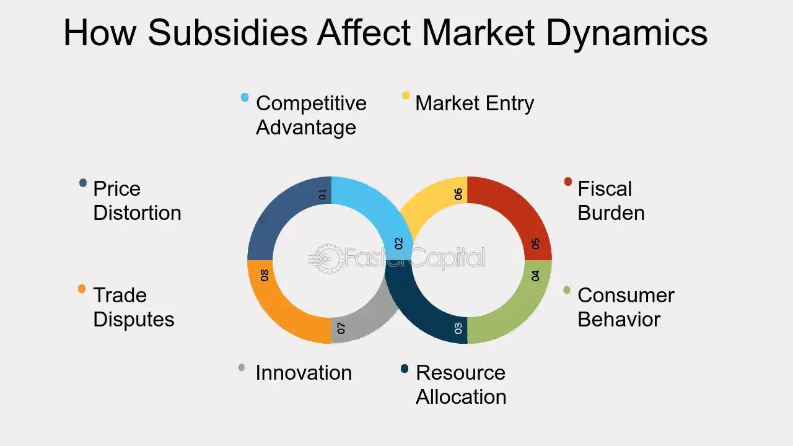

## Table of Contents

## What are government subsidies?

Government subsidies are financial help given by the government to businesses, organizations, or individuals. They are used to support certain activities or industries that the government thinks are important. For example, a government might give money to farmers to help them grow food more cheaply, or to companies that make green energy to encourage more of it.

Subsidies can be given in many ways, like direct payments, tax breaks, or low-interest loans. The goal is often to make things more affordable for people, to help the economy grow, or to support new industries. However, subsidies can also cause problems, like when they help big companies too much and make it hard for smaller ones to compete.

## How do subsidies affect the pricing of goods and services in an industry?

Subsidies can lower the prices of goods and services in an industry. When the government gives money to businesses, it helps them pay for things like making products or providing services. This means businesses don't have to charge as much to cover their costs. For example, if a farmer gets money from the government, they might be able to sell their crops for less money than they would without the subsidy. This makes food cheaper for everyone who buys it.

However, subsidies can also cause problems with prices. Sometimes, when businesses get subsidies, they might not try as hard to keep their costs down. They might think, "We're getting money from the government, so we don't need to worry about saving money." This can lead to higher prices in the long run if businesses become less efficient. Also, if subsidies help big companies more than small ones, it can make it hard for smaller businesses to compete, which can lead to less choice and higher prices for consumers.

## Can you explain the different types of subsidies that governments offer to industries?

Governments offer different types of subsidies to help industries. One common type is direct payments, where the government gives money directly to businesses. This can help them pay for things like new equipment or research. Another type is tax breaks, which means businesses don't have to pay as much in taxes. This leaves them with more money to spend on their operations. Governments also offer low-interest loans, which are easier for businesses to pay back than regular loans.

Another kind of subsidy is price supports, where the government sets a minimum price for certain goods to help farmers or other producers. This makes sure they can sell their products for enough money to make a living. Governments also use grants, which are like gifts of money that businesses don't have to pay back. These are often given to help start new businesses or to support projects that are good for the community, like building a new factory or creating jobs.

In some cases, governments offer subsidies in the form of services or infrastructure. For example, they might build roads or ports to help businesses transport their goods more easily. They might also provide training programs to help workers learn new skills. All these types of subsidies are designed to help businesses grow and succeed, but they can also have different effects on the economy and on consumers.

## What industries commonly receive government subsidies and why?

Many industries get government subsidies, but some of the most common ones are farming, energy, and transportation. Farmers often get money from the government to help them grow food more cheaply. This is important because everyone needs to eat, and the government wants to make sure there's enough food for everyone. Energy companies, especially those that make green energy like wind or solar power, also get subsidies. The government wants to encourage more green energy because it's better for the environment. Transportation companies, like airlines or train services, get help too. This is to make travel easier and cheaper for people.

Sometimes, new industries or small businesses get subsidies to help them start up and grow. The government might give money to tech startups or small factories to create jobs and boost the economy. These subsidies help new businesses compete with bigger ones and bring new ideas and products to the market. Overall, subsidies are used to support important industries, help the economy, and make life better for people, but they can also have downsides if not managed carefully.

## How do subsidies influence competition within an industry?

Subsidies can change how companies compete in an industry. When a business gets money from the government, it can offer lower prices or spend more on new ideas and technology. This can make it hard for other companies that don't get subsidies to keep up. For example, if one farmer gets money to grow crops more cheaply, they can sell their food for less than other farmers. This can make it tough for the other farmers to sell their crops and stay in business.

On the other hand, subsidies can also help new or small businesses grow. When the government gives money to new companies, it can help them start up and compete with bigger ones. This can lead to more choices for customers and more innovation in the industry. But if subsidies mostly help big companies, it can make it harder for small ones to compete, which might lead to less competition overall. Balancing these effects is important for making sure subsidies help the economy without hurting fair competition.

## What are the short-term benefits of subsidies for industries?

Subsidies can help industries right away by giving them more money to work with. When a business gets money from the government, it can use that money to pay for things like new equipment or to hire more workers. This can help the business make more products or offer better services quickly. For example, a farmer might use a subsidy to buy new machines that help them grow more food faster. This can make the business more successful in the short term.

Also, subsidies can help lower the prices of goods and services for customers. When businesses get money from the government, they don't need to charge as much to cover their costs. This means people can buy things more cheaply, which is good for them right away. For example, if a company that makes green energy gets a subsidy, they might be able to sell their energy for less money. This can help people save money on their bills and make green energy more popular quickly.

## What are the long-term effects of subsidies on industrial growth and innovation?

Subsidies can help industries grow and innovate over time. When businesses get money from the government, they can use it to buy new technology or do research. This can help them come up with new ideas and products. For example, a company might use a subsidy to build a new factory with better machines. This can help them make things faster and cheaper, which can make the business bigger and more successful in the long run. Also, subsidies can help new industries start up and grow. When the government gives money to new businesses, it can help them compete with bigger ones and bring new ideas to the market.

However, subsidies can also cause problems for industrial growth and innovation. If businesses rely too much on government money, they might not try as hard to save money or come up with new ideas on their own. This can make them less efficient and less innovative over time. Also, if subsidies mostly help big companies, it can make it hard for small ones to compete. This can lead to less competition and fewer new ideas in the industry. Balancing these effects is important for making sure subsidies help industries grow and innovate without causing too many problems.

## How do subsidies impact the global market and trade?

Subsidies can change how countries trade with each other. When a government gives money to its businesses, those businesses can sell their products for less money than businesses in other countries. This can make it hard for businesses in other countries to compete. For example, if a country gives money to its farmers, those farmers can sell their food more cheaply. This can make it hard for farmers in other countries to sell their food, which can lead to less trade and more problems between countries.

Subsidies can also cause problems with fair trade. Some countries might say that subsidies are not fair because they give businesses in other countries an advantage. This can lead to arguments and even trade wars, where countries put taxes on each other's products to try to make things fair again. These fights can make it harder for businesses to sell their products in other countries, which can hurt the global economy. Balancing the benefits and problems of subsidies is important for keeping trade fair and helping the global market grow.

## What are the economic theories supporting or opposing the use of subsidies?

Some economic theories support the use of subsidies. They say that subsidies can help industries that are important for the country, like farming or green energy. By giving money to these industries, the government can make sure there's enough food for everyone or help the environment. Subsidies can also help new businesses start up and grow, which can lead to more jobs and a stronger economy. These theories think that the benefits of subsidies, like lower prices and more innovation, are worth the cost to the government.

Other economic theories oppose the use of subsidies. They argue that subsidies can cause more problems than they solve. When businesses get money from the government, they might not try as hard to save money or come up with new ideas on their own. This can make them less efficient and less innovative over time. Also, subsidies can make it hard for businesses in other countries to compete, which can lead to trade fights and hurt the global economy. These theories think that the market should decide which businesses succeed, not the government.

## How do governments finance subsidies and what are the fiscal implications?

Governments finance subsidies using money from taxes, borrowing, or by cutting spending in other areas. When a government decides to give money to businesses or people, it needs to find that money somewhere. One way is to use money that comes from taxes that everyone pays. Another way is to borrow money, which means the government has to pay it back later with interest. Sometimes, the government might choose to spend less on other things, like building roads or running schools, to free up money for subsidies.

The fiscal implications of subsidies can be big. When a government spends money on subsidies, it might have less money for other important things. This can lead to bigger budget deficits, which means the government is spending more money than it's getting from taxes. Over time, this can lead to more debt, which the government has to pay back. Also, if subsidies help some businesses more than others, it can change how the economy works and lead to problems with fairness and competition. Balancing the benefits of subsidies with these fiscal challenges is important for keeping the economy healthy.

## Can you discuss a case study where subsidies significantly impacted an industry?

In the United States, the solar energy industry has been significantly impacted by government subsidies. The government started giving money to solar companies to help them grow and make more solar panels. This made it cheaper for people to use solar energy instead of other kinds of energy. Because of the subsidies, more people started using solar power, and the industry grew a lot. Companies were able to build bigger factories and hire more workers, which helped the economy.

However, the subsidies also caused some problems. Some people said that the government was helping solar companies too much, and it was not fair to other energy companies. They argued that the subsidies made it hard for other kinds of energy, like coal or natural gas, to compete. There were also fights about whether the subsidies were the best way to help the environment. Even though the solar industry grew a lot, the subsidies made some people worry about fairness and the best way to spend government money.

## What are the potential unintended consequences of government subsidies on industries?

Government subsidies can have unintended consequences on industries. When businesses get money from the government, they might not try as hard to save money or come up with new ideas. This can make them less efficient over time. For example, a company might not look for cheaper ways to make their products because they know they'll get money from the government. This can lead to higher costs in the long run and make it harder for the industry to grow and innovate.

Also, subsidies can change how companies compete. If only some businesses get subsidies, it can make it hard for others to compete. This can lead to less competition and fewer choices for customers. For example, if big companies get more subsidies than small ones, the small ones might go out of business. This can make the industry less diverse and less able to come up with new ideas. Balancing these effects is important for making sure subsidies help industries without causing too many problems.

## What is the economic impact of industry support?

Industry support through government subsidies plays a pivotal role in catalyzing economic growth by influencing both the supply and demand sides of the market. Subsidies are financial aids that lessen the burden of production costs for manufacturers, allowing them to increase their output without exerting upward pressure on prices. This setup is critical in stabilizing essential sectors, especially those susceptible to external market fluctuations, thereby ensuring uninterrupted production and supply of goods and services.

On the supply side, subsidies can significantly reduce the marginal cost of production. This reduction enables firms to expand their operations and increase their market supply. The competitive advantage gained through decreased production costs can lead to economies of scale, enabling companies to operate more efficiently and allocate resources optimally. The formula for calculating the marginal cost $MC$ in such scenarios can be represented as:

$$
MC = \frac{\Delta TC - S}{\Delta Q}
$$

where $\Delta TC$ is the change in total cost, $S$ represents subsidies provided, and $\Delta Q$ is the change in quantity produced. Subsidies effectively decrease the effective total cost, hence lowering the marginal cost.

On the demand side, subsidies can reduce the final price paid by consumers, making goods and services more affordable. This accessibility leads to increased consumer spending, which is a crucial component of economic growth. When consumers spend more, it creates a ripple effect throughout the economy, enhancing demand for goods and services and encouraging further production.

The dual impact of subsidies—boosting supply while simultaneously stimulating demand—can lead to a more robust and resilient economy. This phenomenon can encourage innovation as firms seek to leverage subsidies to improve their offerings and reach a broader customer base. As a result, the overall market dynamics transform, fostering a competitive environment that can lead to technological advancements and improved product quality.

Moreover, by supporting industries that are strategically vital for national interest, subsidies can strengthen a nation's economic infrastructure. They can help nascent industries develop and become competitive in the global market. This strategic positioning is crucial for long-term economic resilience and growth, as it fosters self-reliance and reduces dependency on imports for critical sectors. 

In summary, government subsidies are an essential mechanism for providing industry support, crucially influencing economic growth pathways by enhancing supply capabilities and stimulating demand. This synergy not only supports a healthy economic environment but also positions economies to adapt and thrive amidst global challenges and opportunities.

## References & Further Reading

[1]: Bergstra, J., Bardenet, R., Bengio, Y., & Kégl, B. (2011). ["Algorithms for Hyper-Parameter Optimization."](https://papers.nips.cc/paper/4443-algorithms-for-hyper-parameter-optimization) Advances in Neural Information Processing Systems 24.

[2]: ["Advances in Financial Machine Learning"](https://www.amazon.com/Advances-Financial-Machine-Learning-Marcos/dp/1119482089) by Marcos Lopez de Prado

[3]: ["Evidence-Based Technical Analysis: Applying the Scientific Method and Statistical Inference to Trading Signals"](https://www.amazon.com/Evidence-Based-Technical-Analysis-Scientific-Statistical/dp/0470008741) by David Aronson

[4]: ["Machine Learning for Algorithmic Trading"](https://github.com/stefan-jansen/machine-learning-for-trading) by Stefan Jansen

[5]: ["Quantitative Trading: How to Build Your Own Algorithmic Trading Business"](https://www.amazon.com/Quantitative-Trading-Build-Algorithmic-Business/dp/1119800064) by Ernest P. Chan