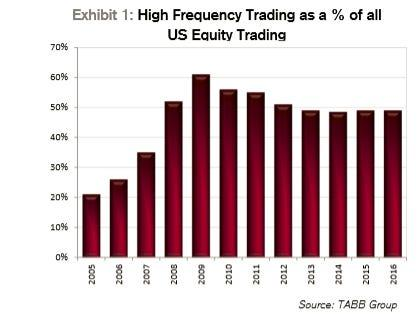

## Table of Contents

## What is high-frequency trading (HFT)?

High-frequency trading (HFT) is a type of trading that uses powerful computers to buy and sell stocks, currencies, or other financial products very quickly. These trades happen in just a few seconds or even milliseconds. People who do HFT use special computer programs that can find small changes in prices and make trades faster than humans can.

HFT is used by big banks, investment firms, and special trading companies. They try to make small profits from many trades. Because the trades are so fast and happen so often, these small profits can add up to a lot of money. However, HFT can also make the market more risky because the fast trading can cause big price changes very quickly.

## How does high-frequency trading work?

High-frequency trading works by using super fast computers and special software to trade stocks, currencies, or other financial products very quickly. These computers look at lots of data all the time to spot small changes in prices. When they see a chance to make a little bit of money, they buy and sell very fast, often in just a few milliseconds. The idea is to make many small profits that add up over time.

The people who do high-frequency trading, like big banks and special trading companies, use these computers to do many trades every day. They connect their computers to the stock market with very fast internet connections so they can trade even faster than others. This speed is important because it lets them make money from tiny price differences that might only last for a short time. But because they trade so much and so fast, it can also make the market more unpredictable and risky.

## What is the history of high-frequency trading?

High-frequency trading started to become popular in the late 1990s and early 2000s. Before that, trading was mostly done by people, and it was slower. But as computers got faster and better, some people started to use them to trade very quickly. In the early 2000s, rules changed to let more computers trade directly on the stock market. This made it easier for high-frequency trading to grow.

By the mid-2000s, high-frequency trading was a big part of the stock market. Companies that did high-frequency trading built special systems to make their trades as fast as possible. They even paid a lot of money to have their computers very close to the stock market's computers, so their trade orders could get there faster. Over time, high-frequency trading became a big business, but it also made some people worry about how safe and fair the stock market was.

## How has HFT changed the stock market landscape?

High-frequency trading has changed the stock market a lot. It has made trading faster and more automatic. Now, instead of people making trades, computers do it very quickly. This has made the market more busy and full of trades. It has also made it easier for people to buy and sell things quickly. But it has also made the market more complicated and hard to understand. Traders and investors need to know more about how computers work and how they can affect prices.

HFT has also made the market more competitive. Big banks and special trading companies use HFT to try to make small profits from many quick trades. This competition has pushed everyone to use faster and better technology. But it has also made the market riskier. The fast trades can cause big price changes very quickly, which can be scary for people who are not used to it. Some people worry that HFT might make the market less fair because only those with the best technology can really compete.

## What are the benefits of high-frequency trading for the stock market?

High-frequency trading has made the stock market more active and easier to use. It has brought more trades and made it possible for people to buy and sell things very quickly. This means that the prices of stocks and other things can change to match what people want more easily. Also, HFT has made the market more competitive. Companies and banks that use HFT have to keep making their technology better, which can help everyone in the market.

Another benefit of high-frequency trading is that it can make the market more efficient. The fast computers that do HFT look at a lot of information all the time and can find small changes in prices. This helps to keep prices fair and up-to-date. When prices are more accurate, it can help everyone make better choices about what to buy and sell. So, even though HFT is very fast and complicated, it can help the market work better for everyone.

## What are the potential risks and criticisms of HFT?

High-frequency trading can make the stock market more risky. Because HFT trades very fast and often, it can cause big price changes very quickly. This can be scary for people who are not used to it. Sometimes, these quick changes can lead to big problems, like what happened during the "Flash Crash" of 2010, when the market dropped a lot in just a few minutes. Also, HFT can make the market less fair. Only big companies with the best technology can really compete, which can leave smaller traders and investors at a disadvantage.

Another worry about HFT is that it might not be good for the market in the long run. Some people think that HFT just moves money around without really helping the economy grow. They say it can make the market more about short-term gains than long-term growth. Critics also worry about how hard it is to understand and control HFT. The fast and complicated trades can be hard for regulators to watch and make sure everything is fair and safe.

## How does HFT affect market liquidity?

High-frequency trading can make the market more liquid. Liquidity means how easy it is to buy and sell things without changing their price too much. HFT makes a lot of trades all the time, which means there are always people ready to buy or sell. This can help make the market smoother and easier for everyone to use. When there are more trades happening, it can be easier for people to get in and out of the market quickly.

But HFT can also make the market less liquid in some ways. Because HFT trades so fast and often, it can cause big price changes very quickly. Sometimes, these quick changes can scare other traders and investors away. When people get scared, they might not want to trade as much, which can make the market less liquid. So, while HFT can add a lot of trades to the market, it can also make things more unpredictable and sometimes less liquid.

## Can HFT lead to market volatility and flash crashes?

High-frequency trading can lead to more market volatility and even flash crashes. Volatility means that prices can change a lot and very quickly. HFT uses computers to trade very fast, and these fast trades can cause big price swings. For example, if a lot of HFT computers start selling at the same time, it can make prices drop very fast. This happened during the "Flash Crash" of 2010, when the market dropped a lot in just a few minutes because of fast trading.

Flash crashes are sudden, big drops in prices that happen very quickly. They can be caused by HFT because the fast trades can create a chain reaction. If one computer sees a price drop and starts selling, other computers might see that and start selling too. This can make prices fall even more, very quickly. So, while HFT can make the market more active, it can also make it more risky and lead to big, sudden changes in prices.

## What regulatory measures are in place for HFT?

Governments and financial regulators have put some rules in place to try to control high-frequency trading and make sure it is fair and safe. In the United States, the Securities and Exchange Commission (SEC) has rules like the "Market Access Rule," which says that companies have to check their computer trading systems to make sure they are not too risky. There are also rules about how fast trades can happen and how much information traders have to share.

In Europe, the Markets in Financial Instruments Directive (MiFID II) has rules to help control HFT. These rules say that HFT companies have to register with regulators and keep records of their trades. They also have to follow rules about how much they can trade and how they can use the information they get. These rules are trying to make the market safer and fairer for everyone, but it is still hard to keep up with how fast and complicated HFT can be.

## How do different countries regulate high-frequency trading?

In the United States, the Securities and Exchange Commission (SEC) has put rules in place to manage high-frequency trading. One important rule is the "Market Access Rule," which makes companies check their computer trading systems to make sure they are not too risky. There are also rules about how fast trades can happen and how much information traders have to share. These rules help to keep the market safe and fair for everyone.

In Europe, the Markets in Financial Instruments Directive (MiFID II) has rules to control HFT. These rules say that HFT companies have to register with regulators and keep records of their trades. They also have to follow rules about how much they can trade and how they can use the information they get. These rules try to make the market safer and fairer, but it can still be hard to keep up with how fast and complicated HFT can be.

## What advanced technologies and algorithms are used in HFT?

High-frequency trading uses really fast computers and special software to make trades very quickly. These computers use algorithms, which are like math recipes, to look at a lot of information all the time. They can spot tiny changes in prices and make trades in just a few milliseconds. Some common algorithms used in HFT are market making, which tries to buy and sell to make small profits, and statistical arbitrage, which looks for small price differences between similar things to trade on. These algorithms help HFT traders make a lot of trades every day and try to make small profits that add up.

Another important technology in HFT is fast internet connections. HFT companies pay a lot of money to have their computers very close to the stock market's computers. This is called co-location, and it helps them send their trade orders faster than others. They also use special data feeds to get information about the market very quickly. All of these technologies and algorithms work together to make HFT very fast and efficient, but they also make the market more complicated and hard to understand.

## How can one predict the impact of HFT on future market trends?

Predicting how high-frequency trading will affect future market trends can be tricky. HFT makes a lot of trades very quickly, which can make the market more active and easier for everyone to use. This means prices can change to match what people want more easily, which can help keep the market fair. But HFT can also make the market more unpredictable. The fast trades can cause big price changes very quickly, which can scare some people away and make the market less stable. So, while HFT can make the market more efficient, it can also make it riskier and harder to predict.

Looking ahead, HFT might keep making the market faster and more competitive. As technology gets better, HFT companies will keep trying to make their trades even faster and smarter. This could lead to more trades and more small profits for them. But it might also make the market more complicated and harder for regulators to keep an eye on. If HFT keeps growing, it could change how everyone trades and invests, making the market more about short-term gains than long-term growth. So, while HFT can help the market in some ways, it also brings new challenges that we need to think about for the future.

## What is High-Frequency Trading (HFT)?

High-frequency trading (HFT) is a specialized subset of algorithmic trading that emphasizes the execution of a vast number of trades at exceptionally high speeds. By employing sophisticated algorithms coupled with state-of-the-art technology, HFT systems automate the decision-making processes, minimizing human error and optimizing the rapid exploitation of fleeting market opportunities. 

The primary objective of HFT is to capitalize on marginal price discrepancies across various markets or financial instruments. By executing trades within fractions of a second, HFT exploits these minor variations to secure profits. Although the mechanics of HFT are intricate, the core principle revolves around the accumulation of numerous small gains, often just a fraction of a cent, repeated over millions of trades each day. For example, if an HFT firm makes $0.0001 per share on average and trades 1 billion shares per day, the daily profit would be:

$$

\text{Daily Profit} = 0.0001 \times 1,000,000,000 = 100,000 \text{ USD}
$$

This strategy leverages technology to ensure that trading signals are identified and executed faster than manual methods could achieve. The development of [HFT](/wiki/high-frequency-trading-strategies) systems involves intricate programming and the utilization of powerful computing infrastructures capable of processing and reacting to market data in milliseconds.

Moreover, the advancement in technology has facilitated the creation of more complex and efficient HFT algorithms. These programs are designed to analyze large volumes of data and detect patterns that can lead to profitable trades. HFT strategies often encompass various trading techniques such as [market making](/wiki/market-making), where firms provide [liquidity](/wiki/liquidity-risk-premium) by continuously buying and selling securities to profit from bid-ask spreads.

HFT's reliance on technology and automation underscores its competitive edge in financial markets. By significantly reducing latency—the delay between the decision to trade and the execution of the trade—HFT firms enhance the efficiency of their operations and can execute trades far more swiftly than traditional methods. This reduction in latency is pivotal as it allows HFT firms to react to market conditions and discrepancies almost instantaneously, ensuring they maintain a dominant position in high-speed trading environments.

## What is the impact of High-Frequency Trading (HFT) on the stock market?

High-frequency trading (HFT) significantly enhances market liquidity by enabling rapid transactions that allow market participants to trade with minimal impact on prices. By facilitating a high [volume](/wiki/volume-trading-strategy) of trades, HFT strategies reduce the time securities spend in the market, thus preventing substantial price shifts due to individual transactions. This increased liquidity benefits both retail and institutional traders, allowing them to execute trades more efficiently and at lower costs.

One notable effect of HFT on stock markets is its ability to narrow bid-ask spreads. The bid-ask spread is the difference between the highest price a buyer is willing to pay for an asset and the lowest price a seller is willing to accept. Narrower spreads imply lower transaction costs, making trading more economically viable for various market participants. A narrower spread can be represented mathematically as:

$$
\text{Spread} = \text{Ask Price} - \text{Bid Price}
$$

where a decrease in the spread is beneficial. By employing algorithms that continuously monitor and adjust to market conditions, HFT firms engage in market-making activities that inherently reduce these spreads, increasing the market's overall efficiency.

Despite these benefits, HFT can introduce significant [volatility](/wiki/volatility-trading-strategies) into the stock market. The rapid speed at which HFT operates, often executing trades in milliseconds, can sometimes destabilize markets. This is particularly evident during 'flash crashes', where the market experiences a sudden and severe drop in prices followed by a swift recovery. HFT's liquidity provision can evaporate almost instantaneously in such scenarios, exacerbating market instability.

A prominent example of such a scenario occurred during the May 6, 2010, Flash Crash, when major U.S. stock indices experienced a rapid and dramatic drop in value, partly attributed to the high-speed trading algorithms that withdrew liquidity.

HFT's dual impact of improving trading efficiency while posing risks to market stability reflects its complex role in modern financial markets. While it undeniably contributes to technological advancements and operational efficiency, its propensity to amplify systemic risks continues to generate debate among regulators and market participants. Addressing these challenges requires a balanced approach that embraces innovation while ensuring robust oversight to maintain market integrity.

## References & Further Reading

[1]: Aldridge, I. (2013). ["High-Frequency Trading: A Practical Guide to Algorithmic Strategies and Trading Systems"](https://www.amazon.com/High-Frequency-Trading-Practical-Algorithmic-Strategies/dp/1118343506). Wiley Finance.

[2]: Lewis, M. (2014). ["Flash Boys: A Wall Street Revolt"](https://en.wikipedia.org/wiki/Flash_Boys). W. W. Norton & Company.

[3]: Zhang, S., & Riordan, R. (2011). ["Technology and Market Quality: The Case of High-Frequency Trading"](https://research.manchester.ac.uk/en/publications/technology-and-market-quality-the-case-of-high-frequency-trading). Available at SSRN 1641387.

[4]: Kirilenko, A. A., & Lo, A. W. (2013). ["Moore's Law versus Murphy's Law: Algorithmic Trading and Its Discontents"](https://www.aeaweb.org/articles?id=10.1257/jep.27.2.51). Journal of Economic Perspectives, 27(2), 51-72.

[5]: Menkveld, A. J. (2013). ["High Frequency Trading and the New Market Makers"](https://www.sciencedirect.com/science/article/pii/S1386418113000281). Journal of Financial Markets, 16(4), 712-740.

[6]: Easley, D., Lopez de Prado, M. M., & O'Hara, M. (2012). ["The Volume Clock: Insights into the High-Frequency Paradigm"](https://papers.ssrn.com/sol3/papers.cfm?abstract_id=2034858). The Journal of Portfolio Management, 39(1), 19-29.