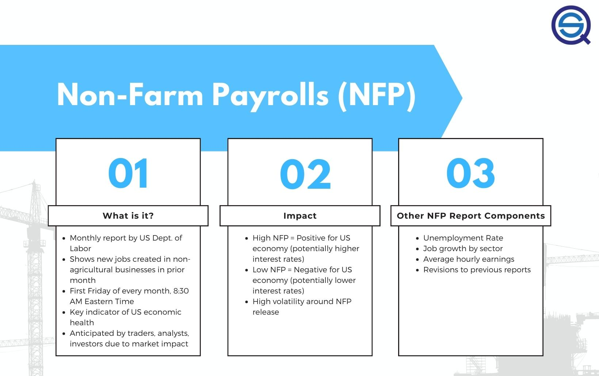

## Table of Contents

## What is Non-Farm Payroll (NFP)?

Non-Farm Payroll (NFP) is a report that comes out every month from the U.S. government. It tells us how many jobs were added or lost in the country, except for jobs in farming, private households, and some other small groups. This report is important because it helps people understand how the economy is doing. If more jobs are added, it usually means the economy is growing. If jobs are lost, it might mean the economy is slowing down.

The NFP report is watched closely by many people, like investors, traders, and policymakers. They use the information to make decisions about things like buying or selling stocks, or setting interest rates. The report can cause big changes in the stock market and other financial markets because it gives a quick snapshot of the economy's health. It comes out on the first Friday of every month and covers the previous month's data.

## How is the NFP data collected and reported?

The NFP data is collected by the U.S. Bureau of Labor Statistics (BLS). They gather information from businesses and government agencies across the country. Every month, they ask these employers about the number of people they have working for them. This helps the BLS figure out if the number of jobs went up or down.

Once the BLS has all the data, they put it together and make the NFP report. This report is released on the first Friday of each month at 8:30 AM Eastern Time. It tells everyone how many jobs were added or lost in the previous month, not counting farm jobs and a few other types of jobs. The report is very important because it gives a quick look at how the economy is doing, and many people use it to make decisions about money and investments.

## What does a higher NFP number indicate about the economy?

A higher NFP number means more jobs were added in the economy. This is usually a good sign because it shows that businesses are growing and need more workers. When more people have jobs, they have more money to spend, which can help the economy grow even more. It's like a cycle where more jobs lead to more spending, which leads to more jobs.

However, a very high NFP number can sometimes cause problems. If too many jobs are added too quickly, it might lead to higher wages as businesses compete for workers. This can cause inflation, which means prices for things like food and gas go up. The government and the Federal Reserve watch the NFP numbers closely to make sure the economy stays balanced and doesn't grow too fast or too slow.

## How does a higher NFP affect interest rates?

When the NFP number is higher, it usually means more people are working and the economy is doing well. This can make the Federal Reserve think about raising interest rates. They do this to keep the economy from growing too fast, which can cause prices to go up too much. Higher interest rates make it more expensive for people and businesses to borrow money, so they might spend less. This helps slow down the economy a bit and keep it balanced.

But, the Federal Reserve looks at a lot of things, not just the NFP number, when deciding on interest rates. They want to make sure the economy stays healthy and that prices don't go up too fast. So, a higher NFP number is just one piece of the puzzle. If other signs also show the economy is strong, the Fed might decide to raise rates. But if other signs are not so strong, they might wait and see before making a change.

## What is the immediate impact of a higher NFP on currency values?

When the NFP number is higher than expected, it usually makes the U.S. dollar stronger. This happens because a higher NFP means more people are working and the economy is doing well. Investors and traders see this as a good sign and want to buy more U.S. dollars. When more people want to buy the dollar, its value goes up compared to other currencies.

The immediate impact can be seen in the foreign exchange markets right after the NFP report comes out. If the NFP number is much higher than what people were expecting, the dollar can jump in value very quickly. This can cause a lot of movement in the markets as traders adjust their positions based on the new information. However, the effect might not last long if other economic indicators don't support the strong NFP number.

## How do traders typically react to higher NFP numbers in the forex market?

When traders see a higher NFP number, they often start buying the U.S. dollar because it means the economy is doing well. They think the Federal Reserve might raise interest rates to slow down the economy, which makes the dollar more valuable. So, right after the NFP report comes out, there's usually a lot of buying of the dollar, and its value goes up quickly against other currencies.

This quick reaction can cause a lot of movement in the [forex](/wiki/forex-system) market. Traders who were betting on a weaker dollar might lose money and need to change their positions fast. But, the excitement doesn't always last long. If other economic signs don't support the strong NFP number, the dollar's value might go back down after a while. Traders keep watching other reports and news to see if the higher NFP number really means the economy is strong or if it was just a one-time thing.

## Can you explain the relationship between NFP and major currency pairs like EUR/USD?

When the NFP number is higher than expected, it usually makes the U.S. dollar stronger. This is because more people working means the economy is doing well, and traders think the Federal Reserve might raise interest rates. When interest rates go up, it makes the dollar more valuable. So, in the EUR/USD pair, a higher NFP number would make the dollar side of the pair stronger, causing the value of the pair to go down. This means it takes fewer dollars to buy one euro.

Traders watch the NFP report closely because it can cause big changes in the forex market. If the NFP number is much higher than what people were expecting, the EUR/USD pair can move a lot right after the report comes out. Traders who were betting on a weaker dollar might lose money and need to change their positions quickly. But, the effect might not last long if other economic signs don't support the strong NFP number. Traders keep an eye on other reports and news to see if the higher NFP number really means the economy is strong or if it was just a one-time thing.

## What are some strategies forex traders use in anticipation of NFP releases?

Forex traders often prepare for NFP releases by adjusting their trading strategies. One common approach is to reduce their exposure to the market right before the NFP report comes out. This means they might close some of their trades or use smaller position sizes. They do this because the NFP report can cause big, sudden moves in the market, and they want to protect their money from these quick changes.

Another strategy traders use is to set up trades that can take advantage of the big moves that happen after the NFP report. They might use something called a "straddle" where they place two orders: one to buy if the price goes up a lot, and another to buy if the price goes down a lot. This way, no matter which way the market moves after the NFP report, they can make money. But this strategy can be risky because the market might not move as much as they expect.

Some traders also look at what other people are expecting the NFP number to be. If the actual number is a lot different from what people were expecting, the market can move even more. So, traders might use this information to guess how big the market move will be and plan their trades around it. They might also use stop-loss orders to limit how much they can lose if the market moves against them.

## How does the market's expectation of NFP data influence forex market movements?

The market's expectation of NFP data plays a big role in how the forex market moves. Before the NFP report comes out, traders and investors make guesses about what the number will be. If everyone thinks the number will be high, they might start buying the U.S. dollar before the report even comes out. This can make the dollar's value go up a little bit before the actual report is released. But if the real NFP number is different from what people were expecting, the market can move a lot more.

For example, if the market expects a high NFP number but the actual number is low, the U.S. dollar might drop quickly. Traders who were betting on a high number might lose money and need to sell their dollars fast, which makes the dollar's value go down even more. On the other hand, if the market expects a low number but the actual number is high, the dollar can jump in value. Traders who were ready for a low number might rush to buy dollars, pushing its value up. So, the difference between what people expect and what actually happens can cause big swings in the forex market.

## What historical data shows about the correlation between NFP and forex market volatility?

Historical data shows that the NFP report often causes big changes in the forex market. When the NFP number is different from what people were expecting, the market can move a lot. For example, if the NFP number is much higher than expected, the U.S. dollar usually goes up in value quickly. But if the number is lower than expected, the dollar can drop fast. This is because traders and investors change their bets based on the new information, and this can cause a lot of buying or selling of the dollar.

Looking at past NFP reports, we can see that the forex market is often more volatile right after the report comes out. The biggest moves happen in the first few minutes or hours after the report is released. Traders know this, so they often prepare for these big swings by adjusting their trades or using special strategies. Over time, the market usually calms down, but the initial reaction to the NFP number can be very strong and cause a lot of excitement in the forex market.

## How do central banks respond to higher NFP numbers and what are the forex market implications?

When the NFP number is higher, it means more people are working and the economy is doing well. Central banks, like the Federal Reserve, might decide to raise interest rates to keep the economy from growing too fast. They do this because if the economy grows too quickly, prices can go up a lot, which is called inflation. By raising interest rates, borrowing money becomes more expensive, so people and businesses might spend less. This helps slow down the economy a bit and keep it balanced.

In the forex market, when central banks raise interest rates because of a higher NFP number, the U.S. dollar usually gets stronger. This is because higher interest rates make the dollar more valuable compared to other currencies. Traders and investors start buying more dollars, which pushes its value up. But, the effect might not last long if other economic signs don't support the strong NFP number. Traders keep watching other reports and news to see if the higher NFP number really means the economy is strong or if it was just a one-time thing.

## What advanced technical analysis tools can be used to predict forex market movements post-NFP release?

One advanced technical analysis tool that traders use to predict forex market movements after an NFP release is the use of Bollinger Bands. Bollinger Bands help traders see how much the price of a currency is moving. When the NFP number comes out, the price can move a lot, and Bollinger Bands can show if the price is moving more than usual. If the price goes outside the bands, it might mean the market is going to keep moving in that direction. Traders can use this information to decide if they should buy or sell the currency.

Another tool is the Relative Strength Index (RSI). The RSI helps traders see if a currency is overbought or oversold. After an NFP release, if the RSI shows that the currency is overbought, it might mean the price will go down soon. If it's oversold, the price might go up. Traders can use the RSI to find good times to enter or [exit](/wiki/exit-strategy) trades based on how the market reacts to the NFP number. Both Bollinger Bands and RSI can help traders make better guesses about what the market will do next after the NFP report comes out.

## References & Further Reading

[1]: Bergstra, J., Bardenet, R., Bengio, Y., & Kégl, B. (2011). ["Algorithms for Hyper-Parameter Optimization."](https://papers.nips.cc/paper/4443-algorithms-for-hyper-parameter-optimization) Advances in Neural Information Processing Systems 24.

[2]: ["Advances in Financial Machine Learning"](https://www.amazon.com/Advances-Financial-Machine-Learning-Marcos/dp/1119482089) by Marcos Lopez de Prado

[3]: ["Evidence-Based Technical Analysis: Applying the Scientific Method and Statistical Inference to Trading Signals"](https://www.amazon.com/Evidence-Based-Technical-Analysis-Scientific-Statistical/dp/0470008741) by David Aronson

[4]: ["Machine Learning for Algorithmic Trading"](https://github.com/stefan-jansen/machine-learning-for-trading) by Stefan Jansen

[5]: ["Quantitative Trading: How to Build Your Own Algorithmic Trading Business"](https://www.amazon.com/Quantitative-Trading-Build-Algorithmic-Business/dp/1119800064) by Ernest P. Chan