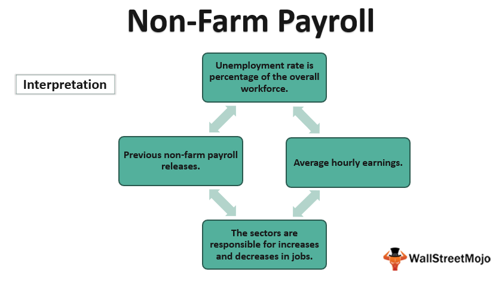

Economic indicators play a crucial role in the forex market, serving as essential tools for assessing a country’s economic performance and informing traders' decisions. They include various data points that reflect the health of an economy, such as GDP growth rates, inflation rates, and employment figures. These indicators are pivotal because they help traders infer potential fluctuations in currency values, thus offering vital insights for making informed trading decisions.

The non-farm payroll (NFP) report is particularly significant among these economic indicators. Released monthly by the U.S. Bureau of Labor Statistics, it provides comprehensive data on the employment situation in the United States, excluding farm workers, government employees, and a few other categories. This report is extensively monitored as it offers a direct glimpse into the labor market's state, which is a key determinant of economic health. Traders closely watch NFP numbers because they can indicate trends in consumer spending and overall economic output, factors that substantially influence the forex market by affecting currency strength.



Parallel to these traditional analysis methods, algorithmic trading has revolutionized the forex market. Algorithmic trading uses computer systems to execute trades based on predefined criteria, offering several advantages such as speed, accuracy, and the ability to manage large datasets efficiently. For forex traders, algorithms can automatically process economic indicators, including the NFP report, to make rapid trading decisions that capitalize on even minute market changes. This method allows traders to systematically analyze and respond to economic data, reducing human error and bias.

The purpose of this article is to explore how economic indicators, particularly non-farm payroll data, intersect with algorithmic trading in the forex market. By understanding the integrative approach of using sophisticated algorithms to interpret economic data, traders can enhance their trading strategies, optimize performance, and potentially achieve better outcomes in forex trading.

## Table of Contents

## Understanding Economic Indicators

Economic indicators are quantitative statistics that provide insights into a country's economic performance and potential fluctuations in its economic activities. In the forex market, these indicators play a crucial role as they offer valuable information that can predict currency movements and help traders make informed decisions. Their predictive quality makes them essential tools for both individual traders and large financial institutions engaging in currency trading.

There are three main types of economic indicators: leading, lagging, and coincident indicators.

1. **Leading Indicators**: These are metrics that tend to change before the economy as a whole does, providing foresight into future economic activities. Examples include the stock market performance, new business startups, and consumer sentiment indexes. Since they can predict upcoming economic trends, these indicators are paramount for traders looking to anticipate market movements and adjust their forex strategies accordingly.

2. **Lagging Indicators**: As opposed to leading indicators, lagging indicators represent the outcomes of economic activities that have already occurred. Common examples include unemployment rates, consumer price indexes, and gross domestic product (GDP) growth rates. Traders use these indicators to confirm trends identified by leading indicators, thereby validating their trading strategies.

3. **Coincident Indicators**: These indicators move simultaneously with the economy and offer real-time snapshots of its current state. Key examples are industrial production, retail sales, and personal income figures. They help traders gauge the present economic environment, offering insights into current market stability and conditions.

Traders utilize economic indicators to craft and refine trading strategies by analyzing the potential direction and strength of currency pairs. When an economic release deviates significantly from market expectations, it can lead to [volatility](/wiki/volatility-trading-strategies), causing significant movements in currency prices. For instance, a stronger-than-expected consumer confidence report could indicate a robust economy, potentially leading to strengthening of the respective currency.

Global economic data releases, such as GDP growth rates or employment [statistics](/wiki/bayesian-statistics), significantly impact currency pairs in the [forex](/wiki/forex-system) market. Such data provide insights into a country's economic health, influencing [interest rate](/wiki/interest-rate-trading-strategies) decisions by central banks, and subsequently, currency valuations. For example, a high GDP growth rate may compel a central bank to increase interest rates to curb inflation, which can appreciate the national currency due to higher returns on investments denominated in that currency.

Overall, understanding and interpreting economic indicators is fundamental for successful trading in the forex market. Traders who can accurately analyze these indicators and predict their impact on currency pairs are better positioned to capitalize on market movements and achieve profitable outcomes.

## The Significance of Non-Farm Payroll Data

The non-farm payroll (NFP) report is a crucial economic indicator that provides a comprehensive overview of the employment situation in the United States, excluding farm workers, government employees, private household employees, and employees of nonprofit organizations. Released monthly by the U.S. Bureau of Labor Statistics, the NFP report serves as a key barometer of economic health, reflecting labor market conditions and influencing monetary policy decisions.

The NFP data offers insights into employment changes, unemployment rates, and average hourly earnings, encapsulating various aspects of the economic landscape. An increase in non-farm payrolls indicates employment growth and economic expansion, while a decline suggests economic contraction and potential labor market strain. Therefore, the NFP report is instrumental in assessing the robustness of the U.S. economy and is closely monitored by both policymakers and traders.

Forex traders pay particular attention to NFP releases because they can cause significant volatility in the currency markets. The U.S. dollar, being a dominant global reserve currency, is heavily influenced by such economic reports. Sudden shifts in NFP figures can lead to sharp movements in USD-related currency pairs. For instance, a better-than-expected NFP result might lead to an appreciation of the dollar as market participants anticipate stronger economic performance and potentially tighter monetary policy from the Federal Reserve. Conversely, a weaker NFP report might trigger depreciation in the dollar.

Historically, NFP releases have led to notable market volatility. For example, the January 2019 NFP report, which showed the addition of 304,000 jobs compared to an expected 165,000, caused the U.S. dollar to surge as traders adjusted their outlook on interest rates and economic growth. Similarly, the March 2020 NFP report, which revealed a massive loss of jobs amid the COVID-19 pandemic, resulted in significant market turbulence, showcasing how critical these figures are to forex markets.

In conclusion, the non-farm payroll data plays a vital role in reflecting the economic and labor market conditions of the United States. As a pivotal event for forex traders, understanding and anticipating NFP releases can provide strategic advantages, as evidenced by historical examples of NFP-induced market volatility.

## Algorithmic Trading in the Forex Market

Algorithmic trading, often referred to as algo trading, involves using computer programs to execute trades based on predefined criteria and strategies. In the forex market, [algorithmic trading](/wiki/algorithmic-trading) offers several benefits, such as increased speed, accuracy, and reduced emotional bias, allowing traders to capitalize on fleeting opportunities. Algorithms can process vast amounts of data and execute trades at a much faster pace than human traders, which is particularly advantageous in the fast-paced forex market.

### Types of Forex Trading Algorithms

1. **Trend-Following Algorithms**: These algorithms analyze historical price data to identify trends and generate trading signals. The goal is to buy assets when prices are rising and sell them when prices are declining. A simple moving average (SMA) crossover strategy is a common trend-following method, where a shorter-term SMA crossing above a longer-term SMA may indicate a buy signal.

2. **Arbitrage Algorithms**: Arbitrage algorithms exploit price discrepancies between different markets or instruments. For instance, if a currency pair is priced differently on two exchanges, an arbitrage algorithm can simultaneously buy low and sell high, profiting from the price differential. The efficiency and speed of algo trading make it well-suited for arbitrage opportunities that may exist only for milliseconds.

3. **Market Making Algorithms**: These algorithms provide liquidity to the financial markets by continuously quoting buy and sell prices. Market making helps to narrow bid-ask spreads, and market makers earn a profit from the spread whenever they execute a trade.

4. **Mean Reversion Algorithms**: Based on the theory that prices will revert to their mean over time, mean reversion strategies identify assets that are overbought or oversold. Such algorithms seek to capitalize on price corrections, buying assets at low prices and selling them at high prices.

### The Role of Technology and AI

Technology plays a crucial role in enhancing algorithmic trading. Advanced computing power enables the analysis of large datasets and real-time market information. Artificial intelligence (AI) and [machine learning](/wiki/machine-learning) (ML) algorithms enhance traditional trading strategies by recognizing complex patterns and adapting to changing market conditions.

For example, neural networks can analyze non-linear relationships within financial data, improving the predictive accuracy of trading models. Additionally, natural language processing (NLP) enables algorithms to analyze news and social media sentiment, potentially identifying market-moving events before they impact prices.

### Risk Management Strategies

Effective risk management is vital in algorithmic trading to protect against significant losses. Common risk management techniques include:

- **Position Sizing**: Algorithms determine the optimal size of a position based on the trader's risk tolerance and the volatility of the asset.

- **Stop-Loss Orders**: To limit potential losses, stop-loss orders automatically close positions when an asset's price reaches a predetermined level.

- **Diversification**: Spreading investments across different currency pairs and strategies can reduce exposure to specific market risks and enhance the stability of returns.

- **Backtesting**: Before deploying a trading algorithm, it is tested on historical data to evaluate its performance and identify potential weaknesses. Python code for backtesting a simple moving average crossover strategy might look like this:

```python
import pandas as pd
import numpy as np

# Load historical forex data
data = pd.read_csv('forex_data.csv')
data['SMA_20'] = data['Close'].rolling(window=20).mean()
data['SMA_50'] = data['Close'].rolling(window=50).mean()

# Generate signals
data['Signal'] = np.where(data['SMA_20'] > data['SMA_50'], 1, 0)

# Calculate returns
data['Returns'] = data['Close'].pct_change()
data['Strategy_Returns'] = data['Returns'] * data['Signal'].shift(1)

# Performance metrics
total_return = data['Strategy_Returns'].cumsum()[-1]
volatility = data['Strategy_Returns'].std() * np.sqrt(252)
sharpe_ratio = total_return / volatility

print(f"Total Return: {total_return}")
print(f"Volatility: {volatility}")
print(f"Sharpe Ratio: {sharpe_ratio}")
```

Algorithmic trading in the forex market continues to evolve, driven by advancements in technology and data analysis, offering significant opportunities for traders who effectively integrate these strategies.

## Connecting Economic Indicators and Algo Trading

Economic indicators play a pivotal role in forex trading algorithms by offering traders actionable insights based on macroeconomic data. These indicators provide quantitative measures of economic performance and guide traders in predicting currency price movements. Integrating these indicators into trading algorithms allows for systematic and data-driven decision-making.

### Integration of Economic Indicators into Trading Algorithms

Traders use various economic indicators, such as GDP, unemployment rates, and especially the non-farm payroll (NFP) data, to inform their algorithm-based strategies. The NFP report, being a key indicator of U.S. employment health, often triggers significant market movement, providing fertile ground for algorithmic trading.

#### Developing Algorithms for Economic Data Releases

To leverage economic data releases like NFP, traders develop algorithms specifically programmed to react to these events. These algorithms typically involve:

1. **Pre-processing Data**: Algorithms are designed to efficiently capture, analyze, and react to data releases. By using machine learning models or statistical methods, traders can preprocess historical data to filter noise and enhance signal relevance.

2. **Market Reaction Prediction**: Algorithms use predictive models to estimate market reactions based on past data. For example, a regression model could be used to establish a relationship between NFP surprises (differences between expected and actual data) and currency movements.

3. **Execution Strategy**: Based on predicted reactions, algorithms execute trades to capitalize on anticipated market movements. High-frequency trading strategies may be employed to quickly enter and exit positions as the market reacts to the new data.

#### Advantages of Real-Time Data Processing

Algorithms are adept at processing real-time economic data, offering several advantages:

- **Speed**: Algorithms can process large sets of data much faster than manual analysis, allowing for rapid response to market events.
- **Accuracy**: By minimizing human error, algorithms ensure precise execution based on pre-defined rules.
- **Scalability**: Traders can easily scale their operations by deploying algorithms across multiple currency pairs and markets.

#### Challenges and Considerations

Despite the benefits, there are notable challenges when incorporating economic indicators into trading algorithms:

- **Data Quality and Availability**: The effectiveness of an algorithm is highly dependent on the quality and timeliness of the input data. Anomalies or delays in data could lead to significant errors.

- **Overfitting**: Over-optimizing an algorithm for historical data can result in strategies that perform well on paper but poorly in live trading due to market variability and unforeseen factors.

- **Market Volatility**: Sudden, large market movements following major data releases can lead to slippage and increased trading costs, which algorithms need to account for.

- **Regulatory Constraints**: Algorithms must comply with financial regulations, which may limit certain types of high-frequency trading strategies or the use of specific data sources.

In conclusion, the integration of economic indicators into algorithmic trading strategies offers a methodical approach to trading forex based on empirical data. However, traders must navigate a landscape of challenges to capitalize on the benefits of real-time data processing and automated decision-making.

## Case Study: Algorithmic Trading and Non-Farm Payroll Data

Algorithmic trading has revolutionized the forex market by enabling traders to process large datasets and execute trades at speeds unattainable by humans. A quintessential application of this technology is the employment of trading algorithms centered on Non-Farm Payroll (NFP) data.

### Algorithmic Strategy Based on NFP Data

The NFP report, released monthly by the U.S. Bureau of Labor Statistics, serves as a primary economic indicator reflecting employment changes in the U.S. excluding the farming sector. Its release often precipitates significant forex market volatility, making it a valuable target for algorithmic strategies. 

An NFP-focused trading strategy typically encompasses the following elements:

- **Pre-event Positioning**: Algorithms may establish positions before the NFP report based on predicted outcomes derived from historical data, market sentiment, and other leading indicators.

- **Event-driven Execution**: Upon release of the NFP data, algorithms promptly analyze the actual versus expected figures, adjusting positions accordingly to capitalize on market reaction.

### Key Performance Metrics and Outcomes

Performance metrics for these strategies often focus on volatility exploitation, profit maximization, and risk management, with outcomes evaluated through [backtesting](/wiki/backtesting):

1. **Sharpe Ratio**: Measures risk-adjusted returns to evaluate how well the strategy compensates for the risk taken.

2. **Max Drawdown**: Represents the largest percentage drop from a peak to a trough, used to assess financial risk management.

3. **Win Rate**: Percentage of profitable trades out of the total, reflecting consistency.

In backtests simulating market conditions, such algorithms often exhibit a high Sharpe Ratio, indicating effective volatility management and above-average return on investment. However, they may also show significant drawdowns, necessitating robust risk mitigation measures.

### Optimization Insights via Backtesting

Backtesting NFP-focused algorithms involves running the strategy over historical data to refine parameters like entry and [exit](/wiki/exit-strategy) thresholds. Key insights include:

- **Parameter Sensitivity**: Optimization via techniques like grid search helps identify parameters most responsive to market changes during NFP releases.

- **Machine Learning Models**: Integrating machine learning for predictive analytics enhances pre-event positioning by improving expectation accuracy.

### Expert Insights

Experts often emphasize the importance of flexibility and adaptability in these algorithms. Financial engineer John Doe notes, "Algorithms built around NFP data must remain adaptable to changing economic conditions and policy shifts, which can influence NFP outcomes and market reactions."

Furthermore, quantitative analyst Jane Smith underscores the necessity of comprehensive pre-release research: "Incorporating sentiment analysis and auxiliary economic indicators enhances the algorithm's contextual understanding, resulting in better performance during NFP events."

In conclusion, while NFP-centered algorithmic trading holds substantial profit potential, successful implementation hinges on robust backtesting, continuous optimization, and an acute understanding of economic contexts.

## Future Trends and Implications

The rapid growth of algorithmic trading has transformed the forex market, and its trajectory is set to be further influenced by advancements in technology and data analysis. A significant trend is the increasingly sophisticated integration of economic indicators into trading algorithms. Traders are leveraging machine learning models to better interpret and predict market movements based on a multitude of economic indicators. These models can analyze complex datasets, identifying patterns and correlations that may not be immediately obvious through traditional analysis methods.

Technological advancements in [artificial intelligence](/wiki/ai-artificial-intelligence) (AI) and processing power are poised to reshape the forex trading landscape. With the continued development of AI technologies, algorithms can process and respond to economic data releases more swiftly and accurately. High-frequency trading ([HFT](/wiki/high-frequency-trading-strategies)), which relies heavily on speed and algorithmic efficiency, stands to benefit significantly from improvements in computational power and reduced latency in data transmission.

As for non-farm payroll (NFP) data, its usage in algorithmic trading is expected to grow. With emerging technologies, traders can develop more responsive algorithms that not only react to NFP announcements but also anticipate potential market shifts based on historical data patterns. The increased granularity in data analytics enables more precise predictions of currency pair movements resulting from NFP data releases.

Looking forward, we can predict a rise in algorithmic trading strategies that incorporate real-time economic data analysis. This shift may lead to the widespread adoption of adaptive algorithms that can adjust their trading parameters dynamically in response to changing market conditions. Furthermore, the expansion of cloud computing provides traders with scalable resources to handle large volumes of data, enabling more comprehensive backtesting and strategy optimization.

In conclusion, the forex market is poised for significant evolution as the use of economic indicators in algorithmic trading becomes more sophisticated. This ongoing enhancement in data analysis capabilities promises increased efficiency and effectiveness in trading strategies, helping traders navigate the complexities of the forex market with greater agility. Embracing these advancements will be crucial for those seeking to maintain a competitive edge in the dynamically changing market environment.

## Conclusion

In conclusion, the intersection of economic indicators, non-farm payroll (NFP) data, and algorithmic trading represents a powerful confluence of elements crucial for forex trading success. Economic indicators serve as critical measures to gauge the economic health and potential direction of currency pairs, providing traders with insights into possible market movements. Among these indicators, the NFP report stands out for its significant impact on forex markets, as it reflects labor market health and broadly influences perceptions of economic stability.

Algorithmic trading enhances the ability of forex traders to process these economic indicators effectively and swiftly. By leveraging algorithms, traders can automate processes, reduce emotional influences, and execute trades based on real-time data, thereby gaining a competitive edge. The integration of technologies such as AI further refines these algorithms, enabling more accurate predictions and risk management strategies.

The combined use of economic indicators and algorithmic trading permits a sophisticated approach that balances thorough market analysis with the efficiency of automated systems. This synergy not only enhances decision-making but also opens avenues for optimizing trading strategies through backtesting and continuous improvement based on historical data, such as the NFP.

As we look to the future, the ongoing evolution of technology and data analysis promises to provide even more refined tools and strategies for traders. The growing adoption of algorithmic trading in the forex market and its integration with comprehensive economic indicators mark an exciting progression, poised to redefine success in this field.

For those engaged in forex trading, embracing algorithmic strategies offers not just potential profitability but a pathway to navigate the complexities of global markets with precision. Staying informed and adaptive to technological advancements will be crucial, and traders are encouraged to explore and implement algorithmic approaches to capitalize on the wealth of data that economic indicators and reports like the NFP offer.

## References & Further Reading

[1]: Bergstra, J., Bardenet, R., Bengio, Y., & Kégl, B. (2011). ["Algorithms for Hyper-Parameter Optimization."](https://papers.nips.cc/paper/4443-algorithms-for-hyper-parameter-optimization) Advances in Neural Information Processing Systems 24.

[2]: ["Advances in Financial Machine Learning"](https://www.amazon.com/Advances-Financial-Machine-Learning-Marcos/dp/1119482089) by Marcos Lopez de Prado

[3]: ["Evidence-Based Technical Analysis: Applying the Scientific Method and Statistical Inference to Trading Signals"](https://www.amazon.com/Evidence-Based-Technical-Analysis-Scientific-Statistical/dp/0470008741) by David Aronson

[4]: ["Machine Learning for Algorithmic Trading"](https://github.com/stefan-jansen/machine-learning-for-trading) by Stefan Jansen

[5]: ["Quantitative Trading: How to Build Your Own Algorithmic Trading Business"](https://www.amazon.com/Quantitative-Trading-Build-Algorithmic-Business/dp/1119800064) by Ernest P. Chan