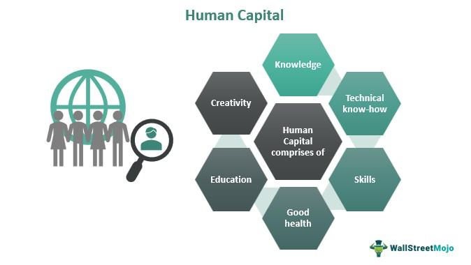

The intersection of human capital investment and algorithmic trading offers a compelling field of study with significant implications for economic growth. Human capital, defined as the knowledge, skills, and abilities of individuals, is a pivotal asset for fostering innovation and enhancing productivity. When coupled with algorithmic trading, which employs advanced computational techniques and technologies to execute trading strategies, the potential to boost economic productivity becomes evident.

Algorithmic trading leverages both data analytics and financial acumen, requiring a convergence of technical skills and market understanding, which underscores the necessity for a well-educated and skilled workforce. The development and management of sophisticated trading algorithms rely heavily on individuals proficient in areas such as financial theory, computer science, and data analysis. This symbiosis between human capital and algorithmic technologies enhances the efficiency and accuracy of trading processes, reducing transaction costs and maximizing returns.



Historically, investment in human capital has been correlated with economic development. In the context of algorithmic trading, this relationship is magnified as the industry demands continuous innovation and adaptability. The intricate relationships between skilled professionals and cutting-edge trading technologies not only drive profitability in financial markets but also contribute to broader economic sustainability by fostering environments ripe for technological advancement and economic resilience. 

Exploring the economic effects of investing in human capital within this context highlights the transformative impact such investments can have. Stakeholders, including educational institutions and industry leaders, are thereby encouraged to prioritize initiatives that build and enhance these critical skills, ensuring a pipeline of talent that can navigate the complexities of modern trading environments. This approach ultimately maintains a competitive edge in the global marketplace, reinforcing the strategic importance of human capital in the evolving landscape of finance.

## Table of Contents

## Understanding Human Capital

Human capital refers to the composite attributes of individuals primarily comprised of their knowledge, skills, and experiences that significantly contribute to enhancing their economic productivity. This concept is recognized as an intangible yet indispensable asset integral to fostering economic growth and resilience. The economic value of human capital is interpreted through its impact on productivity, efficiency, and innovation within the workforce. The strategic investment in education and skills development is often seen as a critical driver of both personal financial growth and overall economic stability. 

This investment entails a broad spectrum of activities, including formal education, vocational training, and ongoing professional development. By enhancing human capital, individuals increase their ability to perform complex tasks, adapt to technological advancements, and innovate, thereby heightening their earning potential. Furthermore, robust human capital within an economy engenders resilience against economic downturns due to a more adaptable and innovative workforce that can navigate and mitigate challenges.

Economic theories often frame human capital within the context of economic output models like the Cobb-Douglas production function, where output $Y$ is a function of labor $L$, capital $K$, and human capital $H$:

$$
Y = A \cdot K^\alpha \cdot L^\beta \cdot H^\gamma
$$

In this equation, $A$ represents total [factor](/wiki/factor-investing) productivity, and $\alpha$, $\beta$, and $\gamma$ denote the output elasticities of each input, reflecting their respective shares in production. A higher $\gamma$ implies a greater contribution of human capital to the overall economic output.

In recent empirical studies, the role of human capital as a determinant of economic growth has consistently been reaffirmed, highlighting its importance in achieving sustainable development. The skillsets encompassed by human capital, especially those pertaining to technological proficiency and critical thinking, are increasingly emphasized as key drivers in modern economies, particularly as they adapt to rapid technological changes. Consequently, policy measures and institutional frameworks that facilitate access to education and skill enhancement are crucial in leveraging human capital for broader economic objectives.

## Types of Human Capital in the Economy

Human capital is a multifaceted asset that bolsters economic productivity through various forms, each contributing uniquely to the economy. One primary type is intellectual capital, which encompasses the knowledge, skills, and experiences that individuals acquire through education and continuous learning. Intellectual capital is essential for driving innovation as it equips individuals with the technical and analytical capabilities needed to solve complex problems, innovate, and create value. This form of capital is crucial for industries that rely heavily on advanced knowledge and technology, such as [algorithmic trading](/wiki/algorithmic-trading), where complex algorithms require a deep understanding of both financial markets and computer science.

Social capital, another important type, refers to the networks, relationships, and trust that individuals build and maintain throughout their careers. It enhances business relationships and market efficiency by facilitating collaboration, communication, and the exchange of information. Well-developed social capital can lead to more cohesive teams, better decision-making processes, and a more robust flow of ideas and resources within organizations. In the broader economic context, social capital strengthens institutional trust and fosters a more resilient business environment conducive to economic growth.

Creative capital plays a significant role by fostering innovative thinking and encouraging entrepreneurial ventures. It embodies the ability to think outside traditional frameworks, leading to the development of new products, services, and business models. Creative capital is vital for sustaining competitive advantage in a rapidly changing global market, as it drives adaptation and reinvention in response to consumer demands and technological advancements. Encouraging creativity within the workforce can lead to breakthroughs that redefine industries and drive long-term economic growth.

Collectively, these types of human capital feed into and support one another, creating a dynamic ecosystem where knowledge, relationships, and creativity interact to propel economic development. By developing and nurturing a balanced blend of intellectual, social, and creative capital, societies can better position themselves to thrive in an interconnected and competitive economy.

## The Role of Human Capital in Algorithmic Trading

Algorithmic trading, a domain that utilizes computer algorithms to execute trading strategies with speed and precision, is fundamentally reliant on human capital. Skilled professionals bring to the table a combination of quantitative, technical, and market insights essential for the creation and management of robust trading systems.

Quantitative skills are crucial as they enable the formulation of trading strategies through mathematical models and statistical methods. Professionals with expertise in these areas devise algorithms that can identify patterns within large volumes of market data, allowing for informed decision-making. For instance, regression analysis, stochastic calculus, and time-series analysis are commonly employed to predict price movements and assess risks.

The following Python example illustrates a basic implementation of linear regression to forecast stock prices using historical data:

```python
import numpy as np
from sklearn.model_selection import train_test_split
from sklearn.linear_model import LinearRegression

# Example Data (price features)
X = np.array([[1, 2], [2, 3], [3, 4], [4, 5], [5, 6]])
# Example Data (price target)
y = np.array([2, 3, 4, 5, 6])

# Splitting data into training and test sets
X_train, X_test, y_train, y_test = train_test_split(X, y, test_size=0.2, random_state=0)

# Linear regression model
model = LinearRegression()
model.fit(X_train, y_train)

# Predict on test data
predictions = model.predict(X_test)
```

In addition to quantitative prowess, technical skills are indispensable. The development of trading algorithms necessitates proficiency in programming languages such as Python, C++, or Java to implement efficient, low-latency solutions. Effective data handling and software architecture are also vital to ensure the systems can process vast datasets and execute trades swiftly.

Moreover, market insights form the third pillar of requisite competencies. Knowledge of financial markets, instruments, and trading mechanisms allows professionals to design algorithms that can adapt to market conditions and achieve competitive advantage. Comprehension of market microstructures and [liquidity](/wiki/liquidity-risk-premium) dynamics is key to minimizing slippage and transaction costs.

The development of sophisticated algorithms thrives on an interdisciplinary mix of skills, where financial theory guides strategic decisions, programming and technical know-how translate strategies into executable code, and data analysis bolsters the system's predictive capabilities. This interplay underscores the indispensable role of human capital in the efficacy and advancement of algorithmic trading.

## Case Studies: Human Capital Shaping Algo Trading

Successful trading firms exemplify the impact of diverse human capital in fostering financial innovation and operational success. In the algorithmic trading landscape, human capital encompasses a wide range of expertise combining quantitative analysis, computer science, finance, and market knowledge. This confluence of skills is pivotal for creating, testing, and deploying sophisticated trading strategies that adapt and respond to market dynamics effectively.

Notable industry leaders have harnessed diverse expertise to develop and refine competitive algorithmic trading strategies. For instance, top hedge funds such as Renaissance Technologies and Citadel are known for their multidisciplinary teams composed of mathematicians, statisticians, computer scientists, and seasoned traders. These firms have consistently demonstrated how an amalgamation of talents can lead to profitable innovation in trading. The integration of statistical models, [machine learning](/wiki/machine-learning) algorithms, and high-frequency trading techniques in these organizations underscores the critical role that human capital plays in advancing trading capabilities.

Renaissance Technologies, founded by Jim Simons, serves as a prominent example. The firm's Medallion Fund, managed primarily by scientists and engineers rather than traditional finance experts, has achieved remarkable success by leveraging mathematical and computational prowess. The fund's success is largely attributed to the interdisciplinary collaboration within the team, combining deep analytical capabilities with market intuition. This approach has enabled Renaissance Technologies to consistently identify market inefficiencies and capitalize on them rapidly.

In terms of educational initiatives, there is a marked evolution to prepare new professionals for algorithmic trading's intricate demands. Universities and financial institutions are increasingly offering specialized courses and programs that blend finance, computer science, and quantitative disciplines. For instance, programs like the Baruch College Master’s in Financial Engineering and MIT’s MicroMasters in Statistics and Data Science focus on imparting the necessary skills to manage and innovate within the domain of algorithmic trading. These educational initiatives are essential for bridging the skills gap and ensuring that emerging professionals are well-equipped to contribute meaningfully to the industry.

Moreover, the rise of online learning platforms and coding bootcamps has democratized access to knowledge necessary for a career in algorithmic trading. Platforms like Coursera, edX, and DataCamp offer courses that focus on quantitative finance, algorithm design, and data analysis. These resources enable individuals from diverse backgrounds to gain foundational and advanced knowledge, thereby diversifying the talent pool available to trading firms.

In conclusion, successful trading firms and educational initiatives highlight the importance of diverse human capital in shaping and advancing the field of algorithmic trading. By fostering interdisciplinary collaboration and evolving educational frameworks, the industry can continue to innovate and adapt to ever-changing market conditions. This adaptability is crucial for maintaining competitive advantage and achieving sustained economic contributions from algorithmic trading activities.

## Challenges and Opportunities in Human Capital for Algo Trading

The algorithmic trading sector is characterized by rapid technological advancements, which necessitate a workforce adept in numerous specialized areas, including quantitative finance, programming, and data analysis. Despite its critical importance, this sector experiences a significant skills gap that hampers its economic potential. Analyzing this gap reveals both challenges and opportunities for human capital development in algorithmic trading.

A primary challenge is the mismatch between the skills available in the workforce and those required by the industry. Advanced algorithmic trading demands a combination of expertise in financial theories, programming languages (such as Python or C++), and statistical analysis. This multi-disciplinary skill set is not commonly found among traditional finance professionals, thereby creating a bottleneck in harnessing the full economic potential of algorithmic trading.

To address this challenge, opportunities for upskilling must be leveraged through educational programs and platforms explicitly designed to cater to the needs of algorithmic trading. These programs aim to equip individuals with the necessary skills by integrating finance, mathematical modeling, and computer science into their curricula. For instance, many universities and online learning platforms now offer specialized courses and certifications that focus on algorithmic trading and quantitative finance.

Furthermore, continuous learning is essential due to the fast-paced evolution of technology in this field. Algorithmic trading systems increasingly incorporate [artificial intelligence](/wiki/ai-artificial-intelligence) and machine learning, requiring professionals to stay updated with the latest advancements. This need for ongoing education highlights the importance of lifelong learning and adaptability, which are crucial for professionals to remain competitive in the industry.

In conclusion, while the skills gap in algorithmic trading presents a substantial challenge, it simultaneously offers significant opportunities for growth and innovation in human capital development. By prioritizing targeted education and fostering a culture of continuous learning, stakeholders can effectively address these challenges and unlock the vast economic potential of the algorithmic trading sector.

## Future Trends in Human Capital and Algorithmic Trading

Technological innovations, particularly artificial intelligence (AI) and machine learning, are fundamentally transforming the skill requirements in the field of algorithmic trading. These technologies are not only enhancing the ability to process data but are also enabling the development of predictive models that improve trading strategies. 

AI and machine learning are now integral in identifying complex patterns within vast datasets, leading to more informed decision-making processes. As these technologies advance, there is an increasing demand for professionals who possess interdisciplinary skills. Individuals proficient in both finance and technical domains, particularly with expertise in programming languages such as Python and statistical analysis, are especially valuable.

The educational landscape is evolving to meet these demands. Universities and training institutions are expanding curricula to create a balance between finance theory and technical skills. This includes teaching programming, data science, and machine learning alongside traditional finance topics. For example, students may learn to construct and backtest machine-learning models using financial data, integrating both financial acumen and technical expertise.

Professionals already in the workforce must also embrace lifelong learning to remain competitive. Continuous professional development is essential as market conditions and technologies change rapidly. Online platforms and courses offer opportunities for professionals to update their skills in areas such as [deep learning](/wiki/deep-learning), quantitative analysis, and algorithm development. Moreover, collaborative learning environments, such as hackathons and coding boot camps, provide hands-on experience that is critical for effective skill retention.

In summary, the convergence of AI and machine learning with algorithmic trading is reshaping skill requirements. Educational institutions are adapting by broadening their curricula, while professionals need to continuously update their skills to keep pace with these technological and market evolutions. The future of human capital in algorithmic trading is one of adaptability and interdisciplinary proficiency.

## Conclusion

Human capital remains a core driver of economic development, particularly in industries that demand specialized skills such as algorithmic trading. This specialized trading method relies heavily on the intersection of advanced technological capabilities and the intricate expertise of human professionals. Investing in human capital involves equipping individuals with the necessary education and skills required to innovate and thrive in rapidly evolving markets.

Algorithmic trading illustrates how critical investments in human capital are for fostering innovation and sustaining economic growth. By providing education and training to individuals in areas such as quantitative finance, data analysis, and programming, economies can cultivate a workforce capable of developing and optimizing advanced trading algorithms. This, in turn, boosts market efficiency and enhances overall economic productivity.

Stakeholders, including educational institutions, policy makers, and industry leaders, must prioritize developing a skilled workforce that can adeptly navigate the complexities of modern economic and technological environments. This involves not only foundational education but also continuous learning opportunities to keep pace with technological advancements such as artificial intelligence and machine learning. 

Continuous professional development is vital for individuals to remain competitive in the labor market and for economies to maintain their growth trajectories. By cultivating a workforce that is both knowledgeable and adaptable, stakeholders can ensure that human capital continues to serve as a pillar of economic resilience and innovation.

## References & Further Reading

1. **Becker, G.S. (1993). "Human Capital: A Theoretical and Empirical Analysis, with Special Reference to Education".** In this seminal work, Becker explores the implications of investing in education and skills development, outlining the economic benefits of enhancing human capital.

2. **Treleaven, P. (2017). "Financial Regulation of Fintech". The Journal of Financial Perspectives.** This paper examines how advancements in fintech, particularly algorithmic trading, are influencing market dynamics and the requisite skill sets for financial professionals.

3. **Hendershott, T., Jones, C.M., & Menkveld, A.J. (2011). "Does Algorithmic Trading Improve Liquidity?" Journal of Finance.** This study investigates the impact of algorithmic trading on market liquidity, offering insights into the technical and financial expertise required to optimize trading algorithms.

4. **Gennaioli, N., La Porta, R., Lopez-de-Silanes, F., & Shleifer, A. (2013). "Human Capital and Regional Development". Quarterly Journal of Economics.** The authors discuss the role of human capital in regional economic growth, providing a broader context for its significance in specialized fields like algorithmic trading.

5. **Harris, L. (2003). "Trading and Exchanges: Market Microstructure for Practitioners".** This book provides a detailed overview of trading mechanisms and the necessary blend of technical skills and market knowledge needed for success in algorithmic trading.

6. **Brynjolfsson, E., & McAfee, A. (2014). "The Second Machine Age: Work, Progress, and Prosperity in a Time of Brilliant Technologies".** The authors explore the intersection of technological advancements, including algorithmic trading, with labor markets, emphasizing the evolving skill sets required in the financial sector.

7. **Autor, D. H. (2019). "Work of the Past, Work of the Future". AEA Papers and Proceedings.** This paper discusses technological impacts on the workforce, providing a lens through which the evolution of skills in algorithmic trading can be understood.

8. **Hull, J. (2017). "Options, Futures, and Other Derivatives".** Hull's comprehensive text is instrumental for understanding the financial theories that underpin trading strategies, crucial for professionals in algorithmic trading.

9. **Aitken, M., & Harris, F.H. (2011). "Algorithmic Trading: Pros and Cons". CFA Institute Conference Proceedings Quarterly.** The authors analyze the benefits and drawbacks of algorithmic trading, highlighting the essential knowledge areas for professionals in the field.

10. **Nash, R., & Behn, R. (2020). "Algorithmic Trading and Information". Journal of Economic Perspectives.** This article delves into how information is processed and utilized in algorithmic trading, emphasizing the importance of continual learning and adaptation to stay competitive. 

These resources provide a comprehensive foundation for understanding the critical role of human capital in algorithmic trading, as well as the economic implications of this intersection. They are essential for anyone seeking to further investigate the dynamic relationship between technological innovations and human skills in financial markets.

